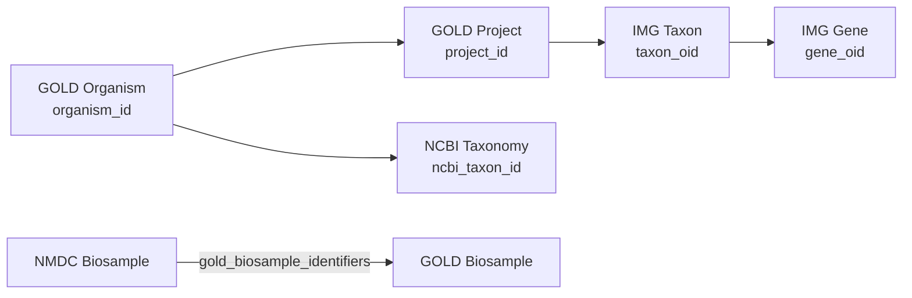

# Microbial Isolate Data Across Lakehouses

This document summarizes the availability and structure of microbial isolate data across JGI, KBase, and NMDC lakehouses.

## Overview

Microbial isolates—cultured, single-strain organisms—are fundamental to genomics research. Each lakehouse captures isolate data differently, with JGI's GOLD and IMG databases providing the richest isolate coverage.

## JGI Lakehouse

### GOLD Database - Organism Records

The GOLD database tracks **598,061 organisms** in the `gold_master_organism` table, with culture status as a key attribute.

#### Culture Status Distribution

| Cultured | Count |
|----------|-------|
| Yes | 518,241 |
| No | 79,815 |
| Unknown | 5 |

#### Culture Types

| Culture Type | Count |
|--------------|-------|
| Isolate | 518,172 |
| Co-Culture | 134 |

#### Cultured Organisms by Domain

| Domain | Cultured Count |
|--------|----------------|
| Bacteria | 427,450 |
| Eukarya | 69,020 |
| Viruses | 11,880 |
| Unknown | 6,425 |
| Archaea | 3,466 |

#### Key Query

```sql
SELECT domain, cultured, COUNT(*) as cnt
FROM "gold-db-2 postgresql".gold.gold_master_organism
WHERE cultured = 'Yes'
GROUP BY domain, cultured
ORDER BY cnt DESC
```

### GOLD Biosample Ecosystem Types

Biosamples are classified by ecosystem. Lab cultures represent direct isolate work:

| Ecosystem | Category | Type | Count |
|-----------|----------|------|-------|
| Engineered | Lab culture | Culture media | 7,850 |
| Environmental | Terrestrial | Soil | 57,083 |
| Host-associated | Mammals: Human | Digestive system | 43,958 |
| Environmental | Aquatic | Marine | 35,287 |
| Environmental | Aquatic | Freshwater | 28,082 |

### IMG Database - Genome Types

IMG's `taxon` table distinguishes isolate genomes from metagenomes:

| Genome Type | Count |
|-------------|-------|
| isolate | 196,379 |
| metagenome | 90,241 |

#### IMG Taxon Domain Distribution

| Domain | Count |
|--------|-------|
| Bacteria | 167,336 |
| *Microbiome | 90,233 |
| Viruses | 21,818 |
| Archaea | 4,536 |
| Eukaryota | 1,192 |

#### Key Query

```sql
SELECT genome_type, COUNT(*) as cnt
FROM "img-db-2 postgresql".img_core_v400.taxon
WHERE genome_type IS NOT NULL
GROUP BY genome_type
ORDER BY cnt DESC
```

### Isolate-Related Columns

| Schema | Table | Column | Description |
|--------|-------|--------|-------------|
| gold | gold_master_organism | cultured | Yes/No/Unknown |
| gold | gold_master_organism | culture_type | Isolate or Co-Culture |
| gold | dw_samples | sample_isolated_from | Isolation source |
| gold | ncbi_assembly | isolate | NCBI isolate field |
| img_core_v400 | taxon | genome_type | "isolate" or "metagenome" |
| img_core_v400 | img_funcs_info | isolates | Isolate count |
| imgsg_dev | project_info | isolate_selected | HMP selection flag |
| imgsg_dev | project_info | hmp_isolate_selection_source | HMP source |

## KBase/BERDL

KBase databases likely contain isolate genome data in:

- `kbase_genomes` - General genome collection
- `kbase_ke_pangenome` - Pangenomic data with GTDB taxonomy

*Note: Direct queries require valid authentication token.*

## NMDC

NMDC focuses primarily on **environmental metagenomes** rather than isolates. However, lab culture samples exist as controls:

### Lab Culture Samples

```bash
nmdc biosample --filter "ecosystem: Engineered" --filter "ecosystem_category: Lab culture"
```

Example record:
- **Organism**: *Vibrio fischeri* ES114
- **Purpose**: Positive control for metagenome analysis
- **Ecosystem classification**: `Engineered > Lab culture > Culture media > Bacteria`

NMDC lab culture samples are linked to GOLD via `gold_biosample_identifiers`.

## Cross-Database Summary

| Lakehouse | Isolate Records | Primary Use | Key Tables |
|-----------|-----------------|-------------|------------|
| **JGI GOLD** | ~518,000 organisms | Genome project metadata, culture tracking | `gold_master_organism`, `biosample` |
| **JGI IMG** | ~196,000 genomes | Annotated isolate genomes with functional data | `taxon`, `gene`, `gene_function` |
| **NMDC** | ~4 samples | Environmental focus; isolates as controls | `biosample` |
| **KBase** | Unknown | Genome analysis platform | `kbase_genomes` |

## Join Points for Isolate Data



### Key Join Fields

| Source | Target | Join Field |
|--------|--------|------------|
| GOLD organism | NCBI | `ncbi_taxonomy_id` |
| GOLD project | IMG taxon | `gold_id` / `sequencing_gold_id` |
| NMDC biosample | GOLD biosample | `gold_biosample_identifiers` |
| IMG taxon | GOLD | `sample_gold_id`, `study_gold_id` |

## Recommendations

1. **For isolate genome analysis**: Start with JGI IMG `taxon` table filtered by `genome_type = 'isolate'`
2. **For culture metadata**: Query GOLD `gold_master_organism` with `cultured = 'Yes'`
3. **For cross-linking to NCBI**: Use `ncbi_taxonomy_id` from GOLD organism records
4. **For environmental context of isolates**: Join GOLD organism to biosample via project

## Example Queries

### Find all cultured bacteria with complete genomes in IMG

```sql
SELECT t.taxon_display_name, t.domain, t.phylum, t.genus, t.species
FROM "img-db-2 postgresql".img_core_v400.taxon t
WHERE t.genome_type = 'isolate'
  AND t.domain = 'Bacteria'
  AND t.seq_status = 'Finished'
LIMIT 100
```

### Find GOLD organisms with isolation source metadata

```sql
SELECT o.ncbi_genus, o.ncbi_species, o.strain, o.sample_collection_site
FROM "gold-db-2 postgresql".gold.gold_master_organism o
WHERE o.cultured = 'Yes'
  AND o.sample_collection_site IS NOT NULL
LIMIT 50
```
