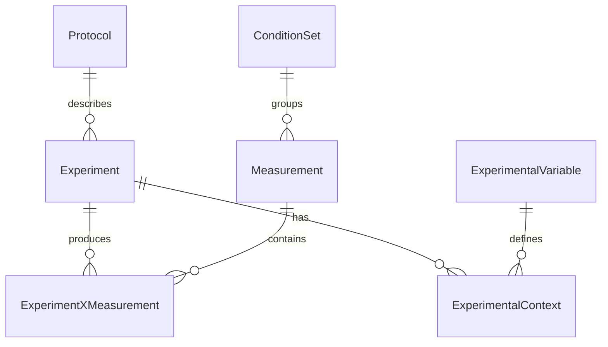

# Perturbation and Phenotype Experiments

This document catalogs experimental data involving perturbations, treatments, and phenotype
measurements across the JGI and KBase lakehouses.

## Overview

Perturbation experiments (TnSeq, knockouts, stress treatments, expression profiling) are
distributed across multiple databases with different levels of metadata richness:

| Database | Data Types | Scale |
|----------|-----------|-------|
| **IMG RNAseq** | Transcriptomics under conditions | 110 experiments, 312 samples |
| **IMG Proteome** | Proteomics with treatments | 5 experiments |
| **GOLD Phenotypes** | Organism trait annotations | 7,113 mappings (159 terms) |
| **GOLD Studies** | Study-level experiment descriptions | TnSeq, mutagenesis, stress studies |
| **MycoCosm** | Fungal expression, proteomics, metabolomics | Per-organism tables |
| **KBase Phenotype** | Experimental conditions and measurements | Structured schema |
| **ENIGMA CoRAL** | Groundwater microbiome conditions | Environmental samples |

## IMG RNA-seq Experiments

The IMG RNAseq database contains transcriptomics experiments with condition/treatment metadata.

### Schema

```
rnaseq_experiment (110 experiments)
    │
    │ exp_oid
    ▼
rnaseq_sample (312 samples)
    │
    │ experiment
    ▼
rnaseq_dataset (expression data)
```

**Location:** `"img-db-2 postgresql".img_rnaseq`

### Key Tables

| Table | Description |
|-------|-------------|
| `rnaseq_experiment` | Experiment metadata (name, description, contact, method) |
| `rnaseq_sample` | Sample conditions, organism, notes |
| `rnaseq_dataset` | Expression measurements |
| `rnaseq_experiment_pubs` | Associated publications |

### Example Perturbation Experiments

```sql
SELECT exp_name, description
FROM "img-db-2 postgresql".img_rnaseq.rnaseq_experiment
LIMIT 5
```

| Experiment | Description |
|------------|-------------|
| *P. syringae* B728a mutant | WT vs NUDIX hydrolase deletion at 20°C/30°C temperature treatments |
| *Synechococcus* PCC 7942 | Six stress and nutrient conditions, two timepoints |
| *Synechocystis* PCC 6803 | Six stress and nutrient conditions, two timepoints |
| *Synechococcus* PCC 7002 | 11 samples under different conditions |
| Lake Vida brine | Extreme cold microbial community transcriptomics |

### Sample-Level Conditions

Samples include detailed treatment notes:

```sql
SELECT sample_oid, description, notes, organism_name
FROM "img-db-2 postgresql".img_rnaseq.rnaseq_sample
WHERE experiment = 4
```

| Sample | Description | Notes |
|--------|-------------|-------|
| KH001 | WT 30°C, R1 | *Pss* B728a incubated for 6-8 hours on KB at 30°C |
| KH002 | WT 20°C, R1 | *Pss* B728a incubated for 6-8 hours on KB at 20°C |
| KH003 | Nudix 30°C, R1 | Deletion mutant at 30°C |
| KH004 | Nudix 20°C, R1 | Deletion mutant at 20°C |

### Organisms with RNA-seq Data

```sql
SELECT COUNT(*) as samples, organism_name
FROM "img-db-2 postgresql".img_rnaseq.rnaseq_sample
GROUP BY organism_name ORDER BY samples DESC LIMIT 10
```

| Samples | Organism |
|---------|----------|
| 17 | *Isoptericola variabilis* 225 |
| 15 | *Synechococcus* sp. PCC 7942 |
| 15 | *Synechocystis* sp. PCC 6803 |
| 12 | *Arthrobacter chlorophenolicus* A6 |
| 12 | *Pseudomonas syringae* pv. syringae B728a |
| 11 | *Synechococcus* sp. PCC 7002 |

## IMG Proteomics Experiments

Mass spectrometry-based proteomics with condition comparisons.

### Schema

```
ms_experiment (5 experiments)
    │
    │ exp_oid
    ▼
ms_sample (sample metadata)
    │
    │ sample_oid
    ▼
ms_protein / ms_peptide (identifications)
```

**Location:** `"img-db-2 postgresql".img_proteome`

### Example Experiments

```sql
SELECT exp_name, description, protein_count
FROM "img-db-2 postgresql".img_proteome.ms_experiment
```

| Experiment | Description | Proteins |
|------------|-------------|----------|
| *Arthrobacter chlorophenolicus* | 4-chlorophenol vs 4-nitrophenol vs phenol at 5°C/28°C (WT vs mutant) | 44,248 |
| *Cryptobacterium curtum* | Baseline proteome | 1,030 |
| *Brachybacterium faecium* | Baseline proteome | 1,803 |

## GOLD Organism Phenotypes

Curated phenotype annotations for organisms registered in GOLD.

### Schema

```
cvphenotype (159 controlled terms)
    │
    │ phenotype_id
    ▼
organism_phenotype (7,113 annotations)
    │
    │ organism_id
    ▼
organism_v2 (organism metadata)
```

**Location:** `"gold-db-2 postgresql".gold`

### Phenotype Categories

| Category | Example Terms |
|----------|---------------|
| **Pathogenicity** | Pathogen (3,132), Non-Pathogen (576), Opportunistic Pathogen (279) |
| **Stress Tolerance** | Acidophile (143), Radiation resistant (49), Alkaliphile (44) |
| **Antimicrobial Resistance** | Meticillin resistant (59), Antibiotic resistant |
| **Metabolic** | Catalase positive (414), Catalase negative (520), Beta-hemolytic (236) |
| **Ecological** | Symbiont (34), Probiotic (106), Biofilm (47), Parasitic |

### Query Example

```sql
SELECT cv.term as phenotype, COUNT(*) as organisms
FROM "gold-db-2 postgresql".gold.organism_phenotype op
JOIN "gold-db-2 postgresql".gold.cvphenotype cv ON op.phenotype_id = cv.id
GROUP BY cv.term ORDER BY organisms DESC LIMIT 10
```

## GOLD Studies with Perturbation Experiments

Many GOLD studies describe TnSeq, mutagenesis, and stress experiments in their descriptions.

### TnSeq / Transposon Mutagenesis Studies

```sql
SELECT study_name, description
FROM "gold-db-2 postgresql".gold.study
WHERE LOWER(description) LIKE '%tnseq%'
   OR LOWER(description) LIKE '%transposon%'
   OR LOWER(description) LIKE '%mutagenesis%'
```

| Study | Description |
|-------|-------------|
| *Ruegeria pomeroyi* DSS-3 | HITS (high-throughput insertion tracking) for DOM cycling genes |
| *Staphylococcus aureus* LAC | TnSeq library for virulence studies |
| *Streptomyces lividans* TK23 | Natural mutagenesis study |
| Fungal Tn-seq | Pioneering fungal mutagenesis using Tn-seq |
| *Mycobacterium marinum* | TraDIS for host-specific virulence factors |

### Stress and Expression Studies

```sql
SELECT study_name
FROM "gold-db-2 postgresql".gold.study
WHERE LOWER(description) LIKE '%stress%'
   OR LOWER(description) LIKE '%expression%'
```

| Study |
|-------|
| Transcriptome analysis under abiotic stress in sorghum |
| *Naganishia friedmannii* freeze-thaw stress transcriptomics |
| *Mimulus laciniatus* drought stress microbiome |
| *Cellulomonas gilvus* aerobic/anaerobic expression |
| Freshwater pond carbon perturbation study |

## MycoCosm Fungal Data

Fungal genome portals contain organism-specific expression, proteomics, and metabolomics tables.

### Expression Data

| Schema Pattern | Description |
|----------------|-------------|
| `ESTexpression` | EST-based expression |
| `conditional_ESTexpression` | Condition-specific expression |
| `*_transcriptome` | Assembled transcriptomes |
| `microarray*` | Microarray experiments |

**Example organisms with expression data:**
- *Emiliania huxleyi* (conditional, diploid/haploid)
- *Chlamydomonas* (microarray, mutants)
- *Trichoderma virens* (Before/During/After Contact microarray)

### Proteomics Data

Tables matching pattern `proteomics_PXD*` or `Proteomics_*`:

| Organism | Table |
|----------|-------|
| *Aspergillus niger* NRRL3 | `proteomics_PXD010431` |
| *Chlamydomonas* | `PXD010794_proteomics` |
| *Neurospora crassa* | `PXD009682_proteomics` |
| *Mycosphaerella graminicola* | `Proteomics_1D_Kema_lab`, `Proteomics_2D_Kema_lab` |

### Metabolomics Data

*Poronia crucua* (`myco-db-1 mysql.Porcrue1`):

| Table | Description |
|-------|-------------|
| `mo_metabolome_experiment_description` | Experiment metadata |
| `mo_metabolome_condition_description` | Condition definitions |
| `mo_metabolome_combination` | Metabolite combinations |
| `mo_metabolome_project` | Project metadata |

### Transposon/Insertion Data

Many fungal genomes have `TransposonRelatedModels` tables for tracking mobile elements and
insertions, useful for genetic studies.

## KBase Phenotype Database

Structured experimental phenotype measurements.

### Schema

**Location:** `kbase_phenotype` database

| Table | Description |
|-------|-------------|
| `Experiment` | Experiment ID, name, description, protocol |
| `ExperimentalVariable` | Variable definitions (name, units, type) |
| `ExperimentalContext` | Variable values for experiments |
| `ConditionSet` | Grouped experimental conditions |
| `Measurement` | Quantitative measurements |
| `Protocol` | Experimental protocols |

### Schema Diagram



## ENIGMA CoRAL Database

Groundwater microbiome data with environmental conditions.

### Schema

**Location:** `enigma_coral` database

| Table | Description |
|-------|-------------|
| `sdt_sample` | Environmental samples with location, depth, date |
| `sdt_condition` | Experimental/environmental conditions |
| `sdt_strain` | Cultured isolates |
| `sdt_taxon` | Taxonomic identifications (linked to NCBI) |
| `sdt_asv` | 16S amplicon sequence variants |

### Sample Metadata

Samples include ENVO ontology terms for material type and MIxS environmental packages:

```sql
SELECT sdt_sample_name, depth_meter, material_sys_oterm_name
FROM enigma_coral.sdt_sample LIMIT 5
```

| Sample | Depth (m) | Material |
|--------|-----------|----------|
| EU02-D01 | 5.4 | ground water |
| EU03-D01 | 4.6 | ground water |
| ED04-D01 | 4.8 | ground water |

## Cross-Database Query Patterns

### Find Organisms with Both Phenotypes and Expression Data

```sql
-- Get organisms with phenotypes that also have RNA-seq
SELECT DISTINCT op.organism_id, cv.term
FROM "gold-db-2 postgresql".gold.organism_phenotype op
JOIN "gold-db-2 postgresql".gold.cvphenotype cv ON op.phenotype_id = cv.id
JOIN "gold-db-2 postgresql".gold.organism_v2 o ON op.organism_id = o.organism_id
WHERE o.ncbi_taxon_id IN (
    SELECT ncbi_taxon_id FROM "img-db-2 postgresql".img_rnaseq.rnaseq_sample
    WHERE ncbi_taxon_id IS NOT NULL
)
```

### Find Studies with Specific Perturbation Types

```sql
-- Find all TnSeq/fitness studies
SELECT study_id, study_name, description
FROM "gold-db-2 postgresql".gold.study
WHERE LOWER(description) LIKE '%fitness%'
   OR LOWER(description) LIKE '%tnseq%'
   OR LOWER(description) LIKE '%knockout%'
   OR LOWER(study_name) LIKE '%fitness%'
```

### Find Stress-Related RNA-seq Experiments

```sql
SELECT exp_oid, exp_name, description
FROM "img-db-2 postgresql".img_rnaseq.rnaseq_experiment
WHERE LOWER(description) LIKE '%stress%'
   OR LOWER(description) LIKE '%mutant%'
   OR LOWER(description) LIKE '%condition%'
```

## Data Gaps and Limitations

| Gap | Description |
|-----|-------------|
| **No centralized FEBA/RB-TnSeq** | Fitness browser data not directly queryable in lakehouses |
| **Limited proteomics** | Only 5 experiments in IMG proteome |
| **Sparse condition standardization** | Conditions described in free text, not ontology terms |
| **Plant phenotype tables empty** | Phytozome phenotype tables exist but currently unpopulated |
| **No microarray expression values** | Microarray tables contain mappings, not expression matrices |

## Recommendations

1. **For RNA-seq experiments**: Start with `img_rnaseq.rnaseq_experiment` and filter by description
2. **For organism phenotypes**: Use GOLD `organism_phenotype` joined with `cvphenotype`
3. **For TnSeq/mutagenesis**: Search GOLD `study.description` for keywords
4. **For fungal data**: Query MycoCosm organism-specific tables
5. **For condition metadata**: Check `rnaseq_sample.notes` and `description` fields
