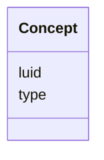

# Class: Concept 


_Named concept/entity extracted from literature (gene, organism, etc.)._


URI: [https://w3id.org/jgi/gcs_citation/Concept](https://w3id.org/jgi/gcs_citation/Concept)





<!-- no inheritance hierarchy -->


## Slots

| Name | Cardinality and Range | Description | Inheritance |
| ---  | --- | --- | --- |
| [luid](luid.md) | 1 <br/> [Integer](Integer.md) | Local unique identifier | direct |
| [type](type.md) | 0..1 <br/> [String](String.md) | Concept type (relation, gene, organism, etc | direct |


## Identifier and Mapping Information


### Annotations

| property | value |
| --- | --- |
| source_table | concept |


### Schema Source


* from schema: https://w3id.org/jgi/gcs_citation


## Mappings

| Mapping Type | Mapped Value |
| ---  | ---  |
| self | https://w3id.org/jgi/gcs_citation/Concept |
| native | https://w3id.org/jgi/gcs_citation/Concept |


## LinkML Source

<!-- TODO: investigate https://stackoverflow.com/questions/37606292/how-to-create-tabbed-code-blocks-in-mkdocs-or-sphinx -->

### Direct

<details>
```yaml
name: Concept
annotations:
  source_table:
    tag: source_table
    value: concept
description: Named concept/entity extracted from literature (gene, organism, etc.).
from_schema: https://w3id.org/jgi/gcs_citation
attributes:
  luid:
    name: luid
    description: Local unique identifier
    from_schema: https://w3id.org/jgi/gcs_citation
    rank: 1000
    identifier: true
    domain_of:
    - Concept
    range: integer
    required: true
  type:
    name: type
    description: Concept type (relation, gene, organism, etc.)
    from_schema: https://w3id.org/jgi/gcs_citation
    rank: 1000
    domain_of:
    - Concept
    range: string

```
</details>

### Induced

<details>
```yaml
name: Concept
annotations:
  source_table:
    tag: source_table
    value: concept
description: Named concept/entity extracted from literature (gene, organism, etc.).
from_schema: https://w3id.org/jgi/gcs_citation
attributes:
  luid:
    name: luid
    description: Local unique identifier
    from_schema: https://w3id.org/jgi/gcs_citation
    rank: 1000
    identifier: true
    alias: luid
    owner: Concept
    domain_of:
    - Concept
    range: integer
  type:
    name: type
    description: Concept type (relation, gene, organism, etc.)
    from_schema: https://w3id.org/jgi/gcs_citation
    rank: 1000
    alias: type
    owner: Concept
    domain_of:
    - Concept
    range: string

```
</details>