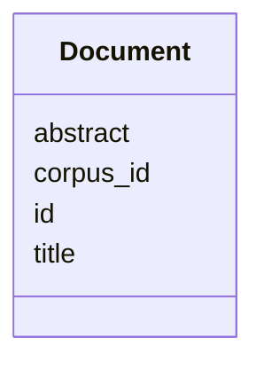

# Class: Document 


_Document/publication record._


URI: [https://w3id.org/jgi/gcs_citation/Document](https://w3id.org/jgi/gcs_citation/Document)





<!-- no inheritance hierarchy -->


## Slots

| Name | Cardinality and Range | Description | Inheritance |
| ---  | --- | --- | --- |
| [id](id.md) | 1 <br/> [Integer](Integer.md) |  | direct |
| [corpus_id](corpus_id.md) | 0..1 <br/> [Integer](Integer.md) |  | direct |
| [title](title.md) | 0..1 <br/> [String](String.md) |  | direct |
| [abstract](abstract.md) | 0..1 <br/> [String](String.md) |  | direct |


## Identifier and Mapping Information


### Annotations

| property | value |
| --- | --- |
| source_table | document |


### Schema Source


* from schema: https://w3id.org/jgi/gcs_citation


## Mappings

| Mapping Type | Mapped Value |
| ---  | ---  |
| self | https://w3id.org/jgi/gcs_citation/Document |
| native | https://w3id.org/jgi/gcs_citation/Document |


## LinkML Source

<!-- TODO: investigate https://stackoverflow.com/questions/37606292/how-to-create-tabbed-code-blocks-in-mkdocs-or-sphinx -->

### Direct

<details>
```yaml
name: Document
annotations:
  source_table:
    tag: source_table
    value: document
description: Document/publication record.
from_schema: https://w3id.org/jgi/gcs_citation
attributes:
  id:
    name: id
    from_schema: https://w3id.org/jgi/gcs_citation
    identifier: true
    domain_of:
    - ConceptIdentifier
    - ConceptIdentifierType
    - ConceptRelation
    - Document
    - DocumentConcept
    - Publication
    - Corpus
    - GenomeCitationReport
    - GenomeCitationStatistics
    - Institution
    - Publisher
    - JgiMetadata
    - MeshKeyword
    - ApiAccessLog
    range: integer
    required: true
  corpus_id:
    name: corpus_id
    comments:
    - Foreign key to Corpus.id
    from_schema: https://w3id.org/jgi/gcs_citation
    rank: 1000
    domain_of:
    - Document
    range: integer
  title:
    name: title
    from_schema: https://w3id.org/jgi/gcs_citation
    rank: 1000
    domain_of:
    - Document
    - Publication
    range: string
  abstract:
    name: abstract
    from_schema: https://w3id.org/jgi/gcs_citation
    rank: 1000
    domain_of:
    - Document
    range: string

```
</details>

### Induced

<details>
```yaml
name: Document
annotations:
  source_table:
    tag: source_table
    value: document
description: Document/publication record.
from_schema: https://w3id.org/jgi/gcs_citation
attributes:
  id:
    name: id
    from_schema: https://w3id.org/jgi/gcs_citation
    identifier: true
    alias: id
    owner: Document
    domain_of:
    - ConceptIdentifier
    - ConceptIdentifierType
    - ConceptRelation
    - Document
    - DocumentConcept
    - Publication
    - Corpus
    - GenomeCitationReport
    - GenomeCitationStatistics
    - Institution
    - Publisher
    - JgiMetadata
    - MeshKeyword
    - ApiAccessLog
    range: integer
    required: true
  corpus_id:
    name: corpus_id
    comments:
    - Foreign key to Corpus.id
    from_schema: https://w3id.org/jgi/gcs_citation
    rank: 1000
    alias: corpus_id
    owner: Document
    domain_of:
    - Document
    range: integer
  title:
    name: title
    from_schema: https://w3id.org/jgi/gcs_citation
    rank: 1000
    alias: title
    owner: Document
    domain_of:
    - Document
    - Publication
    range: string
  abstract:
    name: abstract
    from_schema: https://w3id.org/jgi/gcs_citation
    rank: 1000
    alias: abstract
    owner: Document
    domain_of:
    - Document
    range: string

```
</details>