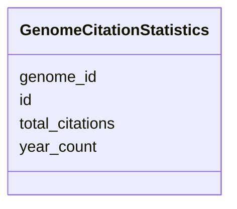

# Class: GenomeCitationStatistics 


_Aggregated citation statistics for genomes._


URI: [https://w3id.org/jgi/gcs_citation/GenomeCitationStatistics](https://w3id.org/jgi/gcs_citation/GenomeCitationStatistics)





<!-- no inheritance hierarchy -->


## Slots

| Name | Cardinality and Range | Description | Inheritance |
| ---  | --- | --- | --- |
| [id](id.md) | 1 <br/> [Integer](Integer.md) |  | direct |
| [genome_id](genome_id.md) | 0..1 <br/> [String](String.md) |  | direct |
| [total_citations](total_citations.md) | 0..1 <br/> [Integer](Integer.md) |  | direct |
| [year_count](year_count.md) | 0..1 <br/> [Integer](Integer.md) |  | direct |


## Identifier and Mapping Information


### Annotations

| property | value |
| --- | --- |
| source_table | genome_citation_statistics |


### Schema Source


* from schema: https://w3id.org/jgi/gcs_citation


## Mappings

| Mapping Type | Mapped Value |
| ---  | ---  |
| self | https://w3id.org/jgi/gcs_citation/GenomeCitationStatistics |
| native | https://w3id.org/jgi/gcs_citation/GenomeCitationStatistics |


## LinkML Source

<!-- TODO: investigate https://stackoverflow.com/questions/37606292/how-to-create-tabbed-code-blocks-in-mkdocs-or-sphinx -->

### Direct

<details>
```yaml
name: GenomeCitationStatistics
annotations:
  source_table:
    tag: source_table
    value: genome_citation_statistics
description: Aggregated citation statistics for genomes.
from_schema: https://w3id.org/jgi/gcs_citation
attributes:
  id:
    name: id
    from_schema: https://w3id.org/jgi/gcs_citation
    identifier: true
    domain_of:
    - ConceptIdentifier
    - ConceptIdentifierType
    - ConceptRelation
    - Document
    - DocumentConcept
    - Publication
    - Corpus
    - GenomeCitationReport
    - GenomeCitationStatistics
    - Institution
    - Publisher
    - JgiMetadata
    - MeshKeyword
    - ApiAccessLog
    range: integer
    required: true
  genome_id:
    name: genome_id
    from_schema: https://w3id.org/jgi/gcs_citation
    domain_of:
    - GenomeCitationReport
    - GenomeCitationStatistics
    range: string
  total_citations:
    name: total_citations
    from_schema: https://w3id.org/jgi/gcs_citation
    rank: 1000
    domain_of:
    - GenomeCitationStatistics
    range: integer
  year_count:
    name: year_count
    from_schema: https://w3id.org/jgi/gcs_citation
    rank: 1000
    domain_of:
    - GenomeCitationStatistics
    range: integer

```
</details>

### Induced

<details>
```yaml
name: GenomeCitationStatistics
annotations:
  source_table:
    tag: source_table
    value: genome_citation_statistics
description: Aggregated citation statistics for genomes.
from_schema: https://w3id.org/jgi/gcs_citation
attributes:
  id:
    name: id
    from_schema: https://w3id.org/jgi/gcs_citation
    identifier: true
    alias: id
    owner: GenomeCitationStatistics
    domain_of:
    - ConceptIdentifier
    - ConceptIdentifierType
    - ConceptRelation
    - Document
    - DocumentConcept
    - Publication
    - Corpus
    - GenomeCitationReport
    - GenomeCitationStatistics
    - Institution
    - Publisher
    - JgiMetadata
    - MeshKeyword
    - ApiAccessLog
    range: integer
    required: true
  genome_id:
    name: genome_id
    from_schema: https://w3id.org/jgi/gcs_citation
    alias: genome_id
    owner: GenomeCitationStatistics
    domain_of:
    - GenomeCitationReport
    - GenomeCitationStatistics
    range: string
  total_citations:
    name: total_citations
    from_schema: https://w3id.org/jgi/gcs_citation
    rank: 1000
    alias: total_citations
    owner: GenomeCitationStatistics
    domain_of:
    - GenomeCitationStatistics
    range: integer
  year_count:
    name: year_count
    from_schema: https://w3id.org/jgi/gcs_citation
    rank: 1000
    alias: year_count
    owner: GenomeCitationStatistics
    domain_of:
    - GenomeCitationStatistics
    range: integer

```
</details>