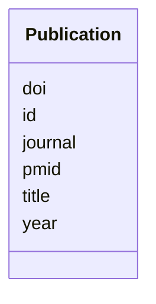

# Class: Publication 


_Publication metadata (journal article, preprint, etc.)._


URI: [https://w3id.org/jgi/gcs_citation/Publication](https://w3id.org/jgi/gcs_citation/Publication)





<!-- no inheritance hierarchy -->


## Slots

| Name | Cardinality and Range | Description | Inheritance |
| ---  | --- | --- | --- |
| [id](id.md) | 1 <br/> [Integer](Integer.md) |  | direct |
| [pmid](pmid.md) | 0..1 <br/> [String](String.md) | PubMed ID | direct |
| [doi](doi.md) | 0..1 <br/> [String](String.md) | Digital Object Identifier | direct |
| [title](title.md) | 0..1 <br/> [String](String.md) |  | direct |
| [journal](journal.md) | 0..1 <br/> [String](String.md) |  | direct |
| [year](year.md) | 0..1 <br/> [Integer](Integer.md) |  | direct |


## Identifier and Mapping Information


### Annotations

| property | value |
| --- | --- |
| source_table | publication |


### Schema Source


* from schema: https://w3id.org/jgi/gcs_citation


## Mappings

| Mapping Type | Mapped Value |
| ---  | ---  |
| self | https://w3id.org/jgi/gcs_citation/Publication |
| native | https://w3id.org/jgi/gcs_citation/Publication |


## LinkML Source

<!-- TODO: investigate https://stackoverflow.com/questions/37606292/how-to-create-tabbed-code-blocks-in-mkdocs-or-sphinx -->

### Direct

<details>
```yaml
name: Publication
annotations:
  source_table:
    tag: source_table
    value: publication
description: Publication metadata (journal article, preprint, etc.).
from_schema: https://w3id.org/jgi/gcs_citation
attributes:
  id:
    name: id
    from_schema: https://w3id.org/jgi/gcs_citation
    identifier: true
    domain_of:
    - ConceptIdentifier
    - ConceptIdentifierType
    - ConceptRelation
    - Document
    - DocumentConcept
    - Publication
    - Corpus
    - GenomeCitationReport
    - GenomeCitationStatistics
    - Institution
    - Publisher
    - JgiMetadata
    - MeshKeyword
    - ApiAccessLog
    range: integer
    required: true
  pmid:
    name: pmid
    description: PubMed ID
    from_schema: https://w3id.org/jgi/gcs_citation
    rank: 1000
    domain_of:
    - Publication
    - GenomeCitationReport
    range: string
  doi:
    name: doi
    description: Digital Object Identifier
    from_schema: https://w3id.org/jgi/gcs_citation
    rank: 1000
    domain_of:
    - Publication
    - GenomeCitationReport
    range: string
  title:
    name: title
    from_schema: https://w3id.org/jgi/gcs_citation
    domain_of:
    - Document
    - Publication
    range: string
  journal:
    name: journal
    from_schema: https://w3id.org/jgi/gcs_citation
    rank: 1000
    domain_of:
    - Publication
    range: string
  year:
    name: year
    from_schema: https://w3id.org/jgi/gcs_citation
    rank: 1000
    domain_of:
    - Publication
    range: integer

```
</details>

### Induced

<details>
```yaml
name: Publication
annotations:
  source_table:
    tag: source_table
    value: publication
description: Publication metadata (journal article, preprint, etc.).
from_schema: https://w3id.org/jgi/gcs_citation
attributes:
  id:
    name: id
    from_schema: https://w3id.org/jgi/gcs_citation
    identifier: true
    alias: id
    owner: Publication
    domain_of:
    - ConceptIdentifier
    - ConceptIdentifierType
    - ConceptRelation
    - Document
    - DocumentConcept
    - Publication
    - Corpus
    - GenomeCitationReport
    - GenomeCitationStatistics
    - Institution
    - Publisher
    - JgiMetadata
    - MeshKeyword
    - ApiAccessLog
    range: integer
    required: true
  pmid:
    name: pmid
    description: PubMed ID
    from_schema: https://w3id.org/jgi/gcs_citation
    rank: 1000
    alias: pmid
    owner: Publication
    domain_of:
    - Publication
    - GenomeCitationReport
    range: string
  doi:
    name: doi
    description: Digital Object Identifier
    from_schema: https://w3id.org/jgi/gcs_citation
    rank: 1000
    alias: doi
    owner: Publication
    domain_of:
    - Publication
    - GenomeCitationReport
    range: string
  title:
    name: title
    from_schema: https://w3id.org/jgi/gcs_citation
    alias: title
    owner: Publication
    domain_of:
    - Document
    - Publication
    range: string
  journal:
    name: journal
    from_schema: https://w3id.org/jgi/gcs_citation
    rank: 1000
    alias: journal
    owner: Publication
    domain_of:
    - Publication
    range: string
  year:
    name: year
    from_schema: https://w3id.org/jgi/gcs_citation
    rank: 1000
    alias: year
    owner: Publication
    domain_of:
    - Publication
    range: integer

```
</details>