# Class: AnalysisProject 


URI: [gold:AnalysisProject](https://w3id.org/jgi/gold/AnalysisProject)

```mermaid
 classDiagram
    class AnalysisProject
    click AnalysisProject href "../AnalysisProject/"
      AnalysisProject : add_date
        
      AnalysisProject : added_by
        
      AnalysisProject : analysis_project_id
        
      AnalysisProject : analysis_project_name
        
      AnalysisProject : analysis_project_name_full
        
      AnalysisProject : analysis_project_type
        
      AnalysisProject : analysis_system
        
      AnalysisProject : annotator_comments
        
      AnalysisProject : ap_for_nonowner
        
      AnalysisProject : appended_ap_name
        
      AnalysisProject : bin_param
        
      AnalysisProject : binning_method
        
      AnalysisProject : comments
        
      AnalysisProject : compl_appr
        
      AnalysisProject : completeness_percentage
        
      AnalysisProject : completion
        
      AnalysisProject : completion_date
        
      AnalysisProject : contamination_percentage
        
      AnalysisProject : contig_count
        
      AnalysisProject : culture_collection
        
      AnalysisProject : decontamination_method
        
      AnalysisProject : domain
        
      AnalysisProject : ecosystem
        
      AnalysisProject : ecosystem_category
        
      AnalysisProject : ecosystem_path_id
        
      AnalysisProject : ecosystem_subtype
        
      AnalysisProject : ecosystem_type
        
      AnalysisProject : est_size
        
      AnalysisProject : genbank_low_quality_annotation
        
      AnalysisProject : gene_calling_method
        
      AnalysisProject : gene_count
        
      AnalysisProject : genus
        
      AnalysisProject : gold_id
        
      AnalysisProject : gold_phylogeny
        
      AnalysisProject : gtdb_class
        
      AnalysisProject : gtdb_family
        
      AnalysisProject : gtdb_genus
        
      AnalysisProject : gtdb_order
        
      AnalysisProject : gtdb_phylum
        
      AnalysisProject : gtdb_species
        
      AnalysisProject : gtdb_superkingdom
        
      AnalysisProject : gtdb_taxonomy_lineage
        
      AnalysisProject : gtdb_version_id
        
      AnalysisProject : img_analysis_complete
        
      AnalysisProject : img_annotation_version
        
      AnalysisProject : img_bin_count
        
      AnalysisProject : img_predicted_plasmid_contigs
        
      AnalysisProject : img_predicted_viral_contigs
        
      AnalysisProject : img_rnaseq_id
        
      AnalysisProject : img_submission_prority
        
      AnalysisProject : img_taxon_id
        
      AnalysisProject : img_use
        
      AnalysisProject : is_assembled_deleted
        
      AnalysisProject : is_decontamination
        
      AnalysisProject : is_img_annotation
        
      AnalysisProject : is_primary
        
      AnalysisProject : is_public
        
      AnalysisProject : is_test
        
      AnalysisProject : its_analysis_project_id
        
      AnalysisProject : its_analysis_project_name
        
      AnalysisProject : its_annotation_at_id
        
      AnalysisProject : its_assembly_at_type
        
      AnalysisProject : its_data_utilization_status
        
      AnalysisProject : its_ncbi_tax_id
        
      AnalysisProject : its_product_name
        
      AnalysisProject : its_version_number
        
      AnalysisProject : mag_cov_software
        
      AnalysisProject : mod_by
        
      AnalysisProject : mod_date
        
      AnalysisProject : ncbi_bioproject_accession
        
      AnalysisProject : ncbi_bioproject_id
        
      AnalysisProject : ncbi_biosample_accession
        
      AnalysisProject : ncbi_class
        
      AnalysisProject : ncbi_family
        
      AnalysisProject : ncbi_genus
        
      AnalysisProject : ncbi_kingdom
        
      AnalysisProject : ncbi_order
        
      AnalysisProject : ncbi_phylum
        
      AnalysisProject : ncbi_species
        
      AnalysisProject : ncbi_superkingdom
        
      AnalysisProject : ncbi_tax_id
        
      AnalysisProject : ncbi_taxonomy_lineage
        
      AnalysisProject : organism_id
        
          
    
        
        
        AnalysisProject --> "0..1" OrganismV2 : organism_id
        click OrganismV2 href "../OrganismV2/"
    

        
      AnalysisProject : phylogeny_suggestion
        
      AnalysisProject : pi_id
        
      AnalysisProject : pi_name
        
      AnalysisProject : pipeline_annotation_method
        
      AnalysisProject : reassembly_bin
        
      AnalysisProject : recover_16s
        
      AnalysisProject : recover_16s_software
        
      AnalysisProject : reference_ap_id
        
          
    
        
        
        AnalysisProject --> "0..1" AnalysisProject : reference_ap_id
        click AnalysisProject href "../AnalysisProject/"
    

        
      AnalysisProject : rejection_reasons
        
      AnalysisProject : replaces_ap_id
        
          
    
        
        
        AnalysisProject --> "0..1" AnalysisProject : replaces_ap_id
        click AnalysisProject href "../AnalysisProject/"
    

        
      AnalysisProject : review_status
        
      AnalysisProject : scaffold_count
        
      AnalysisProject : screening_method
        
      AnalysisProject : sequencing_depth
        
      AnalysisProject : serovar
        
      AnalysisProject : sim_search_meth
        
      AnalysisProject : species
        
      AnalysisProject : specific_ecosystem
        
      AnalysisProject : specimen
        
      AnalysisProject : status_id
        
          
    
        
        
        AnalysisProject --> "0..1" CvapStatus : status_id
        click CvapStatus href "../CvapStatus/"
    

        
      AnalysisProject : strain
        
      AnalysisProject : study_id
        
          
    
        
        
        AnalysisProject --> "0..1" Study : study_id
        click Study href "../Study/"
    

        
      AnalysisProject : submission_comments
        
      AnalysisProject : submission_id
        
      AnalysisProject : submission_status_id
        
      AnalysisProject : submission_status_name
        
      AnalysisProject : subspecies
        
      AnalysisProject : suggest_img_annotation_version
        
      AnalysisProject : trna_pred_software
        
      AnalysisProject : trnas
        
      
```





<!-- no inheritance hierarchy -->


## Slots

| Name | Cardinality and Range | Description | Inheritance |
| ---  | --- | --- | --- |
| [analysis_project_id](analysis_project_id.md) | 0..1 <br/> [Float](Float.md) |  | direct |
| [status_id](status_id.md) | 0..1 <br/> [CvapStatus](CvapStatus.md) | Foreign key to cvap_status | direct |
| [is_public](is_public.md) | 0..1 <br/> [String](String.md) |  | direct |
| [added_by](added_by.md) | 0..1 <br/> [Float](Float.md) |  | direct |
| [add_date](add_date.md) | 0..1 <br/> [Datetime](Datetime.md) |  | direct |
| [mod_date](mod_date.md) | 0..1 <br/> [Datetime](Datetime.md) |  | direct |
| [mod_by](mod_by.md) | 0..1 <br/> [Float](Float.md) |  | direct |
| [its_analysis_project_id](its_analysis_project_id.md) | 0..1 <br/> [Float](Float.md) |  | direct |
| [is_primary](is_primary.md) | 0..1 <br/> [String](String.md) |  | direct |
| [gold_id](gold_id.md) | 0..1 <br/> [String](String.md) |  | direct |
| [analysis_project_name](analysis_project_name.md) | 0..1 <br/> [String](String.md) |  | direct |
| [appended_ap_name](appended_ap_name.md) | 0..1 <br/> [String](String.md) |  | direct |
| [analysis_project_name_full](analysis_project_name_full.md) | 0..1 <br/> [String](String.md) |  | direct |
| [its_analysis_project_name](its_analysis_project_name.md) | 0..1 <br/> [String](String.md) |  | direct |
| [its_product_name](its_product_name.md) | 0..1 <br/> [String](String.md) |  | direct |
| [analysis_project_type](analysis_project_type.md) | 0..1 <br/> [String](String.md) |  | direct |
| [img_submission_prority](img_submission_prority.md) | 0..1 <br/> [String](String.md) |  | direct |
| [submission_id](submission_id.md) | 0..1 <br/> [Float](Float.md) |  | direct |
| [img_taxon_id](img_taxon_id.md) | 0..1 <br/> [Float](Float.md) |  | direct |
| [completion_date](completion_date.md) | 0..1 <br/> [Datetime](Datetime.md) |  | direct |
| [reference_ap_id](reference_ap_id.md) | 0..1 <br/> [AnalysisProject](AnalysisProject.md) | Foreign key to analysis_project | direct |
| [replaces_ap_id](replaces_ap_id.md) | 0..1 <br/> [AnalysisProject](AnalysisProject.md) | Foreign key to analysis_project | direct |
| [comments](comments.md) | 0..1 <br/> [String](String.md) |  | direct |
| [annotator_comments](annotator_comments.md) | 0..1 <br/> [String](String.md) |  | direct |
| [review_status](review_status.md) | 0..1 <br/> [String](String.md) |  | direct |
| [rejection_reasons](rejection_reasons.md) | 0..1 <br/> [String](String.md) |  | direct |
| [pi_id](pi_id.md) | 0..1 <br/> [Float](Float.md) |  | direct |
| [pi_name](pi_name.md) | 0..1 <br/> [String](String.md) |  | direct |
| [est_size](est_size.md) | 0..1 <br/> [Float](Float.md) |  | direct |
| [scaffold_count](scaffold_count.md) | 0..1 <br/> [Float](Float.md) |  | direct |
| [contig_count](contig_count.md) | 0..1 <br/> [Float](Float.md) |  | direct |
| [gene_count](gene_count.md) | 0..1 <br/> [Float](Float.md) |  | direct |
| [binning_method](binning_method.md) | 0..1 <br/> [String](String.md) |  | direct |
| [contamination_percentage](contamination_percentage.md) | 0..1 <br/> [Float](Float.md) |  | direct |
| [completeness_percentage](completeness_percentage.md) | 0..1 <br/> [Float](Float.md) |  | direct |
| [img_bin_count](img_bin_count.md) | 0..1 <br/> [Float](Float.md) |  | direct |
| [bin_param](bin_param.md) | 0..1 <br/> [String](String.md) |  | direct |
| [reassembly_bin](reassembly_bin.md) | 0..1 <br/> [String](String.md) |  | direct |
| [gene_calling_method](gene_calling_method.md) | 0..1 <br/> [String](String.md) |  | direct |
| [sequencing_depth](sequencing_depth.md) | 0..1 <br/> [String](String.md) |  | direct |
| [genbank_low_quality_annotation](genbank_low_quality_annotation.md) | 0..1 <br/> [String](String.md) |  | direct |
| [completion](completion.md) | 0..1 <br/> [String](String.md) |  | direct |
| [pipeline_annotation_method](pipeline_annotation_method.md) | 0..1 <br/> [String](String.md) |  | direct |
| [is_img_annotation](is_img_annotation.md) | 0..1 <br/> [String](String.md) |  | direct |
| [img_annotation_version](img_annotation_version.md) | 0..1 <br/> [String](String.md) |  | direct |
| [specimen](specimen.md) | 0..1 <br/> [String](String.md) |  | direct |
| [its_annotation_at_id](its_annotation_at_id.md) | 0..1 <br/> [Float](Float.md) |  | direct |
| [its_assembly_at_type](its_assembly_at_type.md) | 0..1 <br/> [String](String.md) |  | direct |
| [its_ncbi_tax_id](its_ncbi_tax_id.md) | 0..1 <br/> [Float](Float.md) |  | direct |
| [its_version_number](its_version_number.md) | 0..1 <br/> [Float](Float.md) |  | direct |
| [is_decontamination](is_decontamination.md) | 0..1 <br/> [String](String.md) |  | direct |
| [screening_method](screening_method.md) | 0..1 <br/> [String](String.md) |  | direct |
| [decontamination_method](decontamination_method.md) | 0..1 <br/> [String](String.md) |  | direct |
| [img_use](img_use.md) | 0..1 <br/> [String](String.md) |  | direct |
| [img_rnaseq_id](img_rnaseq_id.md) | 0..1 <br/> [Float](Float.md) |  | direct |
| [submission_status_id](submission_status_id.md) | 0..1 <br/> [Float](Float.md) |  | direct |
| [submission_status_name](submission_status_name.md) | 0..1 <br/> [String](String.md) |  | direct |
| [submission_comments](submission_comments.md) | 0..1 <br/> [String](String.md) |  | direct |
| [img_analysis_complete](img_analysis_complete.md) | 0..1 <br/> [String](String.md) |  | direct |
| [ap_for_nonowner](ap_for_nonowner.md) | 0..1 <br/> [String](String.md) |  | direct |
| [is_assembled_deleted](is_assembled_deleted.md) | 0..1 <br/> [String](String.md) |  | direct |
| [trnas](trnas.md) | 0..1 <br/> [Float](Float.md) |  | direct |
| [trna_pred_software](trna_pred_software.md) | 0..1 <br/> [String](String.md) |  | direct |
| [sim_search_meth](sim_search_meth.md) | 0..1 <br/> [String](String.md) |  | direct |
| [recover_16s](recover_16s.md) | 0..1 <br/> [String](String.md) |  | direct |
| [recover_16s_software](recover_16s_software.md) | 0..1 <br/> [String](String.md) |  | direct |
| [compl_appr](compl_appr.md) | 0..1 <br/> [String](String.md) |  | direct |
| [mag_cov_software](mag_cov_software.md) | 0..1 <br/> [String](String.md) |  | direct |
| [organism_id](organism_id.md) | 0..1 <br/> [OrganismV2](OrganismV2.md) | Foreign key to organism_v2 | direct |
| [domain](domain.md) | 0..1 <br/> [String](String.md) |  | direct |
| [gold_phylogeny](gold_phylogeny.md) | 0..1 <br/> [String](String.md) |  | direct |
| [phylogeny_suggestion](phylogeny_suggestion.md) | 0..1 <br/> [String](String.md) |  | direct |
| [genus](genus.md) | 0..1 <br/> [String](String.md) |  | direct |
| [species](species.md) | 0..1 <br/> [String](String.md) |  | direct |
| [subspecies](subspecies.md) | 0..1 <br/> [String](String.md) |  | direct |
| [strain](strain.md) | 0..1 <br/> [String](String.md) |  | direct |
| [serovar](serovar.md) | 0..1 <br/> [String](String.md) |  | direct |
| [culture_collection](culture_collection.md) | 0..1 <br/> [String](String.md) |  | direct |
| [ncbi_tax_id](ncbi_tax_id.md) | 0..1 <br/> [Float](Float.md) |  | direct |
| [ncbi_superkingdom](ncbi_superkingdom.md) | 0..1 <br/> [String](String.md) |  | direct |
| [ncbi_kingdom](ncbi_kingdom.md) | 0..1 <br/> [String](String.md) |  | direct |
| [ncbi_phylum](ncbi_phylum.md) | 0..1 <br/> [String](String.md) |  | direct |
| [ncbi_class](ncbi_class.md) | 0..1 <br/> [String](String.md) |  | direct |
| [ncbi_order](ncbi_order.md) | 0..1 <br/> [String](String.md) |  | direct |
| [ncbi_family](ncbi_family.md) | 0..1 <br/> [String](String.md) |  | direct |
| [ncbi_genus](ncbi_genus.md) | 0..1 <br/> [String](String.md) |  | direct |
| [ncbi_species](ncbi_species.md) | 0..1 <br/> [String](String.md) |  | direct |
| [ncbi_biosample_accession](ncbi_biosample_accession.md) | 0..1 <br/> [String](String.md) |  | direct |
| [ncbi_bioproject_accession](ncbi_bioproject_accession.md) | 0..1 <br/> [String](String.md) |  | direct |
| [ncbi_bioproject_id](ncbi_bioproject_id.md) | 0..1 <br/> [Float](Float.md) |  | direct |
| [ncbi_taxonomy_lineage](ncbi_taxonomy_lineage.md) | 0..1 <br/> [String](String.md) |  | direct |
| [study_id](study_id.md) | 0..1 <br/> [Study](Study.md) | Foreign key to study | direct |
| [ecosystem_path_id](ecosystem_path_id.md) | 0..1 <br/> [Float](Float.md) |  | direct |
| [ecosystem](ecosystem.md) | 0..1 <br/> [String](String.md) |  | direct |
| [ecosystem_category](ecosystem_category.md) | 0..1 <br/> [String](String.md) |  | direct |
| [ecosystem_type](ecosystem_type.md) | 0..1 <br/> [String](String.md) |  | direct |
| [ecosystem_subtype](ecosystem_subtype.md) | 0..1 <br/> [String](String.md) |  | direct |
| [specific_ecosystem](specific_ecosystem.md) | 0..1 <br/> [String](String.md) |  | direct |
| [img_predicted_viral_contigs](img_predicted_viral_contigs.md) | 0..1 <br/> [Float](Float.md) |  | direct |
| [its_data_utilization_status](its_data_utilization_status.md) | 0..1 <br/> [String](String.md) |  | direct |
| [analysis_system](analysis_system.md) | 0..1 <br/> [String](String.md) |  | direct |
| [suggest_img_annotation_version](suggest_img_annotation_version.md) | 0..1 <br/> [String](String.md) |  | direct |
| [gtdb_version_id](gtdb_version_id.md) | 0..1 <br/> [String](String.md) |  | direct |
| [gtdb_taxonomy_lineage](gtdb_taxonomy_lineage.md) | 0..1 <br/> [String](String.md) |  | direct |
| [gtdb_superkingdom](gtdb_superkingdom.md) | 0..1 <br/> [String](String.md) |  | direct |
| [gtdb_phylum](gtdb_phylum.md) | 0..1 <br/> [String](String.md) |  | direct |
| [gtdb_class](gtdb_class.md) | 0..1 <br/> [String](String.md) |  | direct |
| [gtdb_order](gtdb_order.md) | 0..1 <br/> [String](String.md) |  | direct |
| [gtdb_family](gtdb_family.md) | 0..1 <br/> [String](String.md) |  | direct |
| [gtdb_genus](gtdb_genus.md) | 0..1 <br/> [String](String.md) |  | direct |
| [gtdb_species](gtdb_species.md) | 0..1 <br/> [String](String.md) |  | direct |
| [is_test](is_test.md) | 0..1 <br/> [String](String.md) |  | direct |
| [img_predicted_plasmid_contigs](img_predicted_plasmid_contigs.md) | 0..1 <br/> [Float](Float.md) |  | direct |


## Usages

| used by | used in | type | used |
| ---  | --- | --- | --- |
| [AnalysisProject](AnalysisProject.md) | [reference_ap_id](reference_ap_id.md) | range | [AnalysisProject](AnalysisProject.md) |
| [AnalysisProject](AnalysisProject.md) | [replaces_ap_id](replaces_ap_id.md) | range | [AnalysisProject](AnalysisProject.md) |
| [AnalysisProjectSraRunV2](AnalysisProjectSraRunV2.md) | [analysis_project_id](analysis_project_id.md) | range | [AnalysisProject](AnalysisProject.md) |
| [Assembly](Assembly.md) | [analysis_project_id](analysis_project_id.md) | range | [AnalysisProject](AnalysisProject.md) |
| [ProjectAnalysisProject](ProjectAnalysisProject.md) | [analysis_project_id](analysis_project_id.md) | range | [AnalysisProject](AnalysisProject.md) |


## Identifier and Mapping Information


### Schema Source


* from schema: https://w3id.org/jgi/gold


## Mappings

| Mapping Type | Mapped Value |
| ---  | ---  |
| self | gold:AnalysisProject |
| native | gold:AnalysisProject |


## LinkML Source

<!-- TODO: investigate https://stackoverflow.com/questions/37606292/how-to-create-tabbed-code-blocks-in-mkdocs-or-sphinx -->

### Direct

<details>
```yaml
name: analysis_project
from_schema: https://w3id.org/jgi/gold
attributes:
  analysis_project_id:
    name: analysis_project_id
    from_schema: https://w3id.org/jgi/gold
    rank: 1000
    domain_of:
    - analysis_project
    - analysis_project_publication
    - analysis_project_sra_run_v2
    - assembly
    - dw_analysis_project
    - project_analysis_project
    - sigs_view
    range: float
    required: false
  status_id:
    name: status_id
    description: Foreign key to cvap_status
    from_schema: https://w3id.org/jgi/gold
    rank: 1000
    domain_of:
    - analysis_project
    range: cvap_status
    required: false
  is_public:
    name: is_public
    from_schema: https://w3id.org/jgi/gold
    rank: 1000
    domain_of:
    - analysis_project
    - biosample
    - ncbi_raw_sra_run
    - organism_v2
    - project
    - sra_experiment_v2
    - sra_sample_v2
    - study
    range: string
    required: false
  added_by:
    name: added_by
    from_schema: https://w3id.org/jgi/gold
    rank: 1000
    domain_of:
    - analysis_project
    - package_soil
    range: float
    required: false
  add_date:
    name: add_date
    from_schema: https://w3id.org/jgi/gold
    rank: 1000
    domain_of:
    - analysis_project
    - api_user
    - bacdive
    - biosample
    - excel
    - organism_v2
    - package_soil
    - project
    - study
    range: datetime
    required: false
  mod_date:
    name: mod_date
    from_schema: https://w3id.org/jgi/gold
    rank: 1000
    domain_of:
    - analysis_project
    - api_user
    - bacdive
    - biosample
    - ncbi_raw_sra_run
    - organism_v2
    - package_soil
    - project
    - study
    range: datetime
    required: false
  mod_by:
    name: mod_by
    from_schema: https://w3id.org/jgi/gold
    rank: 1000
    domain_of:
    - analysis_project
    - biosample
    - organism_v2
    - package_soil
    - project
    range: float
    required: false
  its_analysis_project_id:
    name: its_analysis_project_id
    from_schema: https://w3id.org/jgi/gold
    rank: 1000
    domain_of:
    - analysis_project
    range: float
    required: false
  is_primary:
    name: is_primary
    from_schema: https://w3id.org/jgi/gold
    rank: 1000
    domain_of:
    - analysis_project
    range: string
    required: false
  gold_id:
    name: gold_id
    from_schema: https://w3id.org/jgi/gold
    rank: 1000
    domain_of:
    - analysis_project
    - biosample
    - organism_v2
    - project
    - study
    range: string
    required: false
  analysis_project_name:
    name: analysis_project_name
    from_schema: https://w3id.org/jgi/gold
    rank: 1000
    domain_of:
    - analysis_project
    - dw_analysis_project
    range: string
    required: false
  appended_ap_name:
    name: appended_ap_name
    from_schema: https://w3id.org/jgi/gold
    rank: 1000
    domain_of:
    - analysis_project
    range: string
    required: false
  analysis_project_name_full:
    name: analysis_project_name_full
    from_schema: https://w3id.org/jgi/gold
    rank: 1000
    domain_of:
    - analysis_project
    range: string
    required: false
  its_analysis_project_name:
    name: its_analysis_project_name
    from_schema: https://w3id.org/jgi/gold
    rank: 1000
    domain_of:
    - analysis_project
    range: string
    required: false
  its_product_name:
    name: its_product_name
    from_schema: https://w3id.org/jgi/gold
    rank: 1000
    domain_of:
    - analysis_project
    range: string
    required: false
  analysis_project_type:
    name: analysis_project_type
    from_schema: https://w3id.org/jgi/gold
    rank: 1000
    domain_of:
    - analysis_project
    - sigs_view
    range: string
    required: false
  img_submission_prority:
    name: img_submission_prority
    from_schema: https://w3id.org/jgi/gold
    rank: 1000
    domain_of:
    - analysis_project
    range: string
    required: false
  submission_id:
    name: submission_id
    from_schema: https://w3id.org/jgi/gold
    rank: 1000
    domain_of:
    - analysis_project
    range: float
    required: false
  img_taxon_id:
    name: img_taxon_id
    from_schema: https://w3id.org/jgi/gold
    rank: 1000
    domain_of:
    - analysis_project
    - sigs_view
    range: float
    required: false
  completion_date:
    name: completion_date
    from_schema: https://w3id.org/jgi/gold
    rank: 1000
    domain_of:
    - analysis_project
    - project
    range: datetime
    required: false
  reference_ap_id:
    name: reference_ap_id
    description: Foreign key to analysis_project
    from_schema: https://w3id.org/jgi/gold
    rank: 1000
    domain_of:
    - analysis_project
    range: analysis_project
    required: false
  replaces_ap_id:
    name: replaces_ap_id
    description: Foreign key to analysis_project
    from_schema: https://w3id.org/jgi/gold
    rank: 1000
    domain_of:
    - analysis_project
    range: analysis_project
    required: false
  comments:
    name: comments
    from_schema: https://w3id.org/jgi/gold
    rank: 1000
    domain_of:
    - analysis_project
    - assembly
    - organism_v2
    range: string
    required: false
  annotator_comments:
    name: annotator_comments
    from_schema: https://w3id.org/jgi/gold
    rank: 1000
    domain_of:
    - analysis_project
    - biosample
    - organism_v2
    - project
    range: string
    required: false
  review_status:
    name: review_status
    from_schema: https://w3id.org/jgi/gold
    rank: 1000
    domain_of:
    - analysis_project
    range: string
    required: false
  rejection_reasons:
    name: rejection_reasons
    from_schema: https://w3id.org/jgi/gold
    rank: 1000
    domain_of:
    - analysis_project
    range: string
    required: false
  pi_id:
    name: pi_id
    from_schema: https://w3id.org/jgi/gold
    rank: 1000
    domain_of:
    - analysis_project
    - project
    range: float
    required: false
  pi_name:
    name: pi_name
    from_schema: https://w3id.org/jgi/gold
    rank: 1000
    domain_of:
    - analysis_project
    range: string
    required: false
  est_size:
    name: est_size
    from_schema: https://w3id.org/jgi/gold
    rank: 1000
    domain_of:
    - analysis_project
    - project
    range: float
    required: false
  scaffold_count:
    name: scaffold_count
    from_schema: https://w3id.org/jgi/gold
    rank: 1000
    domain_of:
    - analysis_project
    - ncbi_assembly
    - project
    range: float
    required: false
  contig_count:
    name: contig_count
    from_schema: https://w3id.org/jgi/gold
    rank: 1000
    domain_of:
    - analysis_project
    - ncbi_assembly
    - project
    range: float
    required: false
  gene_count:
    name: gene_count
    from_schema: https://w3id.org/jgi/gold
    rank: 1000
    domain_of:
    - analysis_project
    range: float
    required: false
  binning_method:
    name: binning_method
    from_schema: https://w3id.org/jgi/gold
    rank: 1000
    domain_of:
    - analysis_project
    range: string
    required: false
  contamination_percentage:
    name: contamination_percentage
    from_schema: https://w3id.org/jgi/gold
    rank: 1000
    domain_of:
    - analysis_project
    range: float
    required: false
  completeness_percentage:
    name: completeness_percentage
    from_schema: https://w3id.org/jgi/gold
    rank: 1000
    domain_of:
    - analysis_project
    range: float
    required: false
  img_bin_count:
    name: img_bin_count
    from_schema: https://w3id.org/jgi/gold
    rank: 1000
    domain_of:
    - analysis_project
    range: float
    required: false
  bin_param:
    name: bin_param
    from_schema: https://w3id.org/jgi/gold
    rank: 1000
    domain_of:
    - analysis_project
    range: string
    required: false
  reassembly_bin:
    name: reassembly_bin
    from_schema: https://w3id.org/jgi/gold
    rank: 1000
    domain_of:
    - analysis_project
    range: string
    required: false
  gene_calling_method:
    name: gene_calling_method
    from_schema: https://w3id.org/jgi/gold
    rank: 1000
    domain_of:
    - analysis_project
    - sigs_view
    range: string
    required: false
  sequencing_depth:
    name: sequencing_depth
    from_schema: https://w3id.org/jgi/gold
    rank: 1000
    domain_of:
    - analysis_project
    range: string
    required: false
  genbank_low_quality_annotation:
    name: genbank_low_quality_annotation
    from_schema: https://w3id.org/jgi/gold
    rank: 1000
    domain_of:
    - analysis_project
    range: string
    required: false
  completion:
    name: completion
    from_schema: https://w3id.org/jgi/gold
    rank: 1000
    domain_of:
    - analysis_project
    range: string
    required: false
  pipeline_annotation_method:
    name: pipeline_annotation_method
    from_schema: https://w3id.org/jgi/gold
    rank: 1000
    domain_of:
    - analysis_project
    range: string
    required: false
  is_img_annotation:
    name: is_img_annotation
    from_schema: https://w3id.org/jgi/gold
    rank: 1000
    domain_of:
    - analysis_project
    range: string
    required: false
  img_annotation_version:
    name: img_annotation_version
    from_schema: https://w3id.org/jgi/gold
    rank: 1000
    domain_of:
    - analysis_project
    range: string
    required: false
  specimen:
    name: specimen
    from_schema: https://w3id.org/jgi/gold
    rank: 1000
    domain_of:
    - analysis_project
    - biosample
    - organism_v2
    range: string
    required: false
  its_annotation_at_id:
    name: its_annotation_at_id
    from_schema: https://w3id.org/jgi/gold
    rank: 1000
    domain_of:
    - analysis_project
    range: float
    required: false
  its_assembly_at_type:
    name: its_assembly_at_type
    from_schema: https://w3id.org/jgi/gold
    rank: 1000
    domain_of:
    - analysis_project
    range: string
    required: false
  its_ncbi_tax_id:
    name: its_ncbi_tax_id
    from_schema: https://w3id.org/jgi/gold
    rank: 1000
    domain_of:
    - analysis_project
    range: float
    required: false
  its_version_number:
    name: its_version_number
    from_schema: https://w3id.org/jgi/gold
    rank: 1000
    domain_of:
    - analysis_project
    range: float
    required: false
  is_decontamination:
    name: is_decontamination
    from_schema: https://w3id.org/jgi/gold
    rank: 1000
    domain_of:
    - analysis_project
    range: string
    required: false
  screening_method:
    name: screening_method
    from_schema: https://w3id.org/jgi/gold
    rank: 1000
    domain_of:
    - analysis_project
    range: string
    required: false
  decontamination_method:
    name: decontamination_method
    from_schema: https://w3id.org/jgi/gold
    rank: 1000
    domain_of:
    - analysis_project
    range: string
    required: false
  img_use:
    name: img_use
    from_schema: https://w3id.org/jgi/gold
    rank: 1000
    domain_of:
    - analysis_project
    range: string
    required: false
  img_rnaseq_id:
    name: img_rnaseq_id
    from_schema: https://w3id.org/jgi/gold
    rank: 1000
    domain_of:
    - analysis_project
    range: float
    required: false
  submission_status_id:
    name: submission_status_id
    from_schema: https://w3id.org/jgi/gold
    rank: 1000
    domain_of:
    - analysis_project
    range: float
    required: false
  submission_status_name:
    name: submission_status_name
    from_schema: https://w3id.org/jgi/gold
    rank: 1000
    domain_of:
    - analysis_project
    range: string
    required: false
  submission_comments:
    name: submission_comments
    from_schema: https://w3id.org/jgi/gold
    rank: 1000
    domain_of:
    - analysis_project
    range: string
    required: false
  img_analysis_complete:
    name: img_analysis_complete
    from_schema: https://w3id.org/jgi/gold
    rank: 1000
    domain_of:
    - analysis_project
    range: string
    required: false
  ap_for_nonowner:
    name: ap_for_nonowner
    from_schema: https://w3id.org/jgi/gold
    rank: 1000
    domain_of:
    - analysis_project
    range: string
    required: false
  is_assembled_deleted:
    name: is_assembled_deleted
    from_schema: https://w3id.org/jgi/gold
    rank: 1000
    domain_of:
    - analysis_project
    range: string
    required: false
  trnas:
    name: trnas
    from_schema: https://w3id.org/jgi/gold
    rank: 1000
    domain_of:
    - analysis_project
    range: float
    required: false
  trna_pred_software:
    name: trna_pred_software
    from_schema: https://w3id.org/jgi/gold
    rank: 1000
    domain_of:
    - analysis_project
    range: string
    required: false
  sim_search_meth:
    name: sim_search_meth
    from_schema: https://w3id.org/jgi/gold
    rank: 1000
    domain_of:
    - analysis_project
    range: string
    required: false
  recover_16s:
    name: recover_16s
    from_schema: https://w3id.org/jgi/gold
    rank: 1000
    domain_of:
    - analysis_project
    range: string
    required: false
  recover_16s_software:
    name: recover_16s_software
    from_schema: https://w3id.org/jgi/gold
    rank: 1000
    domain_of:
    - analysis_project
    range: string
    required: false
  compl_appr:
    name: compl_appr
    from_schema: https://w3id.org/jgi/gold
    rank: 1000
    domain_of:
    - analysis_project
    range: string
    required: false
  mag_cov_software:
    name: mag_cov_software
    from_schema: https://w3id.org/jgi/gold
    rank: 1000
    domain_of:
    - analysis_project
    range: string
    required: false
  organism_id:
    name: organism_id
    description: Foreign key to organism_v2
    from_schema: https://w3id.org/jgi/gold
    rank: 1000
    domain_of:
    - analysis_project
    - organism_cell_arrangement
    - organism_metabolism
    - organism_v2
    - package_soil
    - project
    range: organism_v2
    required: false
  domain:
    name: domain
    from_schema: https://w3id.org/jgi/gold
    rank: 1000
    domain_of:
    - analysis_project
    - organism_v2
    - sigs_view
    range: string
    required: false
  gold_phylogeny:
    name: gold_phylogeny
    from_schema: https://w3id.org/jgi/gold
    rank: 1000
    domain_of:
    - analysis_project
    - organism_v2
    range: string
    required: false
  phylogeny_suggestion:
    name: phylogeny_suggestion
    from_schema: https://w3id.org/jgi/gold
    rank: 1000
    domain_of:
    - analysis_project
    range: string
    required: false
  genus:
    name: genus
    from_schema: https://w3id.org/jgi/gold
    rank: 1000
    domain_of:
    - analysis_project
    - organism_v2
    - sigs_view
    range: string
    required: false
  species:
    name: species
    from_schema: https://w3id.org/jgi/gold
    rank: 1000
    domain_of:
    - analysis_project
    - organism_v2
    - sigs_view
    range: string
    required: false
  subspecies:
    name: subspecies
    from_schema: https://w3id.org/jgi/gold
    rank: 1000
    domain_of:
    - analysis_project
    - organism_v2
    range: string
    required: false
  strain:
    name: strain
    from_schema: https://w3id.org/jgi/gold
    rank: 1000
    domain_of:
    - analysis_project
    - organism_v2
    range: string
    required: false
  serovar:
    name: serovar
    from_schema: https://w3id.org/jgi/gold
    rank: 1000
    domain_of:
    - analysis_project
    - organism_v2
    range: string
    required: false
  culture_collection:
    name: culture_collection
    from_schema: https://w3id.org/jgi/gold
    rank: 1000
    domain_of:
    - analysis_project
    - sigs_view
    range: string
    required: false
  ncbi_tax_id:
    name: ncbi_tax_id
    from_schema: https://w3id.org/jgi/gold
    rank: 1000
    domain_of:
    - analysis_project
    - dw_analysis_project
    - ncbi_taxonomy
    range: float
    required: false
  ncbi_superkingdom:
    name: ncbi_superkingdom
    from_schema: https://w3id.org/jgi/gold
    rank: 1000
    domain_of:
    - analysis_project
    - ncbi_taxonomy
    - organism_v2
    range: string
    required: false
  ncbi_kingdom:
    name: ncbi_kingdom
    from_schema: https://w3id.org/jgi/gold
    rank: 1000
    domain_of:
    - analysis_project
    - ncbi_taxonomy
    - organism_v2
    range: string
    required: false
  ncbi_phylum:
    name: ncbi_phylum
    from_schema: https://w3id.org/jgi/gold
    rank: 1000
    domain_of:
    - analysis_project
    - ncbi_taxonomy
    - organism_v2
    range: string
    required: false
  ncbi_class:
    name: ncbi_class
    from_schema: https://w3id.org/jgi/gold
    rank: 1000
    domain_of:
    - analysis_project
    - ncbi_taxonomy
    - organism_v2
    - sigs_view
    range: string
    required: false
  ncbi_order:
    name: ncbi_order
    from_schema: https://w3id.org/jgi/gold
    rank: 1000
    domain_of:
    - analysis_project
    - ncbi_taxonomy
    - organism_v2
    - sigs_view
    range: string
    required: false
  ncbi_family:
    name: ncbi_family
    from_schema: https://w3id.org/jgi/gold
    rank: 1000
    domain_of:
    - analysis_project
    - ncbi_taxonomy
    - organism_v2
    - sigs_view
    range: string
    required: false
  ncbi_genus:
    name: ncbi_genus
    from_schema: https://w3id.org/jgi/gold
    rank: 1000
    domain_of:
    - analysis_project
    - ncbi_taxonomy
    - organism_v2
    range: string
    required: false
  ncbi_species:
    name: ncbi_species
    from_schema: https://w3id.org/jgi/gold
    rank: 1000
    domain_of:
    - analysis_project
    - ncbi_taxonomy
    - organism_v2
    range: string
    required: false
  ncbi_biosample_accession:
    name: ncbi_biosample_accession
    from_schema: https://w3id.org/jgi/gold
    rank: 1000
    domain_of:
    - analysis_project
    - project
    range: string
    required: false
  ncbi_bioproject_accession:
    name: ncbi_bioproject_accession
    from_schema: https://w3id.org/jgi/gold
    rank: 1000
    domain_of:
    - analysis_project
    - project
    - sigs_view
    range: string
    required: false
  ncbi_bioproject_id:
    name: ncbi_bioproject_id
    from_schema: https://w3id.org/jgi/gold
    rank: 1000
    domain_of:
    - analysis_project
    - project
    range: float
    required: false
  ncbi_taxonomy_lineage:
    name: ncbi_taxonomy_lineage
    from_schema: https://w3id.org/jgi/gold
    rank: 1000
    domain_of:
    - analysis_project
    range: string
    required: false
  study_id:
    name: study_id
    description: Foreign key to study
    from_schema: https://w3id.org/jgi/gold
    rank: 1000
    domain_of:
    - analysis_project
    - study
    range: study
    required: false
  ecosystem_path_id:
    name: ecosystem_path_id
    from_schema: https://w3id.org/jgi/gold
    rank: 1000
    domain_of:
    - analysis_project
    - biosample
    - organism_v2
    - study
    range: float
    required: false
  ecosystem:
    name: ecosystem
    from_schema: https://w3id.org/jgi/gold
    rank: 1000
    domain_of:
    - analysis_project
    - biosample
    - organism_v2
    - sigs_view
    - study
    range: string
    required: false
  ecosystem_category:
    name: ecosystem_category
    from_schema: https://w3id.org/jgi/gold
    rank: 1000
    domain_of:
    - analysis_project
    - biosample
    - organism_v2
    - sigs_view
    - study
    range: string
    required: false
  ecosystem_type:
    name: ecosystem_type
    from_schema: https://w3id.org/jgi/gold
    rank: 1000
    domain_of:
    - analysis_project
    - biosample
    - organism_v2
    - study
    range: string
    required: false
  ecosystem_subtype:
    name: ecosystem_subtype
    from_schema: https://w3id.org/jgi/gold
    rank: 1000
    domain_of:
    - analysis_project
    - biosample
    - organism_v2
    - study
    range: string
    required: false
  specific_ecosystem:
    name: specific_ecosystem
    from_schema: https://w3id.org/jgi/gold
    rank: 1000
    domain_of:
    - analysis_project
    - biosample
    - organism_v2
    - study
    range: string
    required: false
  img_predicted_viral_contigs:
    name: img_predicted_viral_contigs
    from_schema: https://w3id.org/jgi/gold
    rank: 1000
    domain_of:
    - analysis_project
    range: float
    required: false
  its_data_utilization_status:
    name: its_data_utilization_status
    from_schema: https://w3id.org/jgi/gold
    rank: 1000
    domain_of:
    - analysis_project
    - project
    range: string
    required: false
  analysis_system:
    name: analysis_system
    from_schema: https://w3id.org/jgi/gold
    rank: 1000
    domain_of:
    - analysis_project
    range: string
    required: false
  suggest_img_annotation_version:
    name: suggest_img_annotation_version
    from_schema: https://w3id.org/jgi/gold
    rank: 1000
    domain_of:
    - analysis_project
    range: string
    required: false
  gtdb_version_id:
    name: gtdb_version_id
    from_schema: https://w3id.org/jgi/gold
    rank: 1000
    domain_of:
    - analysis_project
    range: string
    required: false
  gtdb_taxonomy_lineage:
    name: gtdb_taxonomy_lineage
    from_schema: https://w3id.org/jgi/gold
    rank: 1000
    domain_of:
    - analysis_project
    range: string
    required: false
  gtdb_superkingdom:
    name: gtdb_superkingdom
    from_schema: https://w3id.org/jgi/gold
    rank: 1000
    domain_of:
    - analysis_project
    range: string
    required: false
  gtdb_phylum:
    name: gtdb_phylum
    from_schema: https://w3id.org/jgi/gold
    rank: 1000
    domain_of:
    - analysis_project
    range: string
    required: false
  gtdb_class:
    name: gtdb_class
    from_schema: https://w3id.org/jgi/gold
    rank: 1000
    domain_of:
    - analysis_project
    range: string
    required: false
  gtdb_order:
    name: gtdb_order
    from_schema: https://w3id.org/jgi/gold
    rank: 1000
    domain_of:
    - analysis_project
    range: string
    required: false
  gtdb_family:
    name: gtdb_family
    from_schema: https://w3id.org/jgi/gold
    rank: 1000
    domain_of:
    - analysis_project
    range: string
    required: false
  gtdb_genus:
    name: gtdb_genus
    from_schema: https://w3id.org/jgi/gold
    rank: 1000
    domain_of:
    - analysis_project
    range: string
    required: false
  gtdb_species:
    name: gtdb_species
    from_schema: https://w3id.org/jgi/gold
    rank: 1000
    domain_of:
    - analysis_project
    range: string
    required: false
  is_test:
    name: is_test
    from_schema: https://w3id.org/jgi/gold
    rank: 1000
    domain_of:
    - analysis_project
    - biosample
    - ncbi_raw_sra_run
    - organism_v2
    - project
    - sra_experiment_v2
    - sra_sample_v2
    - study
    range: string
    required: false
  img_predicted_plasmid_contigs:
    name: img_predicted_plasmid_contigs
    from_schema: https://w3id.org/jgi/gold
    rank: 1000
    domain_of:
    - analysis_project
    range: float
    required: false

```
</details>

### Induced

<details>
```yaml
name: analysis_project
from_schema: https://w3id.org/jgi/gold
attributes:
  analysis_project_id:
    name: analysis_project_id
    from_schema: https://w3id.org/jgi/gold
    rank: 1000
    alias: analysis_project_id
    owner: analysis_project
    domain_of:
    - analysis_project
    - analysis_project_publication
    - analysis_project_sra_run_v2
    - assembly
    - dw_analysis_project
    - project_analysis_project
    - sigs_view
    range: float
    required: false
  status_id:
    name: status_id
    description: Foreign key to cvap_status
    from_schema: https://w3id.org/jgi/gold
    rank: 1000
    alias: status_id
    owner: analysis_project
    domain_of:
    - analysis_project
    range: cvap_status
    required: false
  is_public:
    name: is_public
    from_schema: https://w3id.org/jgi/gold
    rank: 1000
    alias: is_public
    owner: analysis_project
    domain_of:
    - analysis_project
    - biosample
    - ncbi_raw_sra_run
    - organism_v2
    - project
    - sra_experiment_v2
    - sra_sample_v2
    - study
    range: string
    required: false
  added_by:
    name: added_by
    from_schema: https://w3id.org/jgi/gold
    rank: 1000
    alias: added_by
    owner: analysis_project
    domain_of:
    - analysis_project
    - package_soil
    range: float
    required: false
  add_date:
    name: add_date
    from_schema: https://w3id.org/jgi/gold
    rank: 1000
    alias: add_date
    owner: analysis_project
    domain_of:
    - analysis_project
    - api_user
    - bacdive
    - biosample
    - excel
    - organism_v2
    - package_soil
    - project
    - study
    range: datetime
    required: false
  mod_date:
    name: mod_date
    from_schema: https://w3id.org/jgi/gold
    rank: 1000
    alias: mod_date
    owner: analysis_project
    domain_of:
    - analysis_project
    - api_user
    - bacdive
    - biosample
    - ncbi_raw_sra_run
    - organism_v2
    - package_soil
    - project
    - study
    range: datetime
    required: false
  mod_by:
    name: mod_by
    from_schema: https://w3id.org/jgi/gold
    rank: 1000
    alias: mod_by
    owner: analysis_project
    domain_of:
    - analysis_project
    - biosample
    - organism_v2
    - package_soil
    - project
    range: float
    required: false
  its_analysis_project_id:
    name: its_analysis_project_id
    from_schema: https://w3id.org/jgi/gold
    rank: 1000
    alias: its_analysis_project_id
    owner: analysis_project
    domain_of:
    - analysis_project
    range: float
    required: false
  is_primary:
    name: is_primary
    from_schema: https://w3id.org/jgi/gold
    rank: 1000
    alias: is_primary
    owner: analysis_project
    domain_of:
    - analysis_project
    range: string
    required: false
  gold_id:
    name: gold_id
    from_schema: https://w3id.org/jgi/gold
    rank: 1000
    alias: gold_id
    owner: analysis_project
    domain_of:
    - analysis_project
    - biosample
    - organism_v2
    - project
    - study
    range: string
    required: false
  analysis_project_name:
    name: analysis_project_name
    from_schema: https://w3id.org/jgi/gold
    rank: 1000
    alias: analysis_project_name
    owner: analysis_project
    domain_of:
    - analysis_project
    - dw_analysis_project
    range: string
    required: false
  appended_ap_name:
    name: appended_ap_name
    from_schema: https://w3id.org/jgi/gold
    rank: 1000
    alias: appended_ap_name
    owner: analysis_project
    domain_of:
    - analysis_project
    range: string
    required: false
  analysis_project_name_full:
    name: analysis_project_name_full
    from_schema: https://w3id.org/jgi/gold
    rank: 1000
    alias: analysis_project_name_full
    owner: analysis_project
    domain_of:
    - analysis_project
    range: string
    required: false
  its_analysis_project_name:
    name: its_analysis_project_name
    from_schema: https://w3id.org/jgi/gold
    rank: 1000
    alias: its_analysis_project_name
    owner: analysis_project
    domain_of:
    - analysis_project
    range: string
    required: false
  its_product_name:
    name: its_product_name
    from_schema: https://w3id.org/jgi/gold
    rank: 1000
    alias: its_product_name
    owner: analysis_project
    domain_of:
    - analysis_project
    range: string
    required: false
  analysis_project_type:
    name: analysis_project_type
    from_schema: https://w3id.org/jgi/gold
    rank: 1000
    alias: analysis_project_type
    owner: analysis_project
    domain_of:
    - analysis_project
    - sigs_view
    range: string
    required: false
  img_submission_prority:
    name: img_submission_prority
    from_schema: https://w3id.org/jgi/gold
    rank: 1000
    alias: img_submission_prority
    owner: analysis_project
    domain_of:
    - analysis_project
    range: string
    required: false
  submission_id:
    name: submission_id
    from_schema: https://w3id.org/jgi/gold
    rank: 1000
    alias: submission_id
    owner: analysis_project
    domain_of:
    - analysis_project
    range: float
    required: false
  img_taxon_id:
    name: img_taxon_id
    from_schema: https://w3id.org/jgi/gold
    rank: 1000
    alias: img_taxon_id
    owner: analysis_project
    domain_of:
    - analysis_project
    - sigs_view
    range: float
    required: false
  completion_date:
    name: completion_date
    from_schema: https://w3id.org/jgi/gold
    rank: 1000
    alias: completion_date
    owner: analysis_project
    domain_of:
    - analysis_project
    - project
    range: datetime
    required: false
  reference_ap_id:
    name: reference_ap_id
    description: Foreign key to analysis_project
    from_schema: https://w3id.org/jgi/gold
    rank: 1000
    alias: reference_ap_id
    owner: analysis_project
    domain_of:
    - analysis_project
    range: analysis_project
    required: false
  replaces_ap_id:
    name: replaces_ap_id
    description: Foreign key to analysis_project
    from_schema: https://w3id.org/jgi/gold
    rank: 1000
    alias: replaces_ap_id
    owner: analysis_project
    domain_of:
    - analysis_project
    range: analysis_project
    required: false
  comments:
    name: comments
    from_schema: https://w3id.org/jgi/gold
    rank: 1000
    alias: comments
    owner: analysis_project
    domain_of:
    - analysis_project
    - assembly
    - organism_v2
    range: string
    required: false
  annotator_comments:
    name: annotator_comments
    from_schema: https://w3id.org/jgi/gold
    rank: 1000
    alias: annotator_comments
    owner: analysis_project
    domain_of:
    - analysis_project
    - biosample
    - organism_v2
    - project
    range: string
    required: false
  review_status:
    name: review_status
    from_schema: https://w3id.org/jgi/gold
    rank: 1000
    alias: review_status
    owner: analysis_project
    domain_of:
    - analysis_project
    range: string
    required: false
  rejection_reasons:
    name: rejection_reasons
    from_schema: https://w3id.org/jgi/gold
    rank: 1000
    alias: rejection_reasons
    owner: analysis_project
    domain_of:
    - analysis_project
    range: string
    required: false
  pi_id:
    name: pi_id
    from_schema: https://w3id.org/jgi/gold
    rank: 1000
    alias: pi_id
    owner: analysis_project
    domain_of:
    - analysis_project
    - project
    range: float
    required: false
  pi_name:
    name: pi_name
    from_schema: https://w3id.org/jgi/gold
    rank: 1000
    alias: pi_name
    owner: analysis_project
    domain_of:
    - analysis_project
    range: string
    required: false
  est_size:
    name: est_size
    from_schema: https://w3id.org/jgi/gold
    rank: 1000
    alias: est_size
    owner: analysis_project
    domain_of:
    - analysis_project
    - project
    range: float
    required: false
  scaffold_count:
    name: scaffold_count
    from_schema: https://w3id.org/jgi/gold
    rank: 1000
    alias: scaffold_count
    owner: analysis_project
    domain_of:
    - analysis_project
    - ncbi_assembly
    - project
    range: float
    required: false
  contig_count:
    name: contig_count
    from_schema: https://w3id.org/jgi/gold
    rank: 1000
    alias: contig_count
    owner: analysis_project
    domain_of:
    - analysis_project
    - ncbi_assembly
    - project
    range: float
    required: false
  gene_count:
    name: gene_count
    from_schema: https://w3id.org/jgi/gold
    rank: 1000
    alias: gene_count
    owner: analysis_project
    domain_of:
    - analysis_project
    range: float
    required: false
  binning_method:
    name: binning_method
    from_schema: https://w3id.org/jgi/gold
    rank: 1000
    alias: binning_method
    owner: analysis_project
    domain_of:
    - analysis_project
    range: string
    required: false
  contamination_percentage:
    name: contamination_percentage
    from_schema: https://w3id.org/jgi/gold
    rank: 1000
    alias: contamination_percentage
    owner: analysis_project
    domain_of:
    - analysis_project
    range: float
    required: false
  completeness_percentage:
    name: completeness_percentage
    from_schema: https://w3id.org/jgi/gold
    rank: 1000
    alias: completeness_percentage
    owner: analysis_project
    domain_of:
    - analysis_project
    range: float
    required: false
  img_bin_count:
    name: img_bin_count
    from_schema: https://w3id.org/jgi/gold
    rank: 1000
    alias: img_bin_count
    owner: analysis_project
    domain_of:
    - analysis_project
    range: float
    required: false
  bin_param:
    name: bin_param
    from_schema: https://w3id.org/jgi/gold
    rank: 1000
    alias: bin_param
    owner: analysis_project
    domain_of:
    - analysis_project
    range: string
    required: false
  reassembly_bin:
    name: reassembly_bin
    from_schema: https://w3id.org/jgi/gold
    rank: 1000
    alias: reassembly_bin
    owner: analysis_project
    domain_of:
    - analysis_project
    range: string
    required: false
  gene_calling_method:
    name: gene_calling_method
    from_schema: https://w3id.org/jgi/gold
    rank: 1000
    alias: gene_calling_method
    owner: analysis_project
    domain_of:
    - analysis_project
    - sigs_view
    range: string
    required: false
  sequencing_depth:
    name: sequencing_depth
    from_schema: https://w3id.org/jgi/gold
    rank: 1000
    alias: sequencing_depth
    owner: analysis_project
    domain_of:
    - analysis_project
    range: string
    required: false
  genbank_low_quality_annotation:
    name: genbank_low_quality_annotation
    from_schema: https://w3id.org/jgi/gold
    rank: 1000
    alias: genbank_low_quality_annotation
    owner: analysis_project
    domain_of:
    - analysis_project
    range: string
    required: false
  completion:
    name: completion
    from_schema: https://w3id.org/jgi/gold
    rank: 1000
    alias: completion
    owner: analysis_project
    domain_of:
    - analysis_project
    range: string
    required: false
  pipeline_annotation_method:
    name: pipeline_annotation_method
    from_schema: https://w3id.org/jgi/gold
    rank: 1000
    alias: pipeline_annotation_method
    owner: analysis_project
    domain_of:
    - analysis_project
    range: string
    required: false
  is_img_annotation:
    name: is_img_annotation
    from_schema: https://w3id.org/jgi/gold
    rank: 1000
    alias: is_img_annotation
    owner: analysis_project
    domain_of:
    - analysis_project
    range: string
    required: false
  img_annotation_version:
    name: img_annotation_version
    from_schema: https://w3id.org/jgi/gold
    rank: 1000
    alias: img_annotation_version
    owner: analysis_project
    domain_of:
    - analysis_project
    range: string
    required: false
  specimen:
    name: specimen
    from_schema: https://w3id.org/jgi/gold
    rank: 1000
    alias: specimen
    owner: analysis_project
    domain_of:
    - analysis_project
    - biosample
    - organism_v2
    range: string
    required: false
  its_annotation_at_id:
    name: its_annotation_at_id
    from_schema: https://w3id.org/jgi/gold
    rank: 1000
    alias: its_annotation_at_id
    owner: analysis_project
    domain_of:
    - analysis_project
    range: float
    required: false
  its_assembly_at_type:
    name: its_assembly_at_type
    from_schema: https://w3id.org/jgi/gold
    rank: 1000
    alias: its_assembly_at_type
    owner: analysis_project
    domain_of:
    - analysis_project
    range: string
    required: false
  its_ncbi_tax_id:
    name: its_ncbi_tax_id
    from_schema: https://w3id.org/jgi/gold
    rank: 1000
    alias: its_ncbi_tax_id
    owner: analysis_project
    domain_of:
    - analysis_project
    range: float
    required: false
  its_version_number:
    name: its_version_number
    from_schema: https://w3id.org/jgi/gold
    rank: 1000
    alias: its_version_number
    owner: analysis_project
    domain_of:
    - analysis_project
    range: float
    required: false
  is_decontamination:
    name: is_decontamination
    from_schema: https://w3id.org/jgi/gold
    rank: 1000
    alias: is_decontamination
    owner: analysis_project
    domain_of:
    - analysis_project
    range: string
    required: false
  screening_method:
    name: screening_method
    from_schema: https://w3id.org/jgi/gold
    rank: 1000
    alias: screening_method
    owner: analysis_project
    domain_of:
    - analysis_project
    range: string
    required: false
  decontamination_method:
    name: decontamination_method
    from_schema: https://w3id.org/jgi/gold
    rank: 1000
    alias: decontamination_method
    owner: analysis_project
    domain_of:
    - analysis_project
    range: string
    required: false
  img_use:
    name: img_use
    from_schema: https://w3id.org/jgi/gold
    rank: 1000
    alias: img_use
    owner: analysis_project
    domain_of:
    - analysis_project
    range: string
    required: false
  img_rnaseq_id:
    name: img_rnaseq_id
    from_schema: https://w3id.org/jgi/gold
    rank: 1000
    alias: img_rnaseq_id
    owner: analysis_project
    domain_of:
    - analysis_project
    range: float
    required: false
  submission_status_id:
    name: submission_status_id
    from_schema: https://w3id.org/jgi/gold
    rank: 1000
    alias: submission_status_id
    owner: analysis_project
    domain_of:
    - analysis_project
    range: float
    required: false
  submission_status_name:
    name: submission_status_name
    from_schema: https://w3id.org/jgi/gold
    rank: 1000
    alias: submission_status_name
    owner: analysis_project
    domain_of:
    - analysis_project
    range: string
    required: false
  submission_comments:
    name: submission_comments
    from_schema: https://w3id.org/jgi/gold
    rank: 1000
    alias: submission_comments
    owner: analysis_project
    domain_of:
    - analysis_project
    range: string
    required: false
  img_analysis_complete:
    name: img_analysis_complete
    from_schema: https://w3id.org/jgi/gold
    rank: 1000
    alias: img_analysis_complete
    owner: analysis_project
    domain_of:
    - analysis_project
    range: string
    required: false
  ap_for_nonowner:
    name: ap_for_nonowner
    from_schema: https://w3id.org/jgi/gold
    rank: 1000
    alias: ap_for_nonowner
    owner: analysis_project
    domain_of:
    - analysis_project
    range: string
    required: false
  is_assembled_deleted:
    name: is_assembled_deleted
    from_schema: https://w3id.org/jgi/gold
    rank: 1000
    alias: is_assembled_deleted
    owner: analysis_project
    domain_of:
    - analysis_project
    range: string
    required: false
  trnas:
    name: trnas
    from_schema: https://w3id.org/jgi/gold
    rank: 1000
    alias: trnas
    owner: analysis_project
    domain_of:
    - analysis_project
    range: float
    required: false
  trna_pred_software:
    name: trna_pred_software
    from_schema: https://w3id.org/jgi/gold
    rank: 1000
    alias: trna_pred_software
    owner: analysis_project
    domain_of:
    - analysis_project
    range: string
    required: false
  sim_search_meth:
    name: sim_search_meth
    from_schema: https://w3id.org/jgi/gold
    rank: 1000
    alias: sim_search_meth
    owner: analysis_project
    domain_of:
    - analysis_project
    range: string
    required: false
  recover_16s:
    name: recover_16s
    from_schema: https://w3id.org/jgi/gold
    rank: 1000
    alias: recover_16s
    owner: analysis_project
    domain_of:
    - analysis_project
    range: string
    required: false
  recover_16s_software:
    name: recover_16s_software
    from_schema: https://w3id.org/jgi/gold
    rank: 1000
    alias: recover_16s_software
    owner: analysis_project
    domain_of:
    - analysis_project
    range: string
    required: false
  compl_appr:
    name: compl_appr
    from_schema: https://w3id.org/jgi/gold
    rank: 1000
    alias: compl_appr
    owner: analysis_project
    domain_of:
    - analysis_project
    range: string
    required: false
  mag_cov_software:
    name: mag_cov_software
    from_schema: https://w3id.org/jgi/gold
    rank: 1000
    alias: mag_cov_software
    owner: analysis_project
    domain_of:
    - analysis_project
    range: string
    required: false
  organism_id:
    name: organism_id
    description: Foreign key to organism_v2
    from_schema: https://w3id.org/jgi/gold
    rank: 1000
    alias: organism_id
    owner: analysis_project
    domain_of:
    - analysis_project
    - organism_cell_arrangement
    - organism_metabolism
    - organism_v2
    - package_soil
    - project
    range: organism_v2
    required: false
  domain:
    name: domain
    from_schema: https://w3id.org/jgi/gold
    rank: 1000
    alias: domain
    owner: analysis_project
    domain_of:
    - analysis_project
    - organism_v2
    - sigs_view
    range: string
    required: false
  gold_phylogeny:
    name: gold_phylogeny
    from_schema: https://w3id.org/jgi/gold
    rank: 1000
    alias: gold_phylogeny
    owner: analysis_project
    domain_of:
    - analysis_project
    - organism_v2
    range: string
    required: false
  phylogeny_suggestion:
    name: phylogeny_suggestion
    from_schema: https://w3id.org/jgi/gold
    rank: 1000
    alias: phylogeny_suggestion
    owner: analysis_project
    domain_of:
    - analysis_project
    range: string
    required: false
  genus:
    name: genus
    from_schema: https://w3id.org/jgi/gold
    rank: 1000
    alias: genus
    owner: analysis_project
    domain_of:
    - analysis_project
    - organism_v2
    - sigs_view
    range: string
    required: false
  species:
    name: species
    from_schema: https://w3id.org/jgi/gold
    rank: 1000
    alias: species
    owner: analysis_project
    domain_of:
    - analysis_project
    - organism_v2
    - sigs_view
    range: string
    required: false
  subspecies:
    name: subspecies
    from_schema: https://w3id.org/jgi/gold
    rank: 1000
    alias: subspecies
    owner: analysis_project
    domain_of:
    - analysis_project
    - organism_v2
    range: string
    required: false
  strain:
    name: strain
    from_schema: https://w3id.org/jgi/gold
    rank: 1000
    alias: strain
    owner: analysis_project
    domain_of:
    - analysis_project
    - organism_v2
    range: string
    required: false
  serovar:
    name: serovar
    from_schema: https://w3id.org/jgi/gold
    rank: 1000
    alias: serovar
    owner: analysis_project
    domain_of:
    - analysis_project
    - organism_v2
    range: string
    required: false
  culture_collection:
    name: culture_collection
    from_schema: https://w3id.org/jgi/gold
    rank: 1000
    alias: culture_collection
    owner: analysis_project
    domain_of:
    - analysis_project
    - sigs_view
    range: string
    required: false
  ncbi_tax_id:
    name: ncbi_tax_id
    from_schema: https://w3id.org/jgi/gold
    rank: 1000
    alias: ncbi_tax_id
    owner: analysis_project
    domain_of:
    - analysis_project
    - dw_analysis_project
    - ncbi_taxonomy
    range: float
    required: false
  ncbi_superkingdom:
    name: ncbi_superkingdom
    from_schema: https://w3id.org/jgi/gold
    rank: 1000
    alias: ncbi_superkingdom
    owner: analysis_project
    domain_of:
    - analysis_project
    - ncbi_taxonomy
    - organism_v2
    range: string
    required: false
  ncbi_kingdom:
    name: ncbi_kingdom
    from_schema: https://w3id.org/jgi/gold
    rank: 1000
    alias: ncbi_kingdom
    owner: analysis_project
    domain_of:
    - analysis_project
    - ncbi_taxonomy
    - organism_v2
    range: string
    required: false
  ncbi_phylum:
    name: ncbi_phylum
    from_schema: https://w3id.org/jgi/gold
    rank: 1000
    alias: ncbi_phylum
    owner: analysis_project
    domain_of:
    - analysis_project
    - ncbi_taxonomy
    - organism_v2
    range: string
    required: false
  ncbi_class:
    name: ncbi_class
    from_schema: https://w3id.org/jgi/gold
    rank: 1000
    alias: ncbi_class
    owner: analysis_project
    domain_of:
    - analysis_project
    - ncbi_taxonomy
    - organism_v2
    - sigs_view
    range: string
    required: false
  ncbi_order:
    name: ncbi_order
    from_schema: https://w3id.org/jgi/gold
    rank: 1000
    alias: ncbi_order
    owner: analysis_project
    domain_of:
    - analysis_project
    - ncbi_taxonomy
    - organism_v2
    - sigs_view
    range: string
    required: false
  ncbi_family:
    name: ncbi_family
    from_schema: https://w3id.org/jgi/gold
    rank: 1000
    alias: ncbi_family
    owner: analysis_project
    domain_of:
    - analysis_project
    - ncbi_taxonomy
    - organism_v2
    - sigs_view
    range: string
    required: false
  ncbi_genus:
    name: ncbi_genus
    from_schema: https://w3id.org/jgi/gold
    rank: 1000
    alias: ncbi_genus
    owner: analysis_project
    domain_of:
    - analysis_project
    - ncbi_taxonomy
    - organism_v2
    range: string
    required: false
  ncbi_species:
    name: ncbi_species
    from_schema: https://w3id.org/jgi/gold
    rank: 1000
    alias: ncbi_species
    owner: analysis_project
    domain_of:
    - analysis_project
    - ncbi_taxonomy
    - organism_v2
    range: string
    required: false
  ncbi_biosample_accession:
    name: ncbi_biosample_accession
    from_schema: https://w3id.org/jgi/gold
    rank: 1000
    alias: ncbi_biosample_accession
    owner: analysis_project
    domain_of:
    - analysis_project
    - project
    range: string
    required: false
  ncbi_bioproject_accession:
    name: ncbi_bioproject_accession
    from_schema: https://w3id.org/jgi/gold
    rank: 1000
    alias: ncbi_bioproject_accession
    owner: analysis_project
    domain_of:
    - analysis_project
    - project
    - sigs_view
    range: string
    required: false
  ncbi_bioproject_id:
    name: ncbi_bioproject_id
    from_schema: https://w3id.org/jgi/gold
    rank: 1000
    alias: ncbi_bioproject_id
    owner: analysis_project
    domain_of:
    - analysis_project
    - project
    range: float
    required: false
  ncbi_taxonomy_lineage:
    name: ncbi_taxonomy_lineage
    from_schema: https://w3id.org/jgi/gold
    rank: 1000
    alias: ncbi_taxonomy_lineage
    owner: analysis_project
    domain_of:
    - analysis_project
    range: string
    required: false
  study_id:
    name: study_id
    description: Foreign key to study
    from_schema: https://w3id.org/jgi/gold
    rank: 1000
    alias: study_id
    owner: analysis_project
    domain_of:
    - analysis_project
    - study
    range: study
    required: false
  ecosystem_path_id:
    name: ecosystem_path_id
    from_schema: https://w3id.org/jgi/gold
    rank: 1000
    alias: ecosystem_path_id
    owner: analysis_project
    domain_of:
    - analysis_project
    - biosample
    - organism_v2
    - study
    range: float
    required: false
  ecosystem:
    name: ecosystem
    from_schema: https://w3id.org/jgi/gold
    rank: 1000
    alias: ecosystem
    owner: analysis_project
    domain_of:
    - analysis_project
    - biosample
    - organism_v2
    - sigs_view
    - study
    range: string
    required: false
  ecosystem_category:
    name: ecosystem_category
    from_schema: https://w3id.org/jgi/gold
    rank: 1000
    alias: ecosystem_category
    owner: analysis_project
    domain_of:
    - analysis_project
    - biosample
    - organism_v2
    - sigs_view
    - study
    range: string
    required: false
  ecosystem_type:
    name: ecosystem_type
    from_schema: https://w3id.org/jgi/gold
    rank: 1000
    alias: ecosystem_type
    owner: analysis_project
    domain_of:
    - analysis_project
    - biosample
    - organism_v2
    - study
    range: string
    required: false
  ecosystem_subtype:
    name: ecosystem_subtype
    from_schema: https://w3id.org/jgi/gold
    rank: 1000
    alias: ecosystem_subtype
    owner: analysis_project
    domain_of:
    - analysis_project
    - biosample
    - organism_v2
    - study
    range: string
    required: false
  specific_ecosystem:
    name: specific_ecosystem
    from_schema: https://w3id.org/jgi/gold
    rank: 1000
    alias: specific_ecosystem
    owner: analysis_project
    domain_of:
    - analysis_project
    - biosample
    - organism_v2
    - study
    range: string
    required: false
  img_predicted_viral_contigs:
    name: img_predicted_viral_contigs
    from_schema: https://w3id.org/jgi/gold
    rank: 1000
    alias: img_predicted_viral_contigs
    owner: analysis_project
    domain_of:
    - analysis_project
    range: float
    required: false
  its_data_utilization_status:
    name: its_data_utilization_status
    from_schema: https://w3id.org/jgi/gold
    rank: 1000
    alias: its_data_utilization_status
    owner: analysis_project
    domain_of:
    - analysis_project
    - project
    range: string
    required: false
  analysis_system:
    name: analysis_system
    from_schema: https://w3id.org/jgi/gold
    rank: 1000
    alias: analysis_system
    owner: analysis_project
    domain_of:
    - analysis_project
    range: string
    required: false
  suggest_img_annotation_version:
    name: suggest_img_annotation_version
    from_schema: https://w3id.org/jgi/gold
    rank: 1000
    alias: suggest_img_annotation_version
    owner: analysis_project
    domain_of:
    - analysis_project
    range: string
    required: false
  gtdb_version_id:
    name: gtdb_version_id
    from_schema: https://w3id.org/jgi/gold
    rank: 1000
    alias: gtdb_version_id
    owner: analysis_project
    domain_of:
    - analysis_project
    range: string
    required: false
  gtdb_taxonomy_lineage:
    name: gtdb_taxonomy_lineage
    from_schema: https://w3id.org/jgi/gold
    rank: 1000
    alias: gtdb_taxonomy_lineage
    owner: analysis_project
    domain_of:
    - analysis_project
    range: string
    required: false
  gtdb_superkingdom:
    name: gtdb_superkingdom
    from_schema: https://w3id.org/jgi/gold
    rank: 1000
    alias: gtdb_superkingdom
    owner: analysis_project
    domain_of:
    - analysis_project
    range: string
    required: false
  gtdb_phylum:
    name: gtdb_phylum
    from_schema: https://w3id.org/jgi/gold
    rank: 1000
    alias: gtdb_phylum
    owner: analysis_project
    domain_of:
    - analysis_project
    range: string
    required: false
  gtdb_class:
    name: gtdb_class
    from_schema: https://w3id.org/jgi/gold
    rank: 1000
    alias: gtdb_class
    owner: analysis_project
    domain_of:
    - analysis_project
    range: string
    required: false
  gtdb_order:
    name: gtdb_order
    from_schema: https://w3id.org/jgi/gold
    rank: 1000
    alias: gtdb_order
    owner: analysis_project
    domain_of:
    - analysis_project
    range: string
    required: false
  gtdb_family:
    name: gtdb_family
    from_schema: https://w3id.org/jgi/gold
    rank: 1000
    alias: gtdb_family
    owner: analysis_project
    domain_of:
    - analysis_project
    range: string
    required: false
  gtdb_genus:
    name: gtdb_genus
    from_schema: https://w3id.org/jgi/gold
    rank: 1000
    alias: gtdb_genus
    owner: analysis_project
    domain_of:
    - analysis_project
    range: string
    required: false
  gtdb_species:
    name: gtdb_species
    from_schema: https://w3id.org/jgi/gold
    rank: 1000
    alias: gtdb_species
    owner: analysis_project
    domain_of:
    - analysis_project
    range: string
    required: false
  is_test:
    name: is_test
    from_schema: https://w3id.org/jgi/gold
    rank: 1000
    alias: is_test
    owner: analysis_project
    domain_of:
    - analysis_project
    - biosample
    - ncbi_raw_sra_run
    - organism_v2
    - project
    - sra_experiment_v2
    - sra_sample_v2
    - study
    range: string
    required: false
  img_predicted_plasmid_contigs:
    name: img_predicted_plasmid_contigs
    from_schema: https://w3id.org/jgi/gold
    rank: 1000
    alias: img_predicted_plasmid_contigs
    owner: analysis_project
    domain_of:
    - analysis_project
    range: float
    required: false

```
</details>