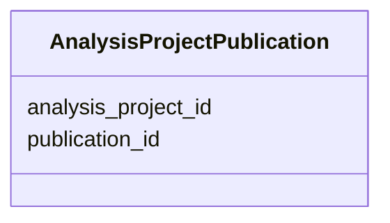

# Class: AnalysisProjectPublication 


URI: [gold:AnalysisProjectPublication](https://w3id.org/jgi/gold/AnalysisProjectPublication)





<!-- no inheritance hierarchy -->


## Slots

| Name | Cardinality and Range | Description | Inheritance |
| ---  | --- | --- | --- |
| [analysis_project_id](analysis_project_id.md) | 0..1 <br/> [Float](Float.md) |  | direct |
| [publication_id](publication_id.md) | 0..1 <br/> [Float](Float.md) |  | direct |


## Identifier and Mapping Information


### Schema Source


* from schema: https://w3id.org/jgi/gold


## Mappings

| Mapping Type | Mapped Value |
| ---  | ---  |
| self | gold:AnalysisProjectPublication |
| native | gold:AnalysisProjectPublication |


## LinkML Source

<!-- TODO: investigate https://stackoverflow.com/questions/37606292/how-to-create-tabbed-code-blocks-in-mkdocs-or-sphinx -->

### Direct

<details>
```yaml
name: analysis_project_publication
from_schema: https://w3id.org/jgi/gold
attributes:
  analysis_project_id:
    name: analysis_project_id
    from_schema: https://w3id.org/jgi/gold
    domain_of:
    - analysis_project
    - analysis_project_publication
    - analysis_project_sra_run_v2
    - assembly
    - dw_analysis_project
    - project_analysis_project
    - sigs_view
    range: float
    required: false
  publication_id:
    name: publication_id
    from_schema: https://w3id.org/jgi/gold
    rank: 1000
    domain_of:
    - analysis_project_publication
    range: float
    required: false

```
</details>

### Induced

<details>
```yaml
name: analysis_project_publication
from_schema: https://w3id.org/jgi/gold
attributes:
  analysis_project_id:
    name: analysis_project_id
    from_schema: https://w3id.org/jgi/gold
    alias: analysis_project_id
    owner: analysis_project_publication
    domain_of:
    - analysis_project
    - analysis_project_publication
    - analysis_project_sra_run_v2
    - assembly
    - dw_analysis_project
    - project_analysis_project
    - sigs_view
    range: float
    required: false
  publication_id:
    name: publication_id
    from_schema: https://w3id.org/jgi/gold
    rank: 1000
    alias: publication_id
    owner: analysis_project_publication
    domain_of:
    - analysis_project_publication
    range: float
    required: false

```
</details>