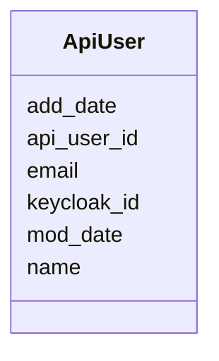

# Class: ApiUser 


URI: [gold:ApiUser](https://w3id.org/jgi/gold/ApiUser)





<!-- no inheritance hierarchy -->


## Slots

| Name | Cardinality and Range | Description | Inheritance |
| ---  | --- | --- | --- |
| [api_user_id](api_user_id.md) | 0..1 <br/> [Float](Float.md) |  | direct |
| [email](email.md) | 0..1 <br/> [String](String.md) |  | direct |
| [name](name.md) | 0..1 <br/> [String](String.md) |  | direct |
| [add_date](add_date.md) | 0..1 <br/> [Datetime](Datetime.md) |  | direct |
| [mod_date](mod_date.md) | 0..1 <br/> [Datetime](Datetime.md) |  | direct |
| [keycloak_id](keycloak_id.md) | 0..1 <br/> [String](String.md) |  | direct |


## Identifier and Mapping Information


### Schema Source


* from schema: https://w3id.org/jgi/gold


## Mappings

| Mapping Type | Mapped Value |
| ---  | ---  |
| self | gold:ApiUser |
| native | gold:ApiUser |


## LinkML Source

<!-- TODO: investigate https://stackoverflow.com/questions/37606292/how-to-create-tabbed-code-blocks-in-mkdocs-or-sphinx -->

### Direct

<details>
```yaml
name: api_user
from_schema: https://w3id.org/jgi/gold
attributes:
  api_user_id:
    name: api_user_id
    from_schema: https://w3id.org/jgi/gold
    rank: 1000
    domain_of:
    - api_user
    range: float
    required: false
  email:
    name: email
    from_schema: https://w3id.org/jgi/gold
    rank: 1000
    domain_of:
    - api_user
    range: string
    required: false
  name:
    name: name
    from_schema: https://w3id.org/jgi/gold
    rank: 1000
    domain_of:
    - api_user
    - assembly
    - assembly_method
    - ror
    range: string
    required: false
  add_date:
    name: add_date
    from_schema: https://w3id.org/jgi/gold
    domain_of:
    - analysis_project
    - api_user
    - bacdive
    - biosample
    - excel
    - organism_v2
    - package_soil
    - project
    - study
    range: datetime
    required: false
  mod_date:
    name: mod_date
    from_schema: https://w3id.org/jgi/gold
    domain_of:
    - analysis_project
    - api_user
    - bacdive
    - biosample
    - ncbi_raw_sra_run
    - organism_v2
    - package_soil
    - project
    - study
    range: datetime
    required: false
  keycloak_id:
    name: keycloak_id
    from_schema: https://w3id.org/jgi/gold
    rank: 1000
    domain_of:
    - api_user
    range: string
    required: false

```
</details>

### Induced

<details>
```yaml
name: api_user
from_schema: https://w3id.org/jgi/gold
attributes:
  api_user_id:
    name: api_user_id
    from_schema: https://w3id.org/jgi/gold
    rank: 1000
    alias: api_user_id
    owner: api_user
    domain_of:
    - api_user
    range: float
    required: false
  email:
    name: email
    from_schema: https://w3id.org/jgi/gold
    rank: 1000
    alias: email
    owner: api_user
    domain_of:
    - api_user
    range: string
    required: false
  name:
    name: name
    from_schema: https://w3id.org/jgi/gold
    rank: 1000
    alias: name
    owner: api_user
    domain_of:
    - api_user
    - assembly
    - assembly_method
    - ror
    range: string
    required: false
  add_date:
    name: add_date
    from_schema: https://w3id.org/jgi/gold
    alias: add_date
    owner: api_user
    domain_of:
    - analysis_project
    - api_user
    - bacdive
    - biosample
    - excel
    - organism_v2
    - package_soil
    - project
    - study
    range: datetime
    required: false
  mod_date:
    name: mod_date
    from_schema: https://w3id.org/jgi/gold
    alias: mod_date
    owner: api_user
    domain_of:
    - analysis_project
    - api_user
    - bacdive
    - biosample
    - ncbi_raw_sra_run
    - organism_v2
    - package_soil
    - project
    - study
    range: datetime
    required: false
  keycloak_id:
    name: keycloak_id
    from_schema: https://w3id.org/jgi/gold
    rank: 1000
    alias: keycloak_id
    owner: api_user
    domain_of:
    - api_user
    range: string
    required: false

```
</details>