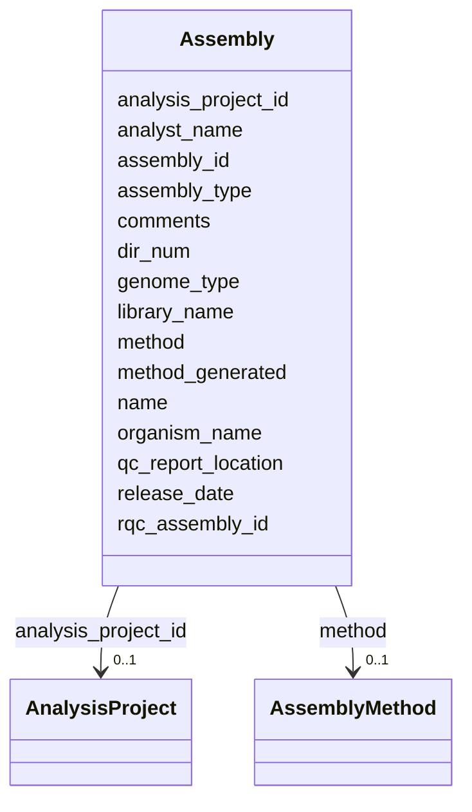

# Class: Assembly 


URI: [gold:Assembly](https://w3id.org/jgi/gold/Assembly)





<!-- no inheritance hierarchy -->


## Slots

| Name | Cardinality and Range | Description | Inheritance |
| ---  | --- | --- | --- |
| [assembly_id](assembly_id.md) | 0..1 <br/> [Float](Float.md) |  | direct |
| [organism_name](organism_name.md) | 0..1 <br/> [String](String.md) |  | direct |
| [library_name](library_name.md) | 0..1 <br/> [String](String.md) |  | direct |
| [genome_type](genome_type.md) | 0..1 <br/> [String](String.md) |  | direct |
| [assembly_type](assembly_type.md) | 0..1 <br/> [String](String.md) |  | direct |
| [analyst_name](analyst_name.md) | 0..1 <br/> [String](String.md) |  | direct |
| [release_date](release_date.md) | 0..1 <br/> [Datetime](Datetime.md) |  | direct |
| [comments](comments.md) | 0..1 <br/> [String](String.md) |  | direct |
| [dir_num](dir_num.md) | 0..1 <br/> [Float](Float.md) |  | direct |
| [rqc_assembly_id](rqc_assembly_id.md) | 0..1 <br/> [Float](Float.md) |  | direct |
| [qc_report_location](qc_report_location.md) | 0..1 <br/> [String](String.md) |  | direct |
| [analysis_project_id](analysis_project_id.md) | 0..1 <br/> [AnalysisProject](AnalysisProject.md) | Foreign key to analysis_project | direct |
| [method](method.md) | 0..1 <br/> [AssemblyMethod](AssemblyMethod.md) | Foreign key to assembly_method | direct |
| [name](name.md) | 0..1 <br/> [String](String.md) |  | direct |
| [method_generated](method_generated.md) | 0..1 <br/> [String](String.md) |  | direct |


## Usages

| used by | used in | type | used |
| ---  | --- | --- | --- |
| [AssemblyLibrary](AssemblyLibrary.md) | [assembly_id](assembly_id.md) | range | [Assembly](Assembly.md) |


## Identifier and Mapping Information


### Schema Source


* from schema: https://w3id.org/jgi/gold


## Mappings

| Mapping Type | Mapped Value |
| ---  | ---  |
| self | gold:Assembly |
| native | gold:Assembly |


## LinkML Source

<!-- TODO: investigate https://stackoverflow.com/questions/37606292/how-to-create-tabbed-code-blocks-in-mkdocs-or-sphinx -->

### Direct

<details>
```yaml
name: assembly
from_schema: https://w3id.org/jgi/gold
attributes:
  assembly_id:
    name: assembly_id
    from_schema: https://w3id.org/jgi/gold
    rank: 1000
    domain_of:
    - assembly
    - assembly_library
    range: float
    required: false
  organism_name:
    name: organism_name
    from_schema: https://w3id.org/jgi/gold
    rank: 1000
    domain_of:
    - assembly
    - ncbi_assembly
    - organism_v2
    range: string
    required: false
  library_name:
    name: library_name
    from_schema: https://w3id.org/jgi/gold
    rank: 1000
    domain_of:
    - assembly
    - sra_experiment_v2
    range: string
    required: false
  genome_type:
    name: genome_type
    from_schema: https://w3id.org/jgi/gold
    rank: 1000
    domain_of:
    - assembly
    range: string
    required: false
  assembly_type:
    name: assembly_type
    from_schema: https://w3id.org/jgi/gold
    rank: 1000
    domain_of:
    - assembly
    - ncbi_assembly
    range: string
    required: false
  analyst_name:
    name: analyst_name
    from_schema: https://w3id.org/jgi/gold
    rank: 1000
    domain_of:
    - assembly
    range: string
    required: false
  release_date:
    name: release_date
    from_schema: https://w3id.org/jgi/gold
    rank: 1000
    domain_of:
    - assembly
    - sigs_view
    range: datetime
    required: false
  comments:
    name: comments
    from_schema: https://w3id.org/jgi/gold
    domain_of:
    - analysis_project
    - assembly
    - organism_v2
    range: string
    required: false
  dir_num:
    name: dir_num
    from_schema: https://w3id.org/jgi/gold
    rank: 1000
    domain_of:
    - assembly
    range: float
    required: false
  rqc_assembly_id:
    name: rqc_assembly_id
    from_schema: https://w3id.org/jgi/gold
    rank: 1000
    domain_of:
    - assembly
    range: float
    required: false
  qc_report_location:
    name: qc_report_location
    from_schema: https://w3id.org/jgi/gold
    rank: 1000
    domain_of:
    - assembly
    range: string
    required: false
  analysis_project_id:
    name: analysis_project_id
    description: Foreign key to analysis_project
    from_schema: https://w3id.org/jgi/gold
    domain_of:
    - analysis_project
    - analysis_project_publication
    - analysis_project_sra_run_v2
    - assembly
    - dw_analysis_project
    - project_analysis_project
    - sigs_view
    range: analysis_project
    required: false
  method:
    name: method
    description: Foreign key to assembly_method
    from_schema: https://w3id.org/jgi/gold
    rank: 1000
    domain_of:
    - assembly
    range: assembly_method
    required: false
  name:
    name: name
    from_schema: https://w3id.org/jgi/gold
    domain_of:
    - api_user
    - assembly
    - assembly_method
    - ror
    range: string
    required: false
  method_generated:
    name: method_generated
    from_schema: https://w3id.org/jgi/gold
    rank: 1000
    domain_of:
    - assembly
    range: string
    required: false

```
</details>

### Induced

<details>
```yaml
name: assembly
from_schema: https://w3id.org/jgi/gold
attributes:
  assembly_id:
    name: assembly_id
    from_schema: https://w3id.org/jgi/gold
    rank: 1000
    alias: assembly_id
    owner: assembly
    domain_of:
    - assembly
    - assembly_library
    range: float
    required: false
  organism_name:
    name: organism_name
    from_schema: https://w3id.org/jgi/gold
    rank: 1000
    alias: organism_name
    owner: assembly
    domain_of:
    - assembly
    - ncbi_assembly
    - organism_v2
    range: string
    required: false
  library_name:
    name: library_name
    from_schema: https://w3id.org/jgi/gold
    rank: 1000
    alias: library_name
    owner: assembly
    domain_of:
    - assembly
    - sra_experiment_v2
    range: string
    required: false
  genome_type:
    name: genome_type
    from_schema: https://w3id.org/jgi/gold
    rank: 1000
    alias: genome_type
    owner: assembly
    domain_of:
    - assembly
    range: string
    required: false
  assembly_type:
    name: assembly_type
    from_schema: https://w3id.org/jgi/gold
    rank: 1000
    alias: assembly_type
    owner: assembly
    domain_of:
    - assembly
    - ncbi_assembly
    range: string
    required: false
  analyst_name:
    name: analyst_name
    from_schema: https://w3id.org/jgi/gold
    rank: 1000
    alias: analyst_name
    owner: assembly
    domain_of:
    - assembly
    range: string
    required: false
  release_date:
    name: release_date
    from_schema: https://w3id.org/jgi/gold
    rank: 1000
    alias: release_date
    owner: assembly
    domain_of:
    - assembly
    - sigs_view
    range: datetime
    required: false
  comments:
    name: comments
    from_schema: https://w3id.org/jgi/gold
    alias: comments
    owner: assembly
    domain_of:
    - analysis_project
    - assembly
    - organism_v2
    range: string
    required: false
  dir_num:
    name: dir_num
    from_schema: https://w3id.org/jgi/gold
    rank: 1000
    alias: dir_num
    owner: assembly
    domain_of:
    - assembly
    range: float
    required: false
  rqc_assembly_id:
    name: rqc_assembly_id
    from_schema: https://w3id.org/jgi/gold
    rank: 1000
    alias: rqc_assembly_id
    owner: assembly
    domain_of:
    - assembly
    range: float
    required: false
  qc_report_location:
    name: qc_report_location
    from_schema: https://w3id.org/jgi/gold
    rank: 1000
    alias: qc_report_location
    owner: assembly
    domain_of:
    - assembly
    range: string
    required: false
  analysis_project_id:
    name: analysis_project_id
    description: Foreign key to analysis_project
    from_schema: https://w3id.org/jgi/gold
    alias: analysis_project_id
    owner: assembly
    domain_of:
    - analysis_project
    - analysis_project_publication
    - analysis_project_sra_run_v2
    - assembly
    - dw_analysis_project
    - project_analysis_project
    - sigs_view
    range: analysis_project
    required: false
  method:
    name: method
    description: Foreign key to assembly_method
    from_schema: https://w3id.org/jgi/gold
    rank: 1000
    alias: method
    owner: assembly
    domain_of:
    - assembly
    range: assembly_method
    required: false
  name:
    name: name
    from_schema: https://w3id.org/jgi/gold
    alias: name
    owner: assembly
    domain_of:
    - api_user
    - assembly
    - assembly_method
    - ror
    range: string
    required: false
  method_generated:
    name: method_generated
    from_schema: https://w3id.org/jgi/gold
    rank: 1000
    alias: method_generated
    owner: assembly
    domain_of:
    - assembly
    range: string
    required: false

```
</details>