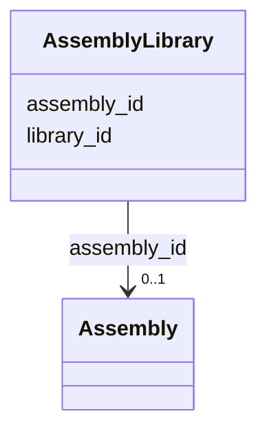

# Class: AssemblyLibrary 


URI: [gold:AssemblyLibrary](https://w3id.org/jgi/gold/AssemblyLibrary)





<!-- no inheritance hierarchy -->


## Slots

| Name | Cardinality and Range | Description | Inheritance |
| ---  | --- | --- | --- |
| [assembly_id](assembly_id.md) | 0..1 <br/> [Assembly](Assembly.md) | Foreign key to assembly | direct |
| [library_id](library_id.md) | 0..1 <br/> [Float](Float.md) |  | direct |


## Identifier and Mapping Information


### Schema Source


* from schema: https://w3id.org/jgi/gold


## Mappings

| Mapping Type | Mapped Value |
| ---  | ---  |
| self | gold:AssemblyLibrary |
| native | gold:AssemblyLibrary |


## LinkML Source

<!-- TODO: investigate https://stackoverflow.com/questions/37606292/how-to-create-tabbed-code-blocks-in-mkdocs-or-sphinx -->

### Direct

<details>
```yaml
name: assembly_library
from_schema: https://w3id.org/jgi/gold
attributes:
  assembly_id:
    name: assembly_id
    description: Foreign key to assembly
    from_schema: https://w3id.org/jgi/gold
    domain_of:
    - assembly
    - assembly_library
    range: assembly
    required: false
  library_id:
    name: library_id
    from_schema: https://w3id.org/jgi/gold
    rank: 1000
    domain_of:
    - assembly_library
    range: float
    required: false

```
</details>

### Induced

<details>
```yaml
name: assembly_library
from_schema: https://w3id.org/jgi/gold
attributes:
  assembly_id:
    name: assembly_id
    description: Foreign key to assembly
    from_schema: https://w3id.org/jgi/gold
    alias: assembly_id
    owner: assembly_library
    domain_of:
    - assembly
    - assembly_library
    range: assembly
    required: false
  library_id:
    name: library_id
    from_schema: https://w3id.org/jgi/gold
    rank: 1000
    alias: library_id
    owner: assembly_library
    domain_of:
    - assembly_library
    range: float
    required: false

```
</details>