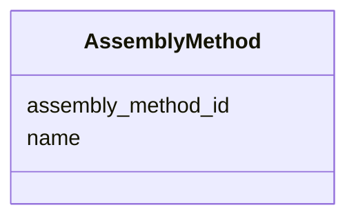

# Class: AssemblyMethod 


URI: [gold:AssemblyMethod](https://w3id.org/jgi/gold/AssemblyMethod)





<!-- no inheritance hierarchy -->


## Slots

| Name | Cardinality and Range | Description | Inheritance |
| ---  | --- | --- | --- |
| [assembly_method_id](assembly_method_id.md) | 0..1 <br/> [Float](Float.md) |  | direct |
| [name](name.md) | 0..1 <br/> [String](String.md) |  | direct |


## Usages

| used by | used in | type | used |
| ---  | --- | --- | --- |
| [Assembly](Assembly.md) | [method](method.md) | range | [AssemblyMethod](AssemblyMethod.md) |
| [AssemblyMethodMapping](AssemblyMethodMapping.md) | [uncurated_id](uncurated_id.md) | range | [AssemblyMethod](AssemblyMethod.md) |
| [AssemblyMethodMapping](AssemblyMethodMapping.md) | [curated_id](curated_id.md) | range | [AssemblyMethod](AssemblyMethod.md) |


## Identifier and Mapping Information


### Schema Source


* from schema: https://w3id.org/jgi/gold


## Mappings

| Mapping Type | Mapped Value |
| ---  | ---  |
| self | gold:AssemblyMethod |
| native | gold:AssemblyMethod |


## LinkML Source

<!-- TODO: investigate https://stackoverflow.com/questions/37606292/how-to-create-tabbed-code-blocks-in-mkdocs-or-sphinx -->

### Direct

<details>
```yaml
name: assembly_method
from_schema: https://w3id.org/jgi/gold
attributes:
  assembly_method_id:
    name: assembly_method_id
    from_schema: https://w3id.org/jgi/gold
    rank: 1000
    domain_of:
    - assembly_method
    range: float
    required: false
  name:
    name: name
    from_schema: https://w3id.org/jgi/gold
    domain_of:
    - api_user
    - assembly
    - assembly_method
    - ror
    range: string
    required: false

```
</details>

### Induced

<details>
```yaml
name: assembly_method
from_schema: https://w3id.org/jgi/gold
attributes:
  assembly_method_id:
    name: assembly_method_id
    from_schema: https://w3id.org/jgi/gold
    rank: 1000
    alias: assembly_method_id
    owner: assembly_method
    domain_of:
    - assembly_method
    range: float
    required: false
  name:
    name: name
    from_schema: https://w3id.org/jgi/gold
    alias: name
    owner: assembly_method
    domain_of:
    - api_user
    - assembly
    - assembly_method
    - ror
    range: string
    required: false

```
</details>