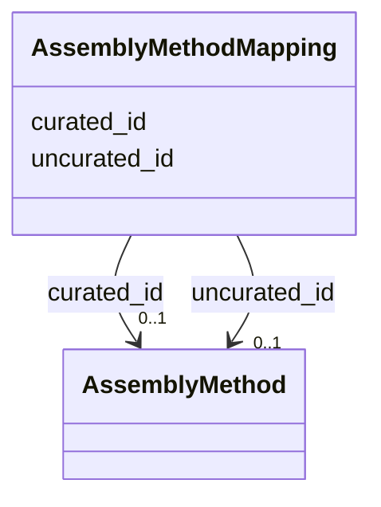

# Class: AssemblyMethodMapping 


URI: [gold:AssemblyMethodMapping](https://w3id.org/jgi/gold/AssemblyMethodMapping)





<!-- no inheritance hierarchy -->


## Slots

| Name | Cardinality and Range | Description | Inheritance |
| ---  | --- | --- | --- |
| [uncurated_id](uncurated_id.md) | 0..1 <br/> [AssemblyMethod](AssemblyMethod.md) | Foreign key to assembly_method | direct |
| [curated_id](curated_id.md) | 0..1 <br/> [AssemblyMethod](AssemblyMethod.md) | Foreign key to assembly_method | direct |


## Identifier and Mapping Information


### Schema Source


* from schema: https://w3id.org/jgi/gold


## Mappings

| Mapping Type | Mapped Value |
| ---  | ---  |
| self | gold:AssemblyMethodMapping |
| native | gold:AssemblyMethodMapping |


## LinkML Source

<!-- TODO: investigate https://stackoverflow.com/questions/37606292/how-to-create-tabbed-code-blocks-in-mkdocs-or-sphinx -->

### Direct

<details>
```yaml
name: assembly_method_mapping
from_schema: https://w3id.org/jgi/gold
attributes:
  uncurated_id:
    name: uncurated_id
    description: Foreign key to assembly_method
    from_schema: https://w3id.org/jgi/gold
    rank: 1000
    domain_of:
    - assembly_method_mapping
    range: assembly_method
    required: false
  curated_id:
    name: curated_id
    description: Foreign key to assembly_method
    from_schema: https://w3id.org/jgi/gold
    rank: 1000
    domain_of:
    - assembly_method_mapping
    range: assembly_method
    required: false

```
</details>

### Induced

<details>
```yaml
name: assembly_method_mapping
from_schema: https://w3id.org/jgi/gold
attributes:
  uncurated_id:
    name: uncurated_id
    description: Foreign key to assembly_method
    from_schema: https://w3id.org/jgi/gold
    rank: 1000
    alias: uncurated_id
    owner: assembly_method_mapping
    domain_of:
    - assembly_method_mapping
    range: assembly_method
    required: false
  curated_id:
    name: curated_id
    description: Foreign key to assembly_method
    from_schema: https://w3id.org/jgi/gold
    rank: 1000
    alias: curated_id
    owner: assembly_method_mapping
    domain_of:
    - assembly_method_mapping
    range: assembly_method
    required: false

```
</details>