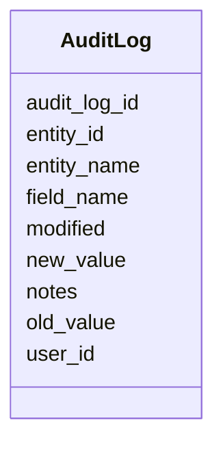

# Class: AuditLog 


URI: [gold:AuditLog](https://w3id.org/jgi/gold/AuditLog)





<!-- no inheritance hierarchy -->


## Slots

| Name | Cardinality and Range | Description | Inheritance |
| ---  | --- | --- | --- |
| [audit_log_id](audit_log_id.md) | 0..1 <br/> [Float](Float.md) |  | direct |
| [entity_name](entity_name.md) | 0..1 <br/> [String](String.md) |  | direct |
| [entity_id](entity_id.md) | 0..1 <br/> [Float](Float.md) |  | direct |
| [field_name](field_name.md) | 0..1 <br/> [String](String.md) |  | direct |
| [user_id](user_id.md) | 0..1 <br/> [Float](Float.md) |  | direct |
| [modified](modified.md) | 0..1 <br/> [Datetime](Datetime.md) |  | direct |
| [old_value](old_value.md) | 0..1 <br/> [String](String.md) |  | direct |
| [new_value](new_value.md) | 0..1 <br/> [String](String.md) |  | direct |
| [notes](notes.md) | 0..1 <br/> [String](String.md) |  | direct |


## Identifier and Mapping Information


### Schema Source


* from schema: https://w3id.org/jgi/gold


## Mappings

| Mapping Type | Mapped Value |
| ---  | ---  |
| self | gold:AuditLog |
| native | gold:AuditLog |


## LinkML Source

<!-- TODO: investigate https://stackoverflow.com/questions/37606292/how-to-create-tabbed-code-blocks-in-mkdocs-or-sphinx -->

### Direct

<details>
```yaml
name: audit_log
from_schema: https://w3id.org/jgi/gold
attributes:
  audit_log_id:
    name: audit_log_id
    from_schema: https://w3id.org/jgi/gold
    rank: 1000
    domain_of:
    - audit_log
    range: float
    required: false
  entity_name:
    name: entity_name
    from_schema: https://w3id.org/jgi/gold
    rank: 1000
    domain_of:
    - audit_log
    range: string
    required: false
  entity_id:
    name: entity_id
    from_schema: https://w3id.org/jgi/gold
    rank: 1000
    domain_of:
    - audit_log
    range: float
    required: false
  field_name:
    name: field_name
    from_schema: https://w3id.org/jgi/gold
    rank: 1000
    domain_of:
    - audit_log
    range: string
    required: false
  user_id:
    name: user_id
    from_schema: https://w3id.org/jgi/gold
    rank: 1000
    domain_of:
    - audit_log
    range: float
    required: false
  modified:
    name: modified
    from_schema: https://w3id.org/jgi/gold
    rank: 1000
    domain_of:
    - audit_log
    range: datetime
    required: false
  old_value:
    name: old_value
    from_schema: https://w3id.org/jgi/gold
    rank: 1000
    domain_of:
    - audit_log
    range: string
    required: false
  new_value:
    name: new_value
    from_schema: https://w3id.org/jgi/gold
    rank: 1000
    domain_of:
    - audit_log
    range: string
    required: false
  notes:
    name: notes
    from_schema: https://w3id.org/jgi/gold
    rank: 1000
    domain_of:
    - audit_log
    - dw_sequencing_product
    range: string
    required: false

```
</details>

### Induced

<details>
```yaml
name: audit_log
from_schema: https://w3id.org/jgi/gold
attributes:
  audit_log_id:
    name: audit_log_id
    from_schema: https://w3id.org/jgi/gold
    rank: 1000
    alias: audit_log_id
    owner: audit_log
    domain_of:
    - audit_log
    range: float
    required: false
  entity_name:
    name: entity_name
    from_schema: https://w3id.org/jgi/gold
    rank: 1000
    alias: entity_name
    owner: audit_log
    domain_of:
    - audit_log
    range: string
    required: false
  entity_id:
    name: entity_id
    from_schema: https://w3id.org/jgi/gold
    rank: 1000
    alias: entity_id
    owner: audit_log
    domain_of:
    - audit_log
    range: float
    required: false
  field_name:
    name: field_name
    from_schema: https://w3id.org/jgi/gold
    rank: 1000
    alias: field_name
    owner: audit_log
    domain_of:
    - audit_log
    range: string
    required: false
  user_id:
    name: user_id
    from_schema: https://w3id.org/jgi/gold
    rank: 1000
    alias: user_id
    owner: audit_log
    domain_of:
    - audit_log
    range: float
    required: false
  modified:
    name: modified
    from_schema: https://w3id.org/jgi/gold
    rank: 1000
    alias: modified
    owner: audit_log
    domain_of:
    - audit_log
    range: datetime
    required: false
  old_value:
    name: old_value
    from_schema: https://w3id.org/jgi/gold
    rank: 1000
    alias: old_value
    owner: audit_log
    domain_of:
    - audit_log
    range: string
    required: false
  new_value:
    name: new_value
    from_schema: https://w3id.org/jgi/gold
    rank: 1000
    alias: new_value
    owner: audit_log
    domain_of:
    - audit_log
    range: string
    required: false
  notes:
    name: notes
    from_schema: https://w3id.org/jgi/gold
    rank: 1000
    alias: notes
    owner: audit_log
    domain_of:
    - audit_log
    - dw_sequencing_product
    range: string
    required: false

```
</details>