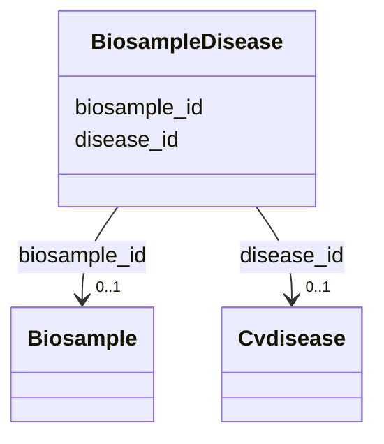

# Class: BiosampleDisease 


URI: [gold:BiosampleDisease](https://w3id.org/jgi/gold/BiosampleDisease)





<!-- no inheritance hierarchy -->


## Slots

| Name | Cardinality and Range | Description | Inheritance |
| ---  | --- | --- | --- |
| [biosample_id](biosample_id.md) | 0..1 <br/> [Biosample](Biosample.md) | Foreign key to biosample | direct |
| [disease_id](disease_id.md) | 0..1 <br/> [Cvdisease](Cvdisease.md) | Foreign key to cvdisease | direct |


## Identifier and Mapping Information


### Schema Source


* from schema: https://w3id.org/jgi/gold


## Mappings

| Mapping Type | Mapped Value |
| ---  | ---  |
| self | gold:BiosampleDisease |
| native | gold:BiosampleDisease |


## LinkML Source

<!-- TODO: investigate https://stackoverflow.com/questions/37606292/how-to-create-tabbed-code-blocks-in-mkdocs-or-sphinx -->

### Direct

<details>
```yaml
name: biosample_disease
from_schema: https://w3id.org/jgi/gold
attributes:
  biosample_id:
    name: biosample_id
    description: Foreign key to biosample
    from_schema: https://w3id.org/jgi/gold
    domain_of:
    - biosample
    - biosample_disease
    - organism_v2
    - package_soil
    range: biosample
    required: false
  disease_id:
    name: disease_id
    description: Foreign key to cvdisease
    from_schema: https://w3id.org/jgi/gold
    rank: 1000
    domain_of:
    - biosample_disease
    range: cvdisease
    required: false

```
</details>

### Induced

<details>
```yaml
name: biosample_disease
from_schema: https://w3id.org/jgi/gold
attributes:
  biosample_id:
    name: biosample_id
    description: Foreign key to biosample
    from_schema: https://w3id.org/jgi/gold
    alias: biosample_id
    owner: biosample_disease
    domain_of:
    - biosample
    - biosample_disease
    - organism_v2
    - package_soil
    range: biosample
    required: false
  disease_id:
    name: disease_id
    description: Foreign key to cvdisease
    from_schema: https://w3id.org/jgi/gold
    rank: 1000
    alias: disease_id
    owner: biosample_disease
    domain_of:
    - biosample_disease
    range: cvdisease
    required: false

```
</details>