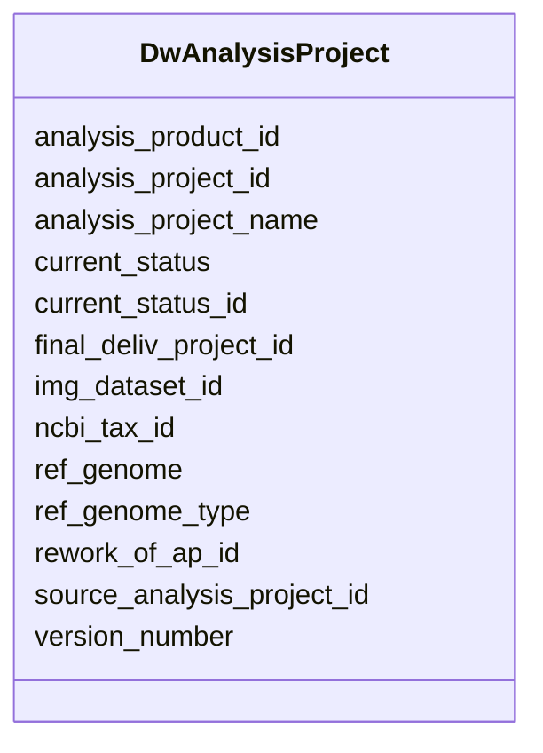

# Class: DwAnalysisProject 


URI: [gold:DwAnalysisProject](https://w3id.org/jgi/gold/DwAnalysisProject)





<!-- no inheritance hierarchy -->


## Slots

| Name | Cardinality and Range | Description | Inheritance |
| ---  | --- | --- | --- |
| [analysis_project_id](analysis_project_id.md) | 0..1 <br/> [Integer](Integer.md) |  | direct |
| [analysis_project_name](analysis_project_name.md) | 0..1 <br/> [String](String.md) |  | direct |
| [final_deliv_project_id](final_deliv_project_id.md) | 0..1 <br/> [Integer](Integer.md) |  | direct |
| [analysis_product_id](analysis_product_id.md) | 0..1 <br/> [Integer](Integer.md) |  | direct |
| [version_number](version_number.md) | 0..1 <br/> [Float](Float.md) |  | direct |
| [current_status](current_status.md) | 0..1 <br/> [String](String.md) |  | direct |
| [current_status_id](current_status_id.md) | 0..1 <br/> [Integer](Integer.md) |  | direct |
| [rework_of_ap_id](rework_of_ap_id.md) | 0..1 <br/> [Integer](Integer.md) |  | direct |
| [ncbi_tax_id](ncbi_tax_id.md) | 0..1 <br/> [Integer](Integer.md) |  | direct |
| [ref_genome](ref_genome.md) | 0..1 <br/> [String](String.md) |  | direct |
| [ref_genome_type](ref_genome_type.md) | 0..1 <br/> [String](String.md) |  | direct |
| [img_dataset_id](img_dataset_id.md) | 0..1 <br/> [String](String.md) |  | direct |
| [source_analysis_project_id](source_analysis_project_id.md) | 0..1 <br/> [Integer](Integer.md) |  | direct |


## Identifier and Mapping Information


### Schema Source


* from schema: https://w3id.org/jgi/gold


## Mappings

| Mapping Type | Mapped Value |
| ---  | ---  |
| self | gold:DwAnalysisProject |
| native | gold:DwAnalysisProject |


## LinkML Source

<!-- TODO: investigate https://stackoverflow.com/questions/37606292/how-to-create-tabbed-code-blocks-in-mkdocs-or-sphinx -->

### Direct

<details>
```yaml
name: dw_analysis_project
from_schema: https://w3id.org/jgi/gold
attributes:
  analysis_project_id:
    name: analysis_project_id
    from_schema: https://w3id.org/jgi/gold
    domain_of:
    - analysis_project
    - analysis_project_publication
    - analysis_project_sra_run_v2
    - assembly
    - dw_analysis_project
    - project_analysis_project
    - sigs_view
    range: integer
    required: false
  analysis_project_name:
    name: analysis_project_name
    from_schema: https://w3id.org/jgi/gold
    domain_of:
    - analysis_project
    - dw_analysis_project
    range: string
    required: false
  final_deliv_project_id:
    name: final_deliv_project_id
    from_schema: https://w3id.org/jgi/gold
    rank: 1000
    domain_of:
    - dw_analysis_project
    - dw_sequencing_project
    range: integer
    required: false
  analysis_product_id:
    name: analysis_product_id
    from_schema: https://w3id.org/jgi/gold
    rank: 1000
    domain_of:
    - dw_analysis_project
    range: integer
    required: false
  version_number:
    name: version_number
    from_schema: https://w3id.org/jgi/gold
    rank: 1000
    domain_of:
    - dw_analysis_project
    range: float
    required: false
  current_status:
    name: current_status
    from_schema: https://w3id.org/jgi/gold
    rank: 1000
    domain_of:
    - dw_analysis_project
    - dw_samples
    - dw_sequencing_project
    range: string
    required: false
  current_status_id:
    name: current_status_id
    from_schema: https://w3id.org/jgi/gold
    rank: 1000
    domain_of:
    - dw_analysis_project
    - dw_sequencing_project
    range: integer
    required: false
  rework_of_ap_id:
    name: rework_of_ap_id
    from_schema: https://w3id.org/jgi/gold
    rank: 1000
    domain_of:
    - dw_analysis_project
    range: integer
    required: false
  ncbi_tax_id:
    name: ncbi_tax_id
    from_schema: https://w3id.org/jgi/gold
    domain_of:
    - analysis_project
    - dw_analysis_project
    - ncbi_taxonomy
    range: integer
    required: false
  ref_genome:
    name: ref_genome
    from_schema: https://w3id.org/jgi/gold
    rank: 1000
    domain_of:
    - dw_analysis_project
    range: string
    required: false
  ref_genome_type:
    name: ref_genome_type
    from_schema: https://w3id.org/jgi/gold
    rank: 1000
    domain_of:
    - dw_analysis_project
    range: string
    required: false
  img_dataset_id:
    name: img_dataset_id
    from_schema: https://w3id.org/jgi/gold
    rank: 1000
    domain_of:
    - dw_analysis_project
    range: string
    required: false
  source_analysis_project_id:
    name: source_analysis_project_id
    from_schema: https://w3id.org/jgi/gold
    rank: 1000
    domain_of:
    - dw_analysis_project
    range: integer
    required: false

```
</details>

### Induced

<details>
```yaml
name: dw_analysis_project
from_schema: https://w3id.org/jgi/gold
attributes:
  analysis_project_id:
    name: analysis_project_id
    from_schema: https://w3id.org/jgi/gold
    alias: analysis_project_id
    owner: dw_analysis_project
    domain_of:
    - analysis_project
    - analysis_project_publication
    - analysis_project_sra_run_v2
    - assembly
    - dw_analysis_project
    - project_analysis_project
    - sigs_view
    range: integer
    required: false
  analysis_project_name:
    name: analysis_project_name
    from_schema: https://w3id.org/jgi/gold
    alias: analysis_project_name
    owner: dw_analysis_project
    domain_of:
    - analysis_project
    - dw_analysis_project
    range: string
    required: false
  final_deliv_project_id:
    name: final_deliv_project_id
    from_schema: https://w3id.org/jgi/gold
    rank: 1000
    alias: final_deliv_project_id
    owner: dw_analysis_project
    domain_of:
    - dw_analysis_project
    - dw_sequencing_project
    range: integer
    required: false
  analysis_product_id:
    name: analysis_product_id
    from_schema: https://w3id.org/jgi/gold
    rank: 1000
    alias: analysis_product_id
    owner: dw_analysis_project
    domain_of:
    - dw_analysis_project
    range: integer
    required: false
  version_number:
    name: version_number
    from_schema: https://w3id.org/jgi/gold
    rank: 1000
    alias: version_number
    owner: dw_analysis_project
    domain_of:
    - dw_analysis_project
    range: float
    required: false
  current_status:
    name: current_status
    from_schema: https://w3id.org/jgi/gold
    rank: 1000
    alias: current_status
    owner: dw_analysis_project
    domain_of:
    - dw_analysis_project
    - dw_samples
    - dw_sequencing_project
    range: string
    required: false
  current_status_id:
    name: current_status_id
    from_schema: https://w3id.org/jgi/gold
    rank: 1000
    alias: current_status_id
    owner: dw_analysis_project
    domain_of:
    - dw_analysis_project
    - dw_sequencing_project
    range: integer
    required: false
  rework_of_ap_id:
    name: rework_of_ap_id
    from_schema: https://w3id.org/jgi/gold
    rank: 1000
    alias: rework_of_ap_id
    owner: dw_analysis_project
    domain_of:
    - dw_analysis_project
    range: integer
    required: false
  ncbi_tax_id:
    name: ncbi_tax_id
    from_schema: https://w3id.org/jgi/gold
    alias: ncbi_tax_id
    owner: dw_analysis_project
    domain_of:
    - analysis_project
    - dw_analysis_project
    - ncbi_taxonomy
    range: integer
    required: false
  ref_genome:
    name: ref_genome
    from_schema: https://w3id.org/jgi/gold
    rank: 1000
    alias: ref_genome
    owner: dw_analysis_project
    domain_of:
    - dw_analysis_project
    range: string
    required: false
  ref_genome_type:
    name: ref_genome_type
    from_schema: https://w3id.org/jgi/gold
    rank: 1000
    alias: ref_genome_type
    owner: dw_analysis_project
    domain_of:
    - dw_analysis_project
    range: string
    required: false
  img_dataset_id:
    name: img_dataset_id
    from_schema: https://w3id.org/jgi/gold
    rank: 1000
    alias: img_dataset_id
    owner: dw_analysis_project
    domain_of:
    - dw_analysis_project
    range: string
    required: false
  source_analysis_project_id:
    name: source_analysis_project_id
    from_schema: https://w3id.org/jgi/gold
    rank: 1000
    alias: source_analysis_project_id
    owner: dw_analysis_project
    domain_of:
    - dw_analysis_project
    range: integer
    required: false

```
</details>