# Class: DwSamples 


URI: [gold:DwSamples](https://w3id.org/jgi/gold/DwSamples)

```mermaid
 classDiagram
    class DwSamples
    click DwSamples href "../DwSamples/"
      DwSamples : absorbance_260_230
        
      DwSamples : absorbance_260_280
        
      DwSamples : collabor_concentration_ngul
        
      DwSamples : collabor_volume_ul
        
      DwSamples : collection_altit_depth_meters
        
      DwSamples : collection_latitude
        
      DwSamples : collection_longitude
        
      DwSamples : collection_site_growth
        
      DwSamples : collection_time
        
      DwSamples : created_by_id
        
      DwSamples : created_by_name
        
      DwSamples : culture_strain_pure_descr
        
      DwSamples : current_concentration_ngul
        
      DwSamples : current_status
        
      DwSamples : current_volume_ul
        
      DwSamples : date_created
        
      DwSamples : developmental_stage_age
        
      DwSamples : dna_isolation_method
        
      DwSamples : dna_treated
        
      DwSamples : gls_sample_id
        
      DwSamples : group_name
        
      DwSamples : in_vivo_conditions
        
      DwSamples : last_updated
        
      DwSamples : last_updated_by_id
        
      DwSamples : last_updated_by_name
        
      DwSamples : material_type
        
      DwSamples : max_depth_meters
        
      DwSamples : max_elevation_meters
        
      DwSamples : max_insert_size_kb
        
      DwSamples : min_depth_meters
        
      DwSamples : min_elevation_meters
        
      DwSamples : number_tubes_plates
        
      DwSamples : pathogenicity
        
      DwSamples : plate_location
        
      DwSamples : qc_status
        
      DwSamples : qc_total_mass_ng
        
      DwSamples : risk_group_level
        
      DwSamples : sample_format
        
      DwSamples : sample_id
        
      DwSamples : sample_isolated_from
        
      DwSamples : sample_name
        
      DwSamples : sample_tube_barcode
        
      DwSamples : sex
        
      DwSamples : shipment_storage_comments
        
      DwSamples : source_sample_pid
        
      DwSamples : starting_culture_pure
        
      DwSamples : status_comments
        
      DwSamples : status_date
        
      DwSamples : storage_solution
        
      DwSamples : tissue_organ_source
        
      DwSamples : tube_plate_label
        
      DwSamples : vector_name
        
      
```





<!-- no inheritance hierarchy -->


## Slots

| Name | Cardinality and Range | Description | Inheritance |
| ---  | --- | --- | --- |
| [sample_id](sample_id.md) | 0..1 <br/> [Integer](Integer.md) |  | direct |
| [gls_sample_id](gls_sample_id.md) | 0..1 <br/> [String](String.md) |  | direct |
| [sample_name](sample_name.md) | 0..1 <br/> [String](String.md) |  | direct |
| [collection_time](collection_time.md) | 0..1 <br/> [Datetime](Datetime.md) |  | direct |
| [collection_latitude](collection_latitude.md) | 0..1 <br/> [Float](Float.md) |  | direct |
| [collection_longitude](collection_longitude.md) | 0..1 <br/> [Float](Float.md) |  | direct |
| [collection_altit_depth_meters](collection_altit_depth_meters.md) | 0..1 <br/> [Float](Float.md) |  | direct |
| [min_depth_meters](min_depth_meters.md) | 0..1 <br/> [Float](Float.md) |  | direct |
| [max_depth_meters](max_depth_meters.md) | 0..1 <br/> [Float](Float.md) |  | direct |
| [min_elevation_meters](min_elevation_meters.md) | 0..1 <br/> [Float](Float.md) |  | direct |
| [max_elevation_meters](max_elevation_meters.md) | 0..1 <br/> [Float](Float.md) |  | direct |
| [collection_site_growth](collection_site_growth.md) | 0..1 <br/> [String](String.md) |  | direct |
| [dna_isolation_method](dna_isolation_method.md) | 0..1 <br/> [String](String.md) |  | direct |
| [current_concentration_ngul](current_concentration_ngul.md) | 0..1 <br/> [Float](Float.md) |  | direct |
| [tube_plate_label](tube_plate_label.md) | 0..1 <br/> [String](String.md) |  | direct |
| [plate_location](plate_location.md) | 0..1 <br/> [String](String.md) |  | direct |
| [number_tubes_plates](number_tubes_plates.md) | 0..1 <br/> [Float](Float.md) |  | direct |
| [shipment_storage_comments](shipment_storage_comments.md) | 0..1 <br/> [String](String.md) |  | direct |
| [dna_treated](dna_treated.md) | 0..1 <br/> [String](String.md) |  | direct |
| [starting_culture_pure](starting_culture_pure.md) | 0..1 <br/> [String](String.md) |  | direct |
| [culture_strain_pure_descr](culture_strain_pure_descr.md) | 0..1 <br/> [String](String.md) |  | direct |
| [tissue_organ_source](tissue_organ_source.md) | 0..1 <br/> [String](String.md) |  | direct |
| [developmental_stage_age](developmental_stage_age.md) | 0..1 <br/> [String](String.md) |  | direct |
| [sex](sex.md) | 0..1 <br/> [String](String.md) |  | direct |
| [in_vivo_conditions](in_vivo_conditions.md) | 0..1 <br/> [String](String.md) |  | direct |
| [vector_name](vector_name.md) | 0..1 <br/> [String](String.md) |  | direct |
| [date_created](date_created.md) | 0..1 <br/> [Datetime](Datetime.md) |  | direct |
| [last_updated](last_updated.md) | 0..1 <br/> [Datetime](Datetime.md) |  | direct |
| [status_date](status_date.md) | 0..1 <br/> [Datetime](Datetime.md) |  | direct |
| [status_comments](status_comments.md) | 0..1 <br/> [String](String.md) |  | direct |
| [absorbance_260_230](absorbance_260_230.md) | 0..1 <br/> [Float](Float.md) |  | direct |
| [sample_isolated_from](sample_isolated_from.md) | 0..1 <br/> [String](String.md) |  | direct |
| [qc_total_mass_ng](qc_total_mass_ng.md) | 0..1 <br/> [Float](Float.md) |  | direct |
| [max_insert_size_kb](max_insert_size_kb.md) | 0..1 <br/> [Float](Float.md) |  | direct |
| [qc_status](qc_status.md) | 0..1 <br/> [String](String.md) |  | direct |
| [sample_tube_barcode](sample_tube_barcode.md) | 0..1 <br/> [String](String.md) |  | direct |
| [collabor_volume_ul](collabor_volume_ul.md) | 0..1 <br/> [Float](Float.md) |  | direct |
| [collabor_concentration_ngul](collabor_concentration_ngul.md) | 0..1 <br/> [Float](Float.md) |  | direct |
| [pathogenicity](pathogenicity.md) | 0..1 <br/> [String](String.md) |  | direct |
| [risk_group_level](risk_group_level.md) | 0..1 <br/> [Integer](Integer.md) |  | direct |
| [absorbance_260_280](absorbance_260_280.md) | 0..1 <br/> [Float](Float.md) |  | direct |
| [current_volume_ul](current_volume_ul.md) | 0..1 <br/> [Float](Float.md) |  | direct |
| [group_name](group_name.md) | 0..1 <br/> [String](String.md) |  | direct |
| [created_by_id](created_by_id.md) | 0..1 <br/> [Integer](Integer.md) |  | direct |
| [created_by_name](created_by_name.md) | 0..1 <br/> [String](String.md) |  | direct |
| [last_updated_by_id](last_updated_by_id.md) | 0..1 <br/> [Integer](Integer.md) |  | direct |
| [last_updated_by_name](last_updated_by_name.md) | 0..1 <br/> [String](String.md) |  | direct |
| [current_status](current_status.md) | 0..1 <br/> [String](String.md) |  | direct |
| [storage_solution](storage_solution.md) | 0..1 <br/> [String](String.md) |  | direct |
| [sample_format](sample_format.md) | 0..1 <br/> [String](String.md) |  | direct |
| [material_type](material_type.md) | 0..1 <br/> [String](String.md) |  | direct |
| [source_sample_pid](source_sample_pid.md) | 0..1 <br/> [String](String.md) |  | direct |


## Identifier and Mapping Information


### Schema Source


* from schema: https://w3id.org/jgi/gold


## Mappings

| Mapping Type | Mapped Value |
| ---  | ---  |
| self | gold:DwSamples |
| native | gold:DwSamples |


## LinkML Source

<!-- TODO: investigate https://stackoverflow.com/questions/37606292/how-to-create-tabbed-code-blocks-in-mkdocs-or-sphinx -->

### Direct

<details>
```yaml
name: dw_samples
from_schema: https://w3id.org/jgi/gold
attributes:
  sample_id:
    name: sample_id
    from_schema: https://w3id.org/jgi/gold
    rank: 1000
    domain_of:
    - dw_samples
    range: integer
    required: false
  gls_sample_id:
    name: gls_sample_id
    from_schema: https://w3id.org/jgi/gold
    rank: 1000
    domain_of:
    - dw_samples
    range: string
    required: false
  sample_name:
    name: sample_name
    from_schema: https://w3id.org/jgi/gold
    rank: 1000
    domain_of:
    - dw_samples
    range: string
    required: false
  collection_time:
    name: collection_time
    from_schema: https://w3id.org/jgi/gold
    rank: 1000
    domain_of:
    - dw_samples
    range: datetime
    required: false
  collection_latitude:
    name: collection_latitude
    from_schema: https://w3id.org/jgi/gold
    rank: 1000
    domain_of:
    - dw_samples
    range: float
    required: false
  collection_longitude:
    name: collection_longitude
    from_schema: https://w3id.org/jgi/gold
    rank: 1000
    domain_of:
    - dw_samples
    range: float
    required: false
  collection_altit_depth_meters:
    name: collection_altit_depth_meters
    from_schema: https://w3id.org/jgi/gold
    rank: 1000
    domain_of:
    - dw_samples
    range: float
    required: false
  min_depth_meters:
    name: min_depth_meters
    from_schema: https://w3id.org/jgi/gold
    rank: 1000
    domain_of:
    - dw_samples
    range: float
    required: false
  max_depth_meters:
    name: max_depth_meters
    from_schema: https://w3id.org/jgi/gold
    rank: 1000
    domain_of:
    - dw_samples
    range: float
    required: false
  min_elevation_meters:
    name: min_elevation_meters
    from_schema: https://w3id.org/jgi/gold
    rank: 1000
    domain_of:
    - dw_samples
    range: float
    required: false
  max_elevation_meters:
    name: max_elevation_meters
    from_schema: https://w3id.org/jgi/gold
    rank: 1000
    domain_of:
    - dw_samples
    range: float
    required: false
  collection_site_growth:
    name: collection_site_growth
    from_schema: https://w3id.org/jgi/gold
    rank: 1000
    domain_of:
    - dw_samples
    range: string
    required: false
  dna_isolation_method:
    name: dna_isolation_method
    from_schema: https://w3id.org/jgi/gold
    rank: 1000
    domain_of:
    - dw_samples
    range: string
    required: false
  current_concentration_ngul:
    name: current_concentration_ngul
    from_schema: https://w3id.org/jgi/gold
    rank: 1000
    domain_of:
    - dw_samples
    range: float
    required: false
  tube_plate_label:
    name: tube_plate_label
    from_schema: https://w3id.org/jgi/gold
    rank: 1000
    domain_of:
    - dw_samples
    range: string
    required: false
  plate_location:
    name: plate_location
    from_schema: https://w3id.org/jgi/gold
    rank: 1000
    domain_of:
    - dw_samples
    range: string
    required: false
  number_tubes_plates:
    name: number_tubes_plates
    from_schema: https://w3id.org/jgi/gold
    rank: 1000
    domain_of:
    - dw_samples
    range: float
    required: false
  shipment_storage_comments:
    name: shipment_storage_comments
    from_schema: https://w3id.org/jgi/gold
    rank: 1000
    domain_of:
    - dw_samples
    range: string
    required: false
  dna_treated:
    name: dna_treated
    from_schema: https://w3id.org/jgi/gold
    rank: 1000
    domain_of:
    - dw_samples
    range: string
    required: false
  starting_culture_pure:
    name: starting_culture_pure
    from_schema: https://w3id.org/jgi/gold
    rank: 1000
    domain_of:
    - dw_samples
    range: string
    required: false
  culture_strain_pure_descr:
    name: culture_strain_pure_descr
    from_schema: https://w3id.org/jgi/gold
    rank: 1000
    domain_of:
    - dw_samples
    range: string
    required: false
  tissue_organ_source:
    name: tissue_organ_source
    from_schema: https://w3id.org/jgi/gold
    rank: 1000
    domain_of:
    - dw_samples
    range: string
    required: false
  developmental_stage_age:
    name: developmental_stage_age
    from_schema: https://w3id.org/jgi/gold
    rank: 1000
    domain_of:
    - dw_samples
    range: string
    required: false
  sex:
    name: sex
    from_schema: https://w3id.org/jgi/gold
    rank: 1000
    domain_of:
    - dw_samples
    range: string
    required: false
  in_vivo_conditions:
    name: in_vivo_conditions
    from_schema: https://w3id.org/jgi/gold
    rank: 1000
    domain_of:
    - dw_samples
    range: string
    required: false
  vector_name:
    name: vector_name
    from_schema: https://w3id.org/jgi/gold
    rank: 1000
    domain_of:
    - dw_samples
    range: string
    required: false
  date_created:
    name: date_created
    from_schema: https://w3id.org/jgi/gold
    rank: 1000
    domain_of:
    - dw_samples
    - dw_sequencing_product
    - dw_sequencing_project
    range: datetime
    required: false
  last_updated:
    name: last_updated
    from_schema: https://w3id.org/jgi/gold
    rank: 1000
    domain_of:
    - dw_samples
    - dw_sequencing_product
    - dw_sequencing_project
    range: datetime
    required: false
  status_date:
    name: status_date
    from_schema: https://w3id.org/jgi/gold
    rank: 1000
    domain_of:
    - dw_samples
    - dw_sequencing_project
    range: datetime
    required: false
  status_comments:
    name: status_comments
    from_schema: https://w3id.org/jgi/gold
    rank: 1000
    domain_of:
    - dw_samples
    - dw_sequencing_project
    range: string
    required: false
  absorbance_260_230:
    name: absorbance_260_230
    from_schema: https://w3id.org/jgi/gold
    rank: 1000
    domain_of:
    - dw_samples
    range: float
    required: false
  sample_isolated_from:
    name: sample_isolated_from
    from_schema: https://w3id.org/jgi/gold
    rank: 1000
    domain_of:
    - dw_samples
    range: string
    required: false
  qc_total_mass_ng:
    name: qc_total_mass_ng
    from_schema: https://w3id.org/jgi/gold
    rank: 1000
    domain_of:
    - dw_samples
    range: float
    required: false
  max_insert_size_kb:
    name: max_insert_size_kb
    from_schema: https://w3id.org/jgi/gold
    rank: 1000
    domain_of:
    - dw_samples
    range: float
    required: false
  qc_status:
    name: qc_status
    from_schema: https://w3id.org/jgi/gold
    rank: 1000
    domain_of:
    - dw_samples
    range: string
    required: false
  sample_tube_barcode:
    name: sample_tube_barcode
    from_schema: https://w3id.org/jgi/gold
    rank: 1000
    domain_of:
    - dw_samples
    range: string
    required: false
  collabor_volume_ul:
    name: collabor_volume_ul
    from_schema: https://w3id.org/jgi/gold
    rank: 1000
    domain_of:
    - dw_samples
    range: float
    required: false
  collabor_concentration_ngul:
    name: collabor_concentration_ngul
    from_schema: https://w3id.org/jgi/gold
    rank: 1000
    domain_of:
    - dw_samples
    range: float
    required: false
  pathogenicity:
    name: pathogenicity
    from_schema: https://w3id.org/jgi/gold
    rank: 1000
    domain_of:
    - dw_samples
    - organism_v2
    range: string
    required: false
  risk_group_level:
    name: risk_group_level
    from_schema: https://w3id.org/jgi/gold
    rank: 1000
    domain_of:
    - dw_samples
    range: integer
    required: false
  absorbance_260_280:
    name: absorbance_260_280
    from_schema: https://w3id.org/jgi/gold
    rank: 1000
    domain_of:
    - dw_samples
    range: float
    required: false
  current_volume_ul:
    name: current_volume_ul
    from_schema: https://w3id.org/jgi/gold
    rank: 1000
    domain_of:
    - dw_samples
    range: float
    required: false
  group_name:
    name: group_name
    from_schema: https://w3id.org/jgi/gold
    rank: 1000
    domain_of:
    - dw_samples
    range: string
    required: false
  created_by_id:
    name: created_by_id
    from_schema: https://w3id.org/jgi/gold
    rank: 1000
    domain_of:
    - dw_samples
    - dw_sequencing_product
    - dw_sequencing_project
    range: integer
    required: false
  created_by_name:
    name: created_by_name
    from_schema: https://w3id.org/jgi/gold
    rank: 1000
    domain_of:
    - dw_samples
    - dw_sequencing_product
    - dw_sequencing_project
    range: string
    required: false
  last_updated_by_id:
    name: last_updated_by_id
    from_schema: https://w3id.org/jgi/gold
    rank: 1000
    domain_of:
    - dw_samples
    - dw_sequencing_product
    - dw_sequencing_project
    range: integer
    required: false
  last_updated_by_name:
    name: last_updated_by_name
    from_schema: https://w3id.org/jgi/gold
    rank: 1000
    domain_of:
    - dw_samples
    - dw_sequencing_product
    - dw_sequencing_project
    range: string
    required: false
  current_status:
    name: current_status
    from_schema: https://w3id.org/jgi/gold
    domain_of:
    - dw_analysis_project
    - dw_samples
    - dw_sequencing_project
    range: string
    required: false
  storage_solution:
    name: storage_solution
    from_schema: https://w3id.org/jgi/gold
    rank: 1000
    domain_of:
    - dw_samples
    range: string
    required: false
  sample_format:
    name: sample_format
    from_schema: https://w3id.org/jgi/gold
    rank: 1000
    domain_of:
    - dw_samples
    range: string
    required: false
  material_type:
    name: material_type
    from_schema: https://w3id.org/jgi/gold
    rank: 1000
    domain_of:
    - dw_samples
    - dw_sequencing_project
    range: string
    required: false
  source_sample_pid:
    name: source_sample_pid
    from_schema: https://w3id.org/jgi/gold
    rank: 1000
    domain_of:
    - dw_samples
    range: string
    required: false

```
</details>

### Induced

<details>
```yaml
name: dw_samples
from_schema: https://w3id.org/jgi/gold
attributes:
  sample_id:
    name: sample_id
    from_schema: https://w3id.org/jgi/gold
    rank: 1000
    alias: sample_id
    owner: dw_samples
    domain_of:
    - dw_samples
    range: integer
    required: false
  gls_sample_id:
    name: gls_sample_id
    from_schema: https://w3id.org/jgi/gold
    rank: 1000
    alias: gls_sample_id
    owner: dw_samples
    domain_of:
    - dw_samples
    range: string
    required: false
  sample_name:
    name: sample_name
    from_schema: https://w3id.org/jgi/gold
    rank: 1000
    alias: sample_name
    owner: dw_samples
    domain_of:
    - dw_samples
    range: string
    required: false
  collection_time:
    name: collection_time
    from_schema: https://w3id.org/jgi/gold
    rank: 1000
    alias: collection_time
    owner: dw_samples
    domain_of:
    - dw_samples
    range: datetime
    required: false
  collection_latitude:
    name: collection_latitude
    from_schema: https://w3id.org/jgi/gold
    rank: 1000
    alias: collection_latitude
    owner: dw_samples
    domain_of:
    - dw_samples
    range: float
    required: false
  collection_longitude:
    name: collection_longitude
    from_schema: https://w3id.org/jgi/gold
    rank: 1000
    alias: collection_longitude
    owner: dw_samples
    domain_of:
    - dw_samples
    range: float
    required: false
  collection_altit_depth_meters:
    name: collection_altit_depth_meters
    from_schema: https://w3id.org/jgi/gold
    rank: 1000
    alias: collection_altit_depth_meters
    owner: dw_samples
    domain_of:
    - dw_samples
    range: float
    required: false
  min_depth_meters:
    name: min_depth_meters
    from_schema: https://w3id.org/jgi/gold
    rank: 1000
    alias: min_depth_meters
    owner: dw_samples
    domain_of:
    - dw_samples
    range: float
    required: false
  max_depth_meters:
    name: max_depth_meters
    from_schema: https://w3id.org/jgi/gold
    rank: 1000
    alias: max_depth_meters
    owner: dw_samples
    domain_of:
    - dw_samples
    range: float
    required: false
  min_elevation_meters:
    name: min_elevation_meters
    from_schema: https://w3id.org/jgi/gold
    rank: 1000
    alias: min_elevation_meters
    owner: dw_samples
    domain_of:
    - dw_samples
    range: float
    required: false
  max_elevation_meters:
    name: max_elevation_meters
    from_schema: https://w3id.org/jgi/gold
    rank: 1000
    alias: max_elevation_meters
    owner: dw_samples
    domain_of:
    - dw_samples
    range: float
    required: false
  collection_site_growth:
    name: collection_site_growth
    from_schema: https://w3id.org/jgi/gold
    rank: 1000
    alias: collection_site_growth
    owner: dw_samples
    domain_of:
    - dw_samples
    range: string
    required: false
  dna_isolation_method:
    name: dna_isolation_method
    from_schema: https://w3id.org/jgi/gold
    rank: 1000
    alias: dna_isolation_method
    owner: dw_samples
    domain_of:
    - dw_samples
    range: string
    required: false
  current_concentration_ngul:
    name: current_concentration_ngul
    from_schema: https://w3id.org/jgi/gold
    rank: 1000
    alias: current_concentration_ngul
    owner: dw_samples
    domain_of:
    - dw_samples
    range: float
    required: false
  tube_plate_label:
    name: tube_plate_label
    from_schema: https://w3id.org/jgi/gold
    rank: 1000
    alias: tube_plate_label
    owner: dw_samples
    domain_of:
    - dw_samples
    range: string
    required: false
  plate_location:
    name: plate_location
    from_schema: https://w3id.org/jgi/gold
    rank: 1000
    alias: plate_location
    owner: dw_samples
    domain_of:
    - dw_samples
    range: string
    required: false
  number_tubes_plates:
    name: number_tubes_plates
    from_schema: https://w3id.org/jgi/gold
    rank: 1000
    alias: number_tubes_plates
    owner: dw_samples
    domain_of:
    - dw_samples
    range: float
    required: false
  shipment_storage_comments:
    name: shipment_storage_comments
    from_schema: https://w3id.org/jgi/gold
    rank: 1000
    alias: shipment_storage_comments
    owner: dw_samples
    domain_of:
    - dw_samples
    range: string
    required: false
  dna_treated:
    name: dna_treated
    from_schema: https://w3id.org/jgi/gold
    rank: 1000
    alias: dna_treated
    owner: dw_samples
    domain_of:
    - dw_samples
    range: string
    required: false
  starting_culture_pure:
    name: starting_culture_pure
    from_schema: https://w3id.org/jgi/gold
    rank: 1000
    alias: starting_culture_pure
    owner: dw_samples
    domain_of:
    - dw_samples
    range: string
    required: false
  culture_strain_pure_descr:
    name: culture_strain_pure_descr
    from_schema: https://w3id.org/jgi/gold
    rank: 1000
    alias: culture_strain_pure_descr
    owner: dw_samples
    domain_of:
    - dw_samples
    range: string
    required: false
  tissue_organ_source:
    name: tissue_organ_source
    from_schema: https://w3id.org/jgi/gold
    rank: 1000
    alias: tissue_organ_source
    owner: dw_samples
    domain_of:
    - dw_samples
    range: string
    required: false
  developmental_stage_age:
    name: developmental_stage_age
    from_schema: https://w3id.org/jgi/gold
    rank: 1000
    alias: developmental_stage_age
    owner: dw_samples
    domain_of:
    - dw_samples
    range: string
    required: false
  sex:
    name: sex
    from_schema: https://w3id.org/jgi/gold
    rank: 1000
    alias: sex
    owner: dw_samples
    domain_of:
    - dw_samples
    range: string
    required: false
  in_vivo_conditions:
    name: in_vivo_conditions
    from_schema: https://w3id.org/jgi/gold
    rank: 1000
    alias: in_vivo_conditions
    owner: dw_samples
    domain_of:
    - dw_samples
    range: string
    required: false
  vector_name:
    name: vector_name
    from_schema: https://w3id.org/jgi/gold
    rank: 1000
    alias: vector_name
    owner: dw_samples
    domain_of:
    - dw_samples
    range: string
    required: false
  date_created:
    name: date_created
    from_schema: https://w3id.org/jgi/gold
    rank: 1000
    alias: date_created
    owner: dw_samples
    domain_of:
    - dw_samples
    - dw_sequencing_product
    - dw_sequencing_project
    range: datetime
    required: false
  last_updated:
    name: last_updated
    from_schema: https://w3id.org/jgi/gold
    rank: 1000
    alias: last_updated
    owner: dw_samples
    domain_of:
    - dw_samples
    - dw_sequencing_product
    - dw_sequencing_project
    range: datetime
    required: false
  status_date:
    name: status_date
    from_schema: https://w3id.org/jgi/gold
    rank: 1000
    alias: status_date
    owner: dw_samples
    domain_of:
    - dw_samples
    - dw_sequencing_project
    range: datetime
    required: false
  status_comments:
    name: status_comments
    from_schema: https://w3id.org/jgi/gold
    rank: 1000
    alias: status_comments
    owner: dw_samples
    domain_of:
    - dw_samples
    - dw_sequencing_project
    range: string
    required: false
  absorbance_260_230:
    name: absorbance_260_230
    from_schema: https://w3id.org/jgi/gold
    rank: 1000
    alias: absorbance_260_230
    owner: dw_samples
    domain_of:
    - dw_samples
    range: float
    required: false
  sample_isolated_from:
    name: sample_isolated_from
    from_schema: https://w3id.org/jgi/gold
    rank: 1000
    alias: sample_isolated_from
    owner: dw_samples
    domain_of:
    - dw_samples
    range: string
    required: false
  qc_total_mass_ng:
    name: qc_total_mass_ng
    from_schema: https://w3id.org/jgi/gold
    rank: 1000
    alias: qc_total_mass_ng
    owner: dw_samples
    domain_of:
    - dw_samples
    range: float
    required: false
  max_insert_size_kb:
    name: max_insert_size_kb
    from_schema: https://w3id.org/jgi/gold
    rank: 1000
    alias: max_insert_size_kb
    owner: dw_samples
    domain_of:
    - dw_samples
    range: float
    required: false
  qc_status:
    name: qc_status
    from_schema: https://w3id.org/jgi/gold
    rank: 1000
    alias: qc_status
    owner: dw_samples
    domain_of:
    - dw_samples
    range: string
    required: false
  sample_tube_barcode:
    name: sample_tube_barcode
    from_schema: https://w3id.org/jgi/gold
    rank: 1000
    alias: sample_tube_barcode
    owner: dw_samples
    domain_of:
    - dw_samples
    range: string
    required: false
  collabor_volume_ul:
    name: collabor_volume_ul
    from_schema: https://w3id.org/jgi/gold
    rank: 1000
    alias: collabor_volume_ul
    owner: dw_samples
    domain_of:
    - dw_samples
    range: float
    required: false
  collabor_concentration_ngul:
    name: collabor_concentration_ngul
    from_schema: https://w3id.org/jgi/gold
    rank: 1000
    alias: collabor_concentration_ngul
    owner: dw_samples
    domain_of:
    - dw_samples
    range: float
    required: false
  pathogenicity:
    name: pathogenicity
    from_schema: https://w3id.org/jgi/gold
    rank: 1000
    alias: pathogenicity
    owner: dw_samples
    domain_of:
    - dw_samples
    - organism_v2
    range: string
    required: false
  risk_group_level:
    name: risk_group_level
    from_schema: https://w3id.org/jgi/gold
    rank: 1000
    alias: risk_group_level
    owner: dw_samples
    domain_of:
    - dw_samples
    range: integer
    required: false
  absorbance_260_280:
    name: absorbance_260_280
    from_schema: https://w3id.org/jgi/gold
    rank: 1000
    alias: absorbance_260_280
    owner: dw_samples
    domain_of:
    - dw_samples
    range: float
    required: false
  current_volume_ul:
    name: current_volume_ul
    from_schema: https://w3id.org/jgi/gold
    rank: 1000
    alias: current_volume_ul
    owner: dw_samples
    domain_of:
    - dw_samples
    range: float
    required: false
  group_name:
    name: group_name
    from_schema: https://w3id.org/jgi/gold
    rank: 1000
    alias: group_name
    owner: dw_samples
    domain_of:
    - dw_samples
    range: string
    required: false
  created_by_id:
    name: created_by_id
    from_schema: https://w3id.org/jgi/gold
    rank: 1000
    alias: created_by_id
    owner: dw_samples
    domain_of:
    - dw_samples
    - dw_sequencing_product
    - dw_sequencing_project
    range: integer
    required: false
  created_by_name:
    name: created_by_name
    from_schema: https://w3id.org/jgi/gold
    rank: 1000
    alias: created_by_name
    owner: dw_samples
    domain_of:
    - dw_samples
    - dw_sequencing_product
    - dw_sequencing_project
    range: string
    required: false
  last_updated_by_id:
    name: last_updated_by_id
    from_schema: https://w3id.org/jgi/gold
    rank: 1000
    alias: last_updated_by_id
    owner: dw_samples
    domain_of:
    - dw_samples
    - dw_sequencing_product
    - dw_sequencing_project
    range: integer
    required: false
  last_updated_by_name:
    name: last_updated_by_name
    from_schema: https://w3id.org/jgi/gold
    rank: 1000
    alias: last_updated_by_name
    owner: dw_samples
    domain_of:
    - dw_samples
    - dw_sequencing_product
    - dw_sequencing_project
    range: string
    required: false
  current_status:
    name: current_status
    from_schema: https://w3id.org/jgi/gold
    alias: current_status
    owner: dw_samples
    domain_of:
    - dw_analysis_project
    - dw_samples
    - dw_sequencing_project
    range: string
    required: false
  storage_solution:
    name: storage_solution
    from_schema: https://w3id.org/jgi/gold
    rank: 1000
    alias: storage_solution
    owner: dw_samples
    domain_of:
    - dw_samples
    range: string
    required: false
  sample_format:
    name: sample_format
    from_schema: https://w3id.org/jgi/gold
    rank: 1000
    alias: sample_format
    owner: dw_samples
    domain_of:
    - dw_samples
    range: string
    required: false
  material_type:
    name: material_type
    from_schema: https://w3id.org/jgi/gold
    rank: 1000
    alias: material_type
    owner: dw_samples
    domain_of:
    - dw_samples
    - dw_sequencing_project
    range: string
    required: false
  source_sample_pid:
    name: source_sample_pid
    from_schema: https://w3id.org/jgi/gold
    rank: 1000
    alias: source_sample_pid
    owner: dw_samples
    domain_of:
    - dw_samples
    range: string
    required: false

```
</details>