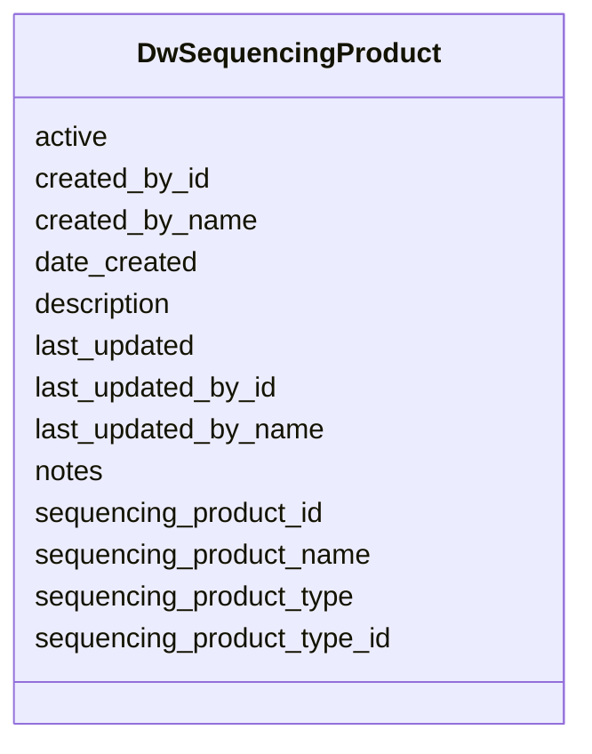

# Class: DwSequencingProduct 


URI: [gold:DwSequencingProduct](https://w3id.org/jgi/gold/DwSequencingProduct)





<!-- no inheritance hierarchy -->


## Slots

| Name | Cardinality and Range | Description | Inheritance |
| ---  | --- | --- | --- |
| [sequencing_product_id](sequencing_product_id.md) | 0..1 <br/> [Integer](Integer.md) |  | direct |
| [sequencing_product_name](sequencing_product_name.md) | 0..1 <br/> [String](String.md) |  | direct |
| [active](active.md) | 0..1 <br/> [String](String.md) |  | direct |
| [date_created](date_created.md) | 0..1 <br/> [Datetime](Datetime.md) |  | direct |
| [last_updated](last_updated.md) | 0..1 <br/> [Datetime](Datetime.md) |  | direct |
| [sequencing_product_type_id](sequencing_product_type_id.md) | 0..1 <br/> [Integer](Integer.md) |  | direct |
| [description](description.md) | 0..1 <br/> [String](String.md) |  | direct |
| [notes](notes.md) | 0..1 <br/> [String](String.md) |  | direct |
| [created_by_id](created_by_id.md) | 0..1 <br/> [Integer](Integer.md) |  | direct |
| [created_by_name](created_by_name.md) | 0..1 <br/> [String](String.md) |  | direct |
| [last_updated_by_id](last_updated_by_id.md) | 0..1 <br/> [Integer](Integer.md) |  | direct |
| [last_updated_by_name](last_updated_by_name.md) | 0..1 <br/> [String](String.md) |  | direct |
| [sequencing_product_type](sequencing_product_type.md) | 0..1 <br/> [String](String.md) |  | direct |


## Identifier and Mapping Information


### Schema Source


* from schema: https://w3id.org/jgi/gold


## Mappings

| Mapping Type | Mapped Value |
| ---  | ---  |
| self | gold:DwSequencingProduct |
| native | gold:DwSequencingProduct |


## LinkML Source

<!-- TODO: investigate https://stackoverflow.com/questions/37606292/how-to-create-tabbed-code-blocks-in-mkdocs-or-sphinx -->

### Direct

<details>
```yaml
name: dw_sequencing_product
from_schema: https://w3id.org/jgi/gold
attributes:
  sequencing_product_id:
    name: sequencing_product_id
    from_schema: https://w3id.org/jgi/gold
    rank: 1000
    domain_of:
    - dw_sequencing_product
    - dw_sequencing_project
    range: integer
    required: false
  sequencing_product_name:
    name: sequencing_product_name
    from_schema: https://w3id.org/jgi/gold
    rank: 1000
    domain_of:
    - dw_sequencing_product
    range: string
    required: false
  active:
    name: active
    from_schema: https://w3id.org/jgi/gold
    domain_of:
    - biosample
    - dw_sequencing_product
    - organism_v2
    - project
    - study
    range: string
    required: false
  date_created:
    name: date_created
    from_schema: https://w3id.org/jgi/gold
    domain_of:
    - dw_samples
    - dw_sequencing_product
    - dw_sequencing_project
    range: datetime
    required: false
  last_updated:
    name: last_updated
    from_schema: https://w3id.org/jgi/gold
    domain_of:
    - dw_samples
    - dw_sequencing_product
    - dw_sequencing_project
    range: datetime
    required: false
  sequencing_product_type_id:
    name: sequencing_product_type_id
    from_schema: https://w3id.org/jgi/gold
    rank: 1000
    domain_of:
    - dw_sequencing_product
    range: integer
    required: false
  description:
    name: description
    from_schema: https://w3id.org/jgi/gold
    domain_of:
    - biosample
    - dw_sequencing_product
    - ncbi_raw_sra_run
    - project
    - sra_experiment_v2
    - study
    range: string
    required: false
  notes:
    name: notes
    from_schema: https://w3id.org/jgi/gold
    domain_of:
    - audit_log
    - dw_sequencing_product
    range: string
    required: false
  created_by_id:
    name: created_by_id
    from_schema: https://w3id.org/jgi/gold
    domain_of:
    - dw_samples
    - dw_sequencing_product
    - dw_sequencing_project
    range: integer
    required: false
  created_by_name:
    name: created_by_name
    from_schema: https://w3id.org/jgi/gold
    domain_of:
    - dw_samples
    - dw_sequencing_product
    - dw_sequencing_project
    range: string
    required: false
  last_updated_by_id:
    name: last_updated_by_id
    from_schema: https://w3id.org/jgi/gold
    domain_of:
    - dw_samples
    - dw_sequencing_product
    - dw_sequencing_project
    range: integer
    required: false
  last_updated_by_name:
    name: last_updated_by_name
    from_schema: https://w3id.org/jgi/gold
    domain_of:
    - dw_samples
    - dw_sequencing_product
    - dw_sequencing_project
    range: string
    required: false
  sequencing_product_type:
    name: sequencing_product_type
    from_schema: https://w3id.org/jgi/gold
    rank: 1000
    domain_of:
    - dw_sequencing_product
    range: string
    required: false

```
</details>

### Induced

<details>
```yaml
name: dw_sequencing_product
from_schema: https://w3id.org/jgi/gold
attributes:
  sequencing_product_id:
    name: sequencing_product_id
    from_schema: https://w3id.org/jgi/gold
    rank: 1000
    alias: sequencing_product_id
    owner: dw_sequencing_product
    domain_of:
    - dw_sequencing_product
    - dw_sequencing_project
    range: integer
    required: false
  sequencing_product_name:
    name: sequencing_product_name
    from_schema: https://w3id.org/jgi/gold
    rank: 1000
    alias: sequencing_product_name
    owner: dw_sequencing_product
    domain_of:
    - dw_sequencing_product
    range: string
    required: false
  active:
    name: active
    from_schema: https://w3id.org/jgi/gold
    alias: active
    owner: dw_sequencing_product
    domain_of:
    - biosample
    - dw_sequencing_product
    - organism_v2
    - project
    - study
    range: string
    required: false
  date_created:
    name: date_created
    from_schema: https://w3id.org/jgi/gold
    alias: date_created
    owner: dw_sequencing_product
    domain_of:
    - dw_samples
    - dw_sequencing_product
    - dw_sequencing_project
    range: datetime
    required: false
  last_updated:
    name: last_updated
    from_schema: https://w3id.org/jgi/gold
    alias: last_updated
    owner: dw_sequencing_product
    domain_of:
    - dw_samples
    - dw_sequencing_product
    - dw_sequencing_project
    range: datetime
    required: false
  sequencing_product_type_id:
    name: sequencing_product_type_id
    from_schema: https://w3id.org/jgi/gold
    rank: 1000
    alias: sequencing_product_type_id
    owner: dw_sequencing_product
    domain_of:
    - dw_sequencing_product
    range: integer
    required: false
  description:
    name: description
    from_schema: https://w3id.org/jgi/gold
    alias: description
    owner: dw_sequencing_product
    domain_of:
    - biosample
    - dw_sequencing_product
    - ncbi_raw_sra_run
    - project
    - sra_experiment_v2
    - study
    range: string
    required: false
  notes:
    name: notes
    from_schema: https://w3id.org/jgi/gold
    alias: notes
    owner: dw_sequencing_product
    domain_of:
    - audit_log
    - dw_sequencing_product
    range: string
    required: false
  created_by_id:
    name: created_by_id
    from_schema: https://w3id.org/jgi/gold
    alias: created_by_id
    owner: dw_sequencing_product
    domain_of:
    - dw_samples
    - dw_sequencing_product
    - dw_sequencing_project
    range: integer
    required: false
  created_by_name:
    name: created_by_name
    from_schema: https://w3id.org/jgi/gold
    alias: created_by_name
    owner: dw_sequencing_product
    domain_of:
    - dw_samples
    - dw_sequencing_product
    - dw_sequencing_project
    range: string
    required: false
  last_updated_by_id:
    name: last_updated_by_id
    from_schema: https://w3id.org/jgi/gold
    alias: last_updated_by_id
    owner: dw_sequencing_product
    domain_of:
    - dw_samples
    - dw_sequencing_product
    - dw_sequencing_project
    range: integer
    required: false
  last_updated_by_name:
    name: last_updated_by_name
    from_schema: https://w3id.org/jgi/gold
    alias: last_updated_by_name
    owner: dw_sequencing_product
    domain_of:
    - dw_samples
    - dw_sequencing_product
    - dw_sequencing_project
    range: string
    required: false
  sequencing_product_type:
    name: sequencing_product_type
    from_schema: https://w3id.org/jgi/gold
    rank: 1000
    alias: sequencing_product_type
    owner: dw_sequencing_product
    domain_of:
    - dw_sequencing_product
    range: string
    required: false

```
</details>