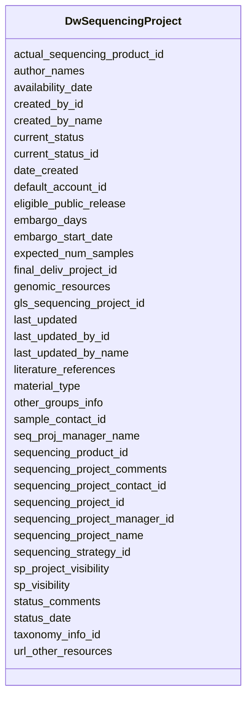

# Class: DwSequencingProject 


URI: [gold:DwSequencingProject](https://w3id.org/jgi/gold/DwSequencingProject)





<!-- no inheritance hierarchy -->


## Slots

| Name | Cardinality and Range | Description | Inheritance |
| ---  | --- | --- | --- |
| [sequencing_project_id](sequencing_project_id.md) | 0..1 <br/> [Integer](Integer.md) |  | direct |
| [author_names](author_names.md) | 0..1 <br/> [String](String.md) |  | direct |
| [created_by_id](created_by_id.md) | 0..1 <br/> [Integer](Integer.md) |  | direct |
| [created_by_name](created_by_name.md) | 0..1 <br/> [String](String.md) |  | direct |
| [current_status](current_status.md) | 0..1 <br/> [String](String.md) |  | direct |
| [current_status_id](current_status_id.md) | 0..1 <br/> [Integer](Integer.md) |  | direct |
| [date_created](date_created.md) | 0..1 <br/> [Datetime](Datetime.md) |  | direct |
| [eligible_public_release](eligible_public_release.md) | 0..1 <br/> [String](String.md) |  | direct |
| [embargo_days](embargo_days.md) | 0..1 <br/> [Integer](Integer.md) |  | direct |
| [embargo_start_date](embargo_start_date.md) | 0..1 <br/> [Datetime](Datetime.md) |  | direct |
| [sp_visibility](sp_visibility.md) | 0..1 <br/> [String](String.md) |  | direct |
| [availability_date](availability_date.md) | 0..1 <br/> [Datetime](Datetime.md) |  | direct |
| [expected_num_samples](expected_num_samples.md) | 0..1 <br/> [Float](Float.md) |  | direct |
| [genomic_resources](genomic_resources.md) | 0..1 <br/> [String](String.md) |  | direct |
| [gls_sequencing_project_id](gls_sequencing_project_id.md) | 0..1 <br/> [String](String.md) |  | direct |
| [last_updated](last_updated.md) | 0..1 <br/> [Datetime](Datetime.md) |  | direct |
| [last_updated_by_id](last_updated_by_id.md) | 0..1 <br/> [Integer](Integer.md) |  | direct |
| [last_updated_by_name](last_updated_by_name.md) | 0..1 <br/> [String](String.md) |  | direct |
| [literature_references](literature_references.md) | 0..1 <br/> [String](String.md) |  | direct |
| [material_type](material_type.md) | 0..1 <br/> [String](String.md) |  | direct |
| [other_groups_info](other_groups_info.md) | 0..1 <br/> [String](String.md) |  | direct |
| [sample_contact_id](sample_contact_id.md) | 0..1 <br/> [Integer](Integer.md) |  | direct |
| [seq_proj_manager_name](seq_proj_manager_name.md) | 0..1 <br/> [String](String.md) |  | direct |
| [sequencing_product_id](sequencing_product_id.md) | 0..1 <br/> [Integer](Integer.md) |  | direct |
| [actual_sequencing_product_id](actual_sequencing_product_id.md) | 0..1 <br/> [Integer](Integer.md) |  | direct |
| [sequencing_project_comments](sequencing_project_comments.md) | 0..1 <br/> [String](String.md) |  | direct |
| [sequencing_project_contact_id](sequencing_project_contact_id.md) | 0..1 <br/> [Integer](Integer.md) |  | direct |
| [sequencing_project_manager_id](sequencing_project_manager_id.md) | 0..1 <br/> [Integer](Integer.md) |  | direct |
| [sequencing_project_name](sequencing_project_name.md) | 0..1 <br/> [String](String.md) |  | direct |
| [sp_project_visibility](sp_project_visibility.md) | 0..1 <br/> [String](String.md) |  | direct |
| [status_comments](status_comments.md) | 0..1 <br/> [String](String.md) |  | direct |
| [status_date](status_date.md) | 0..1 <br/> [Datetime](Datetime.md) |  | direct |
| [url_other_resources](url_other_resources.md) | 0..1 <br/> [String](String.md) |  | direct |
| [default_account_id](default_account_id.md) | 0..1 <br/> [Integer](Integer.md) |  | direct |
| [final_deliv_project_id](final_deliv_project_id.md) | 0..1 <br/> [Integer](Integer.md) |  | direct |
| [taxonomy_info_id](taxonomy_info_id.md) | 0..1 <br/> [Integer](Integer.md) |  | direct |
| [sequencing_strategy_id](sequencing_strategy_id.md) | 0..1 <br/> [Integer](Integer.md) |  | direct |


## Identifier and Mapping Information


### Schema Source


* from schema: https://w3id.org/jgi/gold


## Mappings

| Mapping Type | Mapped Value |
| ---  | ---  |
| self | gold:DwSequencingProject |
| native | gold:DwSequencingProject |


## LinkML Source

<!-- TODO: investigate https://stackoverflow.com/questions/37606292/how-to-create-tabbed-code-blocks-in-mkdocs-or-sphinx -->

### Direct

<details>
```yaml
name: dw_sequencing_project
from_schema: https://w3id.org/jgi/gold
attributes:
  sequencing_project_id:
    name: sequencing_project_id
    from_schema: https://w3id.org/jgi/gold
    rank: 1000
    domain_of:
    - dw_sequencing_project
    range: integer
    required: false
  author_names:
    name: author_names
    from_schema: https://w3id.org/jgi/gold
    rank: 1000
    domain_of:
    - dw_sequencing_project
    range: string
    required: false
  created_by_id:
    name: created_by_id
    from_schema: https://w3id.org/jgi/gold
    domain_of:
    - dw_samples
    - dw_sequencing_product
    - dw_sequencing_project
    range: integer
    required: false
  created_by_name:
    name: created_by_name
    from_schema: https://w3id.org/jgi/gold
    domain_of:
    - dw_samples
    - dw_sequencing_product
    - dw_sequencing_project
    range: string
    required: false
  current_status:
    name: current_status
    from_schema: https://w3id.org/jgi/gold
    domain_of:
    - dw_analysis_project
    - dw_samples
    - dw_sequencing_project
    range: string
    required: false
  current_status_id:
    name: current_status_id
    from_schema: https://w3id.org/jgi/gold
    domain_of:
    - dw_analysis_project
    - dw_sequencing_project
    range: integer
    required: false
  date_created:
    name: date_created
    from_schema: https://w3id.org/jgi/gold
    domain_of:
    - dw_samples
    - dw_sequencing_product
    - dw_sequencing_project
    range: datetime
    required: false
  eligible_public_release:
    name: eligible_public_release
    from_schema: https://w3id.org/jgi/gold
    rank: 1000
    domain_of:
    - dw_sequencing_project
    range: string
    required: false
  embargo_days:
    name: embargo_days
    from_schema: https://w3id.org/jgi/gold
    rank: 1000
    domain_of:
    - dw_sequencing_project
    range: integer
    required: false
  embargo_start_date:
    name: embargo_start_date
    from_schema: https://w3id.org/jgi/gold
    rank: 1000
    domain_of:
    - dw_sequencing_project
    range: datetime
    required: false
  sp_visibility:
    name: sp_visibility
    from_schema: https://w3id.org/jgi/gold
    rank: 1000
    domain_of:
    - dw_sequencing_project
    range: string
    required: false
  availability_date:
    name: availability_date
    from_schema: https://w3id.org/jgi/gold
    rank: 1000
    domain_of:
    - dw_sequencing_project
    range: datetime
    required: false
  expected_num_samples:
    name: expected_num_samples
    from_schema: https://w3id.org/jgi/gold
    rank: 1000
    domain_of:
    - dw_sequencing_project
    range: float
    required: false
  genomic_resources:
    name: genomic_resources
    from_schema: https://w3id.org/jgi/gold
    rank: 1000
    domain_of:
    - dw_sequencing_project
    range: string
    required: false
  gls_sequencing_project_id:
    name: gls_sequencing_project_id
    from_schema: https://w3id.org/jgi/gold
    rank: 1000
    domain_of:
    - dw_sequencing_project
    range: string
    required: false
  last_updated:
    name: last_updated
    from_schema: https://w3id.org/jgi/gold
    domain_of:
    - dw_samples
    - dw_sequencing_product
    - dw_sequencing_project
    range: datetime
    required: false
  last_updated_by_id:
    name: last_updated_by_id
    from_schema: https://w3id.org/jgi/gold
    domain_of:
    - dw_samples
    - dw_sequencing_product
    - dw_sequencing_project
    range: integer
    required: false
  last_updated_by_name:
    name: last_updated_by_name
    from_schema: https://w3id.org/jgi/gold
    domain_of:
    - dw_samples
    - dw_sequencing_product
    - dw_sequencing_project
    range: string
    required: false
  literature_references:
    name: literature_references
    from_schema: https://w3id.org/jgi/gold
    rank: 1000
    domain_of:
    - dw_sequencing_project
    range: string
    required: false
  material_type:
    name: material_type
    from_schema: https://w3id.org/jgi/gold
    domain_of:
    - dw_samples
    - dw_sequencing_project
    range: string
    required: false
  other_groups_info:
    name: other_groups_info
    from_schema: https://w3id.org/jgi/gold
    rank: 1000
    domain_of:
    - dw_sequencing_project
    range: string
    required: false
  sample_contact_id:
    name: sample_contact_id
    from_schema: https://w3id.org/jgi/gold
    rank: 1000
    domain_of:
    - dw_sequencing_project
    range: integer
    required: false
  seq_proj_manager_name:
    name: seq_proj_manager_name
    from_schema: https://w3id.org/jgi/gold
    rank: 1000
    domain_of:
    - dw_sequencing_project
    range: string
    required: false
  sequencing_product_id:
    name: sequencing_product_id
    from_schema: https://w3id.org/jgi/gold
    domain_of:
    - dw_sequencing_product
    - dw_sequencing_project
    range: integer
    required: false
  actual_sequencing_product_id:
    name: actual_sequencing_product_id
    from_schema: https://w3id.org/jgi/gold
    rank: 1000
    domain_of:
    - dw_sequencing_project
    range: integer
    required: false
  sequencing_project_comments:
    name: sequencing_project_comments
    from_schema: https://w3id.org/jgi/gold
    rank: 1000
    domain_of:
    - dw_sequencing_project
    range: string
    required: false
  sequencing_project_contact_id:
    name: sequencing_project_contact_id
    from_schema: https://w3id.org/jgi/gold
    rank: 1000
    domain_of:
    - dw_sequencing_project
    range: integer
    required: false
  sequencing_project_manager_id:
    name: sequencing_project_manager_id
    from_schema: https://w3id.org/jgi/gold
    rank: 1000
    domain_of:
    - dw_sequencing_project
    range: integer
    required: false
  sequencing_project_name:
    name: sequencing_project_name
    from_schema: https://w3id.org/jgi/gold
    rank: 1000
    domain_of:
    - dw_sequencing_project
    range: string
    required: false
  sp_project_visibility:
    name: sp_project_visibility
    from_schema: https://w3id.org/jgi/gold
    rank: 1000
    domain_of:
    - dw_sequencing_project
    range: string
    required: false
  status_comments:
    name: status_comments
    from_schema: https://w3id.org/jgi/gold
    domain_of:
    - dw_samples
    - dw_sequencing_project
    range: string
    required: false
  status_date:
    name: status_date
    from_schema: https://w3id.org/jgi/gold
    domain_of:
    - dw_samples
    - dw_sequencing_project
    range: datetime
    required: false
  url_other_resources:
    name: url_other_resources
    from_schema: https://w3id.org/jgi/gold
    rank: 1000
    domain_of:
    - dw_sequencing_project
    range: string
    required: false
  default_account_id:
    name: default_account_id
    from_schema: https://w3id.org/jgi/gold
    rank: 1000
    domain_of:
    - dw_sequencing_project
    range: integer
    required: false
  final_deliv_project_id:
    name: final_deliv_project_id
    from_schema: https://w3id.org/jgi/gold
    domain_of:
    - dw_analysis_project
    - dw_sequencing_project
    range: integer
    required: false
  taxonomy_info_id:
    name: taxonomy_info_id
    from_schema: https://w3id.org/jgi/gold
    rank: 1000
    domain_of:
    - dw_sequencing_project
    range: integer
    required: false
  sequencing_strategy_id:
    name: sequencing_strategy_id
    from_schema: https://w3id.org/jgi/gold
    rank: 1000
    domain_of:
    - dw_sequencing_project
    range: integer
    required: false

```
</details>

### Induced

<details>
```yaml
name: dw_sequencing_project
from_schema: https://w3id.org/jgi/gold
attributes:
  sequencing_project_id:
    name: sequencing_project_id
    from_schema: https://w3id.org/jgi/gold
    rank: 1000
    alias: sequencing_project_id
    owner: dw_sequencing_project
    domain_of:
    - dw_sequencing_project
    range: integer
    required: false
  author_names:
    name: author_names
    from_schema: https://w3id.org/jgi/gold
    rank: 1000
    alias: author_names
    owner: dw_sequencing_project
    domain_of:
    - dw_sequencing_project
    range: string
    required: false
  created_by_id:
    name: created_by_id
    from_schema: https://w3id.org/jgi/gold
    alias: created_by_id
    owner: dw_sequencing_project
    domain_of:
    - dw_samples
    - dw_sequencing_product
    - dw_sequencing_project
    range: integer
    required: false
  created_by_name:
    name: created_by_name
    from_schema: https://w3id.org/jgi/gold
    alias: created_by_name
    owner: dw_sequencing_project
    domain_of:
    - dw_samples
    - dw_sequencing_product
    - dw_sequencing_project
    range: string
    required: false
  current_status:
    name: current_status
    from_schema: https://w3id.org/jgi/gold
    alias: current_status
    owner: dw_sequencing_project
    domain_of:
    - dw_analysis_project
    - dw_samples
    - dw_sequencing_project
    range: string
    required: false
  current_status_id:
    name: current_status_id
    from_schema: https://w3id.org/jgi/gold
    alias: current_status_id
    owner: dw_sequencing_project
    domain_of:
    - dw_analysis_project
    - dw_sequencing_project
    range: integer
    required: false
  date_created:
    name: date_created
    from_schema: https://w3id.org/jgi/gold
    alias: date_created
    owner: dw_sequencing_project
    domain_of:
    - dw_samples
    - dw_sequencing_product
    - dw_sequencing_project
    range: datetime
    required: false
  eligible_public_release:
    name: eligible_public_release
    from_schema: https://w3id.org/jgi/gold
    rank: 1000
    alias: eligible_public_release
    owner: dw_sequencing_project
    domain_of:
    - dw_sequencing_project
    range: string
    required: false
  embargo_days:
    name: embargo_days
    from_schema: https://w3id.org/jgi/gold
    rank: 1000
    alias: embargo_days
    owner: dw_sequencing_project
    domain_of:
    - dw_sequencing_project
    range: integer
    required: false
  embargo_start_date:
    name: embargo_start_date
    from_schema: https://w3id.org/jgi/gold
    rank: 1000
    alias: embargo_start_date
    owner: dw_sequencing_project
    domain_of:
    - dw_sequencing_project
    range: datetime
    required: false
  sp_visibility:
    name: sp_visibility
    from_schema: https://w3id.org/jgi/gold
    rank: 1000
    alias: sp_visibility
    owner: dw_sequencing_project
    domain_of:
    - dw_sequencing_project
    range: string
    required: false
  availability_date:
    name: availability_date
    from_schema: https://w3id.org/jgi/gold
    rank: 1000
    alias: availability_date
    owner: dw_sequencing_project
    domain_of:
    - dw_sequencing_project
    range: datetime
    required: false
  expected_num_samples:
    name: expected_num_samples
    from_schema: https://w3id.org/jgi/gold
    rank: 1000
    alias: expected_num_samples
    owner: dw_sequencing_project
    domain_of:
    - dw_sequencing_project
    range: float
    required: false
  genomic_resources:
    name: genomic_resources
    from_schema: https://w3id.org/jgi/gold
    rank: 1000
    alias: genomic_resources
    owner: dw_sequencing_project
    domain_of:
    - dw_sequencing_project
    range: string
    required: false
  gls_sequencing_project_id:
    name: gls_sequencing_project_id
    from_schema: https://w3id.org/jgi/gold
    rank: 1000
    alias: gls_sequencing_project_id
    owner: dw_sequencing_project
    domain_of:
    - dw_sequencing_project
    range: string
    required: false
  last_updated:
    name: last_updated
    from_schema: https://w3id.org/jgi/gold
    alias: last_updated
    owner: dw_sequencing_project
    domain_of:
    - dw_samples
    - dw_sequencing_product
    - dw_sequencing_project
    range: datetime
    required: false
  last_updated_by_id:
    name: last_updated_by_id
    from_schema: https://w3id.org/jgi/gold
    alias: last_updated_by_id
    owner: dw_sequencing_project
    domain_of:
    - dw_samples
    - dw_sequencing_product
    - dw_sequencing_project
    range: integer
    required: false
  last_updated_by_name:
    name: last_updated_by_name
    from_schema: https://w3id.org/jgi/gold
    alias: last_updated_by_name
    owner: dw_sequencing_project
    domain_of:
    - dw_samples
    - dw_sequencing_product
    - dw_sequencing_project
    range: string
    required: false
  literature_references:
    name: literature_references
    from_schema: https://w3id.org/jgi/gold
    rank: 1000
    alias: literature_references
    owner: dw_sequencing_project
    domain_of:
    - dw_sequencing_project
    range: string
    required: false
  material_type:
    name: material_type
    from_schema: https://w3id.org/jgi/gold
    alias: material_type
    owner: dw_sequencing_project
    domain_of:
    - dw_samples
    - dw_sequencing_project
    range: string
    required: false
  other_groups_info:
    name: other_groups_info
    from_schema: https://w3id.org/jgi/gold
    rank: 1000
    alias: other_groups_info
    owner: dw_sequencing_project
    domain_of:
    - dw_sequencing_project
    range: string
    required: false
  sample_contact_id:
    name: sample_contact_id
    from_schema: https://w3id.org/jgi/gold
    rank: 1000
    alias: sample_contact_id
    owner: dw_sequencing_project
    domain_of:
    - dw_sequencing_project
    range: integer
    required: false
  seq_proj_manager_name:
    name: seq_proj_manager_name
    from_schema: https://w3id.org/jgi/gold
    rank: 1000
    alias: seq_proj_manager_name
    owner: dw_sequencing_project
    domain_of:
    - dw_sequencing_project
    range: string
    required: false
  sequencing_product_id:
    name: sequencing_product_id
    from_schema: https://w3id.org/jgi/gold
    alias: sequencing_product_id
    owner: dw_sequencing_project
    domain_of:
    - dw_sequencing_product
    - dw_sequencing_project
    range: integer
    required: false
  actual_sequencing_product_id:
    name: actual_sequencing_product_id
    from_schema: https://w3id.org/jgi/gold
    rank: 1000
    alias: actual_sequencing_product_id
    owner: dw_sequencing_project
    domain_of:
    - dw_sequencing_project
    range: integer
    required: false
  sequencing_project_comments:
    name: sequencing_project_comments
    from_schema: https://w3id.org/jgi/gold
    rank: 1000
    alias: sequencing_project_comments
    owner: dw_sequencing_project
    domain_of:
    - dw_sequencing_project
    range: string
    required: false
  sequencing_project_contact_id:
    name: sequencing_project_contact_id
    from_schema: https://w3id.org/jgi/gold
    rank: 1000
    alias: sequencing_project_contact_id
    owner: dw_sequencing_project
    domain_of:
    - dw_sequencing_project
    range: integer
    required: false
  sequencing_project_manager_id:
    name: sequencing_project_manager_id
    from_schema: https://w3id.org/jgi/gold
    rank: 1000
    alias: sequencing_project_manager_id
    owner: dw_sequencing_project
    domain_of:
    - dw_sequencing_project
    range: integer
    required: false
  sequencing_project_name:
    name: sequencing_project_name
    from_schema: https://w3id.org/jgi/gold
    rank: 1000
    alias: sequencing_project_name
    owner: dw_sequencing_project
    domain_of:
    - dw_sequencing_project
    range: string
    required: false
  sp_project_visibility:
    name: sp_project_visibility
    from_schema: https://w3id.org/jgi/gold
    rank: 1000
    alias: sp_project_visibility
    owner: dw_sequencing_project
    domain_of:
    - dw_sequencing_project
    range: string
    required: false
  status_comments:
    name: status_comments
    from_schema: https://w3id.org/jgi/gold
    alias: status_comments
    owner: dw_sequencing_project
    domain_of:
    - dw_samples
    - dw_sequencing_project
    range: string
    required: false
  status_date:
    name: status_date
    from_schema: https://w3id.org/jgi/gold
    alias: status_date
    owner: dw_sequencing_project
    domain_of:
    - dw_samples
    - dw_sequencing_project
    range: datetime
    required: false
  url_other_resources:
    name: url_other_resources
    from_schema: https://w3id.org/jgi/gold
    rank: 1000
    alias: url_other_resources
    owner: dw_sequencing_project
    domain_of:
    - dw_sequencing_project
    range: string
    required: false
  default_account_id:
    name: default_account_id
    from_schema: https://w3id.org/jgi/gold
    rank: 1000
    alias: default_account_id
    owner: dw_sequencing_project
    domain_of:
    - dw_sequencing_project
    range: integer
    required: false
  final_deliv_project_id:
    name: final_deliv_project_id
    from_schema: https://w3id.org/jgi/gold
    alias: final_deliv_project_id
    owner: dw_sequencing_project
    domain_of:
    - dw_analysis_project
    - dw_sequencing_project
    range: integer
    required: false
  taxonomy_info_id:
    name: taxonomy_info_id
    from_schema: https://w3id.org/jgi/gold
    rank: 1000
    alias: taxonomy_info_id
    owner: dw_sequencing_project
    domain_of:
    - dw_sequencing_project
    range: integer
    required: false
  sequencing_strategy_id:
    name: sequencing_strategy_id
    from_schema: https://w3id.org/jgi/gold
    rank: 1000
    alias: sequencing_strategy_id
    owner: dw_sequencing_project
    domain_of:
    - dw_sequencing_project
    range: integer
    required: false

```
</details>