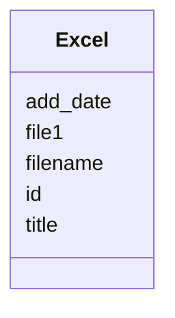

# Class: Excel 


URI: [gold:Excel](https://w3id.org/jgi/gold/Excel)





<!-- no inheritance hierarchy -->


## Slots

| Name | Cardinality and Range | Description | Inheritance |
| ---  | --- | --- | --- |
| [id](id.md) | 0..1 <br/> [Float](Float.md) |  | direct |
| [add_date](add_date.md) | 0..1 <br/> [Datetime](Datetime.md) |  | direct |
| [title](title.md) | 0..1 <br/> [String](String.md) |  | direct |
| [filename](filename.md) | 0..1 <br/> [String](String.md) |  | direct |
| [file1](file1.md) | 0..1 <br/> [String](String.md) |  | direct |


## Identifier and Mapping Information


### Schema Source


* from schema: https://w3id.org/jgi/gold


## Mappings

| Mapping Type | Mapped Value |
| ---  | ---  |
| self | gold:Excel |
| native | gold:Excel |


## LinkML Source

<!-- TODO: investigate https://stackoverflow.com/questions/37606292/how-to-create-tabbed-code-blocks-in-mkdocs-or-sphinx -->

### Direct

<details>
```yaml
name: excel
from_schema: https://w3id.org/jgi/gold
attributes:
  id:
    name: id
    from_schema: https://w3id.org/jgi/gold
    domain_of:
    - cvaerospace_struc
    - cvap_status
    - cvcolor
    - cvdisease
    - cvdoor_type_wood
    - cvhabitat
    - cvmodel
    - cvorganism_type
    - excel
    - gold_master_sequencing_method
    - sequencing_method
    range: float
    required: false
  add_date:
    name: add_date
    from_schema: https://w3id.org/jgi/gold
    domain_of:
    - analysis_project
    - api_user
    - bacdive
    - biosample
    - excel
    - organism_v2
    - package_soil
    - project
    - study
    range: datetime
    required: false
  title:
    name: title
    from_schema: https://w3id.org/jgi/gold
    rank: 1000
    domain_of:
    - excel
    - ncbi_raw_sra_run
    - sra_experiment_v2
    - sra_sample_v2
    range: string
    required: false
  filename:
    name: filename
    from_schema: https://w3id.org/jgi/gold
    rank: 1000
    domain_of:
    - excel
    range: string
    required: false
  file1:
    name: file1
    from_schema: https://w3id.org/jgi/gold
    rank: 1000
    domain_of:
    - excel
    range: string
    required: false

```
</details>

### Induced

<details>
```yaml
name: excel
from_schema: https://w3id.org/jgi/gold
attributes:
  id:
    name: id
    from_schema: https://w3id.org/jgi/gold
    alias: id
    owner: excel
    domain_of:
    - cvaerospace_struc
    - cvap_status
    - cvcolor
    - cvdisease
    - cvdoor_type_wood
    - cvhabitat
    - cvmodel
    - cvorganism_type
    - excel
    - gold_master_sequencing_method
    - sequencing_method
    range: float
    required: false
  add_date:
    name: add_date
    from_schema: https://w3id.org/jgi/gold
    alias: add_date
    owner: excel
    domain_of:
    - analysis_project
    - api_user
    - bacdive
    - biosample
    - excel
    - organism_v2
    - package_soil
    - project
    - study
    range: datetime
    required: false
  title:
    name: title
    from_schema: https://w3id.org/jgi/gold
    rank: 1000
    alias: title
    owner: excel
    domain_of:
    - excel
    - ncbi_raw_sra_run
    - sra_experiment_v2
    - sra_sample_v2
    range: string
    required: false
  filename:
    name: filename
    from_schema: https://w3id.org/jgi/gold
    rank: 1000
    alias: filename
    owner: excel
    domain_of:
    - excel
    range: string
    required: false
  file1:
    name: file1
    from_schema: https://w3id.org/jgi/gold
    rank: 1000
    alias: file1
    owner: excel
    domain_of:
    - excel
    range: string
    required: false

```
</details>