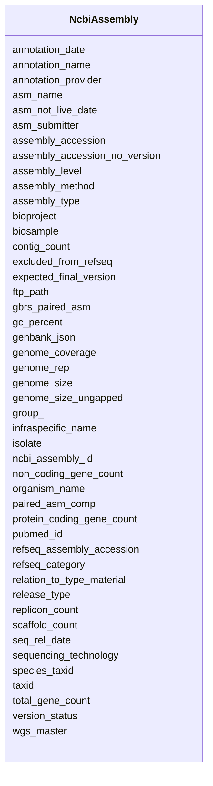

# Class: NcbiAssembly 


URI: [gold:NcbiAssembly](https://w3id.org/jgi/gold/NcbiAssembly)





<!-- no inheritance hierarchy -->


## Slots

| Name | Cardinality and Range | Description | Inheritance |
| ---  | --- | --- | --- |
| [ncbi_assembly_id](ncbi_assembly_id.md) | 0..1 <br/> [Float](Float.md) |  | direct |
| [assembly_accession](assembly_accession.md) | 0..1 <br/> [String](String.md) |  | direct |
| [assembly_accession_no_version](assembly_accession_no_version.md) | 0..1 <br/> [String](String.md) |  | direct |
| [bioproject](bioproject.md) | 0..1 <br/> [String](String.md) |  | direct |
| [biosample](biosample.md) | 0..1 <br/> [String](String.md) |  | direct |
| [wgs_master](wgs_master.md) | 0..1 <br/> [String](String.md) |  | direct |
| [refseq_category](refseq_category.md) | 0..1 <br/> [String](String.md) |  | direct |
| [taxid](taxid.md) | 0..1 <br/> [Float](Float.md) |  | direct |
| [species_taxid](species_taxid.md) | 0..1 <br/> [Float](Float.md) |  | direct |
| [organism_name](organism_name.md) | 0..1 <br/> [String](String.md) |  | direct |
| [infraspecific_name](infraspecific_name.md) | 0..1 <br/> [String](String.md) |  | direct |
| [isolate](isolate.md) | 0..1 <br/> [String](String.md) |  | direct |
| [version_status](version_status.md) | 0..1 <br/> [String](String.md) |  | direct |
| [assembly_level](assembly_level.md) | 0..1 <br/> [String](String.md) |  | direct |
| [release_type](release_type.md) | 0..1 <br/> [String](String.md) |  | direct |
| [genome_rep](genome_rep.md) | 0..1 <br/> [String](String.md) |  | direct |
| [seq_rel_date](seq_rel_date.md) | 0..1 <br/> [Datetime](Datetime.md) |  | direct |
| [asm_name](asm_name.md) | 0..1 <br/> [String](String.md) |  | direct |
| [asm_submitter](asm_submitter.md) | 0..1 <br/> [String](String.md) |  | direct |
| [gbrs_paired_asm](gbrs_paired_asm.md) | 0..1 <br/> [String](String.md) |  | direct |
| [paired_asm_comp](paired_asm_comp.md) | 0..1 <br/> [String](String.md) |  | direct |
| [ftp_path](ftp_path.md) | 0..1 <br/> [String](String.md) |  | direct |
| [excluded_from_refseq](excluded_from_refseq.md) | 0..1 <br/> [String](String.md) |  | direct |
| [relation_to_type_material](relation_to_type_material.md) | 0..1 <br/> [String](String.md) |  | direct |
| [asm_not_live_date](asm_not_live_date.md) | 0..1 <br/> [Datetime](Datetime.md) |  | direct |
| [assembly_type](assembly_type.md) | 0..1 <br/> [String](String.md) |  | direct |
| [group_](group_.md) | 0..1 <br/> [String](String.md) |  | direct |
| [genome_size](genome_size.md) | 0..1 <br/> [Float](Float.md) |  | direct |
| [genome_size_ungapped](genome_size_ungapped.md) | 0..1 <br/> [Float](Float.md) |  | direct |
| [gc_percent](gc_percent.md) | 0..1 <br/> [Float](Float.md) |  | direct |
| [replicon_count](replicon_count.md) | 0..1 <br/> [Float](Float.md) |  | direct |
| [scaffold_count](scaffold_count.md) | 0..1 <br/> [Float](Float.md) |  | direct |
| [contig_count](contig_count.md) | 0..1 <br/> [Float](Float.md) |  | direct |
| [annotation_provider](annotation_provider.md) | 0..1 <br/> [String](String.md) |  | direct |
| [annotation_name](annotation_name.md) | 0..1 <br/> [String](String.md) |  | direct |
| [annotation_date](annotation_date.md) | 0..1 <br/> [Datetime](Datetime.md) |  | direct |
| [total_gene_count](total_gene_count.md) | 0..1 <br/> [Float](Float.md) |  | direct |
| [protein_coding_gene_count](protein_coding_gene_count.md) | 0..1 <br/> [Float](Float.md) |  | direct |
| [non_coding_gene_count](non_coding_gene_count.md) | 0..1 <br/> [Float](Float.md) |  | direct |
| [pubmed_id](pubmed_id.md) | 0..1 <br/> [String](String.md) |  | direct |
| [assembly_method](assembly_method.md) | 0..1 <br/> [String](String.md) |  | direct |
| [expected_final_version](expected_final_version.md) | 0..1 <br/> [String](String.md) |  | direct |
| [genome_coverage](genome_coverage.md) | 0..1 <br/> [String](String.md) |  | direct |
| [sequencing_technology](sequencing_technology.md) | 0..1 <br/> [String](String.md) |  | direct |
| [refseq_assembly_accession](refseq_assembly_accession.md) | 0..1 <br/> [String](String.md) |  | direct |
| [genbank_json](genbank_json.md) | 0..1 <br/> [String](String.md) |  | direct |


## Usages

| used by | used in | type | used |
| ---  | --- | --- | --- |
| [NcbiGenbank](NcbiGenbank.md) | [ncbi_assembly_id](ncbi_assembly_id.md) | range | [NcbiAssembly](NcbiAssembly.md) |


## Identifier and Mapping Information


### Schema Source


* from schema: https://w3id.org/jgi/gold


## Mappings

| Mapping Type | Mapped Value |
| ---  | ---  |
| self | gold:NcbiAssembly |
| native | gold:NcbiAssembly |


## LinkML Source

<!-- TODO: investigate https://stackoverflow.com/questions/37606292/how-to-create-tabbed-code-blocks-in-mkdocs-or-sphinx -->

### Direct

<details>
```yaml
name: ncbi_assembly
from_schema: https://w3id.org/jgi/gold
attributes:
  ncbi_assembly_id:
    name: ncbi_assembly_id
    from_schema: https://w3id.org/jgi/gold
    rank: 1000
    domain_of:
    - ncbi_assembly
    - ncbi_genbank
    range: float
    required: false
  assembly_accession:
    name: assembly_accession
    from_schema: https://w3id.org/jgi/gold
    rank: 1000
    domain_of:
    - ncbi_assembly
    - project
    range: string
    required: false
  assembly_accession_no_version:
    name: assembly_accession_no_version
    from_schema: https://w3id.org/jgi/gold
    rank: 1000
    domain_of:
    - ncbi_assembly
    range: string
    required: false
  bioproject:
    name: bioproject
    from_schema: https://w3id.org/jgi/gold
    rank: 1000
    domain_of:
    - ncbi_assembly
    range: string
    required: false
  biosample:
    name: biosample
    from_schema: https://w3id.org/jgi/gold
    rank: 1000
    domain_of:
    - ncbi_assembly
    range: string
    required: false
  wgs_master:
    name: wgs_master
    from_schema: https://w3id.org/jgi/gold
    rank: 1000
    domain_of:
    - ncbi_assembly
    range: string
    required: false
  refseq_category:
    name: refseq_category
    from_schema: https://w3id.org/jgi/gold
    rank: 1000
    domain_of:
    - ncbi_assembly
    range: string
    required: false
  taxid:
    name: taxid
    from_schema: https://w3id.org/jgi/gold
    rank: 1000
    domain_of:
    - ncbi_assembly
    range: float
    required: false
  species_taxid:
    name: species_taxid
    from_schema: https://w3id.org/jgi/gold
    rank: 1000
    domain_of:
    - ncbi_assembly
    range: float
    required: false
  organism_name:
    name: organism_name
    from_schema: https://w3id.org/jgi/gold
    domain_of:
    - assembly
    - ncbi_assembly
    - organism_v2
    range: string
    required: false
  infraspecific_name:
    name: infraspecific_name
    from_schema: https://w3id.org/jgi/gold
    rank: 1000
    domain_of:
    - ncbi_assembly
    range: string
    required: false
  isolate:
    name: isolate
    from_schema: https://w3id.org/jgi/gold
    rank: 1000
    domain_of:
    - ncbi_assembly
    range: string
    required: false
  version_status:
    name: version_status
    from_schema: https://w3id.org/jgi/gold
    rank: 1000
    domain_of:
    - ncbi_assembly
    range: string
    required: false
  assembly_level:
    name: assembly_level
    from_schema: https://w3id.org/jgi/gold
    rank: 1000
    domain_of:
    - ncbi_assembly
    range: string
    required: false
  release_type:
    name: release_type
    from_schema: https://w3id.org/jgi/gold
    rank: 1000
    domain_of:
    - ncbi_assembly
    range: string
    required: false
  genome_rep:
    name: genome_rep
    from_schema: https://w3id.org/jgi/gold
    rank: 1000
    domain_of:
    - ncbi_assembly
    range: string
    required: false
  seq_rel_date:
    name: seq_rel_date
    from_schema: https://w3id.org/jgi/gold
    rank: 1000
    domain_of:
    - ncbi_assembly
    range: datetime
    required: false
  asm_name:
    name: asm_name
    from_schema: https://w3id.org/jgi/gold
    rank: 1000
    domain_of:
    - ncbi_assembly
    range: string
    required: false
  asm_submitter:
    name: asm_submitter
    from_schema: https://w3id.org/jgi/gold
    rank: 1000
    domain_of:
    - ncbi_assembly
    range: string
    required: false
  gbrs_paired_asm:
    name: gbrs_paired_asm
    from_schema: https://w3id.org/jgi/gold
    rank: 1000
    domain_of:
    - ncbi_assembly
    range: string
    required: false
  paired_asm_comp:
    name: paired_asm_comp
    from_schema: https://w3id.org/jgi/gold
    rank: 1000
    domain_of:
    - ncbi_assembly
    range: string
    required: false
  ftp_path:
    name: ftp_path
    from_schema: https://w3id.org/jgi/gold
    rank: 1000
    domain_of:
    - ncbi_assembly
    range: string
    required: false
  excluded_from_refseq:
    name: excluded_from_refseq
    from_schema: https://w3id.org/jgi/gold
    rank: 1000
    domain_of:
    - ncbi_assembly
    range: string
    required: false
  relation_to_type_material:
    name: relation_to_type_material
    from_schema: https://w3id.org/jgi/gold
    rank: 1000
    domain_of:
    - ncbi_assembly
    range: string
    required: false
  asm_not_live_date:
    name: asm_not_live_date
    from_schema: https://w3id.org/jgi/gold
    rank: 1000
    domain_of:
    - ncbi_assembly
    range: datetime
    required: false
  assembly_type:
    name: assembly_type
    from_schema: https://w3id.org/jgi/gold
    domain_of:
    - assembly
    - ncbi_assembly
    range: string
    required: false
  group_:
    name: group_
    from_schema: https://w3id.org/jgi/gold
    rank: 1000
    domain_of:
    - ncbi_assembly
    range: string
    required: false
  genome_size:
    name: genome_size
    from_schema: https://w3id.org/jgi/gold
    rank: 1000
    domain_of:
    - ncbi_assembly
    range: float
    required: false
  genome_size_ungapped:
    name: genome_size_ungapped
    from_schema: https://w3id.org/jgi/gold
    rank: 1000
    domain_of:
    - ncbi_assembly
    range: float
    required: false
  gc_percent:
    name: gc_percent
    from_schema: https://w3id.org/jgi/gold
    rank: 1000
    domain_of:
    - ncbi_assembly
    - project
    range: float
    required: false
  replicon_count:
    name: replicon_count
    from_schema: https://w3id.org/jgi/gold
    rank: 1000
    domain_of:
    - ncbi_assembly
    range: float
    required: false
  scaffold_count:
    name: scaffold_count
    from_schema: https://w3id.org/jgi/gold
    domain_of:
    - analysis_project
    - ncbi_assembly
    - project
    range: float
    required: false
  contig_count:
    name: contig_count
    from_schema: https://w3id.org/jgi/gold
    domain_of:
    - analysis_project
    - ncbi_assembly
    - project
    range: float
    required: false
  annotation_provider:
    name: annotation_provider
    from_schema: https://w3id.org/jgi/gold
    rank: 1000
    domain_of:
    - ncbi_assembly
    range: string
    required: false
  annotation_name:
    name: annotation_name
    from_schema: https://w3id.org/jgi/gold
    rank: 1000
    domain_of:
    - ncbi_assembly
    range: string
    required: false
  annotation_date:
    name: annotation_date
    from_schema: https://w3id.org/jgi/gold
    rank: 1000
    domain_of:
    - ncbi_assembly
    range: datetime
    required: false
  total_gene_count:
    name: total_gene_count
    from_schema: https://w3id.org/jgi/gold
    rank: 1000
    domain_of:
    - ncbi_assembly
    range: float
    required: false
  protein_coding_gene_count:
    name: protein_coding_gene_count
    from_schema: https://w3id.org/jgi/gold
    rank: 1000
    domain_of:
    - ncbi_assembly
    range: float
    required: false
  non_coding_gene_count:
    name: non_coding_gene_count
    from_schema: https://w3id.org/jgi/gold
    rank: 1000
    domain_of:
    - ncbi_assembly
    range: float
    required: false
  pubmed_id:
    name: pubmed_id
    from_schema: https://w3id.org/jgi/gold
    rank: 1000
    domain_of:
    - ncbi_assembly
    range: string
    required: false
  assembly_method:
    name: assembly_method
    from_schema: https://w3id.org/jgi/gold
    rank: 1000
    domain_of:
    - ncbi_assembly
    range: string
    required: false
  expected_final_version:
    name: expected_final_version
    from_schema: https://w3id.org/jgi/gold
    rank: 1000
    domain_of:
    - ncbi_assembly
    range: string
    required: false
  genome_coverage:
    name: genome_coverage
    from_schema: https://w3id.org/jgi/gold
    rank: 1000
    domain_of:
    - ncbi_assembly
    range: string
    required: false
  sequencing_technology:
    name: sequencing_technology
    from_schema: https://w3id.org/jgi/gold
    rank: 1000
    domain_of:
    - ncbi_assembly
    range: string
    required: false
  refseq_assembly_accession:
    name: refseq_assembly_accession
    from_schema: https://w3id.org/jgi/gold
    rank: 1000
    domain_of:
    - ncbi_assembly
    range: string
    required: false
  genbank_json:
    name: genbank_json
    from_schema: https://w3id.org/jgi/gold
    rank: 1000
    domain_of:
    - ncbi_assembly
    range: string
    required: false

```
</details>

### Induced

<details>
```yaml
name: ncbi_assembly
from_schema: https://w3id.org/jgi/gold
attributes:
  ncbi_assembly_id:
    name: ncbi_assembly_id
    from_schema: https://w3id.org/jgi/gold
    rank: 1000
    alias: ncbi_assembly_id
    owner: ncbi_assembly
    domain_of:
    - ncbi_assembly
    - ncbi_genbank
    range: float
    required: false
  assembly_accession:
    name: assembly_accession
    from_schema: https://w3id.org/jgi/gold
    rank: 1000
    alias: assembly_accession
    owner: ncbi_assembly
    domain_of:
    - ncbi_assembly
    - project
    range: string
    required: false
  assembly_accession_no_version:
    name: assembly_accession_no_version
    from_schema: https://w3id.org/jgi/gold
    rank: 1000
    alias: assembly_accession_no_version
    owner: ncbi_assembly
    domain_of:
    - ncbi_assembly
    range: string
    required: false
  bioproject:
    name: bioproject
    from_schema: https://w3id.org/jgi/gold
    rank: 1000
    alias: bioproject
    owner: ncbi_assembly
    domain_of:
    - ncbi_assembly
    range: string
    required: false
  biosample:
    name: biosample
    from_schema: https://w3id.org/jgi/gold
    rank: 1000
    alias: biosample
    owner: ncbi_assembly
    domain_of:
    - ncbi_assembly
    range: string
    required: false
  wgs_master:
    name: wgs_master
    from_schema: https://w3id.org/jgi/gold
    rank: 1000
    alias: wgs_master
    owner: ncbi_assembly
    domain_of:
    - ncbi_assembly
    range: string
    required: false
  refseq_category:
    name: refseq_category
    from_schema: https://w3id.org/jgi/gold
    rank: 1000
    alias: refseq_category
    owner: ncbi_assembly
    domain_of:
    - ncbi_assembly
    range: string
    required: false
  taxid:
    name: taxid
    from_schema: https://w3id.org/jgi/gold
    rank: 1000
    alias: taxid
    owner: ncbi_assembly
    domain_of:
    - ncbi_assembly
    range: float
    required: false
  species_taxid:
    name: species_taxid
    from_schema: https://w3id.org/jgi/gold
    rank: 1000
    alias: species_taxid
    owner: ncbi_assembly
    domain_of:
    - ncbi_assembly
    range: float
    required: false
  organism_name:
    name: organism_name
    from_schema: https://w3id.org/jgi/gold
    alias: organism_name
    owner: ncbi_assembly
    domain_of:
    - assembly
    - ncbi_assembly
    - organism_v2
    range: string
    required: false
  infraspecific_name:
    name: infraspecific_name
    from_schema: https://w3id.org/jgi/gold
    rank: 1000
    alias: infraspecific_name
    owner: ncbi_assembly
    domain_of:
    - ncbi_assembly
    range: string
    required: false
  isolate:
    name: isolate
    from_schema: https://w3id.org/jgi/gold
    rank: 1000
    alias: isolate
    owner: ncbi_assembly
    domain_of:
    - ncbi_assembly
    range: string
    required: false
  version_status:
    name: version_status
    from_schema: https://w3id.org/jgi/gold
    rank: 1000
    alias: version_status
    owner: ncbi_assembly
    domain_of:
    - ncbi_assembly
    range: string
    required: false
  assembly_level:
    name: assembly_level
    from_schema: https://w3id.org/jgi/gold
    rank: 1000
    alias: assembly_level
    owner: ncbi_assembly
    domain_of:
    - ncbi_assembly
    range: string
    required: false
  release_type:
    name: release_type
    from_schema: https://w3id.org/jgi/gold
    rank: 1000
    alias: release_type
    owner: ncbi_assembly
    domain_of:
    - ncbi_assembly
    range: string
    required: false
  genome_rep:
    name: genome_rep
    from_schema: https://w3id.org/jgi/gold
    rank: 1000
    alias: genome_rep
    owner: ncbi_assembly
    domain_of:
    - ncbi_assembly
    range: string
    required: false
  seq_rel_date:
    name: seq_rel_date
    from_schema: https://w3id.org/jgi/gold
    rank: 1000
    alias: seq_rel_date
    owner: ncbi_assembly
    domain_of:
    - ncbi_assembly
    range: datetime
    required: false
  asm_name:
    name: asm_name
    from_schema: https://w3id.org/jgi/gold
    rank: 1000
    alias: asm_name
    owner: ncbi_assembly
    domain_of:
    - ncbi_assembly
    range: string
    required: false
  asm_submitter:
    name: asm_submitter
    from_schema: https://w3id.org/jgi/gold
    rank: 1000
    alias: asm_submitter
    owner: ncbi_assembly
    domain_of:
    - ncbi_assembly
    range: string
    required: false
  gbrs_paired_asm:
    name: gbrs_paired_asm
    from_schema: https://w3id.org/jgi/gold
    rank: 1000
    alias: gbrs_paired_asm
    owner: ncbi_assembly
    domain_of:
    - ncbi_assembly
    range: string
    required: false
  paired_asm_comp:
    name: paired_asm_comp
    from_schema: https://w3id.org/jgi/gold
    rank: 1000
    alias: paired_asm_comp
    owner: ncbi_assembly
    domain_of:
    - ncbi_assembly
    range: string
    required: false
  ftp_path:
    name: ftp_path
    from_schema: https://w3id.org/jgi/gold
    rank: 1000
    alias: ftp_path
    owner: ncbi_assembly
    domain_of:
    - ncbi_assembly
    range: string
    required: false
  excluded_from_refseq:
    name: excluded_from_refseq
    from_schema: https://w3id.org/jgi/gold
    rank: 1000
    alias: excluded_from_refseq
    owner: ncbi_assembly
    domain_of:
    - ncbi_assembly
    range: string
    required: false
  relation_to_type_material:
    name: relation_to_type_material
    from_schema: https://w3id.org/jgi/gold
    rank: 1000
    alias: relation_to_type_material
    owner: ncbi_assembly
    domain_of:
    - ncbi_assembly
    range: string
    required: false
  asm_not_live_date:
    name: asm_not_live_date
    from_schema: https://w3id.org/jgi/gold
    rank: 1000
    alias: asm_not_live_date
    owner: ncbi_assembly
    domain_of:
    - ncbi_assembly
    range: datetime
    required: false
  assembly_type:
    name: assembly_type
    from_schema: https://w3id.org/jgi/gold
    alias: assembly_type
    owner: ncbi_assembly
    domain_of:
    - assembly
    - ncbi_assembly
    range: string
    required: false
  group_:
    name: group_
    from_schema: https://w3id.org/jgi/gold
    rank: 1000
    alias: group_
    owner: ncbi_assembly
    domain_of:
    - ncbi_assembly
    range: string
    required: false
  genome_size:
    name: genome_size
    from_schema: https://w3id.org/jgi/gold
    rank: 1000
    alias: genome_size
    owner: ncbi_assembly
    domain_of:
    - ncbi_assembly
    range: float
    required: false
  genome_size_ungapped:
    name: genome_size_ungapped
    from_schema: https://w3id.org/jgi/gold
    rank: 1000
    alias: genome_size_ungapped
    owner: ncbi_assembly
    domain_of:
    - ncbi_assembly
    range: float
    required: false
  gc_percent:
    name: gc_percent
    from_schema: https://w3id.org/jgi/gold
    rank: 1000
    alias: gc_percent
    owner: ncbi_assembly
    domain_of:
    - ncbi_assembly
    - project
    range: float
    required: false
  replicon_count:
    name: replicon_count
    from_schema: https://w3id.org/jgi/gold
    rank: 1000
    alias: replicon_count
    owner: ncbi_assembly
    domain_of:
    - ncbi_assembly
    range: float
    required: false
  scaffold_count:
    name: scaffold_count
    from_schema: https://w3id.org/jgi/gold
    alias: scaffold_count
    owner: ncbi_assembly
    domain_of:
    - analysis_project
    - ncbi_assembly
    - project
    range: float
    required: false
  contig_count:
    name: contig_count
    from_schema: https://w3id.org/jgi/gold
    alias: contig_count
    owner: ncbi_assembly
    domain_of:
    - analysis_project
    - ncbi_assembly
    - project
    range: float
    required: false
  annotation_provider:
    name: annotation_provider
    from_schema: https://w3id.org/jgi/gold
    rank: 1000
    alias: annotation_provider
    owner: ncbi_assembly
    domain_of:
    - ncbi_assembly
    range: string
    required: false
  annotation_name:
    name: annotation_name
    from_schema: https://w3id.org/jgi/gold
    rank: 1000
    alias: annotation_name
    owner: ncbi_assembly
    domain_of:
    - ncbi_assembly
    range: string
    required: false
  annotation_date:
    name: annotation_date
    from_schema: https://w3id.org/jgi/gold
    rank: 1000
    alias: annotation_date
    owner: ncbi_assembly
    domain_of:
    - ncbi_assembly
    range: datetime
    required: false
  total_gene_count:
    name: total_gene_count
    from_schema: https://w3id.org/jgi/gold
    rank: 1000
    alias: total_gene_count
    owner: ncbi_assembly
    domain_of:
    - ncbi_assembly
    range: float
    required: false
  protein_coding_gene_count:
    name: protein_coding_gene_count
    from_schema: https://w3id.org/jgi/gold
    rank: 1000
    alias: protein_coding_gene_count
    owner: ncbi_assembly
    domain_of:
    - ncbi_assembly
    range: float
    required: false
  non_coding_gene_count:
    name: non_coding_gene_count
    from_schema: https://w3id.org/jgi/gold
    rank: 1000
    alias: non_coding_gene_count
    owner: ncbi_assembly
    domain_of:
    - ncbi_assembly
    range: float
    required: false
  pubmed_id:
    name: pubmed_id
    from_schema: https://w3id.org/jgi/gold
    rank: 1000
    alias: pubmed_id
    owner: ncbi_assembly
    domain_of:
    - ncbi_assembly
    range: string
    required: false
  assembly_method:
    name: assembly_method
    from_schema: https://w3id.org/jgi/gold
    rank: 1000
    alias: assembly_method
    owner: ncbi_assembly
    domain_of:
    - ncbi_assembly
    range: string
    required: false
  expected_final_version:
    name: expected_final_version
    from_schema: https://w3id.org/jgi/gold
    rank: 1000
    alias: expected_final_version
    owner: ncbi_assembly
    domain_of:
    - ncbi_assembly
    range: string
    required: false
  genome_coverage:
    name: genome_coverage
    from_schema: https://w3id.org/jgi/gold
    rank: 1000
    alias: genome_coverage
    owner: ncbi_assembly
    domain_of:
    - ncbi_assembly
    range: string
    required: false
  sequencing_technology:
    name: sequencing_technology
    from_schema: https://w3id.org/jgi/gold
    rank: 1000
    alias: sequencing_technology
    owner: ncbi_assembly
    domain_of:
    - ncbi_assembly
    range: string
    required: false
  refseq_assembly_accession:
    name: refseq_assembly_accession
    from_schema: https://w3id.org/jgi/gold
    rank: 1000
    alias: refseq_assembly_accession
    owner: ncbi_assembly
    domain_of:
    - ncbi_assembly
    range: string
    required: false
  genbank_json:
    name: genbank_json
    from_schema: https://w3id.org/jgi/gold
    rank: 1000
    alias: genbank_json
    owner: ncbi_assembly
    domain_of:
    - ncbi_assembly
    range: string
    required: false

```
</details>