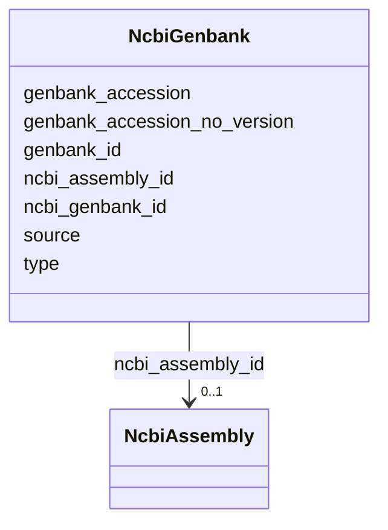

# Class: NcbiGenbank 


URI: [gold:NcbiGenbank](https://w3id.org/jgi/gold/NcbiGenbank)





<!-- no inheritance hierarchy -->


## Slots

| Name | Cardinality and Range | Description | Inheritance |
| ---  | --- | --- | --- |
| [ncbi_genbank_id](ncbi_genbank_id.md) | 0..1 <br/> [Float](Float.md) |  | direct |
| [type](type.md) | 0..1 <br/> [String](String.md) |  | direct |
| [source](source.md) | 0..1 <br/> [String](String.md) |  | direct |
| [genbank_id](genbank_id.md) | 0..1 <br/> [String](String.md) |  | direct |
| [genbank_accession](genbank_accession.md) | 0..1 <br/> [String](String.md) |  | direct |
| [genbank_accession_no_version](genbank_accession_no_version.md) | 0..1 <br/> [String](String.md) |  | direct |
| [ncbi_assembly_id](ncbi_assembly_id.md) | 0..1 <br/> [NcbiAssembly](NcbiAssembly.md) | Foreign key to ncbi_assembly | direct |


## Identifier and Mapping Information


### Schema Source


* from schema: https://w3id.org/jgi/gold


## Mappings

| Mapping Type | Mapped Value |
| ---  | ---  |
| self | gold:NcbiGenbank |
| native | gold:NcbiGenbank |


## LinkML Source

<!-- TODO: investigate https://stackoverflow.com/questions/37606292/how-to-create-tabbed-code-blocks-in-mkdocs-or-sphinx -->

### Direct

<details>
```yaml
name: ncbi_genbank
from_schema: https://w3id.org/jgi/gold
attributes:
  ncbi_genbank_id:
    name: ncbi_genbank_id
    from_schema: https://w3id.org/jgi/gold
    rank: 1000
    domain_of:
    - ncbi_genbank
    range: float
    required: false
  type:
    name: type
    from_schema: https://w3id.org/jgi/gold
    rank: 1000
    domain_of:
    - ncbi_genbank
    range: string
    required: false
  source:
    name: source
    from_schema: https://w3id.org/jgi/gold
    rank: 1000
    domain_of:
    - ncbi_genbank
    - organism_v2
    range: string
    required: false
  genbank_id:
    name: genbank_id
    from_schema: https://w3id.org/jgi/gold
    rank: 1000
    domain_of:
    - ncbi_genbank
    - sigs_view
    range: string
    required: false
  genbank_accession:
    name: genbank_accession
    from_schema: https://w3id.org/jgi/gold
    rank: 1000
    domain_of:
    - ncbi_genbank
    range: string
    required: false
  genbank_accession_no_version:
    name: genbank_accession_no_version
    from_schema: https://w3id.org/jgi/gold
    rank: 1000
    domain_of:
    - ncbi_genbank
    range: string
    required: false
  ncbi_assembly_id:
    name: ncbi_assembly_id
    description: Foreign key to ncbi_assembly
    from_schema: https://w3id.org/jgi/gold
    domain_of:
    - ncbi_assembly
    - ncbi_genbank
    range: ncbi_assembly
    required: false

```
</details>

### Induced

<details>
```yaml
name: ncbi_genbank
from_schema: https://w3id.org/jgi/gold
attributes:
  ncbi_genbank_id:
    name: ncbi_genbank_id
    from_schema: https://w3id.org/jgi/gold
    rank: 1000
    alias: ncbi_genbank_id
    owner: ncbi_genbank
    domain_of:
    - ncbi_genbank
    range: float
    required: false
  type:
    name: type
    from_schema: https://w3id.org/jgi/gold
    rank: 1000
    alias: type
    owner: ncbi_genbank
    domain_of:
    - ncbi_genbank
    range: string
    required: false
  source:
    name: source
    from_schema: https://w3id.org/jgi/gold
    rank: 1000
    alias: source
    owner: ncbi_genbank
    domain_of:
    - ncbi_genbank
    - organism_v2
    range: string
    required: false
  genbank_id:
    name: genbank_id
    from_schema: https://w3id.org/jgi/gold
    rank: 1000
    alias: genbank_id
    owner: ncbi_genbank
    domain_of:
    - ncbi_genbank
    - sigs_view
    range: string
    required: false
  genbank_accession:
    name: genbank_accession
    from_schema: https://w3id.org/jgi/gold
    rank: 1000
    alias: genbank_accession
    owner: ncbi_genbank
    domain_of:
    - ncbi_genbank
    range: string
    required: false
  genbank_accession_no_version:
    name: genbank_accession_no_version
    from_schema: https://w3id.org/jgi/gold
    rank: 1000
    alias: genbank_accession_no_version
    owner: ncbi_genbank
    domain_of:
    - ncbi_genbank
    range: string
    required: false
  ncbi_assembly_id:
    name: ncbi_assembly_id
    description: Foreign key to ncbi_assembly
    from_schema: https://w3id.org/jgi/gold
    alias: ncbi_assembly_id
    owner: ncbi_genbank
    domain_of:
    - ncbi_assembly
    - ncbi_genbank
    range: ncbi_assembly
    required: false

```
</details>