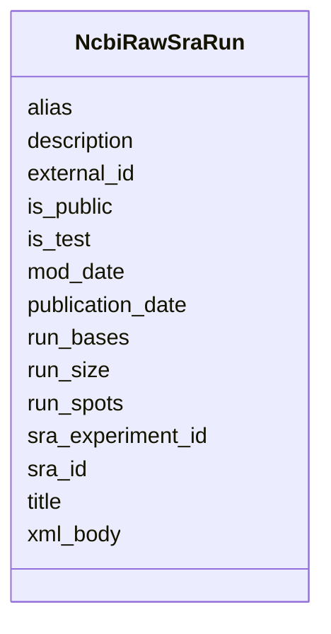

# Class: NcbiRawSraRun 


URI: [gold:NcbiRawSraRun](https://w3id.org/jgi/gold/NcbiRawSraRun)





<!-- no inheritance hierarchy -->


## Slots

| Name | Cardinality and Range | Description | Inheritance |
| ---  | --- | --- | --- |
| [sra_id](sra_id.md) | 0..1 <br/> [String](String.md) |  | direct |
| [title](title.md) | 0..1 <br/> [String](String.md) |  | direct |
| [external_id](external_id.md) | 0..1 <br/> [String](String.md) |  | direct |
| [mod_date](mod_date.md) | 0..1 <br/> [Datetime](Datetime.md) |  | direct |
| [alias](alias.md) | 0..1 <br/> [String](String.md) |  | direct |
| [description](description.md) | 0..1 <br/> [String](String.md) |  | direct |
| [xml_body](xml_body.md) | 0..1 <br/> [String](String.md) |  | direct |
| [sra_experiment_id](sra_experiment_id.md) | 0..1 <br/> [String](String.md) |  | direct |
| [run_spots](run_spots.md) | 0..1 <br/> [Float](Float.md) |  | direct |
| [run_bases](run_bases.md) | 0..1 <br/> [Float](Float.md) |  | direct |
| [run_size](run_size.md) | 0..1 <br/> [Float](Float.md) |  | direct |
| [publication_date](publication_date.md) | 0..1 <br/> [Datetime](Datetime.md) |  | direct |
| [is_test](is_test.md) | 0..1 <br/> [String](String.md) |  | direct |
| [is_public](is_public.md) | 0..1 <br/> [String](String.md) |  | direct |


## Identifier and Mapping Information


### Schema Source


* from schema: https://w3id.org/jgi/gold


## Mappings

| Mapping Type | Mapped Value |
| ---  | ---  |
| self | gold:NcbiRawSraRun |
| native | gold:NcbiRawSraRun |


## LinkML Source

<!-- TODO: investigate https://stackoverflow.com/questions/37606292/how-to-create-tabbed-code-blocks-in-mkdocs-or-sphinx -->

### Direct

<details>
```yaml
name: ncbi_raw_sra_run
from_schema: https://w3id.org/jgi/gold
attributes:
  sra_id:
    name: sra_id
    from_schema: https://w3id.org/jgi/gold
    rank: 1000
    domain_of:
    - ncbi_raw_sra_run
    range: string
    required: false
  title:
    name: title
    from_schema: https://w3id.org/jgi/gold
    domain_of:
    - excel
    - ncbi_raw_sra_run
    - sra_experiment_v2
    - sra_sample_v2
    range: string
    required: false
  external_id:
    name: external_id
    from_schema: https://w3id.org/jgi/gold
    rank: 1000
    domain_of:
    - ncbi_raw_sra_run
    range: string
    required: false
  mod_date:
    name: mod_date
    from_schema: https://w3id.org/jgi/gold
    domain_of:
    - analysis_project
    - api_user
    - bacdive
    - biosample
    - ncbi_raw_sra_run
    - organism_v2
    - package_soil
    - project
    - study
    range: datetime
    required: false
  alias:
    name: alias
    from_schema: https://w3id.org/jgi/gold
    rank: 1000
    domain_of:
    - ncbi_raw_sra_run
    range: string
    required: false
  description:
    name: description
    from_schema: https://w3id.org/jgi/gold
    domain_of:
    - biosample
    - dw_sequencing_product
    - ncbi_raw_sra_run
    - project
    - sra_experiment_v2
    - study
    range: string
    required: false
  xml_body:
    name: xml_body
    from_schema: https://w3id.org/jgi/gold
    rank: 1000
    domain_of:
    - ncbi_raw_sra_run
    range: string
    required: false
  sra_experiment_id:
    name: sra_experiment_id
    from_schema: https://w3id.org/jgi/gold
    rank: 1000
    domain_of:
    - ncbi_raw_sra_run
    - sra_experiment_v2
    range: string
    required: false
  run_spots:
    name: run_spots
    from_schema: https://w3id.org/jgi/gold
    rank: 1000
    domain_of:
    - ncbi_raw_sra_run
    range: float
    required: false
  run_bases:
    name: run_bases
    from_schema: https://w3id.org/jgi/gold
    rank: 1000
    domain_of:
    - ncbi_raw_sra_run
    range: float
    required: false
  run_size:
    name: run_size
    from_schema: https://w3id.org/jgi/gold
    rank: 1000
    domain_of:
    - ncbi_raw_sra_run
    range: float
    required: false
  publication_date:
    name: publication_date
    from_schema: https://w3id.org/jgi/gold
    rank: 1000
    domain_of:
    - ncbi_raw_sra_run
    range: datetime
    required: false
  is_test:
    name: is_test
    from_schema: https://w3id.org/jgi/gold
    domain_of:
    - analysis_project
    - biosample
    - ncbi_raw_sra_run
    - organism_v2
    - project
    - sra_experiment_v2
    - sra_sample_v2
    - study
    range: string
    required: false
  is_public:
    name: is_public
    from_schema: https://w3id.org/jgi/gold
    domain_of:
    - analysis_project
    - biosample
    - ncbi_raw_sra_run
    - organism_v2
    - project
    - sra_experiment_v2
    - sra_sample_v2
    - study
    range: string
    required: false

```
</details>

### Induced

<details>
```yaml
name: ncbi_raw_sra_run
from_schema: https://w3id.org/jgi/gold
attributes:
  sra_id:
    name: sra_id
    from_schema: https://w3id.org/jgi/gold
    rank: 1000
    alias: sra_id
    owner: ncbi_raw_sra_run
    domain_of:
    - ncbi_raw_sra_run
    range: string
    required: false
  title:
    name: title
    from_schema: https://w3id.org/jgi/gold
    alias: title
    owner: ncbi_raw_sra_run
    domain_of:
    - excel
    - ncbi_raw_sra_run
    - sra_experiment_v2
    - sra_sample_v2
    range: string
    required: false
  external_id:
    name: external_id
    from_schema: https://w3id.org/jgi/gold
    rank: 1000
    alias: external_id
    owner: ncbi_raw_sra_run
    domain_of:
    - ncbi_raw_sra_run
    range: string
    required: false
  mod_date:
    name: mod_date
    from_schema: https://w3id.org/jgi/gold
    alias: mod_date
    owner: ncbi_raw_sra_run
    domain_of:
    - analysis_project
    - api_user
    - bacdive
    - biosample
    - ncbi_raw_sra_run
    - organism_v2
    - package_soil
    - project
    - study
    range: datetime
    required: false
  alias:
    name: alias
    from_schema: https://w3id.org/jgi/gold
    rank: 1000
    alias: alias
    owner: ncbi_raw_sra_run
    domain_of:
    - ncbi_raw_sra_run
    range: string
    required: false
  description:
    name: description
    from_schema: https://w3id.org/jgi/gold
    alias: description
    owner: ncbi_raw_sra_run
    domain_of:
    - biosample
    - dw_sequencing_product
    - ncbi_raw_sra_run
    - project
    - sra_experiment_v2
    - study
    range: string
    required: false
  xml_body:
    name: xml_body
    from_schema: https://w3id.org/jgi/gold
    rank: 1000
    alias: xml_body
    owner: ncbi_raw_sra_run
    domain_of:
    - ncbi_raw_sra_run
    range: string
    required: false
  sra_experiment_id:
    name: sra_experiment_id
    from_schema: https://w3id.org/jgi/gold
    rank: 1000
    alias: sra_experiment_id
    owner: ncbi_raw_sra_run
    domain_of:
    - ncbi_raw_sra_run
    - sra_experiment_v2
    range: string
    required: false
  run_spots:
    name: run_spots
    from_schema: https://w3id.org/jgi/gold
    rank: 1000
    alias: run_spots
    owner: ncbi_raw_sra_run
    domain_of:
    - ncbi_raw_sra_run
    range: float
    required: false
  run_bases:
    name: run_bases
    from_schema: https://w3id.org/jgi/gold
    rank: 1000
    alias: run_bases
    owner: ncbi_raw_sra_run
    domain_of:
    - ncbi_raw_sra_run
    range: float
    required: false
  run_size:
    name: run_size
    from_schema: https://w3id.org/jgi/gold
    rank: 1000
    alias: run_size
    owner: ncbi_raw_sra_run
    domain_of:
    - ncbi_raw_sra_run
    range: float
    required: false
  publication_date:
    name: publication_date
    from_schema: https://w3id.org/jgi/gold
    rank: 1000
    alias: publication_date
    owner: ncbi_raw_sra_run
    domain_of:
    - ncbi_raw_sra_run
    range: datetime
    required: false
  is_test:
    name: is_test
    from_schema: https://w3id.org/jgi/gold
    alias: is_test
    owner: ncbi_raw_sra_run
    domain_of:
    - analysis_project
    - biosample
    - ncbi_raw_sra_run
    - organism_v2
    - project
    - sra_experiment_v2
    - sra_sample_v2
    - study
    range: string
    required: false
  is_public:
    name: is_public
    from_schema: https://w3id.org/jgi/gold
    alias: is_public
    owner: ncbi_raw_sra_run
    domain_of:
    - analysis_project
    - biosample
    - ncbi_raw_sra_run
    - organism_v2
    - project
    - sra_experiment_v2
    - sra_sample_v2
    - study
    range: string
    required: false

```
</details>