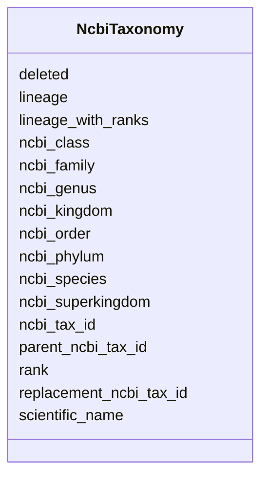

# Class: NcbiTaxonomy 


URI: [gold:NcbiTaxonomy](https://w3id.org/jgi/gold/NcbiTaxonomy)





<!-- no inheritance hierarchy -->


## Slots

| Name | Cardinality and Range | Description | Inheritance |
| ---  | --- | --- | --- |
| [ncbi_tax_id](ncbi_tax_id.md) | 0..1 <br/> [Float](Float.md) |  | direct |
| [parent_ncbi_tax_id](parent_ncbi_tax_id.md) | 0..1 <br/> [Float](Float.md) |  | direct |
| [ncbi_superkingdom](ncbi_superkingdom.md) | 0..1 <br/> [String](String.md) |  | direct |
| [ncbi_kingdom](ncbi_kingdom.md) | 0..1 <br/> [String](String.md) |  | direct |
| [ncbi_phylum](ncbi_phylum.md) | 0..1 <br/> [String](String.md) |  | direct |
| [ncbi_class](ncbi_class.md) | 0..1 <br/> [String](String.md) |  | direct |
| [ncbi_order](ncbi_order.md) | 0..1 <br/> [String](String.md) |  | direct |
| [ncbi_family](ncbi_family.md) | 0..1 <br/> [String](String.md) |  | direct |
| [ncbi_genus](ncbi_genus.md) | 0..1 <br/> [String](String.md) |  | direct |
| [ncbi_species](ncbi_species.md) | 0..1 <br/> [String](String.md) |  | direct |
| [scientific_name](scientific_name.md) | 0..1 <br/> [String](String.md) |  | direct |
| [rank](rank.md) | 0..1 <br/> [String](String.md) |  | direct |
| [replacement_ncbi_tax_id](replacement_ncbi_tax_id.md) | 0..1 <br/> [Float](Float.md) |  | direct |
| [deleted](deleted.md) | 0..1 <br/> [String](String.md) |  | direct |
| [lineage](lineage.md) | 0..1 <br/> [String](String.md) |  | direct |
| [lineage_with_ranks](lineage_with_ranks.md) | 0..1 <br/> [String](String.md) |  | direct |


## Identifier and Mapping Information


### Schema Source


* from schema: https://w3id.org/jgi/gold


## Mappings

| Mapping Type | Mapped Value |
| ---  | ---  |
| self | gold:NcbiTaxonomy |
| native | gold:NcbiTaxonomy |


## LinkML Source

<!-- TODO: investigate https://stackoverflow.com/questions/37606292/how-to-create-tabbed-code-blocks-in-mkdocs-or-sphinx -->

### Direct

<details>
```yaml
name: ncbi_taxonomy
from_schema: https://w3id.org/jgi/gold
attributes:
  ncbi_tax_id:
    name: ncbi_tax_id
    from_schema: https://w3id.org/jgi/gold
    domain_of:
    - analysis_project
    - dw_analysis_project
    - ncbi_taxonomy
    range: float
    required: false
  parent_ncbi_tax_id:
    name: parent_ncbi_tax_id
    from_schema: https://w3id.org/jgi/gold
    rank: 1000
    domain_of:
    - ncbi_taxonomy
    range: float
    required: false
  ncbi_superkingdom:
    name: ncbi_superkingdom
    from_schema: https://w3id.org/jgi/gold
    domain_of:
    - analysis_project
    - ncbi_taxonomy
    - organism_v2
    range: string
    required: false
  ncbi_kingdom:
    name: ncbi_kingdom
    from_schema: https://w3id.org/jgi/gold
    domain_of:
    - analysis_project
    - ncbi_taxonomy
    - organism_v2
    range: string
    required: false
  ncbi_phylum:
    name: ncbi_phylum
    from_schema: https://w3id.org/jgi/gold
    domain_of:
    - analysis_project
    - ncbi_taxonomy
    - organism_v2
    range: string
    required: false
  ncbi_class:
    name: ncbi_class
    from_schema: https://w3id.org/jgi/gold
    domain_of:
    - analysis_project
    - ncbi_taxonomy
    - organism_v2
    - sigs_view
    range: string
    required: false
  ncbi_order:
    name: ncbi_order
    from_schema: https://w3id.org/jgi/gold
    domain_of:
    - analysis_project
    - ncbi_taxonomy
    - organism_v2
    - sigs_view
    range: string
    required: false
  ncbi_family:
    name: ncbi_family
    from_schema: https://w3id.org/jgi/gold
    domain_of:
    - analysis_project
    - ncbi_taxonomy
    - organism_v2
    - sigs_view
    range: string
    required: false
  ncbi_genus:
    name: ncbi_genus
    from_schema: https://w3id.org/jgi/gold
    domain_of:
    - analysis_project
    - ncbi_taxonomy
    - organism_v2
    range: string
    required: false
  ncbi_species:
    name: ncbi_species
    from_schema: https://w3id.org/jgi/gold
    domain_of:
    - analysis_project
    - ncbi_taxonomy
    - organism_v2
    range: string
    required: false
  scientific_name:
    name: scientific_name
    from_schema: https://w3id.org/jgi/gold
    rank: 1000
    domain_of:
    - ncbi_taxonomy
    range: string
    required: false
  rank:
    name: rank
    from_schema: https://w3id.org/jgi/gold
    rank: 1000
    domain_of:
    - ncbi_taxonomy
    range: string
    required: false
  replacement_ncbi_tax_id:
    name: replacement_ncbi_tax_id
    from_schema: https://w3id.org/jgi/gold
    rank: 1000
    domain_of:
    - ncbi_taxonomy
    range: float
    required: false
  deleted:
    name: deleted
    from_schema: https://w3id.org/jgi/gold
    rank: 1000
    domain_of:
    - ncbi_taxonomy
    range: string
    required: false
  lineage:
    name: lineage
    from_schema: https://w3id.org/jgi/gold
    rank: 1000
    domain_of:
    - ncbi_taxonomy
    range: string
    required: false
  lineage_with_ranks:
    name: lineage_with_ranks
    from_schema: https://w3id.org/jgi/gold
    rank: 1000
    domain_of:
    - ncbi_taxonomy
    range: string
    required: false

```
</details>

### Induced

<details>
```yaml
name: ncbi_taxonomy
from_schema: https://w3id.org/jgi/gold
attributes:
  ncbi_tax_id:
    name: ncbi_tax_id
    from_schema: https://w3id.org/jgi/gold
    alias: ncbi_tax_id
    owner: ncbi_taxonomy
    domain_of:
    - analysis_project
    - dw_analysis_project
    - ncbi_taxonomy
    range: float
    required: false
  parent_ncbi_tax_id:
    name: parent_ncbi_tax_id
    from_schema: https://w3id.org/jgi/gold
    rank: 1000
    alias: parent_ncbi_tax_id
    owner: ncbi_taxonomy
    domain_of:
    - ncbi_taxonomy
    range: float
    required: false
  ncbi_superkingdom:
    name: ncbi_superkingdom
    from_schema: https://w3id.org/jgi/gold
    alias: ncbi_superkingdom
    owner: ncbi_taxonomy
    domain_of:
    - analysis_project
    - ncbi_taxonomy
    - organism_v2
    range: string
    required: false
  ncbi_kingdom:
    name: ncbi_kingdom
    from_schema: https://w3id.org/jgi/gold
    alias: ncbi_kingdom
    owner: ncbi_taxonomy
    domain_of:
    - analysis_project
    - ncbi_taxonomy
    - organism_v2
    range: string
    required: false
  ncbi_phylum:
    name: ncbi_phylum
    from_schema: https://w3id.org/jgi/gold
    alias: ncbi_phylum
    owner: ncbi_taxonomy
    domain_of:
    - analysis_project
    - ncbi_taxonomy
    - organism_v2
    range: string
    required: false
  ncbi_class:
    name: ncbi_class
    from_schema: https://w3id.org/jgi/gold
    alias: ncbi_class
    owner: ncbi_taxonomy
    domain_of:
    - analysis_project
    - ncbi_taxonomy
    - organism_v2
    - sigs_view
    range: string
    required: false
  ncbi_order:
    name: ncbi_order
    from_schema: https://w3id.org/jgi/gold
    alias: ncbi_order
    owner: ncbi_taxonomy
    domain_of:
    - analysis_project
    - ncbi_taxonomy
    - organism_v2
    - sigs_view
    range: string
    required: false
  ncbi_family:
    name: ncbi_family
    from_schema: https://w3id.org/jgi/gold
    alias: ncbi_family
    owner: ncbi_taxonomy
    domain_of:
    - analysis_project
    - ncbi_taxonomy
    - organism_v2
    - sigs_view
    range: string
    required: false
  ncbi_genus:
    name: ncbi_genus
    from_schema: https://w3id.org/jgi/gold
    alias: ncbi_genus
    owner: ncbi_taxonomy
    domain_of:
    - analysis_project
    - ncbi_taxonomy
    - organism_v2
    range: string
    required: false
  ncbi_species:
    name: ncbi_species
    from_schema: https://w3id.org/jgi/gold
    alias: ncbi_species
    owner: ncbi_taxonomy
    domain_of:
    - analysis_project
    - ncbi_taxonomy
    - organism_v2
    range: string
    required: false
  scientific_name:
    name: scientific_name
    from_schema: https://w3id.org/jgi/gold
    rank: 1000
    alias: scientific_name
    owner: ncbi_taxonomy
    domain_of:
    - ncbi_taxonomy
    range: string
    required: false
  rank:
    name: rank
    from_schema: https://w3id.org/jgi/gold
    rank: 1000
    alias: rank
    owner: ncbi_taxonomy
    domain_of:
    - ncbi_taxonomy
    range: string
    required: false
  replacement_ncbi_tax_id:
    name: replacement_ncbi_tax_id
    from_schema: https://w3id.org/jgi/gold
    rank: 1000
    alias: replacement_ncbi_tax_id
    owner: ncbi_taxonomy
    domain_of:
    - ncbi_taxonomy
    range: float
    required: false
  deleted:
    name: deleted
    from_schema: https://w3id.org/jgi/gold
    rank: 1000
    alias: deleted
    owner: ncbi_taxonomy
    domain_of:
    - ncbi_taxonomy
    range: string
    required: false
  lineage:
    name: lineage
    from_schema: https://w3id.org/jgi/gold
    rank: 1000
    alias: lineage
    owner: ncbi_taxonomy
    domain_of:
    - ncbi_taxonomy
    range: string
    required: false
  lineage_with_ranks:
    name: lineage_with_ranks
    from_schema: https://w3id.org/jgi/gold
    rank: 1000
    alias: lineage_with_ranks
    owner: ncbi_taxonomy
    domain_of:
    - ncbi_taxonomy
    range: string
    required: false

```
</details>