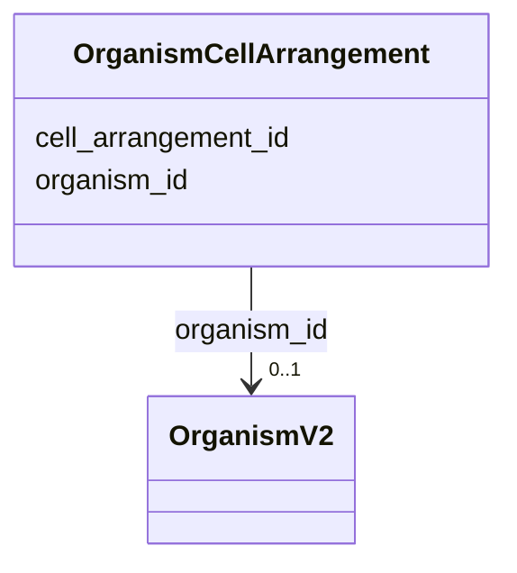

# Class: OrganismCellArrangement 


URI: [gold:OrganismCellArrangement](https://w3id.org/jgi/gold/OrganismCellArrangement)





<!-- no inheritance hierarchy -->


## Slots

| Name | Cardinality and Range | Description | Inheritance |
| ---  | --- | --- | --- |
| [organism_id](organism_id.md) | 0..1 <br/> [OrganismV2](OrganismV2.md) | Foreign key to organism_v2 | direct |
| [cell_arrangement_id](cell_arrangement_id.md) | 0..1 <br/> [Float](Float.md) |  | direct |


## Identifier and Mapping Information


### Schema Source


* from schema: https://w3id.org/jgi/gold


## Mappings

| Mapping Type | Mapped Value |
| ---  | ---  |
| self | gold:OrganismCellArrangement |
| native | gold:OrganismCellArrangement |


## LinkML Source

<!-- TODO: investigate https://stackoverflow.com/questions/37606292/how-to-create-tabbed-code-blocks-in-mkdocs-or-sphinx -->

### Direct

<details>
```yaml
name: organism_cell_arrangement
from_schema: https://w3id.org/jgi/gold
attributes:
  organism_id:
    name: organism_id
    description: Foreign key to organism_v2
    from_schema: https://w3id.org/jgi/gold
    domain_of:
    - analysis_project
    - organism_cell_arrangement
    - organism_metabolism
    - organism_v2
    - package_soil
    - project
    range: organism_v2
    required: false
  cell_arrangement_id:
    name: cell_arrangement_id
    from_schema: https://w3id.org/jgi/gold
    rank: 1000
    domain_of:
    - organism_cell_arrangement
    range: float
    required: false

```
</details>

### Induced

<details>
```yaml
name: organism_cell_arrangement
from_schema: https://w3id.org/jgi/gold
attributes:
  organism_id:
    name: organism_id
    description: Foreign key to organism_v2
    from_schema: https://w3id.org/jgi/gold
    alias: organism_id
    owner: organism_cell_arrangement
    domain_of:
    - analysis_project
    - organism_cell_arrangement
    - organism_metabolism
    - organism_v2
    - package_soil
    - project
    range: organism_v2
    required: false
  cell_arrangement_id:
    name: cell_arrangement_id
    from_schema: https://w3id.org/jgi/gold
    rank: 1000
    alias: cell_arrangement_id
    owner: organism_cell_arrangement
    domain_of:
    - organism_cell_arrangement
    range: float
    required: false

```
</details>