# Class: OrganismV2 


URI: [gold:OrganismV2](https://w3id.org/jgi/gold/OrganismV2)

```mermaid
 classDiagram
    class OrganismV2
    click OrganismV2 href "../OrganismV2/"
      OrganismV2 : active
        
      OrganismV2 : add_date
        
      OrganismV2 : admin_ap_count
        
      OrganismV2 : admin_sp_count
        
      OrganismV2 : altitude
        
      OrganismV2 : altitude2
        
      OrganismV2 : annotator_comments
        
      OrganismV2 : bicarbonate_millimol
        
      OrganismV2 : biosafety_level
        
      OrganismV2 : biosample_id
        
          
    
        
        
        OrganismV2 --> "0..1" Biosample : biosample_id
        click Biosample href "../Biosample/"
    

        
      OrganismV2 : carbon_source
        
      OrganismV2 : cell_diameter
        
      OrganismV2 : cell_length
        
      OrganismV2 : cell_shape
        
      OrganismV2 : chlorophyll_concentration
        
      OrganismV2 : clade
        
      OrganismV2 : color
        
          
    
        
        
        OrganismV2 --> "0..1" Cvcolor : color
        click Cvcolor href "../Cvcolor/"
    

        
      OrganismV2 : comments
        
      OrganismV2 : commercial
        
      OrganismV2 : commercial_comments
        
      OrganismV2 : common_name
        
      OrganismV2 : cruise_line_name
        
      OrganismV2 : culture_collection_id
        
      OrganismV2 : culture_type
        
      OrganismV2 : cultured
        
      OrganismV2 : depth
        
      OrganismV2 : depth2
        
      OrganismV2 : domain
        
      OrganismV2 : ecosystem
        
      OrganismV2 : ecosystem_category
        
      OrganismV2 : ecosystem_path_id
        
      OrganismV2 : ecosystem_subtype
        
      OrganismV2 : ecosystem_type
        
      OrganismV2 : ecotype
        
      OrganismV2 : elevation
        
      OrganismV2 : elevation2
        
      OrganismV2 : encoded_traits
        
      OrganismV2 : env_broad_scale
        
      OrganismV2 : env_local_scale
        
      OrganismV2 : env_medium
        
      OrganismV2 : exemplar_doi
        
      OrganismV2 : exemplar_name
        
      OrganismV2 : genbank_16s_id
        
      OrganismV2 : genus
        
      OrganismV2 : genus_synonyms
        
      OrganismV2 : geographic_location
        
      OrganismV2 : gold_class
        
      OrganismV2 : gold_family
        
      OrganismV2 : gold_id
        
      OrganismV2 : gold_order
        
      OrganismV2 : gold_phylogeny
        
      OrganismV2 : gram_stain
        
      OrganismV2 : growth_conditions
        
      OrganismV2 : growth_temperature
        
      OrganismV2 : growth_temperature2
        
      OrganismV2 : h2s_millimol
        
      OrganismV2 : h2s_present
        
      OrganismV2 : health_disease_stat
        
      OrganismV2 : host_age
        
      OrganismV2 : host_body_product
        
      OrganismV2 : host_body_product_id
        
      OrganismV2 : host_body_site
        
      OrganismV2 : host_body_site_id
        
      OrganismV2 : host_body_subsite
        
      OrganismV2 : host_body_subsite_id
        
      OrganismV2 : host_comments
        
      OrganismV2 : host_gender
        
      OrganismV2 : host_health_condition
        
      OrganismV2 : host_medication
        
      OrganismV2 : host_name
        
      OrganismV2 : host_race
        
      OrganismV2 : host_specificity
        
      OrganismV2 : host_taxonomy_id
        
      OrganismV2 : hydrocarbon_core_package_id
        
      OrganismV2 : hydrocarbon_fs_package_id
        
      OrganismV2 : img_breadth_calc
        
      OrganismV2 : irradiance
        
      OrganismV2 : is_draft
        
      OrganismV2 : is_public
        
      OrganismV2 : is_test
        
      OrganismV2 : is_virocell
        
      OrganismV2 : isolation_publication_id
        
      OrganismV2 : isolation_pubmed_id
        
      OrganismV2 : its_growth_conditions
        
      OrganismV2 : known_non_hosts
        
      OrganismV2 : lat_long_inferred
        
      OrganismV2 : latitude
        
      OrganismV2 : latitude_test
        
      OrganismV2 : legacy_depth_data
        
      OrganismV2 : longhurst_code
        
      OrganismV2 : longitude
        
      OrganismV2 : longitude_test
        
      OrganismV2 : master_group_id
        
          
    
        
        
        OrganismV2 --> "0..1" OrganismV2 : master_group_id
        click OrganismV2 href "../OrganismV2/"
    

        
      OrganismV2 : methane_conc_millimol
        
      OrganismV2 : microbial_mat_package_id
        
      OrganismV2 : mod_by
        
      OrganismV2 : mod_date
        
      OrganismV2 : motility
        
      OrganismV2 : mrn
        
      OrganismV2 : ncbi_biosample_id
        
      OrganismV2 : ncbi_class
        
      OrganismV2 : ncbi_family
        
      OrganismV2 : ncbi_genus
        
      OrganismV2 : ncbi_kingdom
        
      OrganismV2 : ncbi_order
        
      OrganismV2 : ncbi_phylum
        
      OrganismV2 : ncbi_species
        
      OrganismV2 : ncbi_superkingdom
        
      OrganismV2 : ncbi_taxonomy_id
        
      OrganismV2 : ncbi_taxonomy_name
        
      OrganismV2 : nitrate_concentration
        
      OrganismV2 : organism_id
        
      OrganismV2 : organism_name
        
      OrganismV2 : organism_type
        
          
    
        
        
        OrganismV2 --> "0..1" CvorganismType : organism_type
        click CvorganismType href "../CvorganismType/"
    

        
      OrganismV2 : other_ecosystem
        
      OrganismV2 : other_hosts
        
      OrganismV2 : other_names
        
      OrganismV2 : oxygen_concentration
        
      OrganismV2 : oxygen_requirement
        
      OrganismV2 : package_built_environment_id
        
      OrganismV2 : package_host_associated_id
        
      OrganismV2 : package_human_associated_id
        
      OrganismV2 : package_wastewater_id
        
      OrganismV2 : pathogenicity
        
      OrganismV2 : patient_visit_number
        
      OrganismV2 : ph
        
      OrganismV2 : ph1
        
      OrganismV2 : ph2
        
      OrganismV2 : plant_package_id
        
      OrganismV2 : ploidy
        
      OrganismV2 : pressure
        
      OrganismV2 : project_oid
        
      OrganismV2 : propagation
        
      OrganismV2 : proport_isolation
        
      OrganismV2 : proport_ocean
        
      OrganismV2 : proport_station
        
      OrganismV2 : proport_woa_dissolved_oxygen
        
      OrganismV2 : proport_woa_nitrate
        
      OrganismV2 : proport_woa_phosphate
        
      OrganismV2 : proport_woa_salinity
        
      OrganismV2 : proport_woa_silicate
        
      OrganismV2 : proport_woa_temperature
        
      OrganismV2 : public_ap_count
        
      OrganismV2 : public_sp_count
        
      OrganismV2 : replicate_number
        
      OrganismV2 : salinity
        
      OrganismV2 : salinity_concentration
        
      OrganismV2 : sample_biomass
        
      OrganismV2 : sample_collection_day
        
      OrganismV2 : sample_collection_hour
        
      OrganismV2 : sample_collection_minute
        
      OrganismV2 : sample_collection_month
        
      OrganismV2 : sample_collection_site
        
      OrganismV2 : sample_collection_temperature
        
      OrganismV2 : sample_collection_temperature2
        
      OrganismV2 : sample_collection_year
        
      OrganismV2 : sample_conductivity
        
      OrganismV2 : sample_contact_email
        
      OrganismV2 : sample_contact_name
        
      OrganismV2 : sample_isolation_comments
        
      OrganismV2 : sample_isolation_country_id
        
      OrganismV2 : sample_oid
        
      OrganismV2 : sample_volume
        
      OrganismV2 : sampling_strategy
        
      OrganismV2 : sediment_package_id
        
      OrganismV2 : serovar
        
      OrganismV2 : soil_curr_land_use
        
      OrganismV2 : soil_curr_vegetation
        
      OrganismV2 : soil_curr_vegetation_method
        
      OrganismV2 : soil_package_id
        
          
    
        
        
        OrganismV2 --> "0..1" PackageSoil : soil_package_id
        click PackageSoil href "../PackageSoil/"
    

        
      OrganismV2 : soil_prev_land_use
        
      OrganismV2 : soil_sample_biomass
        
      OrganismV2 : soil_sample_volume
        
      OrganismV2 : soluble_iron_micromol
        
      OrganismV2 : source
        
      OrganismV2 : species
        
      OrganismV2 : species_synonyms
        
      OrganismV2 : specific_ecosystem
        
      OrganismV2 : specimen
        
      OrganismV2 : sporulation
        
      OrganismV2 : strain
        
      OrganismV2 : strain_info_id
        
      OrganismV2 : straininfo_group_id
        
      OrganismV2 : submit_biosample_name
        
      OrganismV2 : submit_organism_name
        
      OrganismV2 : submitter_id
        
      OrganismV2 : subspecies
        
      OrganismV2 : subsurface_depth
        
      OrganismV2 : subsurface_depth1
        
      OrganismV2 : subsurface_depth2
        
      OrganismV2 : symbiont_name
        
      OrganismV2 : symbiont_taxon_id
        
      OrganismV2 : symbiotic_physical_interaction
        
      OrganismV2 : symbiotic_relationship
        
      OrganismV2 : tax_class_method
        
      OrganismV2 : tax_ident
        
      OrganismV2 : taxon_doi
        
      OrganismV2 : taxonomy_status
        
      OrganismV2 : temperature_range
        
      OrganismV2 : tot_nitrogen
        
      OrganismV2 : tot_org_carbon
        
      OrganismV2 : type_strain
        
      OrganismV2 : uncultured_type
        
      OrganismV2 : viral_group
        
      OrganismV2 : viral_subgroup
        
      OrganismV2 : virus_enrich_appr
        
      OrganismV2 : water_package_id
        
      
```





<!-- no inheritance hierarchy -->


## Slots

| Name | Cardinality and Range | Description | Inheritance |
| ---  | --- | --- | --- |
| [organism_id](organism_id.md) | 0..1 <br/> [Float](Float.md) |  | direct |
| [active](active.md) | 0..1 <br/> [String](String.md) |  | direct |
| [is_public](is_public.md) | 0..1 <br/> [String](String.md) |  | direct |
| [add_date](add_date.md) | 0..1 <br/> [Datetime](Datetime.md) |  | direct |
| [mod_date](mod_date.md) | 0..1 <br/> [Datetime](Datetime.md) |  | direct |
| [mod_by](mod_by.md) | 0..1 <br/> [Float](Float.md) |  | direct |
| [gold_id](gold_id.md) | 0..1 <br/> [String](String.md) |  | direct |
| [organism_name](organism_name.md) | 0..1 <br/> [String](String.md) |  | direct |
| [genus](genus.md) | 0..1 <br/> [String](String.md) |  | direct |
| [species](species.md) | 0..1 <br/> [String](String.md) |  | direct |
| [subspecies](subspecies.md) | 0..1 <br/> [String](String.md) |  | direct |
| [strain](strain.md) | 0..1 <br/> [String](String.md) |  | direct |
| [serovar](serovar.md) | 0..1 <br/> [String](String.md) |  | direct |
| [culture_collection_id](culture_collection_id.md) | 0..1 <br/> [String](String.md) |  | direct |
| [type_strain](type_strain.md) | 0..1 <br/> [String](String.md) |  | direct |
| [domain](domain.md) | 0..1 <br/> [String](String.md) |  | direct |
| [gold_phylogeny](gold_phylogeny.md) | 0..1 <br/> [String](String.md) |  | direct |
| [ncbi_taxonomy_id](ncbi_taxonomy_id.md) | 0..1 <br/> [Float](Float.md) |  | direct |
| [ncbi_taxonomy_name](ncbi_taxonomy_name.md) | 0..1 <br/> [String](String.md) |  | direct |
| [ncbi_superkingdom](ncbi_superkingdom.md) | 0..1 <br/> [String](String.md) |  | direct |
| [ncbi_kingdom](ncbi_kingdom.md) | 0..1 <br/> [String](String.md) |  | direct |
| [ncbi_phylum](ncbi_phylum.md) | 0..1 <br/> [String](String.md) |  | direct |
| [ncbi_class](ncbi_class.md) | 0..1 <br/> [String](String.md) |  | direct |
| [ncbi_order](ncbi_order.md) | 0..1 <br/> [String](String.md) |  | direct |
| [ncbi_family](ncbi_family.md) | 0..1 <br/> [String](String.md) |  | direct |
| [ncbi_genus](ncbi_genus.md) | 0..1 <br/> [String](String.md) |  | direct |
| [ncbi_species](ncbi_species.md) | 0..1 <br/> [String](String.md) |  | direct |
| [genbank_16s_id](genbank_16s_id.md) | 0..1 <br/> [String](String.md) |  | direct |
| [clade](clade.md) | 0..1 <br/> [String](String.md) |  | direct |
| [tax_class_method](tax_class_method.md) | 0..1 <br/> [String](String.md) |  | direct |
| [organism_type](organism_type.md) | 0..1 <br/> [CvorganismType](CvorganismType.md) | Foreign key to cvorganism_type | direct |
| [cultured](cultured.md) | 0..1 <br/> [String](String.md) |  | direct |
| [culture_type](culture_type.md) | 0..1 <br/> [String](String.md) |  | direct |
| [uncultured_type](uncultured_type.md) | 0..1 <br/> [String](String.md) |  | direct |
| [other_names](other_names.md) | 0..1 <br/> [String](String.md) |  | direct |
| [genus_synonyms](genus_synonyms.md) | 0..1 <br/> [String](String.md) |  | direct |
| [species_synonyms](species_synonyms.md) | 0..1 <br/> [String](String.md) |  | direct |
| [ecotype](ecotype.md) | 0..1 <br/> [String](String.md) |  | direct |
| [common_name](common_name.md) | 0..1 <br/> [String](String.md) |  | direct |
| [master_group_id](master_group_id.md) | 0..1 <br/> [OrganismV2](OrganismV2.md) | Foreign key to organism_v2 | direct |
| [submitter_id](submitter_id.md) | 0..1 <br/> [Float](Float.md) |  | direct |
| [sample_collection_site](sample_collection_site.md) | 0..1 <br/> [String](String.md) |  | direct |
| [sample_isolation_country_id](sample_isolation_country_id.md) | 0..1 <br/> [Float](Float.md) |  | direct |
| [geographic_location](geographic_location.md) | 0..1 <br/> [String](String.md) |  | direct |
| [latitude](latitude.md) | 0..1 <br/> [Float](Float.md) |  | direct |
| [longitude](longitude.md) | 0..1 <br/> [Float](Float.md) |  | direct |
| [lat_long_inferred](lat_long_inferred.md) | 0..1 <br/> [String](String.md) |  | direct |
| [isolation_publication_id](isolation_publication_id.md) | 0..1 <br/> [Float](Float.md) |  | direct |
| [isolation_pubmed_id](isolation_pubmed_id.md) | 0..1 <br/> [Float](Float.md) |  | direct |
| [sample_isolation_comments](sample_isolation_comments.md) | 0..1 <br/> [String](String.md) |  | direct |
| [sample_collection_day](sample_collection_day.md) | 0..1 <br/> [Float](Float.md) |  | direct |
| [sample_collection_month](sample_collection_month.md) | 0..1 <br/> [Float](Float.md) |  | direct |
| [sample_collection_year](sample_collection_year.md) | 0..1 <br/> [Float](Float.md) |  | direct |
| [sample_collection_hour](sample_collection_hour.md) | 0..1 <br/> [Float](Float.md) |  | direct |
| [sample_collection_minute](sample_collection_minute.md) | 0..1 <br/> [Float](Float.md) |  | direct |
| [ecosystem_path_id](ecosystem_path_id.md) | 0..1 <br/> [Float](Float.md) |  | direct |
| [ecosystem](ecosystem.md) | 0..1 <br/> [String](String.md) |  | direct |
| [ecosystem_category](ecosystem_category.md) | 0..1 <br/> [String](String.md) |  | direct |
| [ecosystem_type](ecosystem_type.md) | 0..1 <br/> [String](String.md) |  | direct |
| [ecosystem_subtype](ecosystem_subtype.md) | 0..1 <br/> [String](String.md) |  | direct |
| [specific_ecosystem](specific_ecosystem.md) | 0..1 <br/> [String](String.md) |  | direct |
| [other_ecosystem](other_ecosystem.md) | 0..1 <br/> [String](String.md) |  | direct |
| [gram_stain](gram_stain.md) | 0..1 <br/> [String](String.md) |  | direct |
| [oxygen_requirement](oxygen_requirement.md) | 0..1 <br/> [String](String.md) |  | direct |
| [carbon_source](carbon_source.md) | 0..1 <br/> [String](String.md) |  | direct |
| [cell_shape](cell_shape.md) | 0..1 <br/> [String](String.md) |  | direct |
| [cell_length](cell_length.md) | 0..1 <br/> [String](String.md) |  | direct |
| [motility](motility.md) | 0..1 <br/> [String](String.md) |  | direct |
| [sporulation](sporulation.md) | 0..1 <br/> [String](String.md) |  | direct |
| [cell_diameter](cell_diameter.md) | 0..1 <br/> [String](String.md) |  | direct |
| [temperature_range](temperature_range.md) | 0..1 <br/> [String](String.md) |  | direct |
| [growth_temperature](growth_temperature.md) | 0..1 <br/> [Float](Float.md) |  | direct |
| [growth_temperature2](growth_temperature2.md) | 0..1 <br/> [Float](Float.md) |  | direct |
| [sample_collection_temperature](sample_collection_temperature.md) | 0..1 <br/> [Float](Float.md) |  | direct |
| [sample_collection_temperature2](sample_collection_temperature2.md) | 0..1 <br/> [Float](Float.md) |  | direct |
| [color](color.md) | 0..1 <br/> [Cvcolor](Cvcolor.md) | Foreign key to cvcolor | direct |
| [depth](depth.md) | 0..1 <br/> [Float](Float.md) |  | direct |
| [depth2](depth2.md) | 0..1 <br/> [Float](Float.md) |  | direct |
| [subsurface_depth1](subsurface_depth1.md) | 0..1 <br/> [Float](Float.md) |  | direct |
| [subsurface_depth2](subsurface_depth2.md) | 0..1 <br/> [Float](Float.md) |  | direct |
| [altitude](altitude.md) | 0..1 <br/> [Float](Float.md) |  | direct |
| [altitude2](altitude2.md) | 0..1 <br/> [Float](Float.md) |  | direct |
| [elevation](elevation.md) | 0..1 <br/> [Float](Float.md) |  | direct |
| [elevation2](elevation2.md) | 0..1 <br/> [Float](Float.md) |  | direct |
| [ph1](ph1.md) | 0..1 <br/> [Float](Float.md) |  | direct |
| [ph2](ph2.md) | 0..1 <br/> [Float](Float.md) |  | direct |
| [salinity](salinity.md) | 0..1 <br/> [String](String.md) |  | direct |
| [pressure](pressure.md) | 0..1 <br/> [String](String.md) |  | direct |
| [chlorophyll_concentration](chlorophyll_concentration.md) | 0..1 <br/> [String](String.md) |  | direct |
| [nitrate_concentration](nitrate_concentration.md) | 0..1 <br/> [String](String.md) |  | direct |
| [oxygen_concentration](oxygen_concentration.md) | 0..1 <br/> [String](String.md) |  | direct |
| [salinity_concentration](salinity_concentration.md) | 0..1 <br/> [String](String.md) |  | direct |
| [growth_conditions](growth_conditions.md) | 0..1 <br/> [String](String.md) |  | direct |
| [tot_org_carbon](tot_org_carbon.md) | 0..1 <br/> [Float](Float.md) |  | direct |
| [tot_nitrogen](tot_nitrogen.md) | 0..1 <br/> [String](String.md) |  | direct |
| [bicarbonate_millimol](bicarbonate_millimol.md) | 0..1 <br/> [Float](Float.md) |  | direct |
| [soluble_iron_micromol](soluble_iron_micromol.md) | 0..1 <br/> [Float](Float.md) |  | direct |
| [h2s_millimol](h2s_millimol.md) | 0..1 <br/> [Float](Float.md) |  | direct |
| [h2s_present](h2s_present.md) | 0..1 <br/> [String](String.md) |  | direct |
| [irradiance](irradiance.md) | 0..1 <br/> [String](String.md) |  | direct |
| [methane_conc_millimol](methane_conc_millimol.md) | 0..1 <br/> [Float](Float.md) |  | direct |
| [sample_conductivity](sample_conductivity.md) | 0..1 <br/> [String](String.md) |  | direct |
| [env_broad_scale](env_broad_scale.md) | 0..1 <br/> [String](String.md) |  | direct |
| [env_local_scale](env_local_scale.md) | 0..1 <br/> [String](String.md) |  | direct |
| [env_medium](env_medium.md) | 0..1 <br/> [String](String.md) |  | direct |
| [host_name](host_name.md) | 0..1 <br/> [String](String.md) |  | direct |
| [host_taxonomy_id](host_taxonomy_id.md) | 0..1 <br/> [Float](Float.md) |  | direct |
| [host_gender](host_gender.md) | 0..1 <br/> [String](String.md) |  | direct |
| [host_race](host_race.md) | 0..1 <br/> [String](String.md) |  | direct |
| [host_age](host_age.md) | 0..1 <br/> [String](String.md) |  | direct |
| [host_health_condition](host_health_condition.md) | 0..1 <br/> [String](String.md) |  | direct |
| [host_medication](host_medication.md) | 0..1 <br/> [String](String.md) |  | direct |
| [host_body_site](host_body_site.md) | 0..1 <br/> [String](String.md) |  | direct |
| [host_body_subsite](host_body_subsite.md) | 0..1 <br/> [String](String.md) |  | direct |
| [host_body_product](host_body_product.md) | 0..1 <br/> [String](String.md) |  | direct |
| [host_body_site_id](host_body_site_id.md) | 0..1 <br/> [Float](Float.md) |  | direct |
| [host_body_subsite_id](host_body_subsite_id.md) | 0..1 <br/> [Float](Float.md) |  | direct |
| [host_body_product_id](host_body_product_id.md) | 0..1 <br/> [Float](Float.md) |  | direct |
| [host_specificity](host_specificity.md) | 0..1 <br/> [String](String.md) |  | direct |
| [host_comments](host_comments.md) | 0..1 <br/> [String](String.md) |  | direct |
| [patient_visit_number](patient_visit_number.md) | 0..1 <br/> [Float](Float.md) |  | direct |
| [mrn](mrn.md) | 0..1 <br/> [String](String.md) |  | direct |
| [known_non_hosts](known_non_hosts.md) | 0..1 <br/> [String](String.md) |  | direct |
| [other_hosts](other_hosts.md) | 0..1 <br/> [String](String.md) |  | direct |
| [viral_group](viral_group.md) | 0..1 <br/> [String](String.md) |  | direct |
| [viral_subgroup](viral_subgroup.md) | 0..1 <br/> [String](String.md) |  | direct |
| [virus_enrich_appr](virus_enrich_appr.md) | 0..1 <br/> [String](String.md) |  | direct |
| [propagation](propagation.md) | 0..1 <br/> [String](String.md) |  | direct |
| [ploidy](ploidy.md) | 0..1 <br/> [String](String.md) |  | direct |
| [pathogenicity](pathogenicity.md) | 0..1 <br/> [String](String.md) |  | direct |
| [health_disease_stat](health_disease_stat.md) | 0..1 <br/> [String](String.md) |  | direct |
| [encoded_traits](encoded_traits.md) | 0..1 <br/> [String](String.md) |  | direct |
| [tax_ident](tax_ident.md) | 0..1 <br/> [String](String.md) |  | direct |
| [comments](comments.md) | 0..1 <br/> [String](String.md) |  | direct |
| [annotator_comments](annotator_comments.md) | 0..1 <br/> [String](String.md) |  | direct |
| [sample_contact_name](sample_contact_name.md) | 0..1 <br/> [String](String.md) |  | direct |
| [sample_contact_email](sample_contact_email.md) | 0..1 <br/> [String](String.md) |  | direct |
| [sampling_strategy](sampling_strategy.md) | 0..1 <br/> [String](String.md) |  | direct |
| [replicate_number](replicate_number.md) | 0..1 <br/> [Float](Float.md) |  | direct |
| [symbiotic_relationship](symbiotic_relationship.md) | 0..1 <br/> [String](String.md) |  | direct |
| [symbiotic_physical_interaction](symbiotic_physical_interaction.md) | 0..1 <br/> [String](String.md) |  | direct |
| [symbiont_name](symbiont_name.md) | 0..1 <br/> [String](String.md) |  | direct |
| [symbiont_taxon_id](symbiont_taxon_id.md) | 0..1 <br/> [Float](Float.md) |  | direct |
| [commercial](commercial.md) | 0..1 <br/> [String](String.md) |  | direct |
| [commercial_comments](commercial_comments.md) | 0..1 <br/> [String](String.md) |  | direct |
| [subsurface_depth](subsurface_depth.md) | 0..1 <br/> [String](String.md) |  | direct |
| [ph](ph.md) | 0..1 <br/> [String](String.md) |  | direct |
| [is_virocell](is_virocell.md) | 0..1 <br/> [String](String.md) |  | direct |
| [straininfo_group_id](straininfo_group_id.md) | 0..1 <br/> [Float](Float.md) |  | direct |
| [source](source.md) | 0..1 <br/> [String](String.md) |  | direct |
| [taxonomy_status](taxonomy_status.md) | 0..1 <br/> [String](String.md) |  | direct |
| [legacy_depth_data](legacy_depth_data.md) | 0..1 <br/> [String](String.md) |  | direct |
| [latitude_test](latitude_test.md) | 0..1 <br/> [Float](Float.md) |  | direct |
| [longitude_test](longitude_test.md) | 0..1 <br/> [Float](Float.md) |  | direct |
| [soil_curr_land_use](soil_curr_land_use.md) | 0..1 <br/> [String](String.md) |  | direct |
| [soil_curr_vegetation](soil_curr_vegetation.md) | 0..1 <br/> [String](String.md) |  | direct |
| [soil_curr_vegetation_method](soil_curr_vegetation_method.md) | 0..1 <br/> [String](String.md) |  | direct |
| [soil_prev_land_use](soil_prev_land_use.md) | 0..1 <br/> [String](String.md) |  | direct |
| [soil_sample_biomass](soil_sample_biomass.md) | 0..1 <br/> [Float](Float.md) |  | direct |
| [soil_sample_volume](soil_sample_volume.md) | 0..1 <br/> [Float](Float.md) |  | direct |
| [img_breadth_calc](img_breadth_calc.md) | 0..1 <br/> [Float](Float.md) |  | direct |
| [public_sp_count](public_sp_count.md) | 0..1 <br/> [Float](Float.md) |  | direct |
| [admin_sp_count](admin_sp_count.md) | 0..1 <br/> [Float](Float.md) |  | direct |
| [public_ap_count](public_ap_count.md) | 0..1 <br/> [Float](Float.md) |  | direct |
| [admin_ap_count](admin_ap_count.md) | 0..1 <br/> [Float](Float.md) |  | direct |
| [gold_class](gold_class.md) | 0..1 <br/> [String](String.md) |  | direct |
| [gold_order](gold_order.md) | 0..1 <br/> [String](String.md) |  | direct |
| [gold_family](gold_family.md) | 0..1 <br/> [String](String.md) |  | direct |
| [submit_organism_name](submit_organism_name.md) | 0..1 <br/> [String](String.md) |  | direct |
| [biosample_id](biosample_id.md) | 0..1 <br/> [Biosample](Biosample.md) | Foreign key to biosample | direct |
| [exemplar_doi](exemplar_doi.md) | 0..1 <br/> [String](String.md) |  | direct |
| [exemplar_name](exemplar_name.md) | 0..1 <br/> [String](String.md) |  | direct |
| [taxon_doi](taxon_doi.md) | 0..1 <br/> [String](String.md) |  | direct |
| [strain_info_id](strain_info_id.md) | 0..1 <br/> [Float](Float.md) |  | direct |
| [biosafety_level](biosafety_level.md) | 0..1 <br/> [String](String.md) |  | direct |
| [ncbi_biosample_id](ncbi_biosample_id.md) | 0..1 <br/> [String](String.md) |  | direct |
| [longhurst_code](longhurst_code.md) | 0..1 <br/> [String](String.md) |  | direct |
| [cruise_line_name](cruise_line_name.md) | 0..1 <br/> [String](String.md) |  | direct |
| [proport_ocean](proport_ocean.md) | 0..1 <br/> [String](String.md) |  | direct |
| [proport_isolation](proport_isolation.md) | 0..1 <br/> [String](String.md) |  | direct |
| [proport_station](proport_station.md) | 0..1 <br/> [String](String.md) |  | direct |
| [proport_woa_temperature](proport_woa_temperature.md) | 0..1 <br/> [Float](Float.md) |  | direct |
| [proport_woa_salinity](proport_woa_salinity.md) | 0..1 <br/> [Float](Float.md) |  | direct |
| [proport_woa_dissolved_oxygen](proport_woa_dissolved_oxygen.md) | 0..1 <br/> [Float](Float.md) |  | direct |
| [proport_woa_silicate](proport_woa_silicate.md) | 0..1 <br/> [Float](Float.md) |  | direct |
| [proport_woa_phosphate](proport_woa_phosphate.md) | 0..1 <br/> [Float](Float.md) |  | direct |
| [proport_woa_nitrate](proport_woa_nitrate.md) | 0..1 <br/> [Float](Float.md) |  | direct |
| [its_growth_conditions](its_growth_conditions.md) | 0..1 <br/> [String](String.md) |  | direct |
| [project_oid](project_oid.md) | 0..1 <br/> [Float](Float.md) |  | direct |
| [sample_oid](sample_oid.md) | 0..1 <br/> [Float](Float.md) |  | direct |
| [specimen](specimen.md) | 0..1 <br/> [String](String.md) |  | direct |
| [submit_biosample_name](submit_biosample_name.md) | 0..1 <br/> [String](String.md) |  | direct |
| [soil_package_id](soil_package_id.md) | 0..1 <br/> [PackageSoil](PackageSoil.md) | Foreign key to package_soil | direct |
| [water_package_id](water_package_id.md) | 0..1 <br/> [Float](Float.md) |  | direct |
| [plant_package_id](plant_package_id.md) | 0..1 <br/> [Float](Float.md) |  | direct |
| [hydrocarbon_fs_package_id](hydrocarbon_fs_package_id.md) | 0..1 <br/> [Float](Float.md) |  | direct |
| [hydrocarbon_core_package_id](hydrocarbon_core_package_id.md) | 0..1 <br/> [Float](Float.md) |  | direct |
| [microbial_mat_package_id](microbial_mat_package_id.md) | 0..1 <br/> [Float](Float.md) |  | direct |
| [sediment_package_id](sediment_package_id.md) | 0..1 <br/> [Float](Float.md) |  | direct |
| [package_host_associated_id](package_host_associated_id.md) | 0..1 <br/> [Float](Float.md) |  | direct |
| [package_human_associated_id](package_human_associated_id.md) | 0..1 <br/> [Float](Float.md) |  | direct |
| [package_wastewater_id](package_wastewater_id.md) | 0..1 <br/> [Float](Float.md) |  | direct |
| [package_built_environment_id](package_built_environment_id.md) | 0..1 <br/> [Float](Float.md) |  | direct |
| [sample_volume](sample_volume.md) | 0..1 <br/> [String](String.md) |  | direct |
| [sample_biomass](sample_biomass.md) | 0..1 <br/> [String](String.md) |  | direct |
| [is_draft](is_draft.md) | 0..1 <br/> [String](String.md) |  | direct |
| [is_test](is_test.md) | 0..1 <br/> [String](String.md) |  | direct |


## Usages

| used by | used in | type | used |
| ---  | --- | --- | --- |
| [AnalysisProject](AnalysisProject.md) | [organism_id](organism_id.md) | range | [OrganismV2](OrganismV2.md) |
| [OrganismCellArrangement](OrganismCellArrangement.md) | [organism_id](organism_id.md) | range | [OrganismV2](OrganismV2.md) |
| [OrganismMetabolism](OrganismMetabolism.md) | [organism_id](organism_id.md) | range | [OrganismV2](OrganismV2.md) |
| [OrganismV2](OrganismV2.md) | [master_group_id](master_group_id.md) | range | [OrganismV2](OrganismV2.md) |
| [PackageSoil](PackageSoil.md) | [organism_id](organism_id.md) | range | [OrganismV2](OrganismV2.md) |
| [Project](Project.md) | [organism_id](organism_id.md) | range | [OrganismV2](OrganismV2.md) |


## Identifier and Mapping Information


### Schema Source


* from schema: https://w3id.org/jgi/gold


## Mappings

| Mapping Type | Mapped Value |
| ---  | ---  |
| self | gold:OrganismV2 |
| native | gold:OrganismV2 |


## LinkML Source

<!-- TODO: investigate https://stackoverflow.com/questions/37606292/how-to-create-tabbed-code-blocks-in-mkdocs-or-sphinx -->

### Direct

<details>
```yaml
name: organism_v2
from_schema: https://w3id.org/jgi/gold
attributes:
  organism_id:
    name: organism_id
    from_schema: https://w3id.org/jgi/gold
    domain_of:
    - analysis_project
    - organism_cell_arrangement
    - organism_metabolism
    - organism_v2
    - package_soil
    - project
    range: float
    required: false
  active:
    name: active
    from_schema: https://w3id.org/jgi/gold
    domain_of:
    - biosample
    - dw_sequencing_product
    - organism_v2
    - project
    - study
    range: string
    required: false
  is_public:
    name: is_public
    from_schema: https://w3id.org/jgi/gold
    domain_of:
    - analysis_project
    - biosample
    - ncbi_raw_sra_run
    - organism_v2
    - project
    - sra_experiment_v2
    - sra_sample_v2
    - study
    range: string
    required: false
  add_date:
    name: add_date
    from_schema: https://w3id.org/jgi/gold
    domain_of:
    - analysis_project
    - api_user
    - bacdive
    - biosample
    - excel
    - organism_v2
    - package_soil
    - project
    - study
    range: datetime
    required: false
  mod_date:
    name: mod_date
    from_schema: https://w3id.org/jgi/gold
    domain_of:
    - analysis_project
    - api_user
    - bacdive
    - biosample
    - ncbi_raw_sra_run
    - organism_v2
    - package_soil
    - project
    - study
    range: datetime
    required: false
  mod_by:
    name: mod_by
    from_schema: https://w3id.org/jgi/gold
    domain_of:
    - analysis_project
    - biosample
    - organism_v2
    - package_soil
    - project
    range: float
    required: false
  gold_id:
    name: gold_id
    from_schema: https://w3id.org/jgi/gold
    domain_of:
    - analysis_project
    - biosample
    - organism_v2
    - project
    - study
    range: string
    required: false
  organism_name:
    name: organism_name
    from_schema: https://w3id.org/jgi/gold
    domain_of:
    - assembly
    - ncbi_assembly
    - organism_v2
    range: string
    required: false
  genus:
    name: genus
    from_schema: https://w3id.org/jgi/gold
    domain_of:
    - analysis_project
    - organism_v2
    - sigs_view
    range: string
    required: false
  species:
    name: species
    from_schema: https://w3id.org/jgi/gold
    domain_of:
    - analysis_project
    - organism_v2
    - sigs_view
    range: string
    required: false
  subspecies:
    name: subspecies
    from_schema: https://w3id.org/jgi/gold
    domain_of:
    - analysis_project
    - organism_v2
    range: string
    required: false
  strain:
    name: strain
    from_schema: https://w3id.org/jgi/gold
    domain_of:
    - analysis_project
    - organism_v2
    range: string
    required: false
  serovar:
    name: serovar
    from_schema: https://w3id.org/jgi/gold
    domain_of:
    - analysis_project
    - organism_v2
    range: string
    required: false
  culture_collection_id:
    name: culture_collection_id
    from_schema: https://w3id.org/jgi/gold
    domain_of:
    - bacdive
    - organism_v2
    range: string
    required: false
  type_strain:
    name: type_strain
    from_schema: https://w3id.org/jgi/gold
    rank: 1000
    domain_of:
    - organism_v2
    - sigs_view
    range: string
    required: false
  domain:
    name: domain
    from_schema: https://w3id.org/jgi/gold
    domain_of:
    - analysis_project
    - organism_v2
    - sigs_view
    range: string
    required: false
  gold_phylogeny:
    name: gold_phylogeny
    from_schema: https://w3id.org/jgi/gold
    domain_of:
    - analysis_project
    - organism_v2
    range: string
    required: false
  ncbi_taxonomy_id:
    name: ncbi_taxonomy_id
    from_schema: https://w3id.org/jgi/gold
    domain_of:
    - biosample
    - organism_v2
    range: float
    required: false
  ncbi_taxonomy_name:
    name: ncbi_taxonomy_name
    from_schema: https://w3id.org/jgi/gold
    domain_of:
    - biosample
    - organism_v2
    range: string
    required: false
  ncbi_superkingdom:
    name: ncbi_superkingdom
    from_schema: https://w3id.org/jgi/gold
    domain_of:
    - analysis_project
    - ncbi_taxonomy
    - organism_v2
    range: string
    required: false
  ncbi_kingdom:
    name: ncbi_kingdom
    from_schema: https://w3id.org/jgi/gold
    domain_of:
    - analysis_project
    - ncbi_taxonomy
    - organism_v2
    range: string
    required: false
  ncbi_phylum:
    name: ncbi_phylum
    from_schema: https://w3id.org/jgi/gold
    domain_of:
    - analysis_project
    - ncbi_taxonomy
    - organism_v2
    range: string
    required: false
  ncbi_class:
    name: ncbi_class
    from_schema: https://w3id.org/jgi/gold
    domain_of:
    - analysis_project
    - ncbi_taxonomy
    - organism_v2
    - sigs_view
    range: string
    required: false
  ncbi_order:
    name: ncbi_order
    from_schema: https://w3id.org/jgi/gold
    domain_of:
    - analysis_project
    - ncbi_taxonomy
    - organism_v2
    - sigs_view
    range: string
    required: false
  ncbi_family:
    name: ncbi_family
    from_schema: https://w3id.org/jgi/gold
    domain_of:
    - analysis_project
    - ncbi_taxonomy
    - organism_v2
    - sigs_view
    range: string
    required: false
  ncbi_genus:
    name: ncbi_genus
    from_schema: https://w3id.org/jgi/gold
    domain_of:
    - analysis_project
    - ncbi_taxonomy
    - organism_v2
    range: string
    required: false
  ncbi_species:
    name: ncbi_species
    from_schema: https://w3id.org/jgi/gold
    domain_of:
    - analysis_project
    - ncbi_taxonomy
    - organism_v2
    range: string
    required: false
  genbank_16s_id:
    name: genbank_16s_id
    from_schema: https://w3id.org/jgi/gold
    rank: 1000
    domain_of:
    - organism_v2
    range: string
    required: false
  clade:
    name: clade
    from_schema: https://w3id.org/jgi/gold
    rank: 1000
    domain_of:
    - organism_v2
    range: string
    required: false
  tax_class_method:
    name: tax_class_method
    from_schema: https://w3id.org/jgi/gold
    rank: 1000
    domain_of:
    - organism_v2
    range: string
    required: false
  organism_type:
    name: organism_type
    description: Foreign key to cvorganism_type
    from_schema: https://w3id.org/jgi/gold
    rank: 1000
    domain_of:
    - organism_v2
    - project
    range: cvorganism_type
    required: false
  cultured:
    name: cultured
    from_schema: https://w3id.org/jgi/gold
    rank: 1000
    domain_of:
    - organism_v2
    range: string
    required: false
  culture_type:
    name: culture_type
    from_schema: https://w3id.org/jgi/gold
    rank: 1000
    domain_of:
    - organism_v2
    range: string
    required: false
  uncultured_type:
    name: uncultured_type
    from_schema: https://w3id.org/jgi/gold
    rank: 1000
    domain_of:
    - organism_v2
    range: string
    required: false
  other_names:
    name: other_names
    from_schema: https://w3id.org/jgi/gold
    rank: 1000
    domain_of:
    - organism_v2
    range: string
    required: false
  genus_synonyms:
    name: genus_synonyms
    from_schema: https://w3id.org/jgi/gold
    rank: 1000
    domain_of:
    - organism_v2
    range: string
    required: false
  species_synonyms:
    name: species_synonyms
    from_schema: https://w3id.org/jgi/gold
    rank: 1000
    domain_of:
    - organism_v2
    range: string
    required: false
  ecotype:
    name: ecotype
    from_schema: https://w3id.org/jgi/gold
    rank: 1000
    domain_of:
    - organism_v2
    range: string
    required: false
  common_name:
    name: common_name
    from_schema: https://w3id.org/jgi/gold
    rank: 1000
    domain_of:
    - organism_v2
    range: string
    required: false
  master_group_id:
    name: master_group_id
    description: Foreign key to organism_v2
    from_schema: https://w3id.org/jgi/gold
    rank: 1000
    domain_of:
    - organism_v2
    range: organism_v2
    required: false
  submitter_id:
    name: submitter_id
    from_schema: https://w3id.org/jgi/gold
    domain_of:
    - biosample
    - organism_v2
    - project
    - sra_experiment_v2
    range: float
    required: false
  sample_collection_site:
    name: sample_collection_site
    from_schema: https://w3id.org/jgi/gold
    domain_of:
    - biosample
    - organism_v2
    range: string
    required: false
  sample_isolation_country_id:
    name: sample_isolation_country_id
    from_schema: https://w3id.org/jgi/gold
    domain_of:
    - biosample
    - organism_v2
    range: float
    required: false
  geographic_location:
    name: geographic_location
    from_schema: https://w3id.org/jgi/gold
    domain_of:
    - biosample
    - organism_v2
    range: string
    required: false
  latitude:
    name: latitude
    from_schema: https://w3id.org/jgi/gold
    domain_of:
    - biosample
    - organism_v2
    - sigs_view
    range: float
    required: false
  longitude:
    name: longitude
    from_schema: https://w3id.org/jgi/gold
    domain_of:
    - biosample
    - organism_v2
    - sigs_view
    range: float
    required: false
  lat_long_inferred:
    name: lat_long_inferred
    from_schema: https://w3id.org/jgi/gold
    domain_of:
    - biosample
    - organism_v2
    range: string
    required: false
  isolation_publication_id:
    name: isolation_publication_id
    from_schema: https://w3id.org/jgi/gold
    domain_of:
    - biosample
    - organism_v2
    - project
    range: float
    required: false
  isolation_pubmed_id:
    name: isolation_pubmed_id
    from_schema: https://w3id.org/jgi/gold
    domain_of:
    - biosample
    - organism_v2
    range: float
    required: false
  sample_isolation_comments:
    name: sample_isolation_comments
    from_schema: https://w3id.org/jgi/gold
    domain_of:
    - biosample
    - organism_v2
    range: string
    required: false
  sample_collection_day:
    name: sample_collection_day
    from_schema: https://w3id.org/jgi/gold
    domain_of:
    - biosample
    - organism_v2
    range: float
    required: false
  sample_collection_month:
    name: sample_collection_month
    from_schema: https://w3id.org/jgi/gold
    domain_of:
    - biosample
    - organism_v2
    range: float
    required: false
  sample_collection_year:
    name: sample_collection_year
    from_schema: https://w3id.org/jgi/gold
    domain_of:
    - biosample
    - organism_v2
    range: float
    required: false
  sample_collection_hour:
    name: sample_collection_hour
    from_schema: https://w3id.org/jgi/gold
    domain_of:
    - biosample
    - organism_v2
    range: float
    required: false
  sample_collection_minute:
    name: sample_collection_minute
    from_schema: https://w3id.org/jgi/gold
    domain_of:
    - biosample
    - organism_v2
    range: float
    required: false
  ecosystem_path_id:
    name: ecosystem_path_id
    from_schema: https://w3id.org/jgi/gold
    domain_of:
    - analysis_project
    - biosample
    - organism_v2
    - study
    range: float
    required: false
  ecosystem:
    name: ecosystem
    from_schema: https://w3id.org/jgi/gold
    domain_of:
    - analysis_project
    - biosample
    - organism_v2
    - sigs_view
    - study
    range: string
    required: false
  ecosystem_category:
    name: ecosystem_category
    from_schema: https://w3id.org/jgi/gold
    domain_of:
    - analysis_project
    - biosample
    - organism_v2
    - sigs_view
    - study
    range: string
    required: false
  ecosystem_type:
    name: ecosystem_type
    from_schema: https://w3id.org/jgi/gold
    domain_of:
    - analysis_project
    - biosample
    - organism_v2
    - study
    range: string
    required: false
  ecosystem_subtype:
    name: ecosystem_subtype
    from_schema: https://w3id.org/jgi/gold
    domain_of:
    - analysis_project
    - biosample
    - organism_v2
    - study
    range: string
    required: false
  specific_ecosystem:
    name: specific_ecosystem
    from_schema: https://w3id.org/jgi/gold
    domain_of:
    - analysis_project
    - biosample
    - organism_v2
    - study
    range: string
    required: false
  other_ecosystem:
    name: other_ecosystem
    from_schema: https://w3id.org/jgi/gold
    domain_of:
    - biosample
    - organism_v2
    range: string
    required: false
  gram_stain:
    name: gram_stain
    from_schema: https://w3id.org/jgi/gold
    rank: 1000
    domain_of:
    - organism_v2
    - sigs_view
    range: string
    required: false
  oxygen_requirement:
    name: oxygen_requirement
    from_schema: https://w3id.org/jgi/gold
    rank: 1000
    domain_of:
    - organism_v2
    - sigs_view
    range: string
    required: false
  carbon_source:
    name: carbon_source
    from_schema: https://w3id.org/jgi/gold
    rank: 1000
    domain_of:
    - organism_v2
    - sigs_view
    range: string
    required: false
  cell_shape:
    name: cell_shape
    from_schema: https://w3id.org/jgi/gold
    rank: 1000
    domain_of:
    - organism_v2
    - sigs_view
    range: string
    required: false
  cell_length:
    name: cell_length
    from_schema: https://w3id.org/jgi/gold
    rank: 1000
    domain_of:
    - organism_v2
    range: string
    required: false
  motility:
    name: motility
    from_schema: https://w3id.org/jgi/gold
    rank: 1000
    domain_of:
    - organism_v2
    - sigs_view
    range: string
    required: false
  sporulation:
    name: sporulation
    from_schema: https://w3id.org/jgi/gold
    rank: 1000
    domain_of:
    - organism_v2
    - sigs_view
    range: string
    required: false
  cell_diameter:
    name: cell_diameter
    from_schema: https://w3id.org/jgi/gold
    rank: 1000
    domain_of:
    - organism_v2
    range: string
    required: false
  temperature_range:
    name: temperature_range
    from_schema: https://w3id.org/jgi/gold
    rank: 1000
    domain_of:
    - organism_v2
    - sigs_view
    range: string
    required: false
  growth_temperature:
    name: growth_temperature
    from_schema: https://w3id.org/jgi/gold
    domain_of:
    - biosample
    - organism_v2
    range: float
    required: false
  growth_temperature2:
    name: growth_temperature2
    from_schema: https://w3id.org/jgi/gold
    domain_of:
    - biosample
    - organism_v2
    range: float
    required: false
  sample_collection_temperature:
    name: sample_collection_temperature
    from_schema: https://w3id.org/jgi/gold
    rank: 1000
    domain_of:
    - organism_v2
    range: float
    required: false
  sample_collection_temperature2:
    name: sample_collection_temperature2
    from_schema: https://w3id.org/jgi/gold
    rank: 1000
    domain_of:
    - organism_v2
    range: float
    required: false
  color:
    name: color
    description: Foreign key to cvcolor
    from_schema: https://w3id.org/jgi/gold
    rank: 1000
    domain_of:
    - organism_v2
    range: cvcolor
    required: false
  depth:
    name: depth
    from_schema: https://w3id.org/jgi/gold
    domain_of:
    - biosample
    - organism_v2
    - sigs_view
    range: float
    required: false
  depth2:
    name: depth2
    from_schema: https://w3id.org/jgi/gold
    domain_of:
    - biosample
    - organism_v2
    range: float
    required: false
  subsurface_depth1:
    name: subsurface_depth1
    from_schema: https://w3id.org/jgi/gold
    rank: 1000
    domain_of:
    - organism_v2
    range: float
    required: false
  subsurface_depth2:
    name: subsurface_depth2
    from_schema: https://w3id.org/jgi/gold
    domain_of:
    - biosample
    - organism_v2
    range: float
    required: false
  altitude:
    name: altitude
    from_schema: https://w3id.org/jgi/gold
    domain_of:
    - biosample
    - organism_v2
    - sigs_view
    range: float
    required: false
  altitude2:
    name: altitude2
    from_schema: https://w3id.org/jgi/gold
    domain_of:
    - biosample
    - organism_v2
    range: float
    required: false
  elevation:
    name: elevation
    from_schema: https://w3id.org/jgi/gold
    domain_of:
    - biosample
    - organism_v2
    range: float
    required: false
  elevation2:
    name: elevation2
    from_schema: https://w3id.org/jgi/gold
    domain_of:
    - biosample
    - organism_v2
    range: float
    required: false
  ph1:
    name: ph1
    from_schema: https://w3id.org/jgi/gold
    domain_of:
    - biosample
    - organism_v2
    range: float
    required: false
  ph2:
    name: ph2
    from_schema: https://w3id.org/jgi/gold
    domain_of:
    - biosample
    - organism_v2
    range: float
    required: false
  salinity:
    name: salinity
    from_schema: https://w3id.org/jgi/gold
    domain_of:
    - biosample
    - organism_v2
    - sigs_view
    range: string
    required: false
  pressure:
    name: pressure
    from_schema: https://w3id.org/jgi/gold
    domain_of:
    - biosample
    - organism_v2
    range: string
    required: false
  chlorophyll_concentration:
    name: chlorophyll_concentration
    from_schema: https://w3id.org/jgi/gold
    domain_of:
    - biosample
    - organism_v2
    range: string
    required: false
  nitrate_concentration:
    name: nitrate_concentration
    from_schema: https://w3id.org/jgi/gold
    domain_of:
    - biosample
    - organism_v2
    range: string
    required: false
  oxygen_concentration:
    name: oxygen_concentration
    from_schema: https://w3id.org/jgi/gold
    domain_of:
    - biosample
    - organism_v2
    range: string
    required: false
  salinity_concentration:
    name: salinity_concentration
    from_schema: https://w3id.org/jgi/gold
    domain_of:
    - biosample
    - organism_v2
    range: string
    required: false
  growth_conditions:
    name: growth_conditions
    from_schema: https://w3id.org/jgi/gold
    domain_of:
    - biosample
    - organism_v2
    range: string
    required: false
  tot_org_carbon:
    name: tot_org_carbon
    from_schema: https://w3id.org/jgi/gold
    domain_of:
    - biosample
    - organism_v2
    - package_soil
    range: float
    required: false
  tot_nitrogen:
    name: tot_nitrogen
    from_schema: https://w3id.org/jgi/gold
    domain_of:
    - biosample
    - organism_v2
    - package_soil
    range: string
    required: false
  bicarbonate_millimol:
    name: bicarbonate_millimol
    from_schema: https://w3id.org/jgi/gold
    domain_of:
    - biosample
    - organism_v2
    range: float
    required: false
  soluble_iron_micromol:
    name: soluble_iron_micromol
    from_schema: https://w3id.org/jgi/gold
    domain_of:
    - biosample
    - organism_v2
    range: float
    required: false
  h2s_millimol:
    name: h2s_millimol
    from_schema: https://w3id.org/jgi/gold
    domain_of:
    - biosample
    - organism_v2
    range: float
    required: false
  h2s_present:
    name: h2s_present
    from_schema: https://w3id.org/jgi/gold
    domain_of:
    - biosample
    - organism_v2
    range: string
    required: false
  irradiance:
    name: irradiance
    from_schema: https://w3id.org/jgi/gold
    domain_of:
    - biosample
    - organism_v2
    range: string
    required: false
  methane_conc_millimol:
    name: methane_conc_millimol
    from_schema: https://w3id.org/jgi/gold
    domain_of:
    - biosample
    - organism_v2
    range: float
    required: false
  sample_conductivity:
    name: sample_conductivity
    from_schema: https://w3id.org/jgi/gold
    domain_of:
    - biosample
    - organism_v2
    range: string
    required: false
  env_broad_scale:
    name: env_broad_scale
    from_schema: https://w3id.org/jgi/gold
    domain_of:
    - biosample
    - organism_v2
    range: string
    required: false
  env_local_scale:
    name: env_local_scale
    from_schema: https://w3id.org/jgi/gold
    domain_of:
    - biosample
    - organism_v2
    range: string
    required: false
  env_medium:
    name: env_medium
    from_schema: https://w3id.org/jgi/gold
    domain_of:
    - biosample
    - organism_v2
    range: string
    required: false
  host_name:
    name: host_name
    from_schema: https://w3id.org/jgi/gold
    domain_of:
    - biosample
    - organism_v2
    range: string
    required: false
  host_taxonomy_id:
    name: host_taxonomy_id
    from_schema: https://w3id.org/jgi/gold
    domain_of:
    - biosample
    - organism_v2
    range: float
    required: false
  host_gender:
    name: host_gender
    from_schema: https://w3id.org/jgi/gold
    domain_of:
    - biosample
    - organism_v2
    range: string
    required: false
  host_race:
    name: host_race
    from_schema: https://w3id.org/jgi/gold
    domain_of:
    - biosample
    - organism_v2
    range: string
    required: false
  host_age:
    name: host_age
    from_schema: https://w3id.org/jgi/gold
    domain_of:
    - biosample
    - organism_v2
    range: string
    required: false
  host_health_condition:
    name: host_health_condition
    from_schema: https://w3id.org/jgi/gold
    domain_of:
    - biosample
    - organism_v2
    range: string
    required: false
  host_medication:
    name: host_medication
    from_schema: https://w3id.org/jgi/gold
    domain_of:
    - biosample
    - organism_v2
    range: string
    required: false
  host_body_site:
    name: host_body_site
    from_schema: https://w3id.org/jgi/gold
    domain_of:
    - biosample
    - organism_v2
    range: string
    required: false
  host_body_subsite:
    name: host_body_subsite
    from_schema: https://w3id.org/jgi/gold
    domain_of:
    - biosample
    - organism_v2
    range: string
    required: false
  host_body_product:
    name: host_body_product
    from_schema: https://w3id.org/jgi/gold
    domain_of:
    - biosample
    - organism_v2
    range: string
    required: false
  host_body_site_id:
    name: host_body_site_id
    from_schema: https://w3id.org/jgi/gold
    domain_of:
    - biosample
    - organism_v2
    range: float
    required: false
  host_body_subsite_id:
    name: host_body_subsite_id
    from_schema: https://w3id.org/jgi/gold
    domain_of:
    - biosample
    - organism_v2
    range: float
    required: false
  host_body_product_id:
    name: host_body_product_id
    from_schema: https://w3id.org/jgi/gold
    domain_of:
    - biosample
    - organism_v2
    range: float
    required: false
  host_specificity:
    name: host_specificity
    from_schema: https://w3id.org/jgi/gold
    domain_of:
    - biosample
    - organism_v2
    range: string
    required: false
  host_comments:
    name: host_comments
    from_schema: https://w3id.org/jgi/gold
    domain_of:
    - biosample
    - organism_v2
    range: string
    required: false
  patient_visit_number:
    name: patient_visit_number
    from_schema: https://w3id.org/jgi/gold
    domain_of:
    - biosample
    - organism_v2
    range: float
    required: false
  mrn:
    name: mrn
    from_schema: https://w3id.org/jgi/gold
    domain_of:
    - biosample
    - organism_v2
    range: string
    required: false
  known_non_hosts:
    name: known_non_hosts
    from_schema: https://w3id.org/jgi/gold
    domain_of:
    - biosample
    - organism_v2
    range: string
    required: false
  other_hosts:
    name: other_hosts
    from_schema: https://w3id.org/jgi/gold
    domain_of:
    - biosample
    - organism_v2
    range: string
    required: false
  viral_group:
    name: viral_group
    from_schema: https://w3id.org/jgi/gold
    rank: 1000
    domain_of:
    - organism_v2
    range: string
    required: false
  viral_subgroup:
    name: viral_subgroup
    from_schema: https://w3id.org/jgi/gold
    rank: 1000
    domain_of:
    - organism_v2
    range: string
    required: false
  virus_enrich_appr:
    name: virus_enrich_appr
    from_schema: https://w3id.org/jgi/gold
    rank: 1000
    domain_of:
    - organism_v2
    range: string
    required: false
  propagation:
    name: propagation
    from_schema: https://w3id.org/jgi/gold
    rank: 1000
    domain_of:
    - organism_v2
    range: string
    required: false
  ploidy:
    name: ploidy
    from_schema: https://w3id.org/jgi/gold
    rank: 1000
    domain_of:
    - organism_v2
    range: string
    required: false
  pathogenicity:
    name: pathogenicity
    from_schema: https://w3id.org/jgi/gold
    domain_of:
    - dw_samples
    - organism_v2
    range: string
    required: false
  health_disease_stat:
    name: health_disease_stat
    from_schema: https://w3id.org/jgi/gold
    domain_of:
    - biosample
    - organism_v2
    range: string
    required: false
  encoded_traits:
    name: encoded_traits
    from_schema: https://w3id.org/jgi/gold
    rank: 1000
    domain_of:
    - organism_v2
    range: string
    required: false
  tax_ident:
    name: tax_ident
    from_schema: https://w3id.org/jgi/gold
    rank: 1000
    domain_of:
    - organism_v2
    range: string
    required: false
  comments:
    name: comments
    from_schema: https://w3id.org/jgi/gold
    domain_of:
    - analysis_project
    - assembly
    - organism_v2
    range: string
    required: false
  annotator_comments:
    name: annotator_comments
    from_schema: https://w3id.org/jgi/gold
    domain_of:
    - analysis_project
    - biosample
    - organism_v2
    - project
    range: string
    required: false
  sample_contact_name:
    name: sample_contact_name
    from_schema: https://w3id.org/jgi/gold
    domain_of:
    - biosample
    - organism_v2
    range: string
    required: false
  sample_contact_email:
    name: sample_contact_email
    from_schema: https://w3id.org/jgi/gold
    domain_of:
    - biosample
    - organism_v2
    range: string
    required: false
  sampling_strategy:
    name: sampling_strategy
    from_schema: https://w3id.org/jgi/gold
    domain_of:
    - biosample
    - organism_v2
    range: string
    required: false
  replicate_number:
    name: replicate_number
    from_schema: https://w3id.org/jgi/gold
    domain_of:
    - biosample
    - organism_v2
    range: float
    required: false
  symbiotic_relationship:
    name: symbiotic_relationship
    from_schema: https://w3id.org/jgi/gold
    rank: 1000
    domain_of:
    - organism_v2
    range: string
    required: false
  symbiotic_physical_interaction:
    name: symbiotic_physical_interaction
    from_schema: https://w3id.org/jgi/gold
    rank: 1000
    domain_of:
    - organism_v2
    range: string
    required: false
  symbiont_name:
    name: symbiont_name
    from_schema: https://w3id.org/jgi/gold
    rank: 1000
    domain_of:
    - organism_v2
    range: string
    required: false
  symbiont_taxon_id:
    name: symbiont_taxon_id
    from_schema: https://w3id.org/jgi/gold
    rank: 1000
    domain_of:
    - organism_v2
    range: float
    required: false
  commercial:
    name: commercial
    from_schema: https://w3id.org/jgi/gold
    rank: 1000
    domain_of:
    - organism_v2
    range: string
    required: false
  commercial_comments:
    name: commercial_comments
    from_schema: https://w3id.org/jgi/gold
    rank: 1000
    domain_of:
    - organism_v2
    range: string
    required: false
  subsurface_depth:
    name: subsurface_depth
    from_schema: https://w3id.org/jgi/gold
    domain_of:
    - biosample
    - organism_v2
    range: string
    required: false
  ph:
    name: ph
    from_schema: https://w3id.org/jgi/gold
    domain_of:
    - biosample
    - organism_v2
    - sigs_view
    range: string
    required: false
  is_virocell:
    name: is_virocell
    from_schema: https://w3id.org/jgi/gold
    rank: 1000
    domain_of:
    - organism_v2
    range: string
    required: false
  straininfo_group_id:
    name: straininfo_group_id
    from_schema: https://w3id.org/jgi/gold
    rank: 1000
    domain_of:
    - organism_v2
    range: float
    required: false
  source:
    name: source
    from_schema: https://w3id.org/jgi/gold
    domain_of:
    - ncbi_genbank
    - organism_v2
    range: string
    required: false
  taxonomy_status:
    name: taxonomy_status
    from_schema: https://w3id.org/jgi/gold
    rank: 1000
    domain_of:
    - organism_v2
    range: string
    required: false
  legacy_depth_data:
    name: legacy_depth_data
    from_schema: https://w3id.org/jgi/gold
    domain_of:
    - biosample
    - organism_v2
    range: string
    required: false
  latitude_test:
    name: latitude_test
    from_schema: https://w3id.org/jgi/gold
    domain_of:
    - biosample
    - organism_v2
    range: float
    required: false
  longitude_test:
    name: longitude_test
    from_schema: https://w3id.org/jgi/gold
    domain_of:
    - biosample
    - organism_v2
    range: float
    required: false
  soil_curr_land_use:
    name: soil_curr_land_use
    from_schema: https://w3id.org/jgi/gold
    rank: 1000
    domain_of:
    - organism_v2
    - package_soil
    range: string
    required: false
  soil_curr_vegetation:
    name: soil_curr_vegetation
    from_schema: https://w3id.org/jgi/gold
    rank: 1000
    domain_of:
    - organism_v2
    - package_soil
    range: string
    required: false
  soil_curr_vegetation_method:
    name: soil_curr_vegetation_method
    from_schema: https://w3id.org/jgi/gold
    rank: 1000
    domain_of:
    - organism_v2
    - package_soil
    range: string
    required: false
  soil_prev_land_use:
    name: soil_prev_land_use
    from_schema: https://w3id.org/jgi/gold
    rank: 1000
    domain_of:
    - organism_v2
    - package_soil
    range: string
    required: false
  soil_sample_biomass:
    name: soil_sample_biomass
    from_schema: https://w3id.org/jgi/gold
    rank: 1000
    domain_of:
    - organism_v2
    - package_soil
    range: float
    required: false
  soil_sample_volume:
    name: soil_sample_volume
    from_schema: https://w3id.org/jgi/gold
    rank: 1000
    domain_of:
    - organism_v2
    - package_soil
    range: float
    required: false
  img_breadth_calc:
    name: img_breadth_calc
    from_schema: https://w3id.org/jgi/gold
    rank: 1000
    domain_of:
    - organism_v2
    range: float
    required: false
  public_sp_count:
    name: public_sp_count
    from_schema: https://w3id.org/jgi/gold
    domain_of:
    - biosample
    - organism_v2
    - study
    range: float
    required: false
  admin_sp_count:
    name: admin_sp_count
    from_schema: https://w3id.org/jgi/gold
    domain_of:
    - biosample
    - organism_v2
    - study
    range: float
    required: false
  public_ap_count:
    name: public_ap_count
    from_schema: https://w3id.org/jgi/gold
    domain_of:
    - biosample
    - organism_v2
    - project
    - study
    range: float
    required: false
  admin_ap_count:
    name: admin_ap_count
    from_schema: https://w3id.org/jgi/gold
    domain_of:
    - biosample
    - organism_v2
    - project
    - study
    range: float
    required: false
  gold_class:
    name: gold_class
    from_schema: https://w3id.org/jgi/gold
    rank: 1000
    domain_of:
    - organism_v2
    range: string
    required: false
  gold_order:
    name: gold_order
    from_schema: https://w3id.org/jgi/gold
    rank: 1000
    domain_of:
    - organism_v2
    range: string
    required: false
  gold_family:
    name: gold_family
    from_schema: https://w3id.org/jgi/gold
    rank: 1000
    domain_of:
    - organism_v2
    range: string
    required: false
  submit_organism_name:
    name: submit_organism_name
    from_schema: https://w3id.org/jgi/gold
    rank: 1000
    domain_of:
    - organism_v2
    range: string
    required: false
  biosample_id:
    name: biosample_id
    description: Foreign key to biosample
    from_schema: https://w3id.org/jgi/gold
    domain_of:
    - biosample
    - biosample_disease
    - organism_v2
    - package_soil
    range: biosample
    required: false
  exemplar_doi:
    name: exemplar_doi
    from_schema: https://w3id.org/jgi/gold
    rank: 1000
    domain_of:
    - organism_v2
    range: string
    required: false
  exemplar_name:
    name: exemplar_name
    from_schema: https://w3id.org/jgi/gold
    rank: 1000
    domain_of:
    - organism_v2
    range: string
    required: false
  taxon_doi:
    name: taxon_doi
    from_schema: https://w3id.org/jgi/gold
    rank: 1000
    domain_of:
    - organism_v2
    range: string
    required: false
  strain_info_id:
    name: strain_info_id
    from_schema: https://w3id.org/jgi/gold
    rank: 1000
    domain_of:
    - organism_v2
    range: float
    required: false
  biosafety_level:
    name: biosafety_level
    from_schema: https://w3id.org/jgi/gold
    rank: 1000
    domain_of:
    - organism_v2
    range: string
    required: false
  ncbi_biosample_id:
    name: ncbi_biosample_id
    from_schema: https://w3id.org/jgi/gold
    rank: 1000
    domain_of:
    - organism_v2
    range: string
    required: false
  longhurst_code:
    name: longhurst_code
    from_schema: https://w3id.org/jgi/gold
    domain_of:
    - biosample
    - organism_v2
    range: string
    required: false
  cruise_line_name:
    name: cruise_line_name
    from_schema: https://w3id.org/jgi/gold
    domain_of:
    - biosample
    - organism_v2
    range: string
    required: false
  proport_ocean:
    name: proport_ocean
    from_schema: https://w3id.org/jgi/gold
    domain_of:
    - biosample
    - organism_v2
    range: string
    required: false
  proport_isolation:
    name: proport_isolation
    from_schema: https://w3id.org/jgi/gold
    domain_of:
    - biosample
    - organism_v2
    range: string
    required: false
  proport_station:
    name: proport_station
    from_schema: https://w3id.org/jgi/gold
    domain_of:
    - biosample
    - organism_v2
    range: string
    required: false
  proport_woa_temperature:
    name: proport_woa_temperature
    from_schema: https://w3id.org/jgi/gold
    domain_of:
    - biosample
    - organism_v2
    range: float
    required: false
  proport_woa_salinity:
    name: proport_woa_salinity
    from_schema: https://w3id.org/jgi/gold
    domain_of:
    - biosample
    - organism_v2
    range: float
    required: false
  proport_woa_dissolved_oxygen:
    name: proport_woa_dissolved_oxygen
    from_schema: https://w3id.org/jgi/gold
    domain_of:
    - biosample
    - organism_v2
    range: float
    required: false
  proport_woa_silicate:
    name: proport_woa_silicate
    from_schema: https://w3id.org/jgi/gold
    domain_of:
    - biosample
    - organism_v2
    range: float
    required: false
  proport_woa_phosphate:
    name: proport_woa_phosphate
    from_schema: https://w3id.org/jgi/gold
    domain_of:
    - biosample
    - organism_v2
    range: float
    required: false
  proport_woa_nitrate:
    name: proport_woa_nitrate
    from_schema: https://w3id.org/jgi/gold
    domain_of:
    - biosample
    - organism_v2
    range: float
    required: false
  its_growth_conditions:
    name: its_growth_conditions
    from_schema: https://w3id.org/jgi/gold
    domain_of:
    - biosample
    - organism_v2
    range: string
    required: false
  project_oid:
    name: project_oid
    from_schema: https://w3id.org/jgi/gold
    domain_of:
    - biosample
    - organism_v2
    - project
    - study
    range: float
    required: false
  sample_oid:
    name: sample_oid
    from_schema: https://w3id.org/jgi/gold
    domain_of:
    - biosample
    - organism_v2
    - project
    range: float
    required: false
  specimen:
    name: specimen
    from_schema: https://w3id.org/jgi/gold
    domain_of:
    - analysis_project
    - biosample
    - organism_v2
    range: string
    required: false
  submit_biosample_name:
    name: submit_biosample_name
    from_schema: https://w3id.org/jgi/gold
    domain_of:
    - biosample
    - organism_v2
    range: string
    required: false
  soil_package_id:
    name: soil_package_id
    description: Foreign key to package_soil
    from_schema: https://w3id.org/jgi/gold
    domain_of:
    - biosample
    - organism_v2
    - package_soil
    range: package_soil
    required: false
  water_package_id:
    name: water_package_id
    from_schema: https://w3id.org/jgi/gold
    domain_of:
    - biosample
    - organism_v2
    range: float
    required: false
  plant_package_id:
    name: plant_package_id
    from_schema: https://w3id.org/jgi/gold
    domain_of:
    - biosample
    - organism_v2
    range: float
    required: false
  hydrocarbon_fs_package_id:
    name: hydrocarbon_fs_package_id
    from_schema: https://w3id.org/jgi/gold
    domain_of:
    - biosample
    - organism_v2
    range: float
    required: false
  hydrocarbon_core_package_id:
    name: hydrocarbon_core_package_id
    from_schema: https://w3id.org/jgi/gold
    domain_of:
    - biosample
    - organism_v2
    range: float
    required: false
  microbial_mat_package_id:
    name: microbial_mat_package_id
    from_schema: https://w3id.org/jgi/gold
    domain_of:
    - biosample
    - organism_v2
    range: float
    required: false
  sediment_package_id:
    name: sediment_package_id
    from_schema: https://w3id.org/jgi/gold
    domain_of:
    - biosample
    - organism_v2
    range: float
    required: false
  package_host_associated_id:
    name: package_host_associated_id
    from_schema: https://w3id.org/jgi/gold
    domain_of:
    - biosample
    - organism_v2
    range: float
    required: false
  package_human_associated_id:
    name: package_human_associated_id
    from_schema: https://w3id.org/jgi/gold
    domain_of:
    - biosample
    - organism_v2
    range: float
    required: false
  package_wastewater_id:
    name: package_wastewater_id
    from_schema: https://w3id.org/jgi/gold
    domain_of:
    - biosample
    - organism_v2
    range: float
    required: false
  package_built_environment_id:
    name: package_built_environment_id
    from_schema: https://w3id.org/jgi/gold
    domain_of:
    - biosample
    - organism_v2
    range: float
    required: false
  sample_volume:
    name: sample_volume
    from_schema: https://w3id.org/jgi/gold
    domain_of:
    - biosample
    - organism_v2
    range: string
    required: false
  sample_biomass:
    name: sample_biomass
    from_schema: https://w3id.org/jgi/gold
    domain_of:
    - biosample
    - organism_v2
    range: string
    required: false
  is_draft:
    name: is_draft
    from_schema: https://w3id.org/jgi/gold
    domain_of:
    - biosample
    - organism_v2
    - project
    - study
    range: string
    required: false
  is_test:
    name: is_test
    from_schema: https://w3id.org/jgi/gold
    domain_of:
    - analysis_project
    - biosample
    - ncbi_raw_sra_run
    - organism_v2
    - project
    - sra_experiment_v2
    - sra_sample_v2
    - study
    range: string
    required: false

```
</details>

### Induced

<details>
```yaml
name: organism_v2
from_schema: https://w3id.org/jgi/gold
attributes:
  organism_id:
    name: organism_id
    from_schema: https://w3id.org/jgi/gold
    alias: organism_id
    owner: organism_v2
    domain_of:
    - analysis_project
    - organism_cell_arrangement
    - organism_metabolism
    - organism_v2
    - package_soil
    - project
    range: float
    required: false
  active:
    name: active
    from_schema: https://w3id.org/jgi/gold
    alias: active
    owner: organism_v2
    domain_of:
    - biosample
    - dw_sequencing_product
    - organism_v2
    - project
    - study
    range: string
    required: false
  is_public:
    name: is_public
    from_schema: https://w3id.org/jgi/gold
    alias: is_public
    owner: organism_v2
    domain_of:
    - analysis_project
    - biosample
    - ncbi_raw_sra_run
    - organism_v2
    - project
    - sra_experiment_v2
    - sra_sample_v2
    - study
    range: string
    required: false
  add_date:
    name: add_date
    from_schema: https://w3id.org/jgi/gold
    alias: add_date
    owner: organism_v2
    domain_of:
    - analysis_project
    - api_user
    - bacdive
    - biosample
    - excel
    - organism_v2
    - package_soil
    - project
    - study
    range: datetime
    required: false
  mod_date:
    name: mod_date
    from_schema: https://w3id.org/jgi/gold
    alias: mod_date
    owner: organism_v2
    domain_of:
    - analysis_project
    - api_user
    - bacdive
    - biosample
    - ncbi_raw_sra_run
    - organism_v2
    - package_soil
    - project
    - study
    range: datetime
    required: false
  mod_by:
    name: mod_by
    from_schema: https://w3id.org/jgi/gold
    alias: mod_by
    owner: organism_v2
    domain_of:
    - analysis_project
    - biosample
    - organism_v2
    - package_soil
    - project
    range: float
    required: false
  gold_id:
    name: gold_id
    from_schema: https://w3id.org/jgi/gold
    alias: gold_id
    owner: organism_v2
    domain_of:
    - analysis_project
    - biosample
    - organism_v2
    - project
    - study
    range: string
    required: false
  organism_name:
    name: organism_name
    from_schema: https://w3id.org/jgi/gold
    alias: organism_name
    owner: organism_v2
    domain_of:
    - assembly
    - ncbi_assembly
    - organism_v2
    range: string
    required: false
  genus:
    name: genus
    from_schema: https://w3id.org/jgi/gold
    alias: genus
    owner: organism_v2
    domain_of:
    - analysis_project
    - organism_v2
    - sigs_view
    range: string
    required: false
  species:
    name: species
    from_schema: https://w3id.org/jgi/gold
    alias: species
    owner: organism_v2
    domain_of:
    - analysis_project
    - organism_v2
    - sigs_view
    range: string
    required: false
  subspecies:
    name: subspecies
    from_schema: https://w3id.org/jgi/gold
    alias: subspecies
    owner: organism_v2
    domain_of:
    - analysis_project
    - organism_v2
    range: string
    required: false
  strain:
    name: strain
    from_schema: https://w3id.org/jgi/gold
    alias: strain
    owner: organism_v2
    domain_of:
    - analysis_project
    - organism_v2
    range: string
    required: false
  serovar:
    name: serovar
    from_schema: https://w3id.org/jgi/gold
    alias: serovar
    owner: organism_v2
    domain_of:
    - analysis_project
    - organism_v2
    range: string
    required: false
  culture_collection_id:
    name: culture_collection_id
    from_schema: https://w3id.org/jgi/gold
    alias: culture_collection_id
    owner: organism_v2
    domain_of:
    - bacdive
    - organism_v2
    range: string
    required: false
  type_strain:
    name: type_strain
    from_schema: https://w3id.org/jgi/gold
    rank: 1000
    alias: type_strain
    owner: organism_v2
    domain_of:
    - organism_v2
    - sigs_view
    range: string
    required: false
  domain:
    name: domain
    from_schema: https://w3id.org/jgi/gold
    alias: domain
    owner: organism_v2
    domain_of:
    - analysis_project
    - organism_v2
    - sigs_view
    range: string
    required: false
  gold_phylogeny:
    name: gold_phylogeny
    from_schema: https://w3id.org/jgi/gold
    alias: gold_phylogeny
    owner: organism_v2
    domain_of:
    - analysis_project
    - organism_v2
    range: string
    required: false
  ncbi_taxonomy_id:
    name: ncbi_taxonomy_id
    from_schema: https://w3id.org/jgi/gold
    alias: ncbi_taxonomy_id
    owner: organism_v2
    domain_of:
    - biosample
    - organism_v2
    range: float
    required: false
  ncbi_taxonomy_name:
    name: ncbi_taxonomy_name
    from_schema: https://w3id.org/jgi/gold
    alias: ncbi_taxonomy_name
    owner: organism_v2
    domain_of:
    - biosample
    - organism_v2
    range: string
    required: false
  ncbi_superkingdom:
    name: ncbi_superkingdom
    from_schema: https://w3id.org/jgi/gold
    alias: ncbi_superkingdom
    owner: organism_v2
    domain_of:
    - analysis_project
    - ncbi_taxonomy
    - organism_v2
    range: string
    required: false
  ncbi_kingdom:
    name: ncbi_kingdom
    from_schema: https://w3id.org/jgi/gold
    alias: ncbi_kingdom
    owner: organism_v2
    domain_of:
    - analysis_project
    - ncbi_taxonomy
    - organism_v2
    range: string
    required: false
  ncbi_phylum:
    name: ncbi_phylum
    from_schema: https://w3id.org/jgi/gold
    alias: ncbi_phylum
    owner: organism_v2
    domain_of:
    - analysis_project
    - ncbi_taxonomy
    - organism_v2
    range: string
    required: false
  ncbi_class:
    name: ncbi_class
    from_schema: https://w3id.org/jgi/gold
    alias: ncbi_class
    owner: organism_v2
    domain_of:
    - analysis_project
    - ncbi_taxonomy
    - organism_v2
    - sigs_view
    range: string
    required: false
  ncbi_order:
    name: ncbi_order
    from_schema: https://w3id.org/jgi/gold
    alias: ncbi_order
    owner: organism_v2
    domain_of:
    - analysis_project
    - ncbi_taxonomy
    - organism_v2
    - sigs_view
    range: string
    required: false
  ncbi_family:
    name: ncbi_family
    from_schema: https://w3id.org/jgi/gold
    alias: ncbi_family
    owner: organism_v2
    domain_of:
    - analysis_project
    - ncbi_taxonomy
    - organism_v2
    - sigs_view
    range: string
    required: false
  ncbi_genus:
    name: ncbi_genus
    from_schema: https://w3id.org/jgi/gold
    alias: ncbi_genus
    owner: organism_v2
    domain_of:
    - analysis_project
    - ncbi_taxonomy
    - organism_v2
    range: string
    required: false
  ncbi_species:
    name: ncbi_species
    from_schema: https://w3id.org/jgi/gold
    alias: ncbi_species
    owner: organism_v2
    domain_of:
    - analysis_project
    - ncbi_taxonomy
    - organism_v2
    range: string
    required: false
  genbank_16s_id:
    name: genbank_16s_id
    from_schema: https://w3id.org/jgi/gold
    rank: 1000
    alias: genbank_16s_id
    owner: organism_v2
    domain_of:
    - organism_v2
    range: string
    required: false
  clade:
    name: clade
    from_schema: https://w3id.org/jgi/gold
    rank: 1000
    alias: clade
    owner: organism_v2
    domain_of:
    - organism_v2
    range: string
    required: false
  tax_class_method:
    name: tax_class_method
    from_schema: https://w3id.org/jgi/gold
    rank: 1000
    alias: tax_class_method
    owner: organism_v2
    domain_of:
    - organism_v2
    range: string
    required: false
  organism_type:
    name: organism_type
    description: Foreign key to cvorganism_type
    from_schema: https://w3id.org/jgi/gold
    rank: 1000
    alias: organism_type
    owner: organism_v2
    domain_of:
    - organism_v2
    - project
    range: cvorganism_type
    required: false
  cultured:
    name: cultured
    from_schema: https://w3id.org/jgi/gold
    rank: 1000
    alias: cultured
    owner: organism_v2
    domain_of:
    - organism_v2
    range: string
    required: false
  culture_type:
    name: culture_type
    from_schema: https://w3id.org/jgi/gold
    rank: 1000
    alias: culture_type
    owner: organism_v2
    domain_of:
    - organism_v2
    range: string
    required: false
  uncultured_type:
    name: uncultured_type
    from_schema: https://w3id.org/jgi/gold
    rank: 1000
    alias: uncultured_type
    owner: organism_v2
    domain_of:
    - organism_v2
    range: string
    required: false
  other_names:
    name: other_names
    from_schema: https://w3id.org/jgi/gold
    rank: 1000
    alias: other_names
    owner: organism_v2
    domain_of:
    - organism_v2
    range: string
    required: false
  genus_synonyms:
    name: genus_synonyms
    from_schema: https://w3id.org/jgi/gold
    rank: 1000
    alias: genus_synonyms
    owner: organism_v2
    domain_of:
    - organism_v2
    range: string
    required: false
  species_synonyms:
    name: species_synonyms
    from_schema: https://w3id.org/jgi/gold
    rank: 1000
    alias: species_synonyms
    owner: organism_v2
    domain_of:
    - organism_v2
    range: string
    required: false
  ecotype:
    name: ecotype
    from_schema: https://w3id.org/jgi/gold
    rank: 1000
    alias: ecotype
    owner: organism_v2
    domain_of:
    - organism_v2
    range: string
    required: false
  common_name:
    name: common_name
    from_schema: https://w3id.org/jgi/gold
    rank: 1000
    alias: common_name
    owner: organism_v2
    domain_of:
    - organism_v2
    range: string
    required: false
  master_group_id:
    name: master_group_id
    description: Foreign key to organism_v2
    from_schema: https://w3id.org/jgi/gold
    rank: 1000
    alias: master_group_id
    owner: organism_v2
    domain_of:
    - organism_v2
    range: organism_v2
    required: false
  submitter_id:
    name: submitter_id
    from_schema: https://w3id.org/jgi/gold
    alias: submitter_id
    owner: organism_v2
    domain_of:
    - biosample
    - organism_v2
    - project
    - sra_experiment_v2
    range: float
    required: false
  sample_collection_site:
    name: sample_collection_site
    from_schema: https://w3id.org/jgi/gold
    alias: sample_collection_site
    owner: organism_v2
    domain_of:
    - biosample
    - organism_v2
    range: string
    required: false
  sample_isolation_country_id:
    name: sample_isolation_country_id
    from_schema: https://w3id.org/jgi/gold
    alias: sample_isolation_country_id
    owner: organism_v2
    domain_of:
    - biosample
    - organism_v2
    range: float
    required: false
  geographic_location:
    name: geographic_location
    from_schema: https://w3id.org/jgi/gold
    alias: geographic_location
    owner: organism_v2
    domain_of:
    - biosample
    - organism_v2
    range: string
    required: false
  latitude:
    name: latitude
    from_schema: https://w3id.org/jgi/gold
    alias: latitude
    owner: organism_v2
    domain_of:
    - biosample
    - organism_v2
    - sigs_view
    range: float
    required: false
  longitude:
    name: longitude
    from_schema: https://w3id.org/jgi/gold
    alias: longitude
    owner: organism_v2
    domain_of:
    - biosample
    - organism_v2
    - sigs_view
    range: float
    required: false
  lat_long_inferred:
    name: lat_long_inferred
    from_schema: https://w3id.org/jgi/gold
    alias: lat_long_inferred
    owner: organism_v2
    domain_of:
    - biosample
    - organism_v2
    range: string
    required: false
  isolation_publication_id:
    name: isolation_publication_id
    from_schema: https://w3id.org/jgi/gold
    alias: isolation_publication_id
    owner: organism_v2
    domain_of:
    - biosample
    - organism_v2
    - project
    range: float
    required: false
  isolation_pubmed_id:
    name: isolation_pubmed_id
    from_schema: https://w3id.org/jgi/gold
    alias: isolation_pubmed_id
    owner: organism_v2
    domain_of:
    - biosample
    - organism_v2
    range: float
    required: false
  sample_isolation_comments:
    name: sample_isolation_comments
    from_schema: https://w3id.org/jgi/gold
    alias: sample_isolation_comments
    owner: organism_v2
    domain_of:
    - biosample
    - organism_v2
    range: string
    required: false
  sample_collection_day:
    name: sample_collection_day
    from_schema: https://w3id.org/jgi/gold
    alias: sample_collection_day
    owner: organism_v2
    domain_of:
    - biosample
    - organism_v2
    range: float
    required: false
  sample_collection_month:
    name: sample_collection_month
    from_schema: https://w3id.org/jgi/gold
    alias: sample_collection_month
    owner: organism_v2
    domain_of:
    - biosample
    - organism_v2
    range: float
    required: false
  sample_collection_year:
    name: sample_collection_year
    from_schema: https://w3id.org/jgi/gold
    alias: sample_collection_year
    owner: organism_v2
    domain_of:
    - biosample
    - organism_v2
    range: float
    required: false
  sample_collection_hour:
    name: sample_collection_hour
    from_schema: https://w3id.org/jgi/gold
    alias: sample_collection_hour
    owner: organism_v2
    domain_of:
    - biosample
    - organism_v2
    range: float
    required: false
  sample_collection_minute:
    name: sample_collection_minute
    from_schema: https://w3id.org/jgi/gold
    alias: sample_collection_minute
    owner: organism_v2
    domain_of:
    - biosample
    - organism_v2
    range: float
    required: false
  ecosystem_path_id:
    name: ecosystem_path_id
    from_schema: https://w3id.org/jgi/gold
    alias: ecosystem_path_id
    owner: organism_v2
    domain_of:
    - analysis_project
    - biosample
    - organism_v2
    - study
    range: float
    required: false
  ecosystem:
    name: ecosystem
    from_schema: https://w3id.org/jgi/gold
    alias: ecosystem
    owner: organism_v2
    domain_of:
    - analysis_project
    - biosample
    - organism_v2
    - sigs_view
    - study
    range: string
    required: false
  ecosystem_category:
    name: ecosystem_category
    from_schema: https://w3id.org/jgi/gold
    alias: ecosystem_category
    owner: organism_v2
    domain_of:
    - analysis_project
    - biosample
    - organism_v2
    - sigs_view
    - study
    range: string
    required: false
  ecosystem_type:
    name: ecosystem_type
    from_schema: https://w3id.org/jgi/gold
    alias: ecosystem_type
    owner: organism_v2
    domain_of:
    - analysis_project
    - biosample
    - organism_v2
    - study
    range: string
    required: false
  ecosystem_subtype:
    name: ecosystem_subtype
    from_schema: https://w3id.org/jgi/gold
    alias: ecosystem_subtype
    owner: organism_v2
    domain_of:
    - analysis_project
    - biosample
    - organism_v2
    - study
    range: string
    required: false
  specific_ecosystem:
    name: specific_ecosystem
    from_schema: https://w3id.org/jgi/gold
    alias: specific_ecosystem
    owner: organism_v2
    domain_of:
    - analysis_project
    - biosample
    - organism_v2
    - study
    range: string
    required: false
  other_ecosystem:
    name: other_ecosystem
    from_schema: https://w3id.org/jgi/gold
    alias: other_ecosystem
    owner: organism_v2
    domain_of:
    - biosample
    - organism_v2
    range: string
    required: false
  gram_stain:
    name: gram_stain
    from_schema: https://w3id.org/jgi/gold
    rank: 1000
    alias: gram_stain
    owner: organism_v2
    domain_of:
    - organism_v2
    - sigs_view
    range: string
    required: false
  oxygen_requirement:
    name: oxygen_requirement
    from_schema: https://w3id.org/jgi/gold
    rank: 1000
    alias: oxygen_requirement
    owner: organism_v2
    domain_of:
    - organism_v2
    - sigs_view
    range: string
    required: false
  carbon_source:
    name: carbon_source
    from_schema: https://w3id.org/jgi/gold
    rank: 1000
    alias: carbon_source
    owner: organism_v2
    domain_of:
    - organism_v2
    - sigs_view
    range: string
    required: false
  cell_shape:
    name: cell_shape
    from_schema: https://w3id.org/jgi/gold
    rank: 1000
    alias: cell_shape
    owner: organism_v2
    domain_of:
    - organism_v2
    - sigs_view
    range: string
    required: false
  cell_length:
    name: cell_length
    from_schema: https://w3id.org/jgi/gold
    rank: 1000
    alias: cell_length
    owner: organism_v2
    domain_of:
    - organism_v2
    range: string
    required: false
  motility:
    name: motility
    from_schema: https://w3id.org/jgi/gold
    rank: 1000
    alias: motility
    owner: organism_v2
    domain_of:
    - organism_v2
    - sigs_view
    range: string
    required: false
  sporulation:
    name: sporulation
    from_schema: https://w3id.org/jgi/gold
    rank: 1000
    alias: sporulation
    owner: organism_v2
    domain_of:
    - organism_v2
    - sigs_view
    range: string
    required: false
  cell_diameter:
    name: cell_diameter
    from_schema: https://w3id.org/jgi/gold
    rank: 1000
    alias: cell_diameter
    owner: organism_v2
    domain_of:
    - organism_v2
    range: string
    required: false
  temperature_range:
    name: temperature_range
    from_schema: https://w3id.org/jgi/gold
    rank: 1000
    alias: temperature_range
    owner: organism_v2
    domain_of:
    - organism_v2
    - sigs_view
    range: string
    required: false
  growth_temperature:
    name: growth_temperature
    from_schema: https://w3id.org/jgi/gold
    alias: growth_temperature
    owner: organism_v2
    domain_of:
    - biosample
    - organism_v2
    range: float
    required: false
  growth_temperature2:
    name: growth_temperature2
    from_schema: https://w3id.org/jgi/gold
    alias: growth_temperature2
    owner: organism_v2
    domain_of:
    - biosample
    - organism_v2
    range: float
    required: false
  sample_collection_temperature:
    name: sample_collection_temperature
    from_schema: https://w3id.org/jgi/gold
    rank: 1000
    alias: sample_collection_temperature
    owner: organism_v2
    domain_of:
    - organism_v2
    range: float
    required: false
  sample_collection_temperature2:
    name: sample_collection_temperature2
    from_schema: https://w3id.org/jgi/gold
    rank: 1000
    alias: sample_collection_temperature2
    owner: organism_v2
    domain_of:
    - organism_v2
    range: float
    required: false
  color:
    name: color
    description: Foreign key to cvcolor
    from_schema: https://w3id.org/jgi/gold
    rank: 1000
    alias: color
    owner: organism_v2
    domain_of:
    - organism_v2
    range: cvcolor
    required: false
  depth:
    name: depth
    from_schema: https://w3id.org/jgi/gold
    alias: depth
    owner: organism_v2
    domain_of:
    - biosample
    - organism_v2
    - sigs_view
    range: float
    required: false
  depth2:
    name: depth2
    from_schema: https://w3id.org/jgi/gold
    alias: depth2
    owner: organism_v2
    domain_of:
    - biosample
    - organism_v2
    range: float
    required: false
  subsurface_depth1:
    name: subsurface_depth1
    from_schema: https://w3id.org/jgi/gold
    rank: 1000
    alias: subsurface_depth1
    owner: organism_v2
    domain_of:
    - organism_v2
    range: float
    required: false
  subsurface_depth2:
    name: subsurface_depth2
    from_schema: https://w3id.org/jgi/gold
    alias: subsurface_depth2
    owner: organism_v2
    domain_of:
    - biosample
    - organism_v2
    range: float
    required: false
  altitude:
    name: altitude
    from_schema: https://w3id.org/jgi/gold
    alias: altitude
    owner: organism_v2
    domain_of:
    - biosample
    - organism_v2
    - sigs_view
    range: float
    required: false
  altitude2:
    name: altitude2
    from_schema: https://w3id.org/jgi/gold
    alias: altitude2
    owner: organism_v2
    domain_of:
    - biosample
    - organism_v2
    range: float
    required: false
  elevation:
    name: elevation
    from_schema: https://w3id.org/jgi/gold
    alias: elevation
    owner: organism_v2
    domain_of:
    - biosample
    - organism_v2
    range: float
    required: false
  elevation2:
    name: elevation2
    from_schema: https://w3id.org/jgi/gold
    alias: elevation2
    owner: organism_v2
    domain_of:
    - biosample
    - organism_v2
    range: float
    required: false
  ph1:
    name: ph1
    from_schema: https://w3id.org/jgi/gold
    alias: ph1
    owner: organism_v2
    domain_of:
    - biosample
    - organism_v2
    range: float
    required: false
  ph2:
    name: ph2
    from_schema: https://w3id.org/jgi/gold
    alias: ph2
    owner: organism_v2
    domain_of:
    - biosample
    - organism_v2
    range: float
    required: false
  salinity:
    name: salinity
    from_schema: https://w3id.org/jgi/gold
    alias: salinity
    owner: organism_v2
    domain_of:
    - biosample
    - organism_v2
    - sigs_view
    range: string
    required: false
  pressure:
    name: pressure
    from_schema: https://w3id.org/jgi/gold
    alias: pressure
    owner: organism_v2
    domain_of:
    - biosample
    - organism_v2
    range: string
    required: false
  chlorophyll_concentration:
    name: chlorophyll_concentration
    from_schema: https://w3id.org/jgi/gold
    alias: chlorophyll_concentration
    owner: organism_v2
    domain_of:
    - biosample
    - organism_v2
    range: string
    required: false
  nitrate_concentration:
    name: nitrate_concentration
    from_schema: https://w3id.org/jgi/gold
    alias: nitrate_concentration
    owner: organism_v2
    domain_of:
    - biosample
    - organism_v2
    range: string
    required: false
  oxygen_concentration:
    name: oxygen_concentration
    from_schema: https://w3id.org/jgi/gold
    alias: oxygen_concentration
    owner: organism_v2
    domain_of:
    - biosample
    - organism_v2
    range: string
    required: false
  salinity_concentration:
    name: salinity_concentration
    from_schema: https://w3id.org/jgi/gold
    alias: salinity_concentration
    owner: organism_v2
    domain_of:
    - biosample
    - organism_v2
    range: string
    required: false
  growth_conditions:
    name: growth_conditions
    from_schema: https://w3id.org/jgi/gold
    alias: growth_conditions
    owner: organism_v2
    domain_of:
    - biosample
    - organism_v2
    range: string
    required: false
  tot_org_carbon:
    name: tot_org_carbon
    from_schema: https://w3id.org/jgi/gold
    alias: tot_org_carbon
    owner: organism_v2
    domain_of:
    - biosample
    - organism_v2
    - package_soil
    range: float
    required: false
  tot_nitrogen:
    name: tot_nitrogen
    from_schema: https://w3id.org/jgi/gold
    alias: tot_nitrogen
    owner: organism_v2
    domain_of:
    - biosample
    - organism_v2
    - package_soil
    range: string
    required: false
  bicarbonate_millimol:
    name: bicarbonate_millimol
    from_schema: https://w3id.org/jgi/gold
    alias: bicarbonate_millimol
    owner: organism_v2
    domain_of:
    - biosample
    - organism_v2
    range: float
    required: false
  soluble_iron_micromol:
    name: soluble_iron_micromol
    from_schema: https://w3id.org/jgi/gold
    alias: soluble_iron_micromol
    owner: organism_v2
    domain_of:
    - biosample
    - organism_v2
    range: float
    required: false
  h2s_millimol:
    name: h2s_millimol
    from_schema: https://w3id.org/jgi/gold
    alias: h2s_millimol
    owner: organism_v2
    domain_of:
    - biosample
    - organism_v2
    range: float
    required: false
  h2s_present:
    name: h2s_present
    from_schema: https://w3id.org/jgi/gold
    alias: h2s_present
    owner: organism_v2
    domain_of:
    - biosample
    - organism_v2
    range: string
    required: false
  irradiance:
    name: irradiance
    from_schema: https://w3id.org/jgi/gold
    alias: irradiance
    owner: organism_v2
    domain_of:
    - biosample
    - organism_v2
    range: string
    required: false
  methane_conc_millimol:
    name: methane_conc_millimol
    from_schema: https://w3id.org/jgi/gold
    alias: methane_conc_millimol
    owner: organism_v2
    domain_of:
    - biosample
    - organism_v2
    range: float
    required: false
  sample_conductivity:
    name: sample_conductivity
    from_schema: https://w3id.org/jgi/gold
    alias: sample_conductivity
    owner: organism_v2
    domain_of:
    - biosample
    - organism_v2
    range: string
    required: false
  env_broad_scale:
    name: env_broad_scale
    from_schema: https://w3id.org/jgi/gold
    alias: env_broad_scale
    owner: organism_v2
    domain_of:
    - biosample
    - organism_v2
    range: string
    required: false
  env_local_scale:
    name: env_local_scale
    from_schema: https://w3id.org/jgi/gold
    alias: env_local_scale
    owner: organism_v2
    domain_of:
    - biosample
    - organism_v2
    range: string
    required: false
  env_medium:
    name: env_medium
    from_schema: https://w3id.org/jgi/gold
    alias: env_medium
    owner: organism_v2
    domain_of:
    - biosample
    - organism_v2
    range: string
    required: false
  host_name:
    name: host_name
    from_schema: https://w3id.org/jgi/gold
    alias: host_name
    owner: organism_v2
    domain_of:
    - biosample
    - organism_v2
    range: string
    required: false
  host_taxonomy_id:
    name: host_taxonomy_id
    from_schema: https://w3id.org/jgi/gold
    alias: host_taxonomy_id
    owner: organism_v2
    domain_of:
    - biosample
    - organism_v2
    range: float
    required: false
  host_gender:
    name: host_gender
    from_schema: https://w3id.org/jgi/gold
    alias: host_gender
    owner: organism_v2
    domain_of:
    - biosample
    - organism_v2
    range: string
    required: false
  host_race:
    name: host_race
    from_schema: https://w3id.org/jgi/gold
    alias: host_race
    owner: organism_v2
    domain_of:
    - biosample
    - organism_v2
    range: string
    required: false
  host_age:
    name: host_age
    from_schema: https://w3id.org/jgi/gold
    alias: host_age
    owner: organism_v2
    domain_of:
    - biosample
    - organism_v2
    range: string
    required: false
  host_health_condition:
    name: host_health_condition
    from_schema: https://w3id.org/jgi/gold
    alias: host_health_condition
    owner: organism_v2
    domain_of:
    - biosample
    - organism_v2
    range: string
    required: false
  host_medication:
    name: host_medication
    from_schema: https://w3id.org/jgi/gold
    alias: host_medication
    owner: organism_v2
    domain_of:
    - biosample
    - organism_v2
    range: string
    required: false
  host_body_site:
    name: host_body_site
    from_schema: https://w3id.org/jgi/gold
    alias: host_body_site
    owner: organism_v2
    domain_of:
    - biosample
    - organism_v2
    range: string
    required: false
  host_body_subsite:
    name: host_body_subsite
    from_schema: https://w3id.org/jgi/gold
    alias: host_body_subsite
    owner: organism_v2
    domain_of:
    - biosample
    - organism_v2
    range: string
    required: false
  host_body_product:
    name: host_body_product
    from_schema: https://w3id.org/jgi/gold
    alias: host_body_product
    owner: organism_v2
    domain_of:
    - biosample
    - organism_v2
    range: string
    required: false
  host_body_site_id:
    name: host_body_site_id
    from_schema: https://w3id.org/jgi/gold
    alias: host_body_site_id
    owner: organism_v2
    domain_of:
    - biosample
    - organism_v2
    range: float
    required: false
  host_body_subsite_id:
    name: host_body_subsite_id
    from_schema: https://w3id.org/jgi/gold
    alias: host_body_subsite_id
    owner: organism_v2
    domain_of:
    - biosample
    - organism_v2
    range: float
    required: false
  host_body_product_id:
    name: host_body_product_id
    from_schema: https://w3id.org/jgi/gold
    alias: host_body_product_id
    owner: organism_v2
    domain_of:
    - biosample
    - organism_v2
    range: float
    required: false
  host_specificity:
    name: host_specificity
    from_schema: https://w3id.org/jgi/gold
    alias: host_specificity
    owner: organism_v2
    domain_of:
    - biosample
    - organism_v2
    range: string
    required: false
  host_comments:
    name: host_comments
    from_schema: https://w3id.org/jgi/gold
    alias: host_comments
    owner: organism_v2
    domain_of:
    - biosample
    - organism_v2
    range: string
    required: false
  patient_visit_number:
    name: patient_visit_number
    from_schema: https://w3id.org/jgi/gold
    alias: patient_visit_number
    owner: organism_v2
    domain_of:
    - biosample
    - organism_v2
    range: float
    required: false
  mrn:
    name: mrn
    from_schema: https://w3id.org/jgi/gold
    alias: mrn
    owner: organism_v2
    domain_of:
    - biosample
    - organism_v2
    range: string
    required: false
  known_non_hosts:
    name: known_non_hosts
    from_schema: https://w3id.org/jgi/gold
    alias: known_non_hosts
    owner: organism_v2
    domain_of:
    - biosample
    - organism_v2
    range: string
    required: false
  other_hosts:
    name: other_hosts
    from_schema: https://w3id.org/jgi/gold
    alias: other_hosts
    owner: organism_v2
    domain_of:
    - biosample
    - organism_v2
    range: string
    required: false
  viral_group:
    name: viral_group
    from_schema: https://w3id.org/jgi/gold
    rank: 1000
    alias: viral_group
    owner: organism_v2
    domain_of:
    - organism_v2
    range: string
    required: false
  viral_subgroup:
    name: viral_subgroup
    from_schema: https://w3id.org/jgi/gold
    rank: 1000
    alias: viral_subgroup
    owner: organism_v2
    domain_of:
    - organism_v2
    range: string
    required: false
  virus_enrich_appr:
    name: virus_enrich_appr
    from_schema: https://w3id.org/jgi/gold
    rank: 1000
    alias: virus_enrich_appr
    owner: organism_v2
    domain_of:
    - organism_v2
    range: string
    required: false
  propagation:
    name: propagation
    from_schema: https://w3id.org/jgi/gold
    rank: 1000
    alias: propagation
    owner: organism_v2
    domain_of:
    - organism_v2
    range: string
    required: false
  ploidy:
    name: ploidy
    from_schema: https://w3id.org/jgi/gold
    rank: 1000
    alias: ploidy
    owner: organism_v2
    domain_of:
    - organism_v2
    range: string
    required: false
  pathogenicity:
    name: pathogenicity
    from_schema: https://w3id.org/jgi/gold
    alias: pathogenicity
    owner: organism_v2
    domain_of:
    - dw_samples
    - organism_v2
    range: string
    required: false
  health_disease_stat:
    name: health_disease_stat
    from_schema: https://w3id.org/jgi/gold
    alias: health_disease_stat
    owner: organism_v2
    domain_of:
    - biosample
    - organism_v2
    range: string
    required: false
  encoded_traits:
    name: encoded_traits
    from_schema: https://w3id.org/jgi/gold
    rank: 1000
    alias: encoded_traits
    owner: organism_v2
    domain_of:
    - organism_v2
    range: string
    required: false
  tax_ident:
    name: tax_ident
    from_schema: https://w3id.org/jgi/gold
    rank: 1000
    alias: tax_ident
    owner: organism_v2
    domain_of:
    - organism_v2
    range: string
    required: false
  comments:
    name: comments
    from_schema: https://w3id.org/jgi/gold
    alias: comments
    owner: organism_v2
    domain_of:
    - analysis_project
    - assembly
    - organism_v2
    range: string
    required: false
  annotator_comments:
    name: annotator_comments
    from_schema: https://w3id.org/jgi/gold
    alias: annotator_comments
    owner: organism_v2
    domain_of:
    - analysis_project
    - biosample
    - organism_v2
    - project
    range: string
    required: false
  sample_contact_name:
    name: sample_contact_name
    from_schema: https://w3id.org/jgi/gold
    alias: sample_contact_name
    owner: organism_v2
    domain_of:
    - biosample
    - organism_v2
    range: string
    required: false
  sample_contact_email:
    name: sample_contact_email
    from_schema: https://w3id.org/jgi/gold
    alias: sample_contact_email
    owner: organism_v2
    domain_of:
    - biosample
    - organism_v2
    range: string
    required: false
  sampling_strategy:
    name: sampling_strategy
    from_schema: https://w3id.org/jgi/gold
    alias: sampling_strategy
    owner: organism_v2
    domain_of:
    - biosample
    - organism_v2
    range: string
    required: false
  replicate_number:
    name: replicate_number
    from_schema: https://w3id.org/jgi/gold
    alias: replicate_number
    owner: organism_v2
    domain_of:
    - biosample
    - organism_v2
    range: float
    required: false
  symbiotic_relationship:
    name: symbiotic_relationship
    from_schema: https://w3id.org/jgi/gold
    rank: 1000
    alias: symbiotic_relationship
    owner: organism_v2
    domain_of:
    - organism_v2
    range: string
    required: false
  symbiotic_physical_interaction:
    name: symbiotic_physical_interaction
    from_schema: https://w3id.org/jgi/gold
    rank: 1000
    alias: symbiotic_physical_interaction
    owner: organism_v2
    domain_of:
    - organism_v2
    range: string
    required: false
  symbiont_name:
    name: symbiont_name
    from_schema: https://w3id.org/jgi/gold
    rank: 1000
    alias: symbiont_name
    owner: organism_v2
    domain_of:
    - organism_v2
    range: string
    required: false
  symbiont_taxon_id:
    name: symbiont_taxon_id
    from_schema: https://w3id.org/jgi/gold
    rank: 1000
    alias: symbiont_taxon_id
    owner: organism_v2
    domain_of:
    - organism_v2
    range: float
    required: false
  commercial:
    name: commercial
    from_schema: https://w3id.org/jgi/gold
    rank: 1000
    alias: commercial
    owner: organism_v2
    domain_of:
    - organism_v2
    range: string
    required: false
  commercial_comments:
    name: commercial_comments
    from_schema: https://w3id.org/jgi/gold
    rank: 1000
    alias: commercial_comments
    owner: organism_v2
    domain_of:
    - organism_v2
    range: string
    required: false
  subsurface_depth:
    name: subsurface_depth
    from_schema: https://w3id.org/jgi/gold
    alias: subsurface_depth
    owner: organism_v2
    domain_of:
    - biosample
    - organism_v2
    range: string
    required: false
  ph:
    name: ph
    from_schema: https://w3id.org/jgi/gold
    alias: ph
    owner: organism_v2
    domain_of:
    - biosample
    - organism_v2
    - sigs_view
    range: string
    required: false
  is_virocell:
    name: is_virocell
    from_schema: https://w3id.org/jgi/gold
    rank: 1000
    alias: is_virocell
    owner: organism_v2
    domain_of:
    - organism_v2
    range: string
    required: false
  straininfo_group_id:
    name: straininfo_group_id
    from_schema: https://w3id.org/jgi/gold
    rank: 1000
    alias: straininfo_group_id
    owner: organism_v2
    domain_of:
    - organism_v2
    range: float
    required: false
  source:
    name: source
    from_schema: https://w3id.org/jgi/gold
    alias: source
    owner: organism_v2
    domain_of:
    - ncbi_genbank
    - organism_v2
    range: string
    required: false
  taxonomy_status:
    name: taxonomy_status
    from_schema: https://w3id.org/jgi/gold
    rank: 1000
    alias: taxonomy_status
    owner: organism_v2
    domain_of:
    - organism_v2
    range: string
    required: false
  legacy_depth_data:
    name: legacy_depth_data
    from_schema: https://w3id.org/jgi/gold
    alias: legacy_depth_data
    owner: organism_v2
    domain_of:
    - biosample
    - organism_v2
    range: string
    required: false
  latitude_test:
    name: latitude_test
    from_schema: https://w3id.org/jgi/gold
    alias: latitude_test
    owner: organism_v2
    domain_of:
    - biosample
    - organism_v2
    range: float
    required: false
  longitude_test:
    name: longitude_test
    from_schema: https://w3id.org/jgi/gold
    alias: longitude_test
    owner: organism_v2
    domain_of:
    - biosample
    - organism_v2
    range: float
    required: false
  soil_curr_land_use:
    name: soil_curr_land_use
    from_schema: https://w3id.org/jgi/gold
    rank: 1000
    alias: soil_curr_land_use
    owner: organism_v2
    domain_of:
    - organism_v2
    - package_soil
    range: string
    required: false
  soil_curr_vegetation:
    name: soil_curr_vegetation
    from_schema: https://w3id.org/jgi/gold
    rank: 1000
    alias: soil_curr_vegetation
    owner: organism_v2
    domain_of:
    - organism_v2
    - package_soil
    range: string
    required: false
  soil_curr_vegetation_method:
    name: soil_curr_vegetation_method
    from_schema: https://w3id.org/jgi/gold
    rank: 1000
    alias: soil_curr_vegetation_method
    owner: organism_v2
    domain_of:
    - organism_v2
    - package_soil
    range: string
    required: false
  soil_prev_land_use:
    name: soil_prev_land_use
    from_schema: https://w3id.org/jgi/gold
    rank: 1000
    alias: soil_prev_land_use
    owner: organism_v2
    domain_of:
    - organism_v2
    - package_soil
    range: string
    required: false
  soil_sample_biomass:
    name: soil_sample_biomass
    from_schema: https://w3id.org/jgi/gold
    rank: 1000
    alias: soil_sample_biomass
    owner: organism_v2
    domain_of:
    - organism_v2
    - package_soil
    range: float
    required: false
  soil_sample_volume:
    name: soil_sample_volume
    from_schema: https://w3id.org/jgi/gold
    rank: 1000
    alias: soil_sample_volume
    owner: organism_v2
    domain_of:
    - organism_v2
    - package_soil
    range: float
    required: false
  img_breadth_calc:
    name: img_breadth_calc
    from_schema: https://w3id.org/jgi/gold
    rank: 1000
    alias: img_breadth_calc
    owner: organism_v2
    domain_of:
    - organism_v2
    range: float
    required: false
  public_sp_count:
    name: public_sp_count
    from_schema: https://w3id.org/jgi/gold
    alias: public_sp_count
    owner: organism_v2
    domain_of:
    - biosample
    - organism_v2
    - study
    range: float
    required: false
  admin_sp_count:
    name: admin_sp_count
    from_schema: https://w3id.org/jgi/gold
    alias: admin_sp_count
    owner: organism_v2
    domain_of:
    - biosample
    - organism_v2
    - study
    range: float
    required: false
  public_ap_count:
    name: public_ap_count
    from_schema: https://w3id.org/jgi/gold
    alias: public_ap_count
    owner: organism_v2
    domain_of:
    - biosample
    - organism_v2
    - project
    - study
    range: float
    required: false
  admin_ap_count:
    name: admin_ap_count
    from_schema: https://w3id.org/jgi/gold
    alias: admin_ap_count
    owner: organism_v2
    domain_of:
    - biosample
    - organism_v2
    - project
    - study
    range: float
    required: false
  gold_class:
    name: gold_class
    from_schema: https://w3id.org/jgi/gold
    rank: 1000
    alias: gold_class
    owner: organism_v2
    domain_of:
    - organism_v2
    range: string
    required: false
  gold_order:
    name: gold_order
    from_schema: https://w3id.org/jgi/gold
    rank: 1000
    alias: gold_order
    owner: organism_v2
    domain_of:
    - organism_v2
    range: string
    required: false
  gold_family:
    name: gold_family
    from_schema: https://w3id.org/jgi/gold
    rank: 1000
    alias: gold_family
    owner: organism_v2
    domain_of:
    - organism_v2
    range: string
    required: false
  submit_organism_name:
    name: submit_organism_name
    from_schema: https://w3id.org/jgi/gold
    rank: 1000
    alias: submit_organism_name
    owner: organism_v2
    domain_of:
    - organism_v2
    range: string
    required: false
  biosample_id:
    name: biosample_id
    description: Foreign key to biosample
    from_schema: https://w3id.org/jgi/gold
    alias: biosample_id
    owner: organism_v2
    domain_of:
    - biosample
    - biosample_disease
    - organism_v2
    - package_soil
    range: biosample
    required: false
  exemplar_doi:
    name: exemplar_doi
    from_schema: https://w3id.org/jgi/gold
    rank: 1000
    alias: exemplar_doi
    owner: organism_v2
    domain_of:
    - organism_v2
    range: string
    required: false
  exemplar_name:
    name: exemplar_name
    from_schema: https://w3id.org/jgi/gold
    rank: 1000
    alias: exemplar_name
    owner: organism_v2
    domain_of:
    - organism_v2
    range: string
    required: false
  taxon_doi:
    name: taxon_doi
    from_schema: https://w3id.org/jgi/gold
    rank: 1000
    alias: taxon_doi
    owner: organism_v2
    domain_of:
    - organism_v2
    range: string
    required: false
  strain_info_id:
    name: strain_info_id
    from_schema: https://w3id.org/jgi/gold
    rank: 1000
    alias: strain_info_id
    owner: organism_v2
    domain_of:
    - organism_v2
    range: float
    required: false
  biosafety_level:
    name: biosafety_level
    from_schema: https://w3id.org/jgi/gold
    rank: 1000
    alias: biosafety_level
    owner: organism_v2
    domain_of:
    - organism_v2
    range: string
    required: false
  ncbi_biosample_id:
    name: ncbi_biosample_id
    from_schema: https://w3id.org/jgi/gold
    rank: 1000
    alias: ncbi_biosample_id
    owner: organism_v2
    domain_of:
    - organism_v2
    range: string
    required: false
  longhurst_code:
    name: longhurst_code
    from_schema: https://w3id.org/jgi/gold
    alias: longhurst_code
    owner: organism_v2
    domain_of:
    - biosample
    - organism_v2
    range: string
    required: false
  cruise_line_name:
    name: cruise_line_name
    from_schema: https://w3id.org/jgi/gold
    alias: cruise_line_name
    owner: organism_v2
    domain_of:
    - biosample
    - organism_v2
    range: string
    required: false
  proport_ocean:
    name: proport_ocean
    from_schema: https://w3id.org/jgi/gold
    alias: proport_ocean
    owner: organism_v2
    domain_of:
    - biosample
    - organism_v2
    range: string
    required: false
  proport_isolation:
    name: proport_isolation
    from_schema: https://w3id.org/jgi/gold
    alias: proport_isolation
    owner: organism_v2
    domain_of:
    - biosample
    - organism_v2
    range: string
    required: false
  proport_station:
    name: proport_station
    from_schema: https://w3id.org/jgi/gold
    alias: proport_station
    owner: organism_v2
    domain_of:
    - biosample
    - organism_v2
    range: string
    required: false
  proport_woa_temperature:
    name: proport_woa_temperature
    from_schema: https://w3id.org/jgi/gold
    alias: proport_woa_temperature
    owner: organism_v2
    domain_of:
    - biosample
    - organism_v2
    range: float
    required: false
  proport_woa_salinity:
    name: proport_woa_salinity
    from_schema: https://w3id.org/jgi/gold
    alias: proport_woa_salinity
    owner: organism_v2
    domain_of:
    - biosample
    - organism_v2
    range: float
    required: false
  proport_woa_dissolved_oxygen:
    name: proport_woa_dissolved_oxygen
    from_schema: https://w3id.org/jgi/gold
    alias: proport_woa_dissolved_oxygen
    owner: organism_v2
    domain_of:
    - biosample
    - organism_v2
    range: float
    required: false
  proport_woa_silicate:
    name: proport_woa_silicate
    from_schema: https://w3id.org/jgi/gold
    alias: proport_woa_silicate
    owner: organism_v2
    domain_of:
    - biosample
    - organism_v2
    range: float
    required: false
  proport_woa_phosphate:
    name: proport_woa_phosphate
    from_schema: https://w3id.org/jgi/gold
    alias: proport_woa_phosphate
    owner: organism_v2
    domain_of:
    - biosample
    - organism_v2
    range: float
    required: false
  proport_woa_nitrate:
    name: proport_woa_nitrate
    from_schema: https://w3id.org/jgi/gold
    alias: proport_woa_nitrate
    owner: organism_v2
    domain_of:
    - biosample
    - organism_v2
    range: float
    required: false
  its_growth_conditions:
    name: its_growth_conditions
    from_schema: https://w3id.org/jgi/gold
    alias: its_growth_conditions
    owner: organism_v2
    domain_of:
    - biosample
    - organism_v2
    range: string
    required: false
  project_oid:
    name: project_oid
    from_schema: https://w3id.org/jgi/gold
    alias: project_oid
    owner: organism_v2
    domain_of:
    - biosample
    - organism_v2
    - project
    - study
    range: float
    required: false
  sample_oid:
    name: sample_oid
    from_schema: https://w3id.org/jgi/gold
    alias: sample_oid
    owner: organism_v2
    domain_of:
    - biosample
    - organism_v2
    - project
    range: float
    required: false
  specimen:
    name: specimen
    from_schema: https://w3id.org/jgi/gold
    alias: specimen
    owner: organism_v2
    domain_of:
    - analysis_project
    - biosample
    - organism_v2
    range: string
    required: false
  submit_biosample_name:
    name: submit_biosample_name
    from_schema: https://w3id.org/jgi/gold
    alias: submit_biosample_name
    owner: organism_v2
    domain_of:
    - biosample
    - organism_v2
    range: string
    required: false
  soil_package_id:
    name: soil_package_id
    description: Foreign key to package_soil
    from_schema: https://w3id.org/jgi/gold
    alias: soil_package_id
    owner: organism_v2
    domain_of:
    - biosample
    - organism_v2
    - package_soil
    range: package_soil
    required: false
  water_package_id:
    name: water_package_id
    from_schema: https://w3id.org/jgi/gold
    alias: water_package_id
    owner: organism_v2
    domain_of:
    - biosample
    - organism_v2
    range: float
    required: false
  plant_package_id:
    name: plant_package_id
    from_schema: https://w3id.org/jgi/gold
    alias: plant_package_id
    owner: organism_v2
    domain_of:
    - biosample
    - organism_v2
    range: float
    required: false
  hydrocarbon_fs_package_id:
    name: hydrocarbon_fs_package_id
    from_schema: https://w3id.org/jgi/gold
    alias: hydrocarbon_fs_package_id
    owner: organism_v2
    domain_of:
    - biosample
    - organism_v2
    range: float
    required: false
  hydrocarbon_core_package_id:
    name: hydrocarbon_core_package_id
    from_schema: https://w3id.org/jgi/gold
    alias: hydrocarbon_core_package_id
    owner: organism_v2
    domain_of:
    - biosample
    - organism_v2
    range: float
    required: false
  microbial_mat_package_id:
    name: microbial_mat_package_id
    from_schema: https://w3id.org/jgi/gold
    alias: microbial_mat_package_id
    owner: organism_v2
    domain_of:
    - biosample
    - organism_v2
    range: float
    required: false
  sediment_package_id:
    name: sediment_package_id
    from_schema: https://w3id.org/jgi/gold
    alias: sediment_package_id
    owner: organism_v2
    domain_of:
    - biosample
    - organism_v2
    range: float
    required: false
  package_host_associated_id:
    name: package_host_associated_id
    from_schema: https://w3id.org/jgi/gold
    alias: package_host_associated_id
    owner: organism_v2
    domain_of:
    - biosample
    - organism_v2
    range: float
    required: false
  package_human_associated_id:
    name: package_human_associated_id
    from_schema: https://w3id.org/jgi/gold
    alias: package_human_associated_id
    owner: organism_v2
    domain_of:
    - biosample
    - organism_v2
    range: float
    required: false
  package_wastewater_id:
    name: package_wastewater_id
    from_schema: https://w3id.org/jgi/gold
    alias: package_wastewater_id
    owner: organism_v2
    domain_of:
    - biosample
    - organism_v2
    range: float
    required: false
  package_built_environment_id:
    name: package_built_environment_id
    from_schema: https://w3id.org/jgi/gold
    alias: package_built_environment_id
    owner: organism_v2
    domain_of:
    - biosample
    - organism_v2
    range: float
    required: false
  sample_volume:
    name: sample_volume
    from_schema: https://w3id.org/jgi/gold
    alias: sample_volume
    owner: organism_v2
    domain_of:
    - biosample
    - organism_v2
    range: string
    required: false
  sample_biomass:
    name: sample_biomass
    from_schema: https://w3id.org/jgi/gold
    alias: sample_biomass
    owner: organism_v2
    domain_of:
    - biosample
    - organism_v2
    range: string
    required: false
  is_draft:
    name: is_draft
    from_schema: https://w3id.org/jgi/gold
    alias: is_draft
    owner: organism_v2
    domain_of:
    - biosample
    - organism_v2
    - project
    - study
    range: string
    required: false
  is_test:
    name: is_test
    from_schema: https://w3id.org/jgi/gold
    alias: is_test
    owner: organism_v2
    domain_of:
    - analysis_project
    - biosample
    - ncbi_raw_sra_run
    - organism_v2
    - project
    - sra_experiment_v2
    - sra_sample_v2
    - study
    range: string
    required: false

```
</details>