# Class: PackageSoil 


URI: [gold:PackageSoil](https://w3id.org/jgi/gold/PackageSoil)

```mermaid
 classDiagram
    class PackageSoil
    click PackageSoil href "../PackageSoil/"
      PackageSoil : add_date
        
      PackageSoil : added_by
        
      PackageSoil : biosample_id
        
          
    
        
        
        PackageSoil --> "0..1" Biosample : biosample_id
        click Biosample href "../Biosample/"
    

        
      PackageSoil : mod_by
        
      PackageSoil : mod_date
        
      PackageSoil : organism_id
        
          
    
        
        
        PackageSoil --> "0..1" OrganismV2 : organism_id
        click OrganismV2 href "../OrganismV2/"
    

        
      PackageSoil : package_version_id
        
      PackageSoil : sample_vol_we_dna_ext
        
      PackageSoil : sample_weight_dna_ext
        
      PackageSoil : soil_agrochem_addition
        
      PackageSoil : soil_aluminium_sat
        
      PackageSoil : soil_aluminium_sat_method
        
      PackageSoil : soil_crop_rotation
        
      PackageSoil : soil_curr_land_use
        
      PackageSoil : soil_curr_vegetation
        
      PackageSoil : soil_curr_vegetation_method
        
      PackageSoil : soil_depth
        
      PackageSoil : soil_depth2
        
      PackageSoil : soil_drainage_class
        
      PackageSoil : soil_elevation
        
      PackageSoil : soil_elevation2
        
      PackageSoil : soil_extreme_event
        
      PackageSoil : soil_fao_class
        
      PackageSoil : soil_fire
        
      PackageSoil : soil_flooding
        
      PackageSoil : soil_heavy_metals
        
      PackageSoil : soil_heavy_metals_method
        
      PackageSoil : soil_horizon
        
      PackageSoil : soil_horizon_method
        
      PackageSoil : soil_link_addit_analys
        
      PackageSoil : soil_link_class_info
        
      PackageSoil : soil_link_climate_info
        
      PackageSoil : soil_local_class
        
      PackageSoil : soil_local_class_method
        
      PackageSoil : soil_mean_annual_precpt
        
      PackageSoil : soil_mean_annual_temp
        
      PackageSoil : soil_mean_seasonal_precpt
        
      PackageSoil : soil_mean_seasonal_temp
        
      PackageSoil : soil_microbial_biomass
        
      PackageSoil : soil_microbial_biomass_method
        
      PackageSoil : soil_misc_param
        
      PackageSoil : soil_package_id
        
      PackageSoil : soil_ph
        
      PackageSoil : soil_ph2
        
      PackageSoil : soil_ph_method
        
      PackageSoil : soil_pool_dna_extracts
        
      PackageSoil : soil_prev_land_use
        
      PackageSoil : soil_prev_land_use_meth
        
      PackageSoil : soil_profile_position
        
      PackageSoil : soil_salinity
        
      PackageSoil : soil_salinity_method
        
      PackageSoil : soil_sample_biomass
        
      PackageSoil : soil_sample_volume
        
      PackageSoil : soil_sieving
        
      PackageSoil : soil_slope_aspect
        
      PackageSoil : soil_slope_gradient
        
      PackageSoil : soil_storage_condition
        
      PackageSoil : soil_texture
        
      PackageSoil : soil_texture_method
        
      PackageSoil : soil_tillage
        
      PackageSoil : soil_tot_n_method
        
      PackageSoil : soil_tot_org_c_method
        
      PackageSoil : soil_type
        
      PackageSoil : soil_type_method
        
      PackageSoil : soil_water_content
        
      PackageSoil : soil_water_content_soil_meth
        
      PackageSoil : tot_nitrogen
        
      PackageSoil : tot_org_carbon
        
      
```





<!-- no inheritance hierarchy -->


## Slots

| Name | Cardinality and Range | Description | Inheritance |
| ---  | --- | --- | --- |
| [soil_package_id](soil_package_id.md) | 0..1 <br/> [Float](Float.md) |  | direct |
| [soil_depth](soil_depth.md) | 0..1 <br/> [Float](Float.md) |  | direct |
| [soil_depth2](soil_depth2.md) | 0..1 <br/> [Float](Float.md) |  | direct |
| [soil_elevation](soil_elevation.md) | 0..1 <br/> [Float](Float.md) |  | direct |
| [soil_elevation2](soil_elevation2.md) | 0..1 <br/> [Float](Float.md) |  | direct |
| [soil_mean_annual_precpt](soil_mean_annual_precpt.md) | 0..1 <br/> [Float](Float.md) |  | direct |
| [soil_mean_seasonal_precpt](soil_mean_seasonal_precpt.md) | 0..1 <br/> [Float](Float.md) |  | direct |
| [soil_mean_annual_temp](soil_mean_annual_temp.md) | 0..1 <br/> [Float](Float.md) |  | direct |
| [soil_mean_seasonal_temp](soil_mean_seasonal_temp.md) | 0..1 <br/> [Float](Float.md) |  | direct |
| [soil_link_climate_info](soil_link_climate_info.md) | 0..1 <br/> [String](String.md) |  | direct |
| [soil_crop_rotation](soil_crop_rotation.md) | 0..1 <br/> [String](String.md) |  | direct |
| [soil_curr_land_use](soil_curr_land_use.md) | 0..1 <br/> [String](String.md) |  | direct |
| [soil_curr_vegetation](soil_curr_vegetation.md) | 0..1 <br/> [String](String.md) |  | direct |
| [soil_curr_vegetation_method](soil_curr_vegetation_method.md) | 0..1 <br/> [String](String.md) |  | direct |
| [soil_fire](soil_fire.md) | 0..1 <br/> [String](String.md) |  | direct |
| [soil_flooding](soil_flooding.md) | 0..1 <br/> [String](String.md) |  | direct |
| [soil_extreme_event](soil_extreme_event.md) | 0..1 <br/> [String](String.md) |  | direct |
| [soil_prev_land_use](soil_prev_land_use.md) | 0..1 <br/> [String](String.md) |  | direct |
| [soil_prev_land_use_meth](soil_prev_land_use_meth.md) | 0..1 <br/> [String](String.md) |  | direct |
| [soil_drainage_class](soil_drainage_class.md) | 0..1 <br/> [String](String.md) |  | direct |
| [soil_fao_class](soil_fao_class.md) | 0..1 <br/> [String](String.md) |  | direct |
| [soil_horizon](soil_horizon.md) | 0..1 <br/> [String](String.md) |  | direct |
| [soil_horizon_method](soil_horizon_method.md) | 0..1 <br/> [String](String.md) |  | direct |
| [soil_link_class_info](soil_link_class_info.md) | 0..1 <br/> [String](String.md) |  | direct |
| [soil_local_class](soil_local_class.md) | 0..1 <br/> [String](String.md) |  | direct |
| [soil_local_class_method](soil_local_class_method.md) | 0..1 <br/> [String](String.md) |  | direct |
| [soil_profile_position](soil_profile_position.md) | 0..1 <br/> [String](String.md) |  | direct |
| [soil_sieving](soil_sieving.md) | 0..1 <br/> [String](String.md) |  | direct |
| [soil_slope_aspect](soil_slope_aspect.md) | 0..1 <br/> [String](String.md) |  | direct |
| [soil_slope_gradient](soil_slope_gradient.md) | 0..1 <br/> [String](String.md) |  | direct |
| [soil_texture](soil_texture.md) | 0..1 <br/> [String](String.md) |  | direct |
| [soil_texture_method](soil_texture_method.md) | 0..1 <br/> [String](String.md) |  | direct |
| [soil_tillage](soil_tillage.md) | 0..1 <br/> [String](String.md) |  | direct |
| [soil_type](soil_type.md) | 0..1 <br/> [String](String.md) |  | direct |
| [soil_type_method](soil_type_method.md) | 0..1 <br/> [String](String.md) |  | direct |
| [soil_aluminium_sat](soil_aluminium_sat.md) | 0..1 <br/> [String](String.md) |  | direct |
| [soil_aluminium_sat_method](soil_aluminium_sat_method.md) | 0..1 <br/> [String](String.md) |  | direct |
| [soil_heavy_metals](soil_heavy_metals.md) | 0..1 <br/> [String](String.md) |  | direct |
| [soil_heavy_metals_method](soil_heavy_metals_method.md) | 0..1 <br/> [String](String.md) |  | direct |
| [soil_microbial_biomass](soil_microbial_biomass.md) | 0..1 <br/> [String](String.md) |  | direct |
| [soil_microbial_biomass_method](soil_microbial_biomass_method.md) | 0..1 <br/> [String](String.md) |  | direct |
| [soil_ph](soil_ph.md) | 0..1 <br/> [Float](Float.md) |  | direct |
| [soil_ph_method](soil_ph_method.md) | 0..1 <br/> [String](String.md) |  | direct |
| [soil_salinity](soil_salinity.md) | 0..1 <br/> [String](String.md) |  | direct |
| [soil_salinity_method](soil_salinity_method.md) | 0..1 <br/> [String](String.md) |  | direct |
| [tot_nitrogen](tot_nitrogen.md) | 0..1 <br/> [String](String.md) |  | direct |
| [soil_tot_n_method](soil_tot_n_method.md) | 0..1 <br/> [String](String.md) |  | direct |
| [tot_org_carbon](tot_org_carbon.md) | 0..1 <br/> [String](String.md) |  | direct |
| [soil_tot_org_c_method](soil_tot_org_c_method.md) | 0..1 <br/> [String](String.md) |  | direct |
| [soil_water_content](soil_water_content.md) | 0..1 <br/> [String](String.md) |  | direct |
| [soil_water_content_soil_meth](soil_water_content_soil_meth.md) | 0..1 <br/> [String](String.md) |  | direct |
| [soil_link_addit_analys](soil_link_addit_analys.md) | 0..1 <br/> [String](String.md) |  | direct |
| [soil_misc_param](soil_misc_param.md) | 0..1 <br/> [String](String.md) |  | direct |
| [soil_agrochem_addition](soil_agrochem_addition.md) | 0..1 <br/> [String](String.md) |  | direct |
| [soil_pool_dna_extracts](soil_pool_dna_extracts.md) | 0..1 <br/> [String](String.md) |  | direct |
| [sample_weight_dna_ext](sample_weight_dna_ext.md) | 0..1 <br/> [String](String.md) |  | direct |
| [soil_storage_condition](soil_storage_condition.md) | 0..1 <br/> [String](String.md) |  | direct |
| [added_by](added_by.md) | 0..1 <br/> [Float](Float.md) |  | direct |
| [add_date](add_date.md) | 0..1 <br/> [Datetime](Datetime.md) |  | direct |
| [mod_by](mod_by.md) | 0..1 <br/> [Float](Float.md) |  | direct |
| [mod_date](mod_date.md) | 0..1 <br/> [Datetime](Datetime.md) |  | direct |
| [organism_id](organism_id.md) | 0..1 <br/> [OrganismV2](OrganismV2.md) | Foreign key to organism_v2 | direct |
| [biosample_id](biosample_id.md) | 0..1 <br/> [Biosample](Biosample.md) | Foreign key to biosample | direct |
| [soil_sample_biomass](soil_sample_biomass.md) | 0..1 <br/> [String](String.md) |  | direct |
| [soil_sample_volume](soil_sample_volume.md) | 0..1 <br/> [String](String.md) |  | direct |
| [soil_ph2](soil_ph2.md) | 0..1 <br/> [Float](Float.md) |  | direct |
| [sample_vol_we_dna_ext](sample_vol_we_dna_ext.md) | 0..1 <br/> [String](String.md) |  | direct |
| [package_version_id](package_version_id.md) | 0..1 <br/> [Float](Float.md) |  | direct |


## Usages

| used by | used in | type | used |
| ---  | --- | --- | --- |
| [Biosample](Biosample.md) | [soil_package_id](soil_package_id.md) | range | [PackageSoil](PackageSoil.md) |
| [OrganismV2](OrganismV2.md) | [soil_package_id](soil_package_id.md) | range | [PackageSoil](PackageSoil.md) |


## Identifier and Mapping Information


### Schema Source


* from schema: https://w3id.org/jgi/gold


## Mappings

| Mapping Type | Mapped Value |
| ---  | ---  |
| self | gold:PackageSoil |
| native | gold:PackageSoil |


## LinkML Source

<!-- TODO: investigate https://stackoverflow.com/questions/37606292/how-to-create-tabbed-code-blocks-in-mkdocs-or-sphinx -->

### Direct

<details>
```yaml
name: package_soil
from_schema: https://w3id.org/jgi/gold
attributes:
  soil_package_id:
    name: soil_package_id
    from_schema: https://w3id.org/jgi/gold
    domain_of:
    - biosample
    - organism_v2
    - package_soil
    range: float
    required: false
  soil_depth:
    name: soil_depth
    from_schema: https://w3id.org/jgi/gold
    rank: 1000
    domain_of:
    - package_soil
    range: float
    required: false
  soil_depth2:
    name: soil_depth2
    from_schema: https://w3id.org/jgi/gold
    rank: 1000
    domain_of:
    - package_soil
    range: float
    required: false
  soil_elevation:
    name: soil_elevation
    from_schema: https://w3id.org/jgi/gold
    rank: 1000
    domain_of:
    - package_soil
    range: float
    required: false
  soil_elevation2:
    name: soil_elevation2
    from_schema: https://w3id.org/jgi/gold
    rank: 1000
    domain_of:
    - package_soil
    range: float
    required: false
  soil_mean_annual_precpt:
    name: soil_mean_annual_precpt
    from_schema: https://w3id.org/jgi/gold
    rank: 1000
    domain_of:
    - package_soil
    range: float
    required: false
  soil_mean_seasonal_precpt:
    name: soil_mean_seasonal_precpt
    from_schema: https://w3id.org/jgi/gold
    rank: 1000
    domain_of:
    - package_soil
    range: float
    required: false
  soil_mean_annual_temp:
    name: soil_mean_annual_temp
    from_schema: https://w3id.org/jgi/gold
    rank: 1000
    domain_of:
    - package_soil
    range: float
    required: false
  soil_mean_seasonal_temp:
    name: soil_mean_seasonal_temp
    from_schema: https://w3id.org/jgi/gold
    rank: 1000
    domain_of:
    - package_soil
    range: float
    required: false
  soil_link_climate_info:
    name: soil_link_climate_info
    from_schema: https://w3id.org/jgi/gold
    rank: 1000
    domain_of:
    - package_soil
    range: string
    required: false
  soil_crop_rotation:
    name: soil_crop_rotation
    from_schema: https://w3id.org/jgi/gold
    rank: 1000
    domain_of:
    - package_soil
    range: string
    required: false
  soil_curr_land_use:
    name: soil_curr_land_use
    from_schema: https://w3id.org/jgi/gold
    domain_of:
    - organism_v2
    - package_soil
    range: string
    required: false
  soil_curr_vegetation:
    name: soil_curr_vegetation
    from_schema: https://w3id.org/jgi/gold
    domain_of:
    - organism_v2
    - package_soil
    range: string
    required: false
  soil_curr_vegetation_method:
    name: soil_curr_vegetation_method
    from_schema: https://w3id.org/jgi/gold
    domain_of:
    - organism_v2
    - package_soil
    range: string
    required: false
  soil_fire:
    name: soil_fire
    from_schema: https://w3id.org/jgi/gold
    rank: 1000
    domain_of:
    - package_soil
    range: string
    required: false
  soil_flooding:
    name: soil_flooding
    from_schema: https://w3id.org/jgi/gold
    rank: 1000
    domain_of:
    - package_soil
    range: string
    required: false
  soil_extreme_event:
    name: soil_extreme_event
    from_schema: https://w3id.org/jgi/gold
    rank: 1000
    domain_of:
    - package_soil
    range: string
    required: false
  soil_prev_land_use:
    name: soil_prev_land_use
    from_schema: https://w3id.org/jgi/gold
    domain_of:
    - organism_v2
    - package_soil
    range: string
    required: false
  soil_prev_land_use_meth:
    name: soil_prev_land_use_meth
    from_schema: https://w3id.org/jgi/gold
    rank: 1000
    domain_of:
    - package_soil
    range: string
    required: false
  soil_drainage_class:
    name: soil_drainage_class
    from_schema: https://w3id.org/jgi/gold
    rank: 1000
    domain_of:
    - package_soil
    range: string
    required: false
  soil_fao_class:
    name: soil_fao_class
    from_schema: https://w3id.org/jgi/gold
    rank: 1000
    domain_of:
    - package_soil
    range: string
    required: false
  soil_horizon:
    name: soil_horizon
    from_schema: https://w3id.org/jgi/gold
    rank: 1000
    domain_of:
    - package_soil
    range: string
    required: false
  soil_horizon_method:
    name: soil_horizon_method
    from_schema: https://w3id.org/jgi/gold
    rank: 1000
    domain_of:
    - package_soil
    range: string
    required: false
  soil_link_class_info:
    name: soil_link_class_info
    from_schema: https://w3id.org/jgi/gold
    rank: 1000
    domain_of:
    - package_soil
    range: string
    required: false
  soil_local_class:
    name: soil_local_class
    from_schema: https://w3id.org/jgi/gold
    rank: 1000
    domain_of:
    - package_soil
    range: string
    required: false
  soil_local_class_method:
    name: soil_local_class_method
    from_schema: https://w3id.org/jgi/gold
    rank: 1000
    domain_of:
    - package_soil
    range: string
    required: false
  soil_profile_position:
    name: soil_profile_position
    from_schema: https://w3id.org/jgi/gold
    rank: 1000
    domain_of:
    - package_soil
    range: string
    required: false
  soil_sieving:
    name: soil_sieving
    from_schema: https://w3id.org/jgi/gold
    rank: 1000
    domain_of:
    - package_soil
    range: string
    required: false
  soil_slope_aspect:
    name: soil_slope_aspect
    from_schema: https://w3id.org/jgi/gold
    rank: 1000
    domain_of:
    - package_soil
    range: string
    required: false
  soil_slope_gradient:
    name: soil_slope_gradient
    from_schema: https://w3id.org/jgi/gold
    rank: 1000
    domain_of:
    - package_soil
    range: string
    required: false
  soil_texture:
    name: soil_texture
    from_schema: https://w3id.org/jgi/gold
    rank: 1000
    domain_of:
    - package_soil
    range: string
    required: false
  soil_texture_method:
    name: soil_texture_method
    from_schema: https://w3id.org/jgi/gold
    rank: 1000
    domain_of:
    - package_soil
    range: string
    required: false
  soil_tillage:
    name: soil_tillage
    from_schema: https://w3id.org/jgi/gold
    rank: 1000
    domain_of:
    - package_soil
    range: string
    required: false
  soil_type:
    name: soil_type
    from_schema: https://w3id.org/jgi/gold
    rank: 1000
    domain_of:
    - package_soil
    range: string
    required: false
  soil_type_method:
    name: soil_type_method
    from_schema: https://w3id.org/jgi/gold
    rank: 1000
    domain_of:
    - package_soil
    range: string
    required: false
  soil_aluminium_sat:
    name: soil_aluminium_sat
    from_schema: https://w3id.org/jgi/gold
    rank: 1000
    domain_of:
    - package_soil
    range: string
    required: false
  soil_aluminium_sat_method:
    name: soil_aluminium_sat_method
    from_schema: https://w3id.org/jgi/gold
    rank: 1000
    domain_of:
    - package_soil
    range: string
    required: false
  soil_heavy_metals:
    name: soil_heavy_metals
    from_schema: https://w3id.org/jgi/gold
    rank: 1000
    domain_of:
    - package_soil
    range: string
    required: false
  soil_heavy_metals_method:
    name: soil_heavy_metals_method
    from_schema: https://w3id.org/jgi/gold
    rank: 1000
    domain_of:
    - package_soil
    range: string
    required: false
  soil_microbial_biomass:
    name: soil_microbial_biomass
    from_schema: https://w3id.org/jgi/gold
    rank: 1000
    domain_of:
    - package_soil
    range: string
    required: false
  soil_microbial_biomass_method:
    name: soil_microbial_biomass_method
    from_schema: https://w3id.org/jgi/gold
    rank: 1000
    domain_of:
    - package_soil
    range: string
    required: false
  soil_ph:
    name: soil_ph
    from_schema: https://w3id.org/jgi/gold
    rank: 1000
    domain_of:
    - package_soil
    range: float
    required: false
  soil_ph_method:
    name: soil_ph_method
    from_schema: https://w3id.org/jgi/gold
    rank: 1000
    domain_of:
    - package_soil
    range: string
    required: false
  soil_salinity:
    name: soil_salinity
    from_schema: https://w3id.org/jgi/gold
    rank: 1000
    domain_of:
    - package_soil
    range: string
    required: false
  soil_salinity_method:
    name: soil_salinity_method
    from_schema: https://w3id.org/jgi/gold
    rank: 1000
    domain_of:
    - package_soil
    range: string
    required: false
  tot_nitrogen:
    name: tot_nitrogen
    from_schema: https://w3id.org/jgi/gold
    domain_of:
    - biosample
    - organism_v2
    - package_soil
    range: string
    required: false
  soil_tot_n_method:
    name: soil_tot_n_method
    from_schema: https://w3id.org/jgi/gold
    rank: 1000
    domain_of:
    - package_soil
    range: string
    required: false
  tot_org_carbon:
    name: tot_org_carbon
    from_schema: https://w3id.org/jgi/gold
    domain_of:
    - biosample
    - organism_v2
    - package_soil
    range: string
    required: false
  soil_tot_org_c_method:
    name: soil_tot_org_c_method
    from_schema: https://w3id.org/jgi/gold
    rank: 1000
    domain_of:
    - package_soil
    range: string
    required: false
  soil_water_content:
    name: soil_water_content
    from_schema: https://w3id.org/jgi/gold
    rank: 1000
    domain_of:
    - package_soil
    range: string
    required: false
  soil_water_content_soil_meth:
    name: soil_water_content_soil_meth
    from_schema: https://w3id.org/jgi/gold
    rank: 1000
    domain_of:
    - package_soil
    range: string
    required: false
  soil_link_addit_analys:
    name: soil_link_addit_analys
    from_schema: https://w3id.org/jgi/gold
    rank: 1000
    domain_of:
    - package_soil
    range: string
    required: false
  soil_misc_param:
    name: soil_misc_param
    from_schema: https://w3id.org/jgi/gold
    rank: 1000
    domain_of:
    - package_soil
    range: string
    required: false
  soil_agrochem_addition:
    name: soil_agrochem_addition
    from_schema: https://w3id.org/jgi/gold
    rank: 1000
    domain_of:
    - package_soil
    range: string
    required: false
  soil_pool_dna_extracts:
    name: soil_pool_dna_extracts
    from_schema: https://w3id.org/jgi/gold
    rank: 1000
    domain_of:
    - package_soil
    range: string
    required: false
  sample_weight_dna_ext:
    name: sample_weight_dna_ext
    from_schema: https://w3id.org/jgi/gold
    rank: 1000
    domain_of:
    - package_soil
    range: string
    required: false
  soil_storage_condition:
    name: soil_storage_condition
    from_schema: https://w3id.org/jgi/gold
    rank: 1000
    domain_of:
    - package_soil
    range: string
    required: false
  added_by:
    name: added_by
    from_schema: https://w3id.org/jgi/gold
    domain_of:
    - analysis_project
    - package_soil
    range: float
    required: false
  add_date:
    name: add_date
    from_schema: https://w3id.org/jgi/gold
    domain_of:
    - analysis_project
    - api_user
    - bacdive
    - biosample
    - excel
    - organism_v2
    - package_soil
    - project
    - study
    range: datetime
    required: false
  mod_by:
    name: mod_by
    from_schema: https://w3id.org/jgi/gold
    domain_of:
    - analysis_project
    - biosample
    - organism_v2
    - package_soil
    - project
    range: float
    required: false
  mod_date:
    name: mod_date
    from_schema: https://w3id.org/jgi/gold
    domain_of:
    - analysis_project
    - api_user
    - bacdive
    - biosample
    - ncbi_raw_sra_run
    - organism_v2
    - package_soil
    - project
    - study
    range: datetime
    required: false
  organism_id:
    name: organism_id
    description: Foreign key to organism_v2
    from_schema: https://w3id.org/jgi/gold
    domain_of:
    - analysis_project
    - organism_cell_arrangement
    - organism_metabolism
    - organism_v2
    - package_soil
    - project
    range: organism_v2
    required: false
  biosample_id:
    name: biosample_id
    description: Foreign key to biosample
    from_schema: https://w3id.org/jgi/gold
    domain_of:
    - biosample
    - biosample_disease
    - organism_v2
    - package_soil
    range: biosample
    required: false
  soil_sample_biomass:
    name: soil_sample_biomass
    from_schema: https://w3id.org/jgi/gold
    domain_of:
    - organism_v2
    - package_soil
    range: string
    required: false
  soil_sample_volume:
    name: soil_sample_volume
    from_schema: https://w3id.org/jgi/gold
    domain_of:
    - organism_v2
    - package_soil
    range: string
    required: false
  soil_ph2:
    name: soil_ph2
    from_schema: https://w3id.org/jgi/gold
    rank: 1000
    domain_of:
    - package_soil
    range: float
    required: false
  sample_vol_we_dna_ext:
    name: sample_vol_we_dna_ext
    from_schema: https://w3id.org/jgi/gold
    rank: 1000
    domain_of:
    - package_soil
    range: string
    required: false
  package_version_id:
    name: package_version_id
    from_schema: https://w3id.org/jgi/gold
    rank: 1000
    domain_of:
    - package_soil
    range: float
    required: false

```
</details>

### Induced

<details>
```yaml
name: package_soil
from_schema: https://w3id.org/jgi/gold
attributes:
  soil_package_id:
    name: soil_package_id
    from_schema: https://w3id.org/jgi/gold
    alias: soil_package_id
    owner: package_soil
    domain_of:
    - biosample
    - organism_v2
    - package_soil
    range: float
    required: false
  soil_depth:
    name: soil_depth
    from_schema: https://w3id.org/jgi/gold
    rank: 1000
    alias: soil_depth
    owner: package_soil
    domain_of:
    - package_soil
    range: float
    required: false
  soil_depth2:
    name: soil_depth2
    from_schema: https://w3id.org/jgi/gold
    rank: 1000
    alias: soil_depth2
    owner: package_soil
    domain_of:
    - package_soil
    range: float
    required: false
  soil_elevation:
    name: soil_elevation
    from_schema: https://w3id.org/jgi/gold
    rank: 1000
    alias: soil_elevation
    owner: package_soil
    domain_of:
    - package_soil
    range: float
    required: false
  soil_elevation2:
    name: soil_elevation2
    from_schema: https://w3id.org/jgi/gold
    rank: 1000
    alias: soil_elevation2
    owner: package_soil
    domain_of:
    - package_soil
    range: float
    required: false
  soil_mean_annual_precpt:
    name: soil_mean_annual_precpt
    from_schema: https://w3id.org/jgi/gold
    rank: 1000
    alias: soil_mean_annual_precpt
    owner: package_soil
    domain_of:
    - package_soil
    range: float
    required: false
  soil_mean_seasonal_precpt:
    name: soil_mean_seasonal_precpt
    from_schema: https://w3id.org/jgi/gold
    rank: 1000
    alias: soil_mean_seasonal_precpt
    owner: package_soil
    domain_of:
    - package_soil
    range: float
    required: false
  soil_mean_annual_temp:
    name: soil_mean_annual_temp
    from_schema: https://w3id.org/jgi/gold
    rank: 1000
    alias: soil_mean_annual_temp
    owner: package_soil
    domain_of:
    - package_soil
    range: float
    required: false
  soil_mean_seasonal_temp:
    name: soil_mean_seasonal_temp
    from_schema: https://w3id.org/jgi/gold
    rank: 1000
    alias: soil_mean_seasonal_temp
    owner: package_soil
    domain_of:
    - package_soil
    range: float
    required: false
  soil_link_climate_info:
    name: soil_link_climate_info
    from_schema: https://w3id.org/jgi/gold
    rank: 1000
    alias: soil_link_climate_info
    owner: package_soil
    domain_of:
    - package_soil
    range: string
    required: false
  soil_crop_rotation:
    name: soil_crop_rotation
    from_schema: https://w3id.org/jgi/gold
    rank: 1000
    alias: soil_crop_rotation
    owner: package_soil
    domain_of:
    - package_soil
    range: string
    required: false
  soil_curr_land_use:
    name: soil_curr_land_use
    from_schema: https://w3id.org/jgi/gold
    alias: soil_curr_land_use
    owner: package_soil
    domain_of:
    - organism_v2
    - package_soil
    range: string
    required: false
  soil_curr_vegetation:
    name: soil_curr_vegetation
    from_schema: https://w3id.org/jgi/gold
    alias: soil_curr_vegetation
    owner: package_soil
    domain_of:
    - organism_v2
    - package_soil
    range: string
    required: false
  soil_curr_vegetation_method:
    name: soil_curr_vegetation_method
    from_schema: https://w3id.org/jgi/gold
    alias: soil_curr_vegetation_method
    owner: package_soil
    domain_of:
    - organism_v2
    - package_soil
    range: string
    required: false
  soil_fire:
    name: soil_fire
    from_schema: https://w3id.org/jgi/gold
    rank: 1000
    alias: soil_fire
    owner: package_soil
    domain_of:
    - package_soil
    range: string
    required: false
  soil_flooding:
    name: soil_flooding
    from_schema: https://w3id.org/jgi/gold
    rank: 1000
    alias: soil_flooding
    owner: package_soil
    domain_of:
    - package_soil
    range: string
    required: false
  soil_extreme_event:
    name: soil_extreme_event
    from_schema: https://w3id.org/jgi/gold
    rank: 1000
    alias: soil_extreme_event
    owner: package_soil
    domain_of:
    - package_soil
    range: string
    required: false
  soil_prev_land_use:
    name: soil_prev_land_use
    from_schema: https://w3id.org/jgi/gold
    alias: soil_prev_land_use
    owner: package_soil
    domain_of:
    - organism_v2
    - package_soil
    range: string
    required: false
  soil_prev_land_use_meth:
    name: soil_prev_land_use_meth
    from_schema: https://w3id.org/jgi/gold
    rank: 1000
    alias: soil_prev_land_use_meth
    owner: package_soil
    domain_of:
    - package_soil
    range: string
    required: false
  soil_drainage_class:
    name: soil_drainage_class
    from_schema: https://w3id.org/jgi/gold
    rank: 1000
    alias: soil_drainage_class
    owner: package_soil
    domain_of:
    - package_soil
    range: string
    required: false
  soil_fao_class:
    name: soil_fao_class
    from_schema: https://w3id.org/jgi/gold
    rank: 1000
    alias: soil_fao_class
    owner: package_soil
    domain_of:
    - package_soil
    range: string
    required: false
  soil_horizon:
    name: soil_horizon
    from_schema: https://w3id.org/jgi/gold
    rank: 1000
    alias: soil_horizon
    owner: package_soil
    domain_of:
    - package_soil
    range: string
    required: false
  soil_horizon_method:
    name: soil_horizon_method
    from_schema: https://w3id.org/jgi/gold
    rank: 1000
    alias: soil_horizon_method
    owner: package_soil
    domain_of:
    - package_soil
    range: string
    required: false
  soil_link_class_info:
    name: soil_link_class_info
    from_schema: https://w3id.org/jgi/gold
    rank: 1000
    alias: soil_link_class_info
    owner: package_soil
    domain_of:
    - package_soil
    range: string
    required: false
  soil_local_class:
    name: soil_local_class
    from_schema: https://w3id.org/jgi/gold
    rank: 1000
    alias: soil_local_class
    owner: package_soil
    domain_of:
    - package_soil
    range: string
    required: false
  soil_local_class_method:
    name: soil_local_class_method
    from_schema: https://w3id.org/jgi/gold
    rank: 1000
    alias: soil_local_class_method
    owner: package_soil
    domain_of:
    - package_soil
    range: string
    required: false
  soil_profile_position:
    name: soil_profile_position
    from_schema: https://w3id.org/jgi/gold
    rank: 1000
    alias: soil_profile_position
    owner: package_soil
    domain_of:
    - package_soil
    range: string
    required: false
  soil_sieving:
    name: soil_sieving
    from_schema: https://w3id.org/jgi/gold
    rank: 1000
    alias: soil_sieving
    owner: package_soil
    domain_of:
    - package_soil
    range: string
    required: false
  soil_slope_aspect:
    name: soil_slope_aspect
    from_schema: https://w3id.org/jgi/gold
    rank: 1000
    alias: soil_slope_aspect
    owner: package_soil
    domain_of:
    - package_soil
    range: string
    required: false
  soil_slope_gradient:
    name: soil_slope_gradient
    from_schema: https://w3id.org/jgi/gold
    rank: 1000
    alias: soil_slope_gradient
    owner: package_soil
    domain_of:
    - package_soil
    range: string
    required: false
  soil_texture:
    name: soil_texture
    from_schema: https://w3id.org/jgi/gold
    rank: 1000
    alias: soil_texture
    owner: package_soil
    domain_of:
    - package_soil
    range: string
    required: false
  soil_texture_method:
    name: soil_texture_method
    from_schema: https://w3id.org/jgi/gold
    rank: 1000
    alias: soil_texture_method
    owner: package_soil
    domain_of:
    - package_soil
    range: string
    required: false
  soil_tillage:
    name: soil_tillage
    from_schema: https://w3id.org/jgi/gold
    rank: 1000
    alias: soil_tillage
    owner: package_soil
    domain_of:
    - package_soil
    range: string
    required: false
  soil_type:
    name: soil_type
    from_schema: https://w3id.org/jgi/gold
    rank: 1000
    alias: soil_type
    owner: package_soil
    domain_of:
    - package_soil
    range: string
    required: false
  soil_type_method:
    name: soil_type_method
    from_schema: https://w3id.org/jgi/gold
    rank: 1000
    alias: soil_type_method
    owner: package_soil
    domain_of:
    - package_soil
    range: string
    required: false
  soil_aluminium_sat:
    name: soil_aluminium_sat
    from_schema: https://w3id.org/jgi/gold
    rank: 1000
    alias: soil_aluminium_sat
    owner: package_soil
    domain_of:
    - package_soil
    range: string
    required: false
  soil_aluminium_sat_method:
    name: soil_aluminium_sat_method
    from_schema: https://w3id.org/jgi/gold
    rank: 1000
    alias: soil_aluminium_sat_method
    owner: package_soil
    domain_of:
    - package_soil
    range: string
    required: false
  soil_heavy_metals:
    name: soil_heavy_metals
    from_schema: https://w3id.org/jgi/gold
    rank: 1000
    alias: soil_heavy_metals
    owner: package_soil
    domain_of:
    - package_soil
    range: string
    required: false
  soil_heavy_metals_method:
    name: soil_heavy_metals_method
    from_schema: https://w3id.org/jgi/gold
    rank: 1000
    alias: soil_heavy_metals_method
    owner: package_soil
    domain_of:
    - package_soil
    range: string
    required: false
  soil_microbial_biomass:
    name: soil_microbial_biomass
    from_schema: https://w3id.org/jgi/gold
    rank: 1000
    alias: soil_microbial_biomass
    owner: package_soil
    domain_of:
    - package_soil
    range: string
    required: false
  soil_microbial_biomass_method:
    name: soil_microbial_biomass_method
    from_schema: https://w3id.org/jgi/gold
    rank: 1000
    alias: soil_microbial_biomass_method
    owner: package_soil
    domain_of:
    - package_soil
    range: string
    required: false
  soil_ph:
    name: soil_ph
    from_schema: https://w3id.org/jgi/gold
    rank: 1000
    alias: soil_ph
    owner: package_soil
    domain_of:
    - package_soil
    range: float
    required: false
  soil_ph_method:
    name: soil_ph_method
    from_schema: https://w3id.org/jgi/gold
    rank: 1000
    alias: soil_ph_method
    owner: package_soil
    domain_of:
    - package_soil
    range: string
    required: false
  soil_salinity:
    name: soil_salinity
    from_schema: https://w3id.org/jgi/gold
    rank: 1000
    alias: soil_salinity
    owner: package_soil
    domain_of:
    - package_soil
    range: string
    required: false
  soil_salinity_method:
    name: soil_salinity_method
    from_schema: https://w3id.org/jgi/gold
    rank: 1000
    alias: soil_salinity_method
    owner: package_soil
    domain_of:
    - package_soil
    range: string
    required: false
  tot_nitrogen:
    name: tot_nitrogen
    from_schema: https://w3id.org/jgi/gold
    alias: tot_nitrogen
    owner: package_soil
    domain_of:
    - biosample
    - organism_v2
    - package_soil
    range: string
    required: false
  soil_tot_n_method:
    name: soil_tot_n_method
    from_schema: https://w3id.org/jgi/gold
    rank: 1000
    alias: soil_tot_n_method
    owner: package_soil
    domain_of:
    - package_soil
    range: string
    required: false
  tot_org_carbon:
    name: tot_org_carbon
    from_schema: https://w3id.org/jgi/gold
    alias: tot_org_carbon
    owner: package_soil
    domain_of:
    - biosample
    - organism_v2
    - package_soil
    range: string
    required: false
  soil_tot_org_c_method:
    name: soil_tot_org_c_method
    from_schema: https://w3id.org/jgi/gold
    rank: 1000
    alias: soil_tot_org_c_method
    owner: package_soil
    domain_of:
    - package_soil
    range: string
    required: false
  soil_water_content:
    name: soil_water_content
    from_schema: https://w3id.org/jgi/gold
    rank: 1000
    alias: soil_water_content
    owner: package_soil
    domain_of:
    - package_soil
    range: string
    required: false
  soil_water_content_soil_meth:
    name: soil_water_content_soil_meth
    from_schema: https://w3id.org/jgi/gold
    rank: 1000
    alias: soil_water_content_soil_meth
    owner: package_soil
    domain_of:
    - package_soil
    range: string
    required: false
  soil_link_addit_analys:
    name: soil_link_addit_analys
    from_schema: https://w3id.org/jgi/gold
    rank: 1000
    alias: soil_link_addit_analys
    owner: package_soil
    domain_of:
    - package_soil
    range: string
    required: false
  soil_misc_param:
    name: soil_misc_param
    from_schema: https://w3id.org/jgi/gold
    rank: 1000
    alias: soil_misc_param
    owner: package_soil
    domain_of:
    - package_soil
    range: string
    required: false
  soil_agrochem_addition:
    name: soil_agrochem_addition
    from_schema: https://w3id.org/jgi/gold
    rank: 1000
    alias: soil_agrochem_addition
    owner: package_soil
    domain_of:
    - package_soil
    range: string
    required: false
  soil_pool_dna_extracts:
    name: soil_pool_dna_extracts
    from_schema: https://w3id.org/jgi/gold
    rank: 1000
    alias: soil_pool_dna_extracts
    owner: package_soil
    domain_of:
    - package_soil
    range: string
    required: false
  sample_weight_dna_ext:
    name: sample_weight_dna_ext
    from_schema: https://w3id.org/jgi/gold
    rank: 1000
    alias: sample_weight_dna_ext
    owner: package_soil
    domain_of:
    - package_soil
    range: string
    required: false
  soil_storage_condition:
    name: soil_storage_condition
    from_schema: https://w3id.org/jgi/gold
    rank: 1000
    alias: soil_storage_condition
    owner: package_soil
    domain_of:
    - package_soil
    range: string
    required: false
  added_by:
    name: added_by
    from_schema: https://w3id.org/jgi/gold
    alias: added_by
    owner: package_soil
    domain_of:
    - analysis_project
    - package_soil
    range: float
    required: false
  add_date:
    name: add_date
    from_schema: https://w3id.org/jgi/gold
    alias: add_date
    owner: package_soil
    domain_of:
    - analysis_project
    - api_user
    - bacdive
    - biosample
    - excel
    - organism_v2
    - package_soil
    - project
    - study
    range: datetime
    required: false
  mod_by:
    name: mod_by
    from_schema: https://w3id.org/jgi/gold
    alias: mod_by
    owner: package_soil
    domain_of:
    - analysis_project
    - biosample
    - organism_v2
    - package_soil
    - project
    range: float
    required: false
  mod_date:
    name: mod_date
    from_schema: https://w3id.org/jgi/gold
    alias: mod_date
    owner: package_soil
    domain_of:
    - analysis_project
    - api_user
    - bacdive
    - biosample
    - ncbi_raw_sra_run
    - organism_v2
    - package_soil
    - project
    - study
    range: datetime
    required: false
  organism_id:
    name: organism_id
    description: Foreign key to organism_v2
    from_schema: https://w3id.org/jgi/gold
    alias: organism_id
    owner: package_soil
    domain_of:
    - analysis_project
    - organism_cell_arrangement
    - organism_metabolism
    - organism_v2
    - package_soil
    - project
    range: organism_v2
    required: false
  biosample_id:
    name: biosample_id
    description: Foreign key to biosample
    from_schema: https://w3id.org/jgi/gold
    alias: biosample_id
    owner: package_soil
    domain_of:
    - biosample
    - biosample_disease
    - organism_v2
    - package_soil
    range: biosample
    required: false
  soil_sample_biomass:
    name: soil_sample_biomass
    from_schema: https://w3id.org/jgi/gold
    alias: soil_sample_biomass
    owner: package_soil
    domain_of:
    - organism_v2
    - package_soil
    range: string
    required: false
  soil_sample_volume:
    name: soil_sample_volume
    from_schema: https://w3id.org/jgi/gold
    alias: soil_sample_volume
    owner: package_soil
    domain_of:
    - organism_v2
    - package_soil
    range: string
    required: false
  soil_ph2:
    name: soil_ph2
    from_schema: https://w3id.org/jgi/gold
    rank: 1000
    alias: soil_ph2
    owner: package_soil
    domain_of:
    - package_soil
    range: float
    required: false
  sample_vol_we_dna_ext:
    name: sample_vol_we_dna_ext
    from_schema: https://w3id.org/jgi/gold
    rank: 1000
    alias: sample_vol_we_dna_ext
    owner: package_soil
    domain_of:
    - package_soil
    range: string
    required: false
  package_version_id:
    name: package_version_id
    from_schema: https://w3id.org/jgi/gold
    rank: 1000
    alias: package_version_id
    owner: package_soil
    domain_of:
    - package_soil
    range: float
    required: false

```
</details>