# Class: Project 


URI: [gold:Project](https://w3id.org/jgi/gold/Project)

```mermaid
 classDiagram
    class Project
    click Project href "../Project/"
      Project : active
        
      Project : adapters
        
      Project : add_date
        
      Project : admin_ap_count
        
      Project : admin_dap_count
        
      Project : annotator_comments
        
      Project : assembly_accession
        
      Project : chromosome_count
        
      Project : completion_date
        
      Project : contam_screen_input
        
      Project : contig_count
        
      Project : description
        
      Project : est_count
        
      Project : est_size
        
      Project : experimental_conditions
        
      Project : finishing_goal_id
        
      Project : funding_program
        
      Project : funding_year
        
      Project : gc_percent
        
      Project : gold_id
        
      Project : gpts_disambiguator
        
      Project : gpts_proposal_id
        
      Project : gpts_sample_id
        
      Project : is_approved
        
      Project : is_draft
        
      Project : is_jgi
        
      Project : is_locked
        
      Project : is_public
        
      Project : is_single_cell_material
        
      Project : is_test
        
      Project : isolation_publication_id
        
      Project : its_data_utilization_status
        
      Project : its_project_name
        
      Project : its_proposal_id
        
      Project : its_sample_group_name
        
      Project : its_sample_id
        
      Project : its_sample_name
        
      Project : its_sequencing_product_name
        
      Project : its_source_sample_pid
        
      Project : its_spid
        
      Project : legacy_gold_id
        
      Project : library_layout
        
      Project : library_method
        
      Project : library_screen
        
      Project : low_quality_genome
        
      Project : master_study_id
        
          
    
        
        
        Project --> "0..1" Study : master_study_id
        click Study href "../Study/"
    

        
      Project : mod_by
        
      Project : mod_date
        
      Project : multiplex_identifiers
        
      Project : ncbi_bioproject_accession
        
      Project : ncbi_bioproject_id
        
      Project : ncbi_biosample_accession
        
      Project : ncbi_locus_tag
        
      Project : ncbi_project_name
        
      Project : ncbi_sra_id
        
      Project : nucl_acid_amp_lit
        
      Project : nucl_acid_ext_lit
        
      Project : nucleic_acid
        
      Project : nucleic_acid_id
        
      Project : old_legacy_gold_id
        
      Project : organism_id
        
          
    
        
        
        Project --> "0..1" OrganismV2 : organism_id
        click OrganismV2 href "../OrganismV2/"
    

        
      Project : organism_type
        
      Project : other_project_names
        
      Project : pcr_cond
        
      Project : pcr_primers
        
      Project : pi_id
        
      Project : plasmid_count
        
      Project : pmo_project_id
        
      Project : project_comments
        
      Project : project_id
        
      Project : project_manager_id
        
      Project : project_name
        
      Project : project_oid
        
      Project : project_status
        
      Project : project_subtype
        
      Project : public_ap_count
        
      Project : public_dap_count
        
      Project : read_count
        
      Project : read_size
        
      Project : sample_group_name
        
      Project : sample_oid
        
      Project : scaffold_count
        
      Project : sequencing_comments
        
      Project : sequencing_quality_id
        
      Project : sequencing_status_id
        
      Project : sequencing_strategy
        
      Project : sequencing_strategy_full
        
      Project : single_cell_lysis_appr
        
      Project : single_cell_lysis_prot
        
      Project : sort_tech
        
      Project : specimen_id
        
      Project : sra_srs_accession
        
      Project : sra_srx_accession
        
      Project : submitter_id
        
      Project : target_gene
        
      Project : target_subfragment
        
      Project : vector
        
      Project : wga_amp_appr
        
      Project : wga_amp_kit
        
      
```





<!-- no inheritance hierarchy -->


## Slots

| Name | Cardinality and Range | Description | Inheritance |
| ---  | --- | --- | --- |
| [project_id](project_id.md) | 0..1 <br/> [Float](Float.md) |  | direct |
| [active](active.md) | 0..1 <br/> [String](String.md) |  | direct |
| [is_public](is_public.md) | 0..1 <br/> [String](String.md) |  | direct |
| [add_date](add_date.md) | 0..1 <br/> [Datetime](Datetime.md) |  | direct |
| [mod_date](mod_date.md) | 0..1 <br/> [Datetime](Datetime.md) |  | direct |
| [mod_by](mod_by.md) | 0..1 <br/> [Float](Float.md) |  | direct |
| [its_proposal_id](its_proposal_id.md) | 0..1 <br/> [Float](Float.md) |  | direct |
| [pmo_project_id](pmo_project_id.md) | 0..1 <br/> [Float](Float.md) |  | direct |
| [its_spid](its_spid.md) | 0..1 <br/> [Float](Float.md) |  | direct |
| [its_sample_id](its_sample_id.md) | 0..1 <br/> [Float](Float.md) |  | direct |
| [gold_id](gold_id.md) | 0..1 <br/> [String](String.md) |  | direct |
| [project_name](project_name.md) | 0..1 <br/> [String](String.md) |  | direct |
| [its_project_name](its_project_name.md) | 0..1 <br/> [String](String.md) |  | direct |
| [its_sample_name](its_sample_name.md) | 0..1 <br/> [String](String.md) |  | direct |
| [its_sample_group_name](its_sample_group_name.md) | 0..1 <br/> [String](String.md) |  | direct |
| [ncbi_bioproject_id](ncbi_bioproject_id.md) | 0..1 <br/> [Float](Float.md) |  | direct |
| [ncbi_bioproject_accession](ncbi_bioproject_accession.md) | 0..1 <br/> [String](String.md) |  | direct |
| [ncbi_biosample_accession](ncbi_biosample_accession.md) | 0..1 <br/> [String](String.md) |  | direct |
| [ncbi_project_name](ncbi_project_name.md) | 0..1 <br/> [String](String.md) |  | direct |
| [its_sequencing_product_name](its_sequencing_product_name.md) | 0..1 <br/> [String](String.md) |  | direct |
| [sequencing_strategy](sequencing_strategy.md) | 0..1 <br/> [String](String.md) |  | direct |
| [sequencing_strategy_full](sequencing_strategy_full.md) | 0..1 <br/> [String](String.md) |  | direct |
| [project_status](project_status.md) | 0..1 <br/> [String](String.md) |  | direct |
| [master_study_id](master_study_id.md) | 0..1 <br/> [Study](Study.md) | Foreign key to study | direct |
| [organism_id](organism_id.md) | 0..1 <br/> [OrganismV2](OrganismV2.md) | Foreign key to organism_v2 | direct |
| [pi_id](pi_id.md) | 0..1 <br/> [Float](Float.md) |  | direct |
| [project_manager_id](project_manager_id.md) | 0..1 <br/> [Float](Float.md) |  | direct |
| [is_single_cell_material](is_single_cell_material.md) | 0..1 <br/> [String](String.md) |  | direct |
| [other_project_names](other_project_names.md) | 0..1 <br/> [String](String.md) |  | direct |
| [description](description.md) | 0..1 <br/> [String](String.md) |  | direct |
| [specimen_id](specimen_id.md) | 0..1 <br/> [Float](Float.md) |  | direct |
| [nucleic_acid](nucleic_acid.md) | 0..1 <br/> [String](String.md) |  | direct |
| [ncbi_sra_id](ncbi_sra_id.md) | 0..1 <br/> [String](String.md) |  | direct |
| [ncbi_locus_tag](ncbi_locus_tag.md) | 0..1 <br/> [String](String.md) |  | direct |
| [organism_type](organism_type.md) | 0..1 <br/> [String](String.md) |  | direct |
| [sequencing_status_id](sequencing_status_id.md) | 0..1 <br/> [Float](Float.md) |  | direct |
| [sequencing_quality_id](sequencing_quality_id.md) | 0..1 <br/> [Float](Float.md) |  | direct |
| [low_quality_genome](low_quality_genome.md) | 0..1 <br/> [String](String.md) |  | direct |
| [sequencing_comments](sequencing_comments.md) | 0..1 <br/> [String](String.md) |  | direct |
| [chromosome_count](chromosome_count.md) | 0..1 <br/> [Float](Float.md) |  | direct |
| [plasmid_count](plasmid_count.md) | 0..1 <br/> [Float](Float.md) |  | direct |
| [scaffold_count](scaffold_count.md) | 0..1 <br/> [Float](Float.md) |  | direct |
| [est_count](est_count.md) | 0..1 <br/> [Float](Float.md) |  | direct |
| [submitter_id](submitter_id.md) | 0..1 <br/> [Float](Float.md) |  | direct |
| [project_comments](project_comments.md) | 0..1 <br/> [String](String.md) |  | direct |
| [annotator_comments](annotator_comments.md) | 0..1 <br/> [String](String.md) |  | direct |
| [gpts_proposal_id](gpts_proposal_id.md) | 0..1 <br/> [Float](Float.md) |  | direct |
| [gpts_sample_id](gpts_sample_id.md) | 0..1 <br/> [Float](Float.md) |  | direct |
| [gpts_disambiguator](gpts_disambiguator.md) | 0..1 <br/> [String](String.md) |  | direct |
| [library_method](library_method.md) | 0..1 <br/> [String](String.md) |  | direct |
| [read_count](read_count.md) | 0..1 <br/> [String](String.md) |  | direct |
| [vector](vector.md) | 0..1 <br/> [String](String.md) |  | direct |
| [read_size](read_size.md) | 0..1 <br/> [String](String.md) |  | direct |
| [assembly_accession](assembly_accession.md) | 0..1 <br/> [String](String.md) |  | direct |
| [nucleic_acid_id](nucleic_acid_id.md) | 0..1 <br/> [Float](Float.md) |  | direct |
| [gc_percent](gc_percent.md) | 0..1 <br/> [Float](Float.md) |  | direct |
| [contig_count](contig_count.md) | 0..1 <br/> [Float](Float.md) |  | direct |
| [est_size](est_size.md) | 0..1 <br/> [Float](Float.md) |  | direct |
| [completion_date](completion_date.md) | 0..1 <br/> [Datetime](Datetime.md) |  | direct |
| [finishing_goal_id](finishing_goal_id.md) | 0..1 <br/> [Float](Float.md) |  | direct |
| [public_ap_count](public_ap_count.md) | 0..1 <br/> [Float](Float.md) |  | direct |
| [admin_ap_count](admin_ap_count.md) | 0..1 <br/> [Float](Float.md) |  | direct |
| [public_dap_count](public_dap_count.md) | 0..1 <br/> [Float](Float.md) |  | direct |
| [admin_dap_count](admin_dap_count.md) | 0..1 <br/> [Float](Float.md) |  | direct |
| [sra_srs_accession](sra_srs_accession.md) | 0..1 <br/> [String](String.md) |  | direct |
| [sra_srx_accession](sra_srx_accession.md) | 0..1 <br/> [String](String.md) |  | direct |
| [funding_program](funding_program.md) | 0..1 <br/> [String](String.md) |  | direct |
| [funding_year](funding_year.md) | 0..1 <br/> [Float](Float.md) |  | direct |
| [experimental_conditions](experimental_conditions.md) | 0..1 <br/> [String](String.md) |  | direct |
| [sample_group_name](sample_group_name.md) | 0..1 <br/> [String](String.md) |  | direct |
| [project_subtype](project_subtype.md) | 0..1 <br/> [String](String.md) |  | direct |
| [single_cell_lysis_prot](single_cell_lysis_prot.md) | 0..1 <br/> [String](String.md) |  | direct |
| [wga_amp_appr](wga_amp_appr.md) | 0..1 <br/> [String](String.md) |  | direct |
| [sort_tech](sort_tech.md) | 0..1 <br/> [String](String.md) |  | direct |
| [single_cell_lysis_appr](single_cell_lysis_appr.md) | 0..1 <br/> [String](String.md) |  | direct |
| [library_layout](library_layout.md) | 0..1 <br/> [String](String.md) |  | direct |
| [contam_screen_input](contam_screen_input.md) | 0..1 <br/> [String](String.md) |  | direct |
| [wga_amp_kit](wga_amp_kit.md) | 0..1 <br/> [String](String.md) |  | direct |
| [nucl_acid_ext_lit](nucl_acid_ext_lit.md) | 0..1 <br/> [String](String.md) |  | direct |
| [nucl_acid_amp_lit](nucl_acid_amp_lit.md) | 0..1 <br/> [String](String.md) |  | direct |
| [library_screen](library_screen.md) | 0..1 <br/> [String](String.md) |  | direct |
| [pcr_primers](pcr_primers.md) | 0..1 <br/> [String](String.md) |  | direct |
| [multiplex_identifiers](multiplex_identifiers.md) | 0..1 <br/> [String](String.md) |  | direct |
| [adapters](adapters.md) | 0..1 <br/> [String](String.md) |  | direct |
| [pcr_cond](pcr_cond.md) | 0..1 <br/> [String](String.md) |  | direct |
| [target_gene](target_gene.md) | 0..1 <br/> [String](String.md) |  | direct |
| [target_subfragment](target_subfragment.md) | 0..1 <br/> [String](String.md) |  | direct |
| [its_data_utilization_status](its_data_utilization_status.md) | 0..1 <br/> [String](String.md) |  | direct |
| [its_source_sample_pid](its_source_sample_pid.md) | 0..1 <br/> [String](String.md) |  | direct |
| [is_jgi](is_jgi.md) | 0..1 <br/> [String](String.md) |  | direct |
| [is_draft](is_draft.md) | 0..1 <br/> [String](String.md) |  | direct |
| [is_test](is_test.md) | 0..1 <br/> [String](String.md) |  | direct |
| [is_approved](is_approved.md) | 0..1 <br/> [String](String.md) |  | direct |
| [is_locked](is_locked.md) | 0..1 <br/> [String](String.md) |  | direct |
| [isolation_publication_id](isolation_publication_id.md) | 0..1 <br/> [Float](Float.md) |  | direct |
| [legacy_gold_id](legacy_gold_id.md) | 0..1 <br/> [String](String.md) |  | direct |
| [old_legacy_gold_id](old_legacy_gold_id.md) | 0..1 <br/> [String](String.md) |  | direct |
| [project_oid](project_oid.md) | 0..1 <br/> [Float](Float.md) |  | direct |
| [sample_oid](sample_oid.md) | 0..1 <br/> [Float](Float.md) |  | direct |


## Usages

| used by | used in | type | used |
| ---  | --- | --- | --- |
| [ProjectAnalysisProject](ProjectAnalysisProject.md) | [project_id](project_id.md) | range | [Project](Project.md) |
| [SraExperimentV2](SraExperimentV2.md) | [project_id](project_id.md) | range | [Project](Project.md) |


## Identifier and Mapping Information


### Schema Source


* from schema: https://w3id.org/jgi/gold


## Mappings

| Mapping Type | Mapped Value |
| ---  | ---  |
| self | gold:Project |
| native | gold:Project |


## LinkML Source

<!-- TODO: investigate https://stackoverflow.com/questions/37606292/how-to-create-tabbed-code-blocks-in-mkdocs-or-sphinx -->

### Direct

<details>
```yaml
name: project
from_schema: https://w3id.org/jgi/gold
attributes:
  project_id:
    name: project_id
    from_schema: https://w3id.org/jgi/gold
    rank: 1000
    domain_of:
    - project
    - project_analysis_project
    - sra_experiment_v2
    range: float
    required: false
  active:
    name: active
    from_schema: https://w3id.org/jgi/gold
    domain_of:
    - biosample
    - dw_sequencing_product
    - organism_v2
    - project
    - study
    range: string
    required: false
  is_public:
    name: is_public
    from_schema: https://w3id.org/jgi/gold
    domain_of:
    - analysis_project
    - biosample
    - ncbi_raw_sra_run
    - organism_v2
    - project
    - sra_experiment_v2
    - sra_sample_v2
    - study
    range: string
    required: false
  add_date:
    name: add_date
    from_schema: https://w3id.org/jgi/gold
    domain_of:
    - analysis_project
    - api_user
    - bacdive
    - biosample
    - excel
    - organism_v2
    - package_soil
    - project
    - study
    range: datetime
    required: false
  mod_date:
    name: mod_date
    from_schema: https://w3id.org/jgi/gold
    domain_of:
    - analysis_project
    - api_user
    - bacdive
    - biosample
    - ncbi_raw_sra_run
    - organism_v2
    - package_soil
    - project
    - study
    range: datetime
    required: false
  mod_by:
    name: mod_by
    from_schema: https://w3id.org/jgi/gold
    domain_of:
    - analysis_project
    - biosample
    - organism_v2
    - package_soil
    - project
    range: float
    required: false
  its_proposal_id:
    name: its_proposal_id
    from_schema: https://w3id.org/jgi/gold
    rank: 1000
    domain_of:
    - project
    - study
    range: float
    required: false
  pmo_project_id:
    name: pmo_project_id
    from_schema: https://w3id.org/jgi/gold
    rank: 1000
    domain_of:
    - project
    range: float
    required: false
  its_spid:
    name: its_spid
    from_schema: https://w3id.org/jgi/gold
    rank: 1000
    domain_of:
    - project
    range: float
    required: false
  its_sample_id:
    name: its_sample_id
    from_schema: https://w3id.org/jgi/gold
    rank: 1000
    domain_of:
    - project
    range: float
    required: false
  gold_id:
    name: gold_id
    from_schema: https://w3id.org/jgi/gold
    domain_of:
    - analysis_project
    - biosample
    - organism_v2
    - project
    - study
    range: string
    required: false
  project_name:
    name: project_name
    from_schema: https://w3id.org/jgi/gold
    rank: 1000
    domain_of:
    - project
    range: string
    required: false
  its_project_name:
    name: its_project_name
    from_schema: https://w3id.org/jgi/gold
    rank: 1000
    domain_of:
    - project
    range: string
    required: false
  its_sample_name:
    name: its_sample_name
    from_schema: https://w3id.org/jgi/gold
    rank: 1000
    domain_of:
    - project
    range: string
    required: false
  its_sample_group_name:
    name: its_sample_group_name
    from_schema: https://w3id.org/jgi/gold
    domain_of:
    - biosample
    - project
    range: string
    required: false
  ncbi_bioproject_id:
    name: ncbi_bioproject_id
    from_schema: https://w3id.org/jgi/gold
    domain_of:
    - analysis_project
    - project
    range: float
    required: false
  ncbi_bioproject_accession:
    name: ncbi_bioproject_accession
    from_schema: https://w3id.org/jgi/gold
    domain_of:
    - analysis_project
    - project
    - sigs_view
    range: string
    required: false
  ncbi_biosample_accession:
    name: ncbi_biosample_accession
    from_schema: https://w3id.org/jgi/gold
    domain_of:
    - analysis_project
    - project
    range: string
    required: false
  ncbi_project_name:
    name: ncbi_project_name
    from_schema: https://w3id.org/jgi/gold
    rank: 1000
    domain_of:
    - project
    range: string
    required: false
  its_sequencing_product_name:
    name: its_sequencing_product_name
    from_schema: https://w3id.org/jgi/gold
    rank: 1000
    domain_of:
    - project
    range: string
    required: false
  sequencing_strategy:
    name: sequencing_strategy
    from_schema: https://w3id.org/jgi/gold
    rank: 1000
    domain_of:
    - project
    range: string
    required: false
  sequencing_strategy_full:
    name: sequencing_strategy_full
    from_schema: https://w3id.org/jgi/gold
    rank: 1000
    domain_of:
    - project
    range: string
    required: false
  project_status:
    name: project_status
    from_schema: https://w3id.org/jgi/gold
    rank: 1000
    domain_of:
    - project
    range: string
    required: false
  master_study_id:
    name: master_study_id
    description: Foreign key to study
    from_schema: https://w3id.org/jgi/gold
    rank: 1000
    domain_of:
    - project
    range: study
    required: false
  organism_id:
    name: organism_id
    description: Foreign key to organism_v2
    from_schema: https://w3id.org/jgi/gold
    domain_of:
    - analysis_project
    - organism_cell_arrangement
    - organism_metabolism
    - organism_v2
    - package_soil
    - project
    range: organism_v2
    required: false
  pi_id:
    name: pi_id
    from_schema: https://w3id.org/jgi/gold
    domain_of:
    - analysis_project
    - project
    range: float
    required: false
  project_manager_id:
    name: project_manager_id
    from_schema: https://w3id.org/jgi/gold
    rank: 1000
    domain_of:
    - project
    range: float
    required: false
  is_single_cell_material:
    name: is_single_cell_material
    from_schema: https://w3id.org/jgi/gold
    rank: 1000
    domain_of:
    - project
    range: string
    required: false
  other_project_names:
    name: other_project_names
    from_schema: https://w3id.org/jgi/gold
    rank: 1000
    domain_of:
    - project
    range: string
    required: false
  description:
    name: description
    from_schema: https://w3id.org/jgi/gold
    domain_of:
    - biosample
    - dw_sequencing_product
    - ncbi_raw_sra_run
    - project
    - sra_experiment_v2
    - study
    range: string
    required: false
  specimen_id:
    name: specimen_id
    from_schema: https://w3id.org/jgi/gold
    rank: 1000
    domain_of:
    - project
    range: float
    required: false
  nucleic_acid:
    name: nucleic_acid
    from_schema: https://w3id.org/jgi/gold
    rank: 1000
    domain_of:
    - project
    range: string
    required: false
  ncbi_sra_id:
    name: ncbi_sra_id
    from_schema: https://w3id.org/jgi/gold
    rank: 1000
    domain_of:
    - project
    range: string
    required: false
  ncbi_locus_tag:
    name: ncbi_locus_tag
    from_schema: https://w3id.org/jgi/gold
    rank: 1000
    domain_of:
    - project
    range: string
    required: false
  organism_type:
    name: organism_type
    from_schema: https://w3id.org/jgi/gold
    domain_of:
    - organism_v2
    - project
    range: string
    required: false
  sequencing_status_id:
    name: sequencing_status_id
    from_schema: https://w3id.org/jgi/gold
    rank: 1000
    domain_of:
    - project
    range: float
    required: false
  sequencing_quality_id:
    name: sequencing_quality_id
    from_schema: https://w3id.org/jgi/gold
    rank: 1000
    domain_of:
    - project
    range: float
    required: false
  low_quality_genome:
    name: low_quality_genome
    from_schema: https://w3id.org/jgi/gold
    rank: 1000
    domain_of:
    - project
    range: string
    required: false
  sequencing_comments:
    name: sequencing_comments
    from_schema: https://w3id.org/jgi/gold
    rank: 1000
    domain_of:
    - project
    range: string
    required: false
  chromosome_count:
    name: chromosome_count
    from_schema: https://w3id.org/jgi/gold
    rank: 1000
    domain_of:
    - project
    range: float
    required: false
  plasmid_count:
    name: plasmid_count
    from_schema: https://w3id.org/jgi/gold
    rank: 1000
    domain_of:
    - project
    range: float
    required: false
  scaffold_count:
    name: scaffold_count
    from_schema: https://w3id.org/jgi/gold
    domain_of:
    - analysis_project
    - ncbi_assembly
    - project
    range: float
    required: false
  est_count:
    name: est_count
    from_schema: https://w3id.org/jgi/gold
    rank: 1000
    domain_of:
    - project
    range: float
    required: false
  submitter_id:
    name: submitter_id
    from_schema: https://w3id.org/jgi/gold
    domain_of:
    - biosample
    - organism_v2
    - project
    - sra_experiment_v2
    range: float
    required: false
  project_comments:
    name: project_comments
    from_schema: https://w3id.org/jgi/gold
    rank: 1000
    domain_of:
    - project
    range: string
    required: false
  annotator_comments:
    name: annotator_comments
    from_schema: https://w3id.org/jgi/gold
    domain_of:
    - analysis_project
    - biosample
    - organism_v2
    - project
    range: string
    required: false
  gpts_proposal_id:
    name: gpts_proposal_id
    from_schema: https://w3id.org/jgi/gold
    rank: 1000
    domain_of:
    - project
    - study
    range: float
    required: false
  gpts_sample_id:
    name: gpts_sample_id
    from_schema: https://w3id.org/jgi/gold
    rank: 1000
    domain_of:
    - project
    range: float
    required: false
  gpts_disambiguator:
    name: gpts_disambiguator
    from_schema: https://w3id.org/jgi/gold
    rank: 1000
    domain_of:
    - project
    range: string
    required: false
  library_method:
    name: library_method
    from_schema: https://w3id.org/jgi/gold
    rank: 1000
    domain_of:
    - project
    range: string
    required: false
  read_count:
    name: read_count
    from_schema: https://w3id.org/jgi/gold
    rank: 1000
    domain_of:
    - project
    range: string
    required: false
  vector:
    name: vector
    from_schema: https://w3id.org/jgi/gold
    rank: 1000
    domain_of:
    - project
    range: string
    required: false
  read_size:
    name: read_size
    from_schema: https://w3id.org/jgi/gold
    rank: 1000
    domain_of:
    - project
    range: string
    required: false
  assembly_accession:
    name: assembly_accession
    from_schema: https://w3id.org/jgi/gold
    domain_of:
    - ncbi_assembly
    - project
    range: string
    required: false
  nucleic_acid_id:
    name: nucleic_acid_id
    from_schema: https://w3id.org/jgi/gold
    rank: 1000
    domain_of:
    - project
    range: float
    required: false
  gc_percent:
    name: gc_percent
    from_schema: https://w3id.org/jgi/gold
    domain_of:
    - ncbi_assembly
    - project
    range: float
    required: false
  contig_count:
    name: contig_count
    from_schema: https://w3id.org/jgi/gold
    domain_of:
    - analysis_project
    - ncbi_assembly
    - project
    range: float
    required: false
  est_size:
    name: est_size
    from_schema: https://w3id.org/jgi/gold
    domain_of:
    - analysis_project
    - project
    range: float
    required: false
  completion_date:
    name: completion_date
    from_schema: https://w3id.org/jgi/gold
    domain_of:
    - analysis_project
    - project
    range: datetime
    required: false
  finishing_goal_id:
    name: finishing_goal_id
    from_schema: https://w3id.org/jgi/gold
    rank: 1000
    domain_of:
    - project
    range: float
    required: false
  public_ap_count:
    name: public_ap_count
    from_schema: https://w3id.org/jgi/gold
    domain_of:
    - biosample
    - organism_v2
    - project
    - study
    range: float
    required: false
  admin_ap_count:
    name: admin_ap_count
    from_schema: https://w3id.org/jgi/gold
    domain_of:
    - biosample
    - organism_v2
    - project
    - study
    range: float
    required: false
  public_dap_count:
    name: public_dap_count
    from_schema: https://w3id.org/jgi/gold
    domain_of:
    - biosample
    - project
    - study
    range: float
    required: false
  admin_dap_count:
    name: admin_dap_count
    from_schema: https://w3id.org/jgi/gold
    domain_of:
    - biosample
    - project
    - study
    range: float
    required: false
  sra_srs_accession:
    name: sra_srs_accession
    from_schema: https://w3id.org/jgi/gold
    rank: 1000
    domain_of:
    - project
    range: string
    required: false
  sra_srx_accession:
    name: sra_srx_accession
    from_schema: https://w3id.org/jgi/gold
    rank: 1000
    domain_of:
    - project
    - sigs_view
    range: string
    required: false
  funding_program:
    name: funding_program
    from_schema: https://w3id.org/jgi/gold
    rank: 1000
    domain_of:
    - project
    range: string
    required: false
  funding_year:
    name: funding_year
    from_schema: https://w3id.org/jgi/gold
    rank: 1000
    domain_of:
    - project
    range: float
    required: false
  experimental_conditions:
    name: experimental_conditions
    from_schema: https://w3id.org/jgi/gold
    rank: 1000
    domain_of:
    - project
    range: string
    required: false
  sample_group_name:
    name: sample_group_name
    from_schema: https://w3id.org/jgi/gold
    rank: 1000
    domain_of:
    - project
    range: string
    required: false
  project_subtype:
    name: project_subtype
    from_schema: https://w3id.org/jgi/gold
    rank: 1000
    domain_of:
    - project
    range: string
    required: false
  single_cell_lysis_prot:
    name: single_cell_lysis_prot
    from_schema: https://w3id.org/jgi/gold
    rank: 1000
    domain_of:
    - project
    range: string
    required: false
  wga_amp_appr:
    name: wga_amp_appr
    from_schema: https://w3id.org/jgi/gold
    rank: 1000
    domain_of:
    - project
    range: string
    required: false
  sort_tech:
    name: sort_tech
    from_schema: https://w3id.org/jgi/gold
    rank: 1000
    domain_of:
    - project
    range: string
    required: false
  single_cell_lysis_appr:
    name: single_cell_lysis_appr
    from_schema: https://w3id.org/jgi/gold
    rank: 1000
    domain_of:
    - project
    range: string
    required: false
  library_layout:
    name: library_layout
    from_schema: https://w3id.org/jgi/gold
    rank: 1000
    domain_of:
    - project
    - sra_experiment_v2
    range: string
    required: false
  contam_screen_input:
    name: contam_screen_input
    from_schema: https://w3id.org/jgi/gold
    rank: 1000
    domain_of:
    - project
    range: string
    required: false
  wga_amp_kit:
    name: wga_amp_kit
    from_schema: https://w3id.org/jgi/gold
    rank: 1000
    domain_of:
    - project
    range: string
    required: false
  nucl_acid_ext_lit:
    name: nucl_acid_ext_lit
    from_schema: https://w3id.org/jgi/gold
    rank: 1000
    domain_of:
    - project
    range: string
    required: false
  nucl_acid_amp_lit:
    name: nucl_acid_amp_lit
    from_schema: https://w3id.org/jgi/gold
    rank: 1000
    domain_of:
    - project
    range: string
    required: false
  library_screen:
    name: library_screen
    from_schema: https://w3id.org/jgi/gold
    rank: 1000
    domain_of:
    - project
    range: string
    required: false
  pcr_primers:
    name: pcr_primers
    from_schema: https://w3id.org/jgi/gold
    rank: 1000
    domain_of:
    - project
    range: string
    required: false
  multiplex_identifiers:
    name: multiplex_identifiers
    from_schema: https://w3id.org/jgi/gold
    rank: 1000
    domain_of:
    - project
    range: string
    required: false
  adapters:
    name: adapters
    from_schema: https://w3id.org/jgi/gold
    rank: 1000
    domain_of:
    - project
    range: string
    required: false
  pcr_cond:
    name: pcr_cond
    from_schema: https://w3id.org/jgi/gold
    rank: 1000
    domain_of:
    - project
    range: string
    required: false
  target_gene:
    name: target_gene
    from_schema: https://w3id.org/jgi/gold
    rank: 1000
    domain_of:
    - project
    range: string
    required: false
  target_subfragment:
    name: target_subfragment
    from_schema: https://w3id.org/jgi/gold
    rank: 1000
    domain_of:
    - project
    range: string
    required: false
  its_data_utilization_status:
    name: its_data_utilization_status
    from_schema: https://w3id.org/jgi/gold
    domain_of:
    - analysis_project
    - project
    range: string
    required: false
  its_source_sample_pid:
    name: its_source_sample_pid
    from_schema: https://w3id.org/jgi/gold
    rank: 1000
    domain_of:
    - project
    range: string
    required: false
  is_jgi:
    name: is_jgi
    from_schema: https://w3id.org/jgi/gold
    rank: 1000
    domain_of:
    - project
    range: string
    required: false
  is_draft:
    name: is_draft
    from_schema: https://w3id.org/jgi/gold
    domain_of:
    - biosample
    - organism_v2
    - project
    - study
    range: string
    required: false
  is_test:
    name: is_test
    from_schema: https://w3id.org/jgi/gold
    domain_of:
    - analysis_project
    - biosample
    - ncbi_raw_sra_run
    - organism_v2
    - project
    - sra_experiment_v2
    - sra_sample_v2
    - study
    range: string
    required: false
  is_approved:
    name: is_approved
    from_schema: https://w3id.org/jgi/gold
    rank: 1000
    domain_of:
    - project
    range: string
    required: false
  is_locked:
    name: is_locked
    from_schema: https://w3id.org/jgi/gold
    rank: 1000
    domain_of:
    - project
    range: string
    required: false
  isolation_publication_id:
    name: isolation_publication_id
    from_schema: https://w3id.org/jgi/gold
    domain_of:
    - biosample
    - organism_v2
    - project
    range: float
    required: false
  legacy_gold_id:
    name: legacy_gold_id
    from_schema: https://w3id.org/jgi/gold
    rank: 1000
    domain_of:
    - project
    - study
    range: string
    required: false
  old_legacy_gold_id:
    name: old_legacy_gold_id
    from_schema: https://w3id.org/jgi/gold
    rank: 1000
    domain_of:
    - project
    range: string
    required: false
  project_oid:
    name: project_oid
    from_schema: https://w3id.org/jgi/gold
    domain_of:
    - biosample
    - organism_v2
    - project
    - study
    range: float
    required: false
  sample_oid:
    name: sample_oid
    from_schema: https://w3id.org/jgi/gold
    domain_of:
    - biosample
    - organism_v2
    - project
    range: float
    required: false

```
</details>

### Induced

<details>
```yaml
name: project
from_schema: https://w3id.org/jgi/gold
attributes:
  project_id:
    name: project_id
    from_schema: https://w3id.org/jgi/gold
    rank: 1000
    alias: project_id
    owner: project
    domain_of:
    - project
    - project_analysis_project
    - sra_experiment_v2
    range: float
    required: false
  active:
    name: active
    from_schema: https://w3id.org/jgi/gold
    alias: active
    owner: project
    domain_of:
    - biosample
    - dw_sequencing_product
    - organism_v2
    - project
    - study
    range: string
    required: false
  is_public:
    name: is_public
    from_schema: https://w3id.org/jgi/gold
    alias: is_public
    owner: project
    domain_of:
    - analysis_project
    - biosample
    - ncbi_raw_sra_run
    - organism_v2
    - project
    - sra_experiment_v2
    - sra_sample_v2
    - study
    range: string
    required: false
  add_date:
    name: add_date
    from_schema: https://w3id.org/jgi/gold
    alias: add_date
    owner: project
    domain_of:
    - analysis_project
    - api_user
    - bacdive
    - biosample
    - excel
    - organism_v2
    - package_soil
    - project
    - study
    range: datetime
    required: false
  mod_date:
    name: mod_date
    from_schema: https://w3id.org/jgi/gold
    alias: mod_date
    owner: project
    domain_of:
    - analysis_project
    - api_user
    - bacdive
    - biosample
    - ncbi_raw_sra_run
    - organism_v2
    - package_soil
    - project
    - study
    range: datetime
    required: false
  mod_by:
    name: mod_by
    from_schema: https://w3id.org/jgi/gold
    alias: mod_by
    owner: project
    domain_of:
    - analysis_project
    - biosample
    - organism_v2
    - package_soil
    - project
    range: float
    required: false
  its_proposal_id:
    name: its_proposal_id
    from_schema: https://w3id.org/jgi/gold
    rank: 1000
    alias: its_proposal_id
    owner: project
    domain_of:
    - project
    - study
    range: float
    required: false
  pmo_project_id:
    name: pmo_project_id
    from_schema: https://w3id.org/jgi/gold
    rank: 1000
    alias: pmo_project_id
    owner: project
    domain_of:
    - project
    range: float
    required: false
  its_spid:
    name: its_spid
    from_schema: https://w3id.org/jgi/gold
    rank: 1000
    alias: its_spid
    owner: project
    domain_of:
    - project
    range: float
    required: false
  its_sample_id:
    name: its_sample_id
    from_schema: https://w3id.org/jgi/gold
    rank: 1000
    alias: its_sample_id
    owner: project
    domain_of:
    - project
    range: float
    required: false
  gold_id:
    name: gold_id
    from_schema: https://w3id.org/jgi/gold
    alias: gold_id
    owner: project
    domain_of:
    - analysis_project
    - biosample
    - organism_v2
    - project
    - study
    range: string
    required: false
  project_name:
    name: project_name
    from_schema: https://w3id.org/jgi/gold
    rank: 1000
    alias: project_name
    owner: project
    domain_of:
    - project
    range: string
    required: false
  its_project_name:
    name: its_project_name
    from_schema: https://w3id.org/jgi/gold
    rank: 1000
    alias: its_project_name
    owner: project
    domain_of:
    - project
    range: string
    required: false
  its_sample_name:
    name: its_sample_name
    from_schema: https://w3id.org/jgi/gold
    rank: 1000
    alias: its_sample_name
    owner: project
    domain_of:
    - project
    range: string
    required: false
  its_sample_group_name:
    name: its_sample_group_name
    from_schema: https://w3id.org/jgi/gold
    alias: its_sample_group_name
    owner: project
    domain_of:
    - biosample
    - project
    range: string
    required: false
  ncbi_bioproject_id:
    name: ncbi_bioproject_id
    from_schema: https://w3id.org/jgi/gold
    alias: ncbi_bioproject_id
    owner: project
    domain_of:
    - analysis_project
    - project
    range: float
    required: false
  ncbi_bioproject_accession:
    name: ncbi_bioproject_accession
    from_schema: https://w3id.org/jgi/gold
    alias: ncbi_bioproject_accession
    owner: project
    domain_of:
    - analysis_project
    - project
    - sigs_view
    range: string
    required: false
  ncbi_biosample_accession:
    name: ncbi_biosample_accession
    from_schema: https://w3id.org/jgi/gold
    alias: ncbi_biosample_accession
    owner: project
    domain_of:
    - analysis_project
    - project
    range: string
    required: false
  ncbi_project_name:
    name: ncbi_project_name
    from_schema: https://w3id.org/jgi/gold
    rank: 1000
    alias: ncbi_project_name
    owner: project
    domain_of:
    - project
    range: string
    required: false
  its_sequencing_product_name:
    name: its_sequencing_product_name
    from_schema: https://w3id.org/jgi/gold
    rank: 1000
    alias: its_sequencing_product_name
    owner: project
    domain_of:
    - project
    range: string
    required: false
  sequencing_strategy:
    name: sequencing_strategy
    from_schema: https://w3id.org/jgi/gold
    rank: 1000
    alias: sequencing_strategy
    owner: project
    domain_of:
    - project
    range: string
    required: false
  sequencing_strategy_full:
    name: sequencing_strategy_full
    from_schema: https://w3id.org/jgi/gold
    rank: 1000
    alias: sequencing_strategy_full
    owner: project
    domain_of:
    - project
    range: string
    required: false
  project_status:
    name: project_status
    from_schema: https://w3id.org/jgi/gold
    rank: 1000
    alias: project_status
    owner: project
    domain_of:
    - project
    range: string
    required: false
  master_study_id:
    name: master_study_id
    description: Foreign key to study
    from_schema: https://w3id.org/jgi/gold
    rank: 1000
    alias: master_study_id
    owner: project
    domain_of:
    - project
    range: study
    required: false
  organism_id:
    name: organism_id
    description: Foreign key to organism_v2
    from_schema: https://w3id.org/jgi/gold
    alias: organism_id
    owner: project
    domain_of:
    - analysis_project
    - organism_cell_arrangement
    - organism_metabolism
    - organism_v2
    - package_soil
    - project
    range: organism_v2
    required: false
  pi_id:
    name: pi_id
    from_schema: https://w3id.org/jgi/gold
    alias: pi_id
    owner: project
    domain_of:
    - analysis_project
    - project
    range: float
    required: false
  project_manager_id:
    name: project_manager_id
    from_schema: https://w3id.org/jgi/gold
    rank: 1000
    alias: project_manager_id
    owner: project
    domain_of:
    - project
    range: float
    required: false
  is_single_cell_material:
    name: is_single_cell_material
    from_schema: https://w3id.org/jgi/gold
    rank: 1000
    alias: is_single_cell_material
    owner: project
    domain_of:
    - project
    range: string
    required: false
  other_project_names:
    name: other_project_names
    from_schema: https://w3id.org/jgi/gold
    rank: 1000
    alias: other_project_names
    owner: project
    domain_of:
    - project
    range: string
    required: false
  description:
    name: description
    from_schema: https://w3id.org/jgi/gold
    alias: description
    owner: project
    domain_of:
    - biosample
    - dw_sequencing_product
    - ncbi_raw_sra_run
    - project
    - sra_experiment_v2
    - study
    range: string
    required: false
  specimen_id:
    name: specimen_id
    from_schema: https://w3id.org/jgi/gold
    rank: 1000
    alias: specimen_id
    owner: project
    domain_of:
    - project
    range: float
    required: false
  nucleic_acid:
    name: nucleic_acid
    from_schema: https://w3id.org/jgi/gold
    rank: 1000
    alias: nucleic_acid
    owner: project
    domain_of:
    - project
    range: string
    required: false
  ncbi_sra_id:
    name: ncbi_sra_id
    from_schema: https://w3id.org/jgi/gold
    rank: 1000
    alias: ncbi_sra_id
    owner: project
    domain_of:
    - project
    range: string
    required: false
  ncbi_locus_tag:
    name: ncbi_locus_tag
    from_schema: https://w3id.org/jgi/gold
    rank: 1000
    alias: ncbi_locus_tag
    owner: project
    domain_of:
    - project
    range: string
    required: false
  organism_type:
    name: organism_type
    from_schema: https://w3id.org/jgi/gold
    alias: organism_type
    owner: project
    domain_of:
    - organism_v2
    - project
    range: string
    required: false
  sequencing_status_id:
    name: sequencing_status_id
    from_schema: https://w3id.org/jgi/gold
    rank: 1000
    alias: sequencing_status_id
    owner: project
    domain_of:
    - project
    range: float
    required: false
  sequencing_quality_id:
    name: sequencing_quality_id
    from_schema: https://w3id.org/jgi/gold
    rank: 1000
    alias: sequencing_quality_id
    owner: project
    domain_of:
    - project
    range: float
    required: false
  low_quality_genome:
    name: low_quality_genome
    from_schema: https://w3id.org/jgi/gold
    rank: 1000
    alias: low_quality_genome
    owner: project
    domain_of:
    - project
    range: string
    required: false
  sequencing_comments:
    name: sequencing_comments
    from_schema: https://w3id.org/jgi/gold
    rank: 1000
    alias: sequencing_comments
    owner: project
    domain_of:
    - project
    range: string
    required: false
  chromosome_count:
    name: chromosome_count
    from_schema: https://w3id.org/jgi/gold
    rank: 1000
    alias: chromosome_count
    owner: project
    domain_of:
    - project
    range: float
    required: false
  plasmid_count:
    name: plasmid_count
    from_schema: https://w3id.org/jgi/gold
    rank: 1000
    alias: plasmid_count
    owner: project
    domain_of:
    - project
    range: float
    required: false
  scaffold_count:
    name: scaffold_count
    from_schema: https://w3id.org/jgi/gold
    alias: scaffold_count
    owner: project
    domain_of:
    - analysis_project
    - ncbi_assembly
    - project
    range: float
    required: false
  est_count:
    name: est_count
    from_schema: https://w3id.org/jgi/gold
    rank: 1000
    alias: est_count
    owner: project
    domain_of:
    - project
    range: float
    required: false
  submitter_id:
    name: submitter_id
    from_schema: https://w3id.org/jgi/gold
    alias: submitter_id
    owner: project
    domain_of:
    - biosample
    - organism_v2
    - project
    - sra_experiment_v2
    range: float
    required: false
  project_comments:
    name: project_comments
    from_schema: https://w3id.org/jgi/gold
    rank: 1000
    alias: project_comments
    owner: project
    domain_of:
    - project
    range: string
    required: false
  annotator_comments:
    name: annotator_comments
    from_schema: https://w3id.org/jgi/gold
    alias: annotator_comments
    owner: project
    domain_of:
    - analysis_project
    - biosample
    - organism_v2
    - project
    range: string
    required: false
  gpts_proposal_id:
    name: gpts_proposal_id
    from_schema: https://w3id.org/jgi/gold
    rank: 1000
    alias: gpts_proposal_id
    owner: project
    domain_of:
    - project
    - study
    range: float
    required: false
  gpts_sample_id:
    name: gpts_sample_id
    from_schema: https://w3id.org/jgi/gold
    rank: 1000
    alias: gpts_sample_id
    owner: project
    domain_of:
    - project
    range: float
    required: false
  gpts_disambiguator:
    name: gpts_disambiguator
    from_schema: https://w3id.org/jgi/gold
    rank: 1000
    alias: gpts_disambiguator
    owner: project
    domain_of:
    - project
    range: string
    required: false
  library_method:
    name: library_method
    from_schema: https://w3id.org/jgi/gold
    rank: 1000
    alias: library_method
    owner: project
    domain_of:
    - project
    range: string
    required: false
  read_count:
    name: read_count
    from_schema: https://w3id.org/jgi/gold
    rank: 1000
    alias: read_count
    owner: project
    domain_of:
    - project
    range: string
    required: false
  vector:
    name: vector
    from_schema: https://w3id.org/jgi/gold
    rank: 1000
    alias: vector
    owner: project
    domain_of:
    - project
    range: string
    required: false
  read_size:
    name: read_size
    from_schema: https://w3id.org/jgi/gold
    rank: 1000
    alias: read_size
    owner: project
    domain_of:
    - project
    range: string
    required: false
  assembly_accession:
    name: assembly_accession
    from_schema: https://w3id.org/jgi/gold
    alias: assembly_accession
    owner: project
    domain_of:
    - ncbi_assembly
    - project
    range: string
    required: false
  nucleic_acid_id:
    name: nucleic_acid_id
    from_schema: https://w3id.org/jgi/gold
    rank: 1000
    alias: nucleic_acid_id
    owner: project
    domain_of:
    - project
    range: float
    required: false
  gc_percent:
    name: gc_percent
    from_schema: https://w3id.org/jgi/gold
    alias: gc_percent
    owner: project
    domain_of:
    - ncbi_assembly
    - project
    range: float
    required: false
  contig_count:
    name: contig_count
    from_schema: https://w3id.org/jgi/gold
    alias: contig_count
    owner: project
    domain_of:
    - analysis_project
    - ncbi_assembly
    - project
    range: float
    required: false
  est_size:
    name: est_size
    from_schema: https://w3id.org/jgi/gold
    alias: est_size
    owner: project
    domain_of:
    - analysis_project
    - project
    range: float
    required: false
  completion_date:
    name: completion_date
    from_schema: https://w3id.org/jgi/gold
    alias: completion_date
    owner: project
    domain_of:
    - analysis_project
    - project
    range: datetime
    required: false
  finishing_goal_id:
    name: finishing_goal_id
    from_schema: https://w3id.org/jgi/gold
    rank: 1000
    alias: finishing_goal_id
    owner: project
    domain_of:
    - project
    range: float
    required: false
  public_ap_count:
    name: public_ap_count
    from_schema: https://w3id.org/jgi/gold
    alias: public_ap_count
    owner: project
    domain_of:
    - biosample
    - organism_v2
    - project
    - study
    range: float
    required: false
  admin_ap_count:
    name: admin_ap_count
    from_schema: https://w3id.org/jgi/gold
    alias: admin_ap_count
    owner: project
    domain_of:
    - biosample
    - organism_v2
    - project
    - study
    range: float
    required: false
  public_dap_count:
    name: public_dap_count
    from_schema: https://w3id.org/jgi/gold
    alias: public_dap_count
    owner: project
    domain_of:
    - biosample
    - project
    - study
    range: float
    required: false
  admin_dap_count:
    name: admin_dap_count
    from_schema: https://w3id.org/jgi/gold
    alias: admin_dap_count
    owner: project
    domain_of:
    - biosample
    - project
    - study
    range: float
    required: false
  sra_srs_accession:
    name: sra_srs_accession
    from_schema: https://w3id.org/jgi/gold
    rank: 1000
    alias: sra_srs_accession
    owner: project
    domain_of:
    - project
    range: string
    required: false
  sra_srx_accession:
    name: sra_srx_accession
    from_schema: https://w3id.org/jgi/gold
    rank: 1000
    alias: sra_srx_accession
    owner: project
    domain_of:
    - project
    - sigs_view
    range: string
    required: false
  funding_program:
    name: funding_program
    from_schema: https://w3id.org/jgi/gold
    rank: 1000
    alias: funding_program
    owner: project
    domain_of:
    - project
    range: string
    required: false
  funding_year:
    name: funding_year
    from_schema: https://w3id.org/jgi/gold
    rank: 1000
    alias: funding_year
    owner: project
    domain_of:
    - project
    range: float
    required: false
  experimental_conditions:
    name: experimental_conditions
    from_schema: https://w3id.org/jgi/gold
    rank: 1000
    alias: experimental_conditions
    owner: project
    domain_of:
    - project
    range: string
    required: false
  sample_group_name:
    name: sample_group_name
    from_schema: https://w3id.org/jgi/gold
    rank: 1000
    alias: sample_group_name
    owner: project
    domain_of:
    - project
    range: string
    required: false
  project_subtype:
    name: project_subtype
    from_schema: https://w3id.org/jgi/gold
    rank: 1000
    alias: project_subtype
    owner: project
    domain_of:
    - project
    range: string
    required: false
  single_cell_lysis_prot:
    name: single_cell_lysis_prot
    from_schema: https://w3id.org/jgi/gold
    rank: 1000
    alias: single_cell_lysis_prot
    owner: project
    domain_of:
    - project
    range: string
    required: false
  wga_amp_appr:
    name: wga_amp_appr
    from_schema: https://w3id.org/jgi/gold
    rank: 1000
    alias: wga_amp_appr
    owner: project
    domain_of:
    - project
    range: string
    required: false
  sort_tech:
    name: sort_tech
    from_schema: https://w3id.org/jgi/gold
    rank: 1000
    alias: sort_tech
    owner: project
    domain_of:
    - project
    range: string
    required: false
  single_cell_lysis_appr:
    name: single_cell_lysis_appr
    from_schema: https://w3id.org/jgi/gold
    rank: 1000
    alias: single_cell_lysis_appr
    owner: project
    domain_of:
    - project
    range: string
    required: false
  library_layout:
    name: library_layout
    from_schema: https://w3id.org/jgi/gold
    rank: 1000
    alias: library_layout
    owner: project
    domain_of:
    - project
    - sra_experiment_v2
    range: string
    required: false
  contam_screen_input:
    name: contam_screen_input
    from_schema: https://w3id.org/jgi/gold
    rank: 1000
    alias: contam_screen_input
    owner: project
    domain_of:
    - project
    range: string
    required: false
  wga_amp_kit:
    name: wga_amp_kit
    from_schema: https://w3id.org/jgi/gold
    rank: 1000
    alias: wga_amp_kit
    owner: project
    domain_of:
    - project
    range: string
    required: false
  nucl_acid_ext_lit:
    name: nucl_acid_ext_lit
    from_schema: https://w3id.org/jgi/gold
    rank: 1000
    alias: nucl_acid_ext_lit
    owner: project
    domain_of:
    - project
    range: string
    required: false
  nucl_acid_amp_lit:
    name: nucl_acid_amp_lit
    from_schema: https://w3id.org/jgi/gold
    rank: 1000
    alias: nucl_acid_amp_lit
    owner: project
    domain_of:
    - project
    range: string
    required: false
  library_screen:
    name: library_screen
    from_schema: https://w3id.org/jgi/gold
    rank: 1000
    alias: library_screen
    owner: project
    domain_of:
    - project
    range: string
    required: false
  pcr_primers:
    name: pcr_primers
    from_schema: https://w3id.org/jgi/gold
    rank: 1000
    alias: pcr_primers
    owner: project
    domain_of:
    - project
    range: string
    required: false
  multiplex_identifiers:
    name: multiplex_identifiers
    from_schema: https://w3id.org/jgi/gold
    rank: 1000
    alias: multiplex_identifiers
    owner: project
    domain_of:
    - project
    range: string
    required: false
  adapters:
    name: adapters
    from_schema: https://w3id.org/jgi/gold
    rank: 1000
    alias: adapters
    owner: project
    domain_of:
    - project
    range: string
    required: false
  pcr_cond:
    name: pcr_cond
    from_schema: https://w3id.org/jgi/gold
    rank: 1000
    alias: pcr_cond
    owner: project
    domain_of:
    - project
    range: string
    required: false
  target_gene:
    name: target_gene
    from_schema: https://w3id.org/jgi/gold
    rank: 1000
    alias: target_gene
    owner: project
    domain_of:
    - project
    range: string
    required: false
  target_subfragment:
    name: target_subfragment
    from_schema: https://w3id.org/jgi/gold
    rank: 1000
    alias: target_subfragment
    owner: project
    domain_of:
    - project
    range: string
    required: false
  its_data_utilization_status:
    name: its_data_utilization_status
    from_schema: https://w3id.org/jgi/gold
    alias: its_data_utilization_status
    owner: project
    domain_of:
    - analysis_project
    - project
    range: string
    required: false
  its_source_sample_pid:
    name: its_source_sample_pid
    from_schema: https://w3id.org/jgi/gold
    rank: 1000
    alias: its_source_sample_pid
    owner: project
    domain_of:
    - project
    range: string
    required: false
  is_jgi:
    name: is_jgi
    from_schema: https://w3id.org/jgi/gold
    rank: 1000
    alias: is_jgi
    owner: project
    domain_of:
    - project
    range: string
    required: false
  is_draft:
    name: is_draft
    from_schema: https://w3id.org/jgi/gold
    alias: is_draft
    owner: project
    domain_of:
    - biosample
    - organism_v2
    - project
    - study
    range: string
    required: false
  is_test:
    name: is_test
    from_schema: https://w3id.org/jgi/gold
    alias: is_test
    owner: project
    domain_of:
    - analysis_project
    - biosample
    - ncbi_raw_sra_run
    - organism_v2
    - project
    - sra_experiment_v2
    - sra_sample_v2
    - study
    range: string
    required: false
  is_approved:
    name: is_approved
    from_schema: https://w3id.org/jgi/gold
    rank: 1000
    alias: is_approved
    owner: project
    domain_of:
    - project
    range: string
    required: false
  is_locked:
    name: is_locked
    from_schema: https://w3id.org/jgi/gold
    rank: 1000
    alias: is_locked
    owner: project
    domain_of:
    - project
    range: string
    required: false
  isolation_publication_id:
    name: isolation_publication_id
    from_schema: https://w3id.org/jgi/gold
    alias: isolation_publication_id
    owner: project
    domain_of:
    - biosample
    - organism_v2
    - project
    range: float
    required: false
  legacy_gold_id:
    name: legacy_gold_id
    from_schema: https://w3id.org/jgi/gold
    rank: 1000
    alias: legacy_gold_id
    owner: project
    domain_of:
    - project
    - study
    range: string
    required: false
  old_legacy_gold_id:
    name: old_legacy_gold_id
    from_schema: https://w3id.org/jgi/gold
    rank: 1000
    alias: old_legacy_gold_id
    owner: project
    domain_of:
    - project
    range: string
    required: false
  project_oid:
    name: project_oid
    from_schema: https://w3id.org/jgi/gold
    alias: project_oid
    owner: project
    domain_of:
    - biosample
    - organism_v2
    - project
    - study
    range: float
    required: false
  sample_oid:
    name: sample_oid
    from_schema: https://w3id.org/jgi/gold
    alias: sample_oid
    owner: project
    domain_of:
    - biosample
    - organism_v2
    - project
    range: float
    required: false

```
</details>