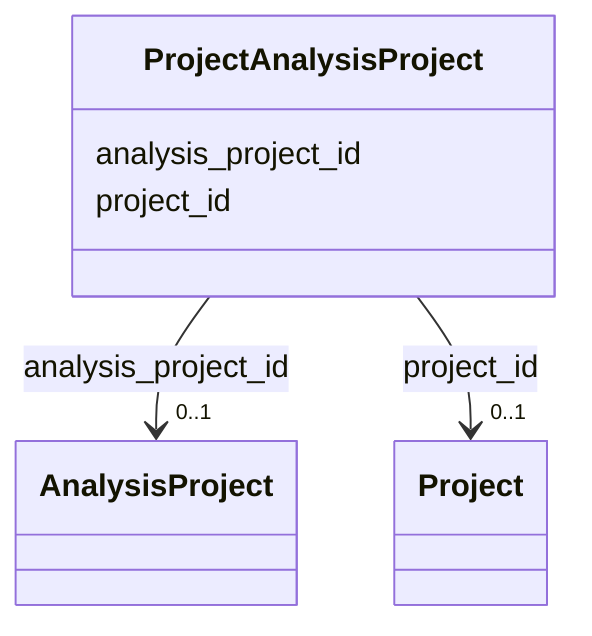

# Class: ProjectAnalysisProject 


URI: [gold:ProjectAnalysisProject](https://w3id.org/jgi/gold/ProjectAnalysisProject)





<!-- no inheritance hierarchy -->


## Slots

| Name | Cardinality and Range | Description | Inheritance |
| ---  | --- | --- | --- |
| [project_id](project_id.md) | 0..1 <br/> [Project](Project.md) | Foreign key to project | direct |
| [analysis_project_id](analysis_project_id.md) | 0..1 <br/> [AnalysisProject](AnalysisProject.md) | Foreign key to analysis_project | direct |


## Identifier and Mapping Information


### Schema Source


* from schema: https://w3id.org/jgi/gold


## Mappings

| Mapping Type | Mapped Value |
| ---  | ---  |
| self | gold:ProjectAnalysisProject |
| native | gold:ProjectAnalysisProject |


## LinkML Source

<!-- TODO: investigate https://stackoverflow.com/questions/37606292/how-to-create-tabbed-code-blocks-in-mkdocs-or-sphinx -->

### Direct

<details>
```yaml
name: project_analysis_project
from_schema: https://w3id.org/jgi/gold
attributes:
  project_id:
    name: project_id
    description: Foreign key to project
    from_schema: https://w3id.org/jgi/gold
    domain_of:
    - project
    - project_analysis_project
    - sra_experiment_v2
    range: project
    required: false
  analysis_project_id:
    name: analysis_project_id
    description: Foreign key to analysis_project
    from_schema: https://w3id.org/jgi/gold
    domain_of:
    - analysis_project
    - analysis_project_publication
    - analysis_project_sra_run_v2
    - assembly
    - dw_analysis_project
    - project_analysis_project
    - sigs_view
    range: analysis_project
    required: false

```
</details>

### Induced

<details>
```yaml
name: project_analysis_project
from_schema: https://w3id.org/jgi/gold
attributes:
  project_id:
    name: project_id
    description: Foreign key to project
    from_schema: https://w3id.org/jgi/gold
    alias: project_id
    owner: project_analysis_project
    domain_of:
    - project
    - project_analysis_project
    - sra_experiment_v2
    range: project
    required: false
  analysis_project_id:
    name: analysis_project_id
    description: Foreign key to analysis_project
    from_schema: https://w3id.org/jgi/gold
    alias: analysis_project_id
    owner: project_analysis_project
    domain_of:
    - analysis_project
    - analysis_project_publication
    - analysis_project_sra_run_v2
    - assembly
    - dw_analysis_project
    - project_analysis_project
    - sigs_view
    range: analysis_project
    required: false

```
</details>