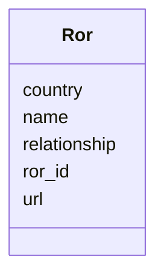

# Class: Ror 


URI: [gold:Ror](https://w3id.org/jgi/gold/Ror)





<!-- no inheritance hierarchy -->


## Slots

| Name | Cardinality and Range | Description | Inheritance |
| ---  | --- | --- | --- |
| [ror_id](ror_id.md) | 0..1 <br/> [String](String.md) |  | direct |
| [name](name.md) | 0..1 <br/> [String](String.md) |  | direct |
| [country](country.md) | 0..1 <br/> [String](String.md) |  | direct |
| [url](url.md) | 0..1 <br/> [String](String.md) |  | direct |
| [relationship](relationship.md) | 0..1 <br/> [String](String.md) |  | direct |


## Identifier and Mapping Information


### Schema Source


* from schema: https://w3id.org/jgi/gold


## Mappings

| Mapping Type | Mapped Value |
| ---  | ---  |
| self | gold:Ror |
| native | gold:Ror |


## LinkML Source

<!-- TODO: investigate https://stackoverflow.com/questions/37606292/how-to-create-tabbed-code-blocks-in-mkdocs-or-sphinx -->

### Direct

<details>
```yaml
name: ror
from_schema: https://w3id.org/jgi/gold
attributes:
  ror_id:
    name: ror_id
    from_schema: https://w3id.org/jgi/gold
    rank: 1000
    domain_of:
    - ror
    range: string
    required: false
  name:
    name: name
    from_schema: https://w3id.org/jgi/gold
    domain_of:
    - api_user
    - assembly
    - assembly_method
    - ror
    range: string
    required: false
  country:
    name: country
    from_schema: https://w3id.org/jgi/gold
    rank: 1000
    domain_of:
    - ror
    range: string
    required: false
  url:
    name: url
    from_schema: https://w3id.org/jgi/gold
    rank: 1000
    domain_of:
    - ror
    range: string
    required: false
  relationship:
    name: relationship
    from_schema: https://w3id.org/jgi/gold
    rank: 1000
    domain_of:
    - ror
    range: string
    required: false

```
</details>

### Induced

<details>
```yaml
name: ror
from_schema: https://w3id.org/jgi/gold
attributes:
  ror_id:
    name: ror_id
    from_schema: https://w3id.org/jgi/gold
    rank: 1000
    alias: ror_id
    owner: ror
    domain_of:
    - ror
    range: string
    required: false
  name:
    name: name
    from_schema: https://w3id.org/jgi/gold
    alias: name
    owner: ror
    domain_of:
    - api_user
    - assembly
    - assembly_method
    - ror
    range: string
    required: false
  country:
    name: country
    from_schema: https://w3id.org/jgi/gold
    rank: 1000
    alias: country
    owner: ror
    domain_of:
    - ror
    range: string
    required: false
  url:
    name: url
    from_schema: https://w3id.org/jgi/gold
    rank: 1000
    alias: url
    owner: ror
    domain_of:
    - ror
    range: string
    required: false
  relationship:
    name: relationship
    from_schema: https://w3id.org/jgi/gold
    rank: 1000
    alias: relationship
    owner: ror
    domain_of:
    - ror
    range: string
    required: false

```
</details>