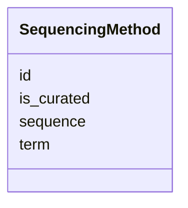

# Class: SequencingMethod 


URI: [gold:SequencingMethod](https://w3id.org/jgi/gold/SequencingMethod)





<!-- no inheritance hierarchy -->


## Slots

| Name | Cardinality and Range | Description | Inheritance |
| ---  | --- | --- | --- |
| [id](id.md) | 0..1 <br/> [Float](Float.md) |  | direct |
| [term](term.md) | 0..1 <br/> [String](String.md) |  | direct |
| [sequence](sequence.md) | 0..1 <br/> [Float](Float.md) |  | direct |
| [is_curated](is_curated.md) | 0..1 <br/> [String](String.md) |  | direct |


## Usages

| used by | used in | type | used |
| ---  | --- | --- | --- |
| [SraExperimentV2](SraExperimentV2.md) | [sequencing_method_id](sequencing_method_id.md) | range | [SequencingMethod](SequencingMethod.md) |


## Identifier and Mapping Information


### Schema Source


* from schema: https://w3id.org/jgi/gold


## Mappings

| Mapping Type | Mapped Value |
| ---  | ---  |
| self | gold:SequencingMethod |
| native | gold:SequencingMethod |


## LinkML Source

<!-- TODO: investigate https://stackoverflow.com/questions/37606292/how-to-create-tabbed-code-blocks-in-mkdocs-or-sphinx -->

### Direct

<details>
```yaml
name: sequencing_method
from_schema: https://w3id.org/jgi/gold
attributes:
  id:
    name: id
    from_schema: https://w3id.org/jgi/gold
    domain_of:
    - cvaerospace_struc
    - cvap_status
    - cvcolor
    - cvdisease
    - cvdoor_type_wood
    - cvhabitat
    - cvmodel
    - cvorganism_type
    - excel
    - gold_master_sequencing_method
    - sequencing_method
    range: float
    required: false
  term:
    name: term
    from_schema: https://w3id.org/jgi/gold
    domain_of:
    - cvaerospace_struc
    - cvap_status
    - cvcolor
    - cvdisease
    - cvdoor_type_wood
    - cvhabitat
    - cvmodel
    - cvorganism_type
    - gold_master_sequencing_method
    - sequencing_method
    range: string
    required: false
  sequence:
    name: sequence
    from_schema: https://w3id.org/jgi/gold
    domain_of:
    - cvaerospace_struc
    - cvap_status
    - cvcolor
    - cvdisease
    - cvdoor_type_wood
    - cvhabitat
    - cvmodel
    - cvorganism_type
    - sequencing_method
    range: float
    required: false
  is_curated:
    name: is_curated
    from_schema: https://w3id.org/jgi/gold
    rank: 1000
    domain_of:
    - sequencing_method
    range: string
    required: false

```
</details>

### Induced

<details>
```yaml
name: sequencing_method
from_schema: https://w3id.org/jgi/gold
attributes:
  id:
    name: id
    from_schema: https://w3id.org/jgi/gold
    alias: id
    owner: sequencing_method
    domain_of:
    - cvaerospace_struc
    - cvap_status
    - cvcolor
    - cvdisease
    - cvdoor_type_wood
    - cvhabitat
    - cvmodel
    - cvorganism_type
    - excel
    - gold_master_sequencing_method
    - sequencing_method
    range: float
    required: false
  term:
    name: term
    from_schema: https://w3id.org/jgi/gold
    alias: term
    owner: sequencing_method
    domain_of:
    - cvaerospace_struc
    - cvap_status
    - cvcolor
    - cvdisease
    - cvdoor_type_wood
    - cvhabitat
    - cvmodel
    - cvorganism_type
    - gold_master_sequencing_method
    - sequencing_method
    range: string
    required: false
  sequence:
    name: sequence
    from_schema: https://w3id.org/jgi/gold
    alias: sequence
    owner: sequencing_method
    domain_of:
    - cvaerospace_struc
    - cvap_status
    - cvcolor
    - cvdisease
    - cvdoor_type_wood
    - cvhabitat
    - cvmodel
    - cvorganism_type
    - sequencing_method
    range: float
    required: false
  is_curated:
    name: is_curated
    from_schema: https://w3id.org/jgi/gold
    rank: 1000
    alias: is_curated
    owner: sequencing_method
    domain_of:
    - sequencing_method
    range: string
    required: false

```
</details>