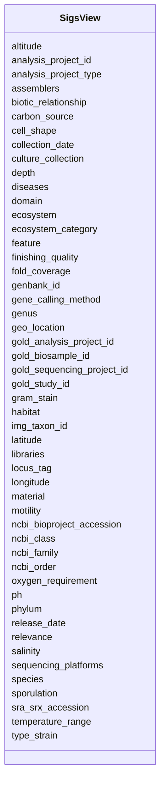

# Class: SigsView 


URI: [gold:SigsView](https://w3id.org/jgi/gold/SigsView)





<!-- no inheritance hierarchy -->


## Slots

| Name | Cardinality and Range | Description | Inheritance |
| ---  | --- | --- | --- |
| [analysis_project_id](analysis_project_id.md) | 0..1 <br/> [Float](Float.md) |  | direct |
| [analysis_project_type](analysis_project_type.md) | 0..1 <br/> [String](String.md) |  | direct |
| [gold_study_id](gold_study_id.md) | 0..1 <br/> [String](String.md) |  | direct |
| [gold_sequencing_project_id](gold_sequencing_project_id.md) | 0..1 <br/> [String](String.md) |  | direct |
| [gold_analysis_project_id](gold_analysis_project_id.md) | 0..1 <br/> [String](String.md) |  | direct |
| [gold_biosample_id](gold_biosample_id.md) | 0..1 <br/> [String](String.md) |  | direct |
| [img_taxon_id](img_taxon_id.md) | 0..1 <br/> [Float](Float.md) |  | direct |
| [sra_srx_accession](sra_srx_accession.md) | 0..1 <br/> [String](String.md) |  | direct |
| [ncbi_bioproject_accession](ncbi_bioproject_accession.md) | 0..1 <br/> [String](String.md) |  | direct |
| [altitude](altitude.md) | 0..1 <br/> [Float](Float.md) |  | direct |
| [depth](depth.md) | 0..1 <br/> [Float](Float.md) |  | direct |
| [ecosystem](ecosystem.md) | 0..1 <br/> [String](String.md) |  | direct |
| [ecosystem_category](ecosystem_category.md) | 0..1 <br/> [String](String.md) |  | direct |
| [latitude](latitude.md) | 0..1 <br/> [Float](Float.md) |  | direct |
| [longitude](longitude.md) | 0..1 <br/> [Float](Float.md) |  | direct |
| [geo_location](geo_location.md) | 0..1 <br/> [String](String.md) |  | direct |
| [feature](feature.md) | 0..1 <br/> [String](String.md) |  | direct |
| [collection_date](collection_date.md) | 0..1 <br/> [String](String.md) |  | direct |
| [relevance](relevance.md) | 0..1 <br/> [String](String.md) |  | direct |
| [material](material.md) | 0..1 <br/> [String](String.md) |  | direct |
| [domain](domain.md) | 0..1 <br/> [String](String.md) |  | direct |
| [phylum](phylum.md) | 0..1 <br/> [String](String.md) |  | direct |
| [ncbi_class](ncbi_class.md) | 0..1 <br/> [String](String.md) |  | direct |
| [ncbi_order](ncbi_order.md) | 0..1 <br/> [String](String.md) |  | direct |
| [ncbi_family](ncbi_family.md) | 0..1 <br/> [String](String.md) |  | direct |
| [genus](genus.md) | 0..1 <br/> [String](String.md) |  | direct |
| [species](species.md) | 0..1 <br/> [String](String.md) |  | direct |
| [gram_stain](gram_stain.md) | 0..1 <br/> [String](String.md) |  | direct |
| [cell_shape](cell_shape.md) | 0..1 <br/> [String](String.md) |  | direct |
| [motility](motility.md) | 0..1 <br/> [String](String.md) |  | direct |
| [sporulation](sporulation.md) | 0..1 <br/> [String](String.md) |  | direct |
| [temperature_range](temperature_range.md) | 0..1 <br/> [String](String.md) |  | direct |
| [ph](ph.md) | 0..1 <br/> [String](String.md) |  | direct |
| [carbon_source](carbon_source.md) | 0..1 <br/> [String](String.md) |  | direct |
| [habitat](habitat.md) | 0..1 <br/> [String](String.md) |  | direct |
| [salinity](salinity.md) | 0..1 <br/> [String](String.md) |  | direct |
| [biotic_relationship](biotic_relationship.md) | 0..1 <br/> [String](String.md) |  | direct |
| [oxygen_requirement](oxygen_requirement.md) | 0..1 <br/> [String](String.md) |  | direct |
| [libraries](libraries.md) | 0..1 <br/> [String](String.md) |  | direct |
| [finishing_quality](finishing_quality.md) | 0..1 <br/> [String](String.md) |  | direct |
| [sequencing_platforms](sequencing_platforms.md) | 0..1 <br/> [String](String.md) |  | direct |
| [fold_coverage](fold_coverage.md) | 0..1 <br/> [String](String.md) |  | direct |
| [gene_calling_method](gene_calling_method.md) | 0..1 <br/> [String](String.md) |  | direct |
| [assemblers](assemblers.md) | 0..1 <br/> [String](String.md) |  | direct |
| [locus_tag](locus_tag.md) | 0..1 <br/> [String](String.md) |  | direct |
| [genbank_id](genbank_id.md) | 0..1 <br/> [String](String.md) |  | direct |
| [release_date](release_date.md) | 0..1 <br/> [Datetime](Datetime.md) |  | direct |
| [culture_collection](culture_collection.md) | 0..1 <br/> [String](String.md) |  | direct |
| [type_strain](type_strain.md) | 0..1 <br/> [String](String.md) |  | direct |
| [diseases](diseases.md) | 0..1 <br/> [String](String.md) |  | direct |


## Identifier and Mapping Information


### Schema Source


* from schema: https://w3id.org/jgi/gold


## Mappings

| Mapping Type | Mapped Value |
| ---  | ---  |
| self | gold:SigsView |
| native | gold:SigsView |


## LinkML Source

<!-- TODO: investigate https://stackoverflow.com/questions/37606292/how-to-create-tabbed-code-blocks-in-mkdocs-or-sphinx -->

### Direct

<details>
```yaml
name: sigs_view
from_schema: https://w3id.org/jgi/gold
attributes:
  analysis_project_id:
    name: analysis_project_id
    from_schema: https://w3id.org/jgi/gold
    domain_of:
    - analysis_project
    - analysis_project_publication
    - analysis_project_sra_run_v2
    - assembly
    - dw_analysis_project
    - project_analysis_project
    - sigs_view
    range: float
    required: false
  analysis_project_type:
    name: analysis_project_type
    from_schema: https://w3id.org/jgi/gold
    domain_of:
    - analysis_project
    - sigs_view
    range: string
    required: false
  gold_study_id:
    name: gold_study_id
    from_schema: https://w3id.org/jgi/gold
    rank: 1000
    domain_of:
    - sigs_view
    range: string
    required: false
  gold_sequencing_project_id:
    name: gold_sequencing_project_id
    from_schema: https://w3id.org/jgi/gold
    rank: 1000
    domain_of:
    - sigs_view
    range: string
    required: false
  gold_analysis_project_id:
    name: gold_analysis_project_id
    from_schema: https://w3id.org/jgi/gold
    rank: 1000
    domain_of:
    - sigs_view
    range: string
    required: false
  gold_biosample_id:
    name: gold_biosample_id
    from_schema: https://w3id.org/jgi/gold
    rank: 1000
    domain_of:
    - sigs_view
    range: string
    required: false
  img_taxon_id:
    name: img_taxon_id
    from_schema: https://w3id.org/jgi/gold
    domain_of:
    - analysis_project
    - sigs_view
    range: float
    required: false
  sra_srx_accession:
    name: sra_srx_accession
    from_schema: https://w3id.org/jgi/gold
    domain_of:
    - project
    - sigs_view
    range: string
    required: false
  ncbi_bioproject_accession:
    name: ncbi_bioproject_accession
    from_schema: https://w3id.org/jgi/gold
    domain_of:
    - analysis_project
    - project
    - sigs_view
    range: string
    required: false
  altitude:
    name: altitude
    from_schema: https://w3id.org/jgi/gold
    domain_of:
    - biosample
    - organism_v2
    - sigs_view
    range: float
    required: false
  depth:
    name: depth
    from_schema: https://w3id.org/jgi/gold
    domain_of:
    - biosample
    - organism_v2
    - sigs_view
    range: float
    required: false
  ecosystem:
    name: ecosystem
    from_schema: https://w3id.org/jgi/gold
    domain_of:
    - analysis_project
    - biosample
    - organism_v2
    - sigs_view
    - study
    range: string
    required: false
  ecosystem_category:
    name: ecosystem_category
    from_schema: https://w3id.org/jgi/gold
    domain_of:
    - analysis_project
    - biosample
    - organism_v2
    - sigs_view
    - study
    range: string
    required: false
  latitude:
    name: latitude
    from_schema: https://w3id.org/jgi/gold
    domain_of:
    - biosample
    - organism_v2
    - sigs_view
    range: float
    required: false
  longitude:
    name: longitude
    from_schema: https://w3id.org/jgi/gold
    domain_of:
    - biosample
    - organism_v2
    - sigs_view
    range: float
    required: false
  geo_location:
    name: geo_location
    from_schema: https://w3id.org/jgi/gold
    rank: 1000
    domain_of:
    - sigs_view
    range: string
    required: false
  feature:
    name: feature
    from_schema: https://w3id.org/jgi/gold
    rank: 1000
    domain_of:
    - sigs_view
    range: string
    required: false
  collection_date:
    name: collection_date
    from_schema: https://w3id.org/jgi/gold
    rank: 1000
    domain_of:
    - sigs_view
    range: string
    required: false
  relevance:
    name: relevance
    from_schema: https://w3id.org/jgi/gold
    rank: 1000
    domain_of:
    - sigs_view
    range: string
    required: false
  material:
    name: material
    from_schema: https://w3id.org/jgi/gold
    rank: 1000
    domain_of:
    - sigs_view
    range: string
    required: false
  domain:
    name: domain
    from_schema: https://w3id.org/jgi/gold
    domain_of:
    - analysis_project
    - organism_v2
    - sigs_view
    range: string
    required: false
  phylum:
    name: phylum
    from_schema: https://w3id.org/jgi/gold
    rank: 1000
    domain_of:
    - sigs_view
    range: string
    required: false
  ncbi_class:
    name: ncbi_class
    from_schema: https://w3id.org/jgi/gold
    domain_of:
    - analysis_project
    - ncbi_taxonomy
    - organism_v2
    - sigs_view
    range: string
    required: false
  ncbi_order:
    name: ncbi_order
    from_schema: https://w3id.org/jgi/gold
    domain_of:
    - analysis_project
    - ncbi_taxonomy
    - organism_v2
    - sigs_view
    range: string
    required: false
  ncbi_family:
    name: ncbi_family
    from_schema: https://w3id.org/jgi/gold
    domain_of:
    - analysis_project
    - ncbi_taxonomy
    - organism_v2
    - sigs_view
    range: string
    required: false
  genus:
    name: genus
    from_schema: https://w3id.org/jgi/gold
    domain_of:
    - analysis_project
    - organism_v2
    - sigs_view
    range: string
    required: false
  species:
    name: species
    from_schema: https://w3id.org/jgi/gold
    domain_of:
    - analysis_project
    - organism_v2
    - sigs_view
    range: string
    required: false
  gram_stain:
    name: gram_stain
    from_schema: https://w3id.org/jgi/gold
    domain_of:
    - organism_v2
    - sigs_view
    range: string
    required: false
  cell_shape:
    name: cell_shape
    from_schema: https://w3id.org/jgi/gold
    domain_of:
    - organism_v2
    - sigs_view
    range: string
    required: false
  motility:
    name: motility
    from_schema: https://w3id.org/jgi/gold
    domain_of:
    - organism_v2
    - sigs_view
    range: string
    required: false
  sporulation:
    name: sporulation
    from_schema: https://w3id.org/jgi/gold
    domain_of:
    - organism_v2
    - sigs_view
    range: string
    required: false
  temperature_range:
    name: temperature_range
    from_schema: https://w3id.org/jgi/gold
    domain_of:
    - organism_v2
    - sigs_view
    range: string
    required: false
  ph:
    name: ph
    from_schema: https://w3id.org/jgi/gold
    domain_of:
    - biosample
    - organism_v2
    - sigs_view
    range: string
    required: false
  carbon_source:
    name: carbon_source
    from_schema: https://w3id.org/jgi/gold
    domain_of:
    - organism_v2
    - sigs_view
    range: string
    required: false
  habitat:
    name: habitat
    from_schema: https://w3id.org/jgi/gold
    domain_of:
    - biosample
    - sigs_view
    range: string
    required: false
  salinity:
    name: salinity
    from_schema: https://w3id.org/jgi/gold
    domain_of:
    - biosample
    - organism_v2
    - sigs_view
    range: string
    required: false
  biotic_relationship:
    name: biotic_relationship
    from_schema: https://w3id.org/jgi/gold
    rank: 1000
    domain_of:
    - sigs_view
    range: string
    required: false
  oxygen_requirement:
    name: oxygen_requirement
    from_schema: https://w3id.org/jgi/gold
    domain_of:
    - organism_v2
    - sigs_view
    range: string
    required: false
  libraries:
    name: libraries
    from_schema: https://w3id.org/jgi/gold
    rank: 1000
    domain_of:
    - sigs_view
    range: string
    required: false
  finishing_quality:
    name: finishing_quality
    from_schema: https://w3id.org/jgi/gold
    rank: 1000
    domain_of:
    - sigs_view
    range: string
    required: false
  sequencing_platforms:
    name: sequencing_platforms
    from_schema: https://w3id.org/jgi/gold
    rank: 1000
    domain_of:
    - sigs_view
    range: string
    required: false
  fold_coverage:
    name: fold_coverage
    from_schema: https://w3id.org/jgi/gold
    rank: 1000
    domain_of:
    - sigs_view
    range: string
    required: false
  gene_calling_method:
    name: gene_calling_method
    from_schema: https://w3id.org/jgi/gold
    domain_of:
    - analysis_project
    - sigs_view
    range: string
    required: false
  assemblers:
    name: assemblers
    from_schema: https://w3id.org/jgi/gold
    rank: 1000
    domain_of:
    - sigs_view
    range: string
    required: false
  locus_tag:
    name: locus_tag
    from_schema: https://w3id.org/jgi/gold
    rank: 1000
    domain_of:
    - sigs_view
    range: string
    required: false
  genbank_id:
    name: genbank_id
    from_schema: https://w3id.org/jgi/gold
    domain_of:
    - ncbi_genbank
    - sigs_view
    range: string
    required: false
  release_date:
    name: release_date
    from_schema: https://w3id.org/jgi/gold
    domain_of:
    - assembly
    - sigs_view
    range: datetime
    required: false
  culture_collection:
    name: culture_collection
    from_schema: https://w3id.org/jgi/gold
    domain_of:
    - analysis_project
    - sigs_view
    range: string
    required: false
  type_strain:
    name: type_strain
    from_schema: https://w3id.org/jgi/gold
    domain_of:
    - organism_v2
    - sigs_view
    range: string
    required: false
  diseases:
    name: diseases
    from_schema: https://w3id.org/jgi/gold
    rank: 1000
    domain_of:
    - sigs_view
    range: string
    required: false

```
</details>

### Induced

<details>
```yaml
name: sigs_view
from_schema: https://w3id.org/jgi/gold
attributes:
  analysis_project_id:
    name: analysis_project_id
    from_schema: https://w3id.org/jgi/gold
    alias: analysis_project_id
    owner: sigs_view
    domain_of:
    - analysis_project
    - analysis_project_publication
    - analysis_project_sra_run_v2
    - assembly
    - dw_analysis_project
    - project_analysis_project
    - sigs_view
    range: float
    required: false
  analysis_project_type:
    name: analysis_project_type
    from_schema: https://w3id.org/jgi/gold
    alias: analysis_project_type
    owner: sigs_view
    domain_of:
    - analysis_project
    - sigs_view
    range: string
    required: false
  gold_study_id:
    name: gold_study_id
    from_schema: https://w3id.org/jgi/gold
    rank: 1000
    alias: gold_study_id
    owner: sigs_view
    domain_of:
    - sigs_view
    range: string
    required: false
  gold_sequencing_project_id:
    name: gold_sequencing_project_id
    from_schema: https://w3id.org/jgi/gold
    rank: 1000
    alias: gold_sequencing_project_id
    owner: sigs_view
    domain_of:
    - sigs_view
    range: string
    required: false
  gold_analysis_project_id:
    name: gold_analysis_project_id
    from_schema: https://w3id.org/jgi/gold
    rank: 1000
    alias: gold_analysis_project_id
    owner: sigs_view
    domain_of:
    - sigs_view
    range: string
    required: false
  gold_biosample_id:
    name: gold_biosample_id
    from_schema: https://w3id.org/jgi/gold
    rank: 1000
    alias: gold_biosample_id
    owner: sigs_view
    domain_of:
    - sigs_view
    range: string
    required: false
  img_taxon_id:
    name: img_taxon_id
    from_schema: https://w3id.org/jgi/gold
    alias: img_taxon_id
    owner: sigs_view
    domain_of:
    - analysis_project
    - sigs_view
    range: float
    required: false
  sra_srx_accession:
    name: sra_srx_accession
    from_schema: https://w3id.org/jgi/gold
    alias: sra_srx_accession
    owner: sigs_view
    domain_of:
    - project
    - sigs_view
    range: string
    required: false
  ncbi_bioproject_accession:
    name: ncbi_bioproject_accession
    from_schema: https://w3id.org/jgi/gold
    alias: ncbi_bioproject_accession
    owner: sigs_view
    domain_of:
    - analysis_project
    - project
    - sigs_view
    range: string
    required: false
  altitude:
    name: altitude
    from_schema: https://w3id.org/jgi/gold
    alias: altitude
    owner: sigs_view
    domain_of:
    - biosample
    - organism_v2
    - sigs_view
    range: float
    required: false
  depth:
    name: depth
    from_schema: https://w3id.org/jgi/gold
    alias: depth
    owner: sigs_view
    domain_of:
    - biosample
    - organism_v2
    - sigs_view
    range: float
    required: false
  ecosystem:
    name: ecosystem
    from_schema: https://w3id.org/jgi/gold
    alias: ecosystem
    owner: sigs_view
    domain_of:
    - analysis_project
    - biosample
    - organism_v2
    - sigs_view
    - study
    range: string
    required: false
  ecosystem_category:
    name: ecosystem_category
    from_schema: https://w3id.org/jgi/gold
    alias: ecosystem_category
    owner: sigs_view
    domain_of:
    - analysis_project
    - biosample
    - organism_v2
    - sigs_view
    - study
    range: string
    required: false
  latitude:
    name: latitude
    from_schema: https://w3id.org/jgi/gold
    alias: latitude
    owner: sigs_view
    domain_of:
    - biosample
    - organism_v2
    - sigs_view
    range: float
    required: false
  longitude:
    name: longitude
    from_schema: https://w3id.org/jgi/gold
    alias: longitude
    owner: sigs_view
    domain_of:
    - biosample
    - organism_v2
    - sigs_view
    range: float
    required: false
  geo_location:
    name: geo_location
    from_schema: https://w3id.org/jgi/gold
    rank: 1000
    alias: geo_location
    owner: sigs_view
    domain_of:
    - sigs_view
    range: string
    required: false
  feature:
    name: feature
    from_schema: https://w3id.org/jgi/gold
    rank: 1000
    alias: feature
    owner: sigs_view
    domain_of:
    - sigs_view
    range: string
    required: false
  collection_date:
    name: collection_date
    from_schema: https://w3id.org/jgi/gold
    rank: 1000
    alias: collection_date
    owner: sigs_view
    domain_of:
    - sigs_view
    range: string
    required: false
  relevance:
    name: relevance
    from_schema: https://w3id.org/jgi/gold
    rank: 1000
    alias: relevance
    owner: sigs_view
    domain_of:
    - sigs_view
    range: string
    required: false
  material:
    name: material
    from_schema: https://w3id.org/jgi/gold
    rank: 1000
    alias: material
    owner: sigs_view
    domain_of:
    - sigs_view
    range: string
    required: false
  domain:
    name: domain
    from_schema: https://w3id.org/jgi/gold
    alias: domain
    owner: sigs_view
    domain_of:
    - analysis_project
    - organism_v2
    - sigs_view
    range: string
    required: false
  phylum:
    name: phylum
    from_schema: https://w3id.org/jgi/gold
    rank: 1000
    alias: phylum
    owner: sigs_view
    domain_of:
    - sigs_view
    range: string
    required: false
  ncbi_class:
    name: ncbi_class
    from_schema: https://w3id.org/jgi/gold
    alias: ncbi_class
    owner: sigs_view
    domain_of:
    - analysis_project
    - ncbi_taxonomy
    - organism_v2
    - sigs_view
    range: string
    required: false
  ncbi_order:
    name: ncbi_order
    from_schema: https://w3id.org/jgi/gold
    alias: ncbi_order
    owner: sigs_view
    domain_of:
    - analysis_project
    - ncbi_taxonomy
    - organism_v2
    - sigs_view
    range: string
    required: false
  ncbi_family:
    name: ncbi_family
    from_schema: https://w3id.org/jgi/gold
    alias: ncbi_family
    owner: sigs_view
    domain_of:
    - analysis_project
    - ncbi_taxonomy
    - organism_v2
    - sigs_view
    range: string
    required: false
  genus:
    name: genus
    from_schema: https://w3id.org/jgi/gold
    alias: genus
    owner: sigs_view
    domain_of:
    - analysis_project
    - organism_v2
    - sigs_view
    range: string
    required: false
  species:
    name: species
    from_schema: https://w3id.org/jgi/gold
    alias: species
    owner: sigs_view
    domain_of:
    - analysis_project
    - organism_v2
    - sigs_view
    range: string
    required: false
  gram_stain:
    name: gram_stain
    from_schema: https://w3id.org/jgi/gold
    alias: gram_stain
    owner: sigs_view
    domain_of:
    - organism_v2
    - sigs_view
    range: string
    required: false
  cell_shape:
    name: cell_shape
    from_schema: https://w3id.org/jgi/gold
    alias: cell_shape
    owner: sigs_view
    domain_of:
    - organism_v2
    - sigs_view
    range: string
    required: false
  motility:
    name: motility
    from_schema: https://w3id.org/jgi/gold
    alias: motility
    owner: sigs_view
    domain_of:
    - organism_v2
    - sigs_view
    range: string
    required: false
  sporulation:
    name: sporulation
    from_schema: https://w3id.org/jgi/gold
    alias: sporulation
    owner: sigs_view
    domain_of:
    - organism_v2
    - sigs_view
    range: string
    required: false
  temperature_range:
    name: temperature_range
    from_schema: https://w3id.org/jgi/gold
    alias: temperature_range
    owner: sigs_view
    domain_of:
    - organism_v2
    - sigs_view
    range: string
    required: false
  ph:
    name: ph
    from_schema: https://w3id.org/jgi/gold
    alias: ph
    owner: sigs_view
    domain_of:
    - biosample
    - organism_v2
    - sigs_view
    range: string
    required: false
  carbon_source:
    name: carbon_source
    from_schema: https://w3id.org/jgi/gold
    alias: carbon_source
    owner: sigs_view
    domain_of:
    - organism_v2
    - sigs_view
    range: string
    required: false
  habitat:
    name: habitat
    from_schema: https://w3id.org/jgi/gold
    alias: habitat
    owner: sigs_view
    domain_of:
    - biosample
    - sigs_view
    range: string
    required: false
  salinity:
    name: salinity
    from_schema: https://w3id.org/jgi/gold
    alias: salinity
    owner: sigs_view
    domain_of:
    - biosample
    - organism_v2
    - sigs_view
    range: string
    required: false
  biotic_relationship:
    name: biotic_relationship
    from_schema: https://w3id.org/jgi/gold
    rank: 1000
    alias: biotic_relationship
    owner: sigs_view
    domain_of:
    - sigs_view
    range: string
    required: false
  oxygen_requirement:
    name: oxygen_requirement
    from_schema: https://w3id.org/jgi/gold
    alias: oxygen_requirement
    owner: sigs_view
    domain_of:
    - organism_v2
    - sigs_view
    range: string
    required: false
  libraries:
    name: libraries
    from_schema: https://w3id.org/jgi/gold
    rank: 1000
    alias: libraries
    owner: sigs_view
    domain_of:
    - sigs_view
    range: string
    required: false
  finishing_quality:
    name: finishing_quality
    from_schema: https://w3id.org/jgi/gold
    rank: 1000
    alias: finishing_quality
    owner: sigs_view
    domain_of:
    - sigs_view
    range: string
    required: false
  sequencing_platforms:
    name: sequencing_platforms
    from_schema: https://w3id.org/jgi/gold
    rank: 1000
    alias: sequencing_platforms
    owner: sigs_view
    domain_of:
    - sigs_view
    range: string
    required: false
  fold_coverage:
    name: fold_coverage
    from_schema: https://w3id.org/jgi/gold
    rank: 1000
    alias: fold_coverage
    owner: sigs_view
    domain_of:
    - sigs_view
    range: string
    required: false
  gene_calling_method:
    name: gene_calling_method
    from_schema: https://w3id.org/jgi/gold
    alias: gene_calling_method
    owner: sigs_view
    domain_of:
    - analysis_project
    - sigs_view
    range: string
    required: false
  assemblers:
    name: assemblers
    from_schema: https://w3id.org/jgi/gold
    rank: 1000
    alias: assemblers
    owner: sigs_view
    domain_of:
    - sigs_view
    range: string
    required: false
  locus_tag:
    name: locus_tag
    from_schema: https://w3id.org/jgi/gold
    rank: 1000
    alias: locus_tag
    owner: sigs_view
    domain_of:
    - sigs_view
    range: string
    required: false
  genbank_id:
    name: genbank_id
    from_schema: https://w3id.org/jgi/gold
    alias: genbank_id
    owner: sigs_view
    domain_of:
    - ncbi_genbank
    - sigs_view
    range: string
    required: false
  release_date:
    name: release_date
    from_schema: https://w3id.org/jgi/gold
    alias: release_date
    owner: sigs_view
    domain_of:
    - assembly
    - sigs_view
    range: datetime
    required: false
  culture_collection:
    name: culture_collection
    from_schema: https://w3id.org/jgi/gold
    alias: culture_collection
    owner: sigs_view
    domain_of:
    - analysis_project
    - sigs_view
    range: string
    required: false
  type_strain:
    name: type_strain
    from_schema: https://w3id.org/jgi/gold
    alias: type_strain
    owner: sigs_view
    domain_of:
    - organism_v2
    - sigs_view
    range: string
    required: false
  diseases:
    name: diseases
    from_schema: https://w3id.org/jgi/gold
    rank: 1000
    alias: diseases
    owner: sigs_view
    domain_of:
    - sigs_view
    range: string
    required: false

```
</details>