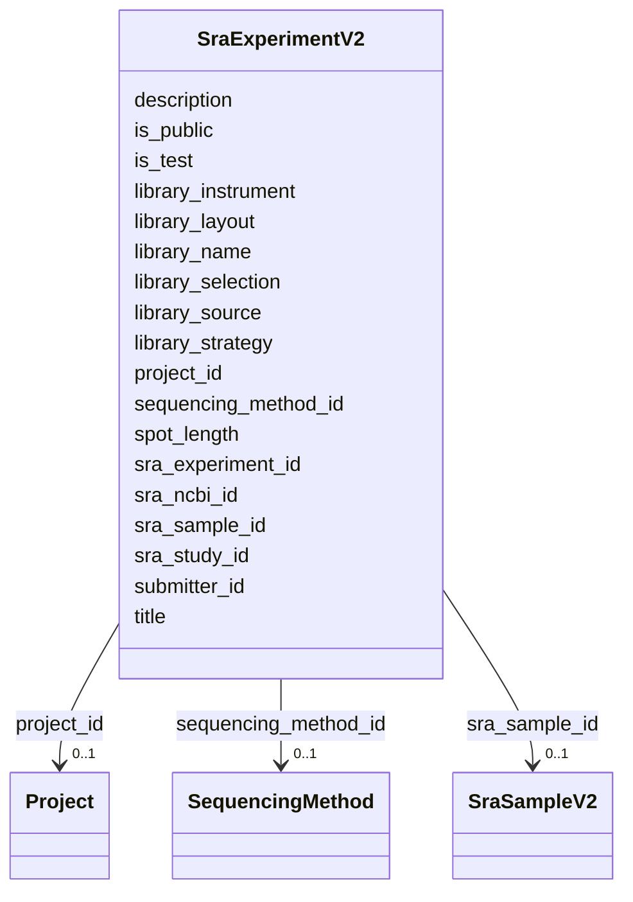

# Class: SraExperimentV2 


URI: [gold:SraExperimentV2](https://w3id.org/jgi/gold/SraExperimentV2)





<!-- no inheritance hierarchy -->


## Slots

| Name | Cardinality and Range | Description | Inheritance |
| ---  | --- | --- | --- |
| [sra_experiment_id](sra_experiment_id.md) | 0..1 <br/> [String](String.md) |  | direct |
| [project_id](project_id.md) | 0..1 <br/> [Project](Project.md) | Foreign key to project | direct |
| [sra_sample_id](sra_sample_id.md) | 0..1 <br/> [SraSampleV2](SraSampleV2.md) | Foreign key to sra_sample_v2 | direct |
| [sra_ncbi_id](sra_ncbi_id.md) | 0..1 <br/> [Float](Float.md) |  | direct |
| [sequencing_method_id](sequencing_method_id.md) | 0..1 <br/> [SequencingMethod](SequencingMethod.md) | Foreign key to sequencing_method | direct |
| [title](title.md) | 0..1 <br/> [String](String.md) |  | direct |
| [description](description.md) | 0..1 <br/> [String](String.md) |  | direct |
| [submitter_id](submitter_id.md) | 0..1 <br/> [Float](Float.md) |  | direct |
| [library_strategy](library_strategy.md) | 0..1 <br/> [String](String.md) |  | direct |
| [library_source](library_source.md) | 0..1 <br/> [String](String.md) |  | direct |
| [library_selection](library_selection.md) | 0..1 <br/> [String](String.md) |  | direct |
| [library_name](library_name.md) | 0..1 <br/> [String](String.md) |  | direct |
| [library_layout](library_layout.md) | 0..1 <br/> [String](String.md) |  | direct |
| [library_instrument](library_instrument.md) | 0..1 <br/> [String](String.md) |  | direct |
| [is_public](is_public.md) | 0..1 <br/> [String](String.md) |  | direct |
| [is_test](is_test.md) | 0..1 <br/> [String](String.md) |  | direct |
| [sra_study_id](sra_study_id.md) | 0..1 <br/> [String](String.md) |  | direct |
| [spot_length](spot_length.md) | 0..1 <br/> [Float](Float.md) |  | direct |


## Identifier and Mapping Information


### Schema Source


* from schema: https://w3id.org/jgi/gold


## Mappings

| Mapping Type | Mapped Value |
| ---  | ---  |
| self | gold:SraExperimentV2 |
| native | gold:SraExperimentV2 |


## LinkML Source

<!-- TODO: investigate https://stackoverflow.com/questions/37606292/how-to-create-tabbed-code-blocks-in-mkdocs-or-sphinx -->

### Direct

<details>
```yaml
name: sra_experiment_v2
from_schema: https://w3id.org/jgi/gold
attributes:
  sra_experiment_id:
    name: sra_experiment_id
    from_schema: https://w3id.org/jgi/gold
    domain_of:
    - ncbi_raw_sra_run
    - sra_experiment_v2
    range: string
    required: false
  project_id:
    name: project_id
    description: Foreign key to project
    from_schema: https://w3id.org/jgi/gold
    domain_of:
    - project
    - project_analysis_project
    - sra_experiment_v2
    range: project
    required: false
  sra_sample_id:
    name: sra_sample_id
    description: Foreign key to sra_sample_v2
    from_schema: https://w3id.org/jgi/gold
    rank: 1000
    domain_of:
    - sra_experiment_v2
    - sra_sample_v2
    range: sra_sample_v2
    required: false
  sra_ncbi_id:
    name: sra_ncbi_id
    from_schema: https://w3id.org/jgi/gold
    rank: 1000
    domain_of:
    - sra_experiment_v2
    range: float
    required: false
  sequencing_method_id:
    name: sequencing_method_id
    description: Foreign key to sequencing_method
    from_schema: https://w3id.org/jgi/gold
    rank: 1000
    domain_of:
    - sra_experiment_v2
    range: sequencing_method
    required: false
  title:
    name: title
    from_schema: https://w3id.org/jgi/gold
    domain_of:
    - excel
    - ncbi_raw_sra_run
    - sra_experiment_v2
    - sra_sample_v2
    range: string
    required: false
  description:
    name: description
    from_schema: https://w3id.org/jgi/gold
    domain_of:
    - biosample
    - dw_sequencing_product
    - ncbi_raw_sra_run
    - project
    - sra_experiment_v2
    - study
    range: string
    required: false
  submitter_id:
    name: submitter_id
    from_schema: https://w3id.org/jgi/gold
    domain_of:
    - biosample
    - organism_v2
    - project
    - sra_experiment_v2
    range: float
    required: false
  library_strategy:
    name: library_strategy
    from_schema: https://w3id.org/jgi/gold
    rank: 1000
    domain_of:
    - sra_experiment_v2
    range: string
    required: false
  library_source:
    name: library_source
    from_schema: https://w3id.org/jgi/gold
    rank: 1000
    domain_of:
    - sra_experiment_v2
    range: string
    required: false
  library_selection:
    name: library_selection
    from_schema: https://w3id.org/jgi/gold
    rank: 1000
    domain_of:
    - sra_experiment_v2
    range: string
    required: false
  library_name:
    name: library_name
    from_schema: https://w3id.org/jgi/gold
    domain_of:
    - assembly
    - sra_experiment_v2
    range: string
    required: false
  library_layout:
    name: library_layout
    from_schema: https://w3id.org/jgi/gold
    domain_of:
    - project
    - sra_experiment_v2
    range: string
    required: false
  library_instrument:
    name: library_instrument
    from_schema: https://w3id.org/jgi/gold
    rank: 1000
    domain_of:
    - sra_experiment_v2
    range: string
    required: false
  is_public:
    name: is_public
    from_schema: https://w3id.org/jgi/gold
    domain_of:
    - analysis_project
    - biosample
    - ncbi_raw_sra_run
    - organism_v2
    - project
    - sra_experiment_v2
    - sra_sample_v2
    - study
    range: string
    required: false
  is_test:
    name: is_test
    from_schema: https://w3id.org/jgi/gold
    domain_of:
    - analysis_project
    - biosample
    - ncbi_raw_sra_run
    - organism_v2
    - project
    - sra_experiment_v2
    - sra_sample_v2
    - study
    range: string
    required: false
  sra_study_id:
    name: sra_study_id
    from_schema: https://w3id.org/jgi/gold
    rank: 1000
    domain_of:
    - sra_experiment_v2
    range: string
    required: false
  spot_length:
    name: spot_length
    from_schema: https://w3id.org/jgi/gold
    rank: 1000
    domain_of:
    - sra_experiment_v2
    range: float
    required: false

```
</details>

### Induced

<details>
```yaml
name: sra_experiment_v2
from_schema: https://w3id.org/jgi/gold
attributes:
  sra_experiment_id:
    name: sra_experiment_id
    from_schema: https://w3id.org/jgi/gold
    alias: sra_experiment_id
    owner: sra_experiment_v2
    domain_of:
    - ncbi_raw_sra_run
    - sra_experiment_v2
    range: string
    required: false
  project_id:
    name: project_id
    description: Foreign key to project
    from_schema: https://w3id.org/jgi/gold
    alias: project_id
    owner: sra_experiment_v2
    domain_of:
    - project
    - project_analysis_project
    - sra_experiment_v2
    range: project
    required: false
  sra_sample_id:
    name: sra_sample_id
    description: Foreign key to sra_sample_v2
    from_schema: https://w3id.org/jgi/gold
    rank: 1000
    alias: sra_sample_id
    owner: sra_experiment_v2
    domain_of:
    - sra_experiment_v2
    - sra_sample_v2
    range: sra_sample_v2
    required: false
  sra_ncbi_id:
    name: sra_ncbi_id
    from_schema: https://w3id.org/jgi/gold
    rank: 1000
    alias: sra_ncbi_id
    owner: sra_experiment_v2
    domain_of:
    - sra_experiment_v2
    range: float
    required: false
  sequencing_method_id:
    name: sequencing_method_id
    description: Foreign key to sequencing_method
    from_schema: https://w3id.org/jgi/gold
    rank: 1000
    alias: sequencing_method_id
    owner: sra_experiment_v2
    domain_of:
    - sra_experiment_v2
    range: sequencing_method
    required: false
  title:
    name: title
    from_schema: https://w3id.org/jgi/gold
    alias: title
    owner: sra_experiment_v2
    domain_of:
    - excel
    - ncbi_raw_sra_run
    - sra_experiment_v2
    - sra_sample_v2
    range: string
    required: false
  description:
    name: description
    from_schema: https://w3id.org/jgi/gold
    alias: description
    owner: sra_experiment_v2
    domain_of:
    - biosample
    - dw_sequencing_product
    - ncbi_raw_sra_run
    - project
    - sra_experiment_v2
    - study
    range: string
    required: false
  submitter_id:
    name: submitter_id
    from_schema: https://w3id.org/jgi/gold
    alias: submitter_id
    owner: sra_experiment_v2
    domain_of:
    - biosample
    - organism_v2
    - project
    - sra_experiment_v2
    range: float
    required: false
  library_strategy:
    name: library_strategy
    from_schema: https://w3id.org/jgi/gold
    rank: 1000
    alias: library_strategy
    owner: sra_experiment_v2
    domain_of:
    - sra_experiment_v2
    range: string
    required: false
  library_source:
    name: library_source
    from_schema: https://w3id.org/jgi/gold
    rank: 1000
    alias: library_source
    owner: sra_experiment_v2
    domain_of:
    - sra_experiment_v2
    range: string
    required: false
  library_selection:
    name: library_selection
    from_schema: https://w3id.org/jgi/gold
    rank: 1000
    alias: library_selection
    owner: sra_experiment_v2
    domain_of:
    - sra_experiment_v2
    range: string
    required: false
  library_name:
    name: library_name
    from_schema: https://w3id.org/jgi/gold
    alias: library_name
    owner: sra_experiment_v2
    domain_of:
    - assembly
    - sra_experiment_v2
    range: string
    required: false
  library_layout:
    name: library_layout
    from_schema: https://w3id.org/jgi/gold
    alias: library_layout
    owner: sra_experiment_v2
    domain_of:
    - project
    - sra_experiment_v2
    range: string
    required: false
  library_instrument:
    name: library_instrument
    from_schema: https://w3id.org/jgi/gold
    rank: 1000
    alias: library_instrument
    owner: sra_experiment_v2
    domain_of:
    - sra_experiment_v2
    range: string
    required: false
  is_public:
    name: is_public
    from_schema: https://w3id.org/jgi/gold
    alias: is_public
    owner: sra_experiment_v2
    domain_of:
    - analysis_project
    - biosample
    - ncbi_raw_sra_run
    - organism_v2
    - project
    - sra_experiment_v2
    - sra_sample_v2
    - study
    range: string
    required: false
  is_test:
    name: is_test
    from_schema: https://w3id.org/jgi/gold
    alias: is_test
    owner: sra_experiment_v2
    domain_of:
    - analysis_project
    - biosample
    - ncbi_raw_sra_run
    - organism_v2
    - project
    - sra_experiment_v2
    - sra_sample_v2
    - study
    range: string
    required: false
  sra_study_id:
    name: sra_study_id
    from_schema: https://w3id.org/jgi/gold
    rank: 1000
    alias: sra_study_id
    owner: sra_experiment_v2
    domain_of:
    - sra_experiment_v2
    range: string
    required: false
  spot_length:
    name: spot_length
    from_schema: https://w3id.org/jgi/gold
    rank: 1000
    alias: spot_length
    owner: sra_experiment_v2
    domain_of:
    - sra_experiment_v2
    range: float
    required: false

```
</details>