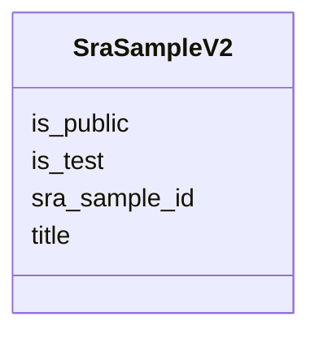

# Class: SraSampleV2 


URI: [gold:SraSampleV2](https://w3id.org/jgi/gold/SraSampleV2)





<!-- no inheritance hierarchy -->


## Slots

| Name | Cardinality and Range | Description | Inheritance |
| ---  | --- | --- | --- |
| [sra_sample_id](sra_sample_id.md) | 0..1 <br/> [String](String.md) |  | direct |
| [title](title.md) | 0..1 <br/> [String](String.md) |  | direct |
| [is_public](is_public.md) | 0..1 <br/> [String](String.md) |  | direct |
| [is_test](is_test.md) | 0..1 <br/> [String](String.md) |  | direct |


## Usages

| used by | used in | type | used |
| ---  | --- | --- | --- |
| [SraExperimentV2](SraExperimentV2.md) | [sra_sample_id](sra_sample_id.md) | range | [SraSampleV2](SraSampleV2.md) |


## Identifier and Mapping Information


### Schema Source


* from schema: https://w3id.org/jgi/gold


## Mappings

| Mapping Type | Mapped Value |
| ---  | ---  |
| self | gold:SraSampleV2 |
| native | gold:SraSampleV2 |


## LinkML Source

<!-- TODO: investigate https://stackoverflow.com/questions/37606292/how-to-create-tabbed-code-blocks-in-mkdocs-or-sphinx -->

### Direct

<details>
```yaml
name: sra_sample_v2
from_schema: https://w3id.org/jgi/gold
attributes:
  sra_sample_id:
    name: sra_sample_id
    from_schema: https://w3id.org/jgi/gold
    domain_of:
    - sra_experiment_v2
    - sra_sample_v2
    range: string
    required: false
  title:
    name: title
    from_schema: https://w3id.org/jgi/gold
    domain_of:
    - excel
    - ncbi_raw_sra_run
    - sra_experiment_v2
    - sra_sample_v2
    range: string
    required: false
  is_public:
    name: is_public
    from_schema: https://w3id.org/jgi/gold
    domain_of:
    - analysis_project
    - biosample
    - ncbi_raw_sra_run
    - organism_v2
    - project
    - sra_experiment_v2
    - sra_sample_v2
    - study
    range: string
    required: false
  is_test:
    name: is_test
    from_schema: https://w3id.org/jgi/gold
    domain_of:
    - analysis_project
    - biosample
    - ncbi_raw_sra_run
    - organism_v2
    - project
    - sra_experiment_v2
    - sra_sample_v2
    - study
    range: string
    required: false

```
</details>

### Induced

<details>
```yaml
name: sra_sample_v2
from_schema: https://w3id.org/jgi/gold
attributes:
  sra_sample_id:
    name: sra_sample_id
    from_schema: https://w3id.org/jgi/gold
    alias: sra_sample_id
    owner: sra_sample_v2
    domain_of:
    - sra_experiment_v2
    - sra_sample_v2
    range: string
    required: false
  title:
    name: title
    from_schema: https://w3id.org/jgi/gold
    alias: title
    owner: sra_sample_v2
    domain_of:
    - excel
    - ncbi_raw_sra_run
    - sra_experiment_v2
    - sra_sample_v2
    range: string
    required: false
  is_public:
    name: is_public
    from_schema: https://w3id.org/jgi/gold
    alias: is_public
    owner: sra_sample_v2
    domain_of:
    - analysis_project
    - biosample
    - ncbi_raw_sra_run
    - organism_v2
    - project
    - sra_experiment_v2
    - sra_sample_v2
    - study
    range: string
    required: false
  is_test:
    name: is_test
    from_schema: https://w3id.org/jgi/gold
    alias: is_test
    owner: sra_sample_v2
    domain_of:
    - analysis_project
    - biosample
    - ncbi_raw_sra_run
    - organism_v2
    - project
    - sra_experiment_v2
    - sra_sample_v2
    - study
    range: string
    required: false

```
</details>