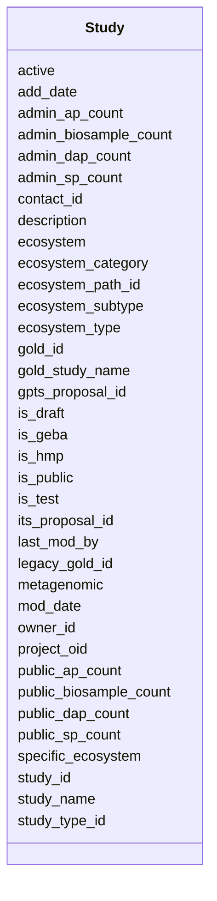

# Class: Study 


URI: [gold:Study](https://w3id.org/jgi/gold/Study)





<!-- no inheritance hierarchy -->


## Slots

| Name | Cardinality and Range | Description | Inheritance |
| ---  | --- | --- | --- |
| [study_id](study_id.md) | 0..1 <br/> [Float](Float.md) |  | direct |
| [its_proposal_id](its_proposal_id.md) | 0..1 <br/> [Float](Float.md) |  | direct |
| [gpts_proposal_id](gpts_proposal_id.md) | 0..1 <br/> [Float](Float.md) |  | direct |
| [active](active.md) | 0..1 <br/> [String](String.md) |  | direct |
| [is_public](is_public.md) | 0..1 <br/> [String](String.md) |  | direct |
| [add_date](add_date.md) | 0..1 <br/> [Datetime](Datetime.md) |  | direct |
| [mod_date](mod_date.md) | 0..1 <br/> [Datetime](Datetime.md) |  | direct |
| [last_mod_by](last_mod_by.md) | 0..1 <br/> [Float](Float.md) |  | direct |
| [gold_id](gold_id.md) | 0..1 <br/> [String](String.md) |  | direct |
| [study_name](study_name.md) | 0..1 <br/> [String](String.md) |  | direct |
| [metagenomic](metagenomic.md) | 0..1 <br/> [String](String.md) |  | direct |
| [ecosystem_path_id](ecosystem_path_id.md) | 0..1 <br/> [Float](Float.md) |  | direct |
| [ecosystem](ecosystem.md) | 0..1 <br/> [String](String.md) |  | direct |
| [ecosystem_category](ecosystem_category.md) | 0..1 <br/> [String](String.md) |  | direct |
| [ecosystem_type](ecosystem_type.md) | 0..1 <br/> [String](String.md) |  | direct |
| [ecosystem_subtype](ecosystem_subtype.md) | 0..1 <br/> [String](String.md) |  | direct |
| [specific_ecosystem](specific_ecosystem.md) | 0..1 <br/> [String](String.md) |  | direct |
| [project_oid](project_oid.md) | 0..1 <br/> [Float](Float.md) |  | direct |
| [legacy_gold_id](legacy_gold_id.md) | 0..1 <br/> [String](String.md) |  | direct |
| [study_type_id](study_type_id.md) | 0..1 <br/> [Float](Float.md) |  | direct |
| [description](description.md) | 0..1 <br/> [String](String.md) |  | direct |
| [owner_id](owner_id.md) | 0..1 <br/> [Float](Float.md) |  | direct |
| [contact_id](contact_id.md) | 0..1 <br/> [Float](Float.md) |  | direct |
| [public_sp_count](public_sp_count.md) | 0..1 <br/> [Float](Float.md) |  | direct |
| [admin_sp_count](admin_sp_count.md) | 0..1 <br/> [Float](Float.md) |  | direct |
| [public_ap_count](public_ap_count.md) | 0..1 <br/> [Float](Float.md) |  | direct |
| [admin_ap_count](admin_ap_count.md) | 0..1 <br/> [Float](Float.md) |  | direct |
| [public_dap_count](public_dap_count.md) | 0..1 <br/> [Float](Float.md) |  | direct |
| [admin_dap_count](admin_dap_count.md) | 0..1 <br/> [Float](Float.md) |  | direct |
| [public_biosample_count](public_biosample_count.md) | 0..1 <br/> [Float](Float.md) |  | direct |
| [admin_biosample_count](admin_biosample_count.md) | 0..1 <br/> [Float](Float.md) |  | direct |
| [is_geba](is_geba.md) | 0..1 <br/> [String](String.md) |  | direct |
| [is_hmp](is_hmp.md) | 0..1 <br/> [String](String.md) |  | direct |
| [is_draft](is_draft.md) | 0..1 <br/> [String](String.md) |  | direct |
| [is_test](is_test.md) | 0..1 <br/> [String](String.md) |  | direct |
| [gold_study_name](gold_study_name.md) | 0..1 <br/> [String](String.md) |  | direct |


## Usages

| used by | used in | type | used |
| ---  | --- | --- | --- |
| [AnalysisProject](AnalysisProject.md) | [study_id](study_id.md) | range | [Study](Study.md) |
| [Project](Project.md) | [master_study_id](master_study_id.md) | range | [Study](Study.md) |


## Identifier and Mapping Information


### Schema Source


* from schema: https://w3id.org/jgi/gold


## Mappings

| Mapping Type | Mapped Value |
| ---  | ---  |
| self | gold:Study |
| native | gold:Study |


## LinkML Source

<!-- TODO: investigate https://stackoverflow.com/questions/37606292/how-to-create-tabbed-code-blocks-in-mkdocs-or-sphinx -->

### Direct

<details>
```yaml
name: study
from_schema: https://w3id.org/jgi/gold
attributes:
  study_id:
    name: study_id
    from_schema: https://w3id.org/jgi/gold
    domain_of:
    - analysis_project
    - study
    range: float
    required: false
  its_proposal_id:
    name: its_proposal_id
    from_schema: https://w3id.org/jgi/gold
    domain_of:
    - project
    - study
    range: float
    required: false
  gpts_proposal_id:
    name: gpts_proposal_id
    from_schema: https://w3id.org/jgi/gold
    domain_of:
    - project
    - study
    range: float
    required: false
  active:
    name: active
    from_schema: https://w3id.org/jgi/gold
    domain_of:
    - biosample
    - dw_sequencing_product
    - organism_v2
    - project
    - study
    range: string
    required: false
  is_public:
    name: is_public
    from_schema: https://w3id.org/jgi/gold
    domain_of:
    - analysis_project
    - biosample
    - ncbi_raw_sra_run
    - organism_v2
    - project
    - sra_experiment_v2
    - sra_sample_v2
    - study
    range: string
    required: false
  add_date:
    name: add_date
    from_schema: https://w3id.org/jgi/gold
    domain_of:
    - analysis_project
    - api_user
    - bacdive
    - biosample
    - excel
    - organism_v2
    - package_soil
    - project
    - study
    range: datetime
    required: false
  mod_date:
    name: mod_date
    from_schema: https://w3id.org/jgi/gold
    domain_of:
    - analysis_project
    - api_user
    - bacdive
    - biosample
    - ncbi_raw_sra_run
    - organism_v2
    - package_soil
    - project
    - study
    range: datetime
    required: false
  last_mod_by:
    name: last_mod_by
    from_schema: https://w3id.org/jgi/gold
    rank: 1000
    domain_of:
    - study
    range: float
    required: false
  gold_id:
    name: gold_id
    from_schema: https://w3id.org/jgi/gold
    domain_of:
    - analysis_project
    - biosample
    - organism_v2
    - project
    - study
    range: string
    required: false
  study_name:
    name: study_name
    from_schema: https://w3id.org/jgi/gold
    rank: 1000
    domain_of:
    - study
    range: string
    required: false
  metagenomic:
    name: metagenomic
    from_schema: https://w3id.org/jgi/gold
    rank: 1000
    domain_of:
    - study
    range: string
    required: false
  ecosystem_path_id:
    name: ecosystem_path_id
    from_schema: https://w3id.org/jgi/gold
    domain_of:
    - analysis_project
    - biosample
    - organism_v2
    - study
    range: float
    required: false
  ecosystem:
    name: ecosystem
    from_schema: https://w3id.org/jgi/gold
    domain_of:
    - analysis_project
    - biosample
    - organism_v2
    - sigs_view
    - study
    range: string
    required: false
  ecosystem_category:
    name: ecosystem_category
    from_schema: https://w3id.org/jgi/gold
    domain_of:
    - analysis_project
    - biosample
    - organism_v2
    - sigs_view
    - study
    range: string
    required: false
  ecosystem_type:
    name: ecosystem_type
    from_schema: https://w3id.org/jgi/gold
    domain_of:
    - analysis_project
    - biosample
    - organism_v2
    - study
    range: string
    required: false
  ecosystem_subtype:
    name: ecosystem_subtype
    from_schema: https://w3id.org/jgi/gold
    domain_of:
    - analysis_project
    - biosample
    - organism_v2
    - study
    range: string
    required: false
  specific_ecosystem:
    name: specific_ecosystem
    from_schema: https://w3id.org/jgi/gold
    domain_of:
    - analysis_project
    - biosample
    - organism_v2
    - study
    range: string
    required: false
  project_oid:
    name: project_oid
    from_schema: https://w3id.org/jgi/gold
    domain_of:
    - biosample
    - organism_v2
    - project
    - study
    range: float
    required: false
  legacy_gold_id:
    name: legacy_gold_id
    from_schema: https://w3id.org/jgi/gold
    domain_of:
    - project
    - study
    range: string
    required: false
  study_type_id:
    name: study_type_id
    from_schema: https://w3id.org/jgi/gold
    rank: 1000
    domain_of:
    - study
    range: float
    required: false
  description:
    name: description
    from_schema: https://w3id.org/jgi/gold
    domain_of:
    - biosample
    - dw_sequencing_product
    - ncbi_raw_sra_run
    - project
    - sra_experiment_v2
    - study
    range: string
    required: false
  owner_id:
    name: owner_id
    from_schema: https://w3id.org/jgi/gold
    rank: 1000
    domain_of:
    - study
    range: float
    required: false
  contact_id:
    name: contact_id
    from_schema: https://w3id.org/jgi/gold
    rank: 1000
    domain_of:
    - study
    range: float
    required: false
  public_sp_count:
    name: public_sp_count
    from_schema: https://w3id.org/jgi/gold
    domain_of:
    - biosample
    - organism_v2
    - study
    range: float
    required: false
  admin_sp_count:
    name: admin_sp_count
    from_schema: https://w3id.org/jgi/gold
    domain_of:
    - biosample
    - organism_v2
    - study
    range: float
    required: false
  public_ap_count:
    name: public_ap_count
    from_schema: https://w3id.org/jgi/gold
    domain_of:
    - biosample
    - organism_v2
    - project
    - study
    range: float
    required: false
  admin_ap_count:
    name: admin_ap_count
    from_schema: https://w3id.org/jgi/gold
    domain_of:
    - biosample
    - organism_v2
    - project
    - study
    range: float
    required: false
  public_dap_count:
    name: public_dap_count
    from_schema: https://w3id.org/jgi/gold
    domain_of:
    - biosample
    - project
    - study
    range: float
    required: false
  admin_dap_count:
    name: admin_dap_count
    from_schema: https://w3id.org/jgi/gold
    domain_of:
    - biosample
    - project
    - study
    range: float
    required: false
  public_biosample_count:
    name: public_biosample_count
    from_schema: https://w3id.org/jgi/gold
    rank: 1000
    domain_of:
    - study
    range: float
    required: false
  admin_biosample_count:
    name: admin_biosample_count
    from_schema: https://w3id.org/jgi/gold
    rank: 1000
    domain_of:
    - study
    range: float
    required: false
  is_geba:
    name: is_geba
    from_schema: https://w3id.org/jgi/gold
    rank: 1000
    domain_of:
    - study
    range: string
    required: false
  is_hmp:
    name: is_hmp
    from_schema: https://w3id.org/jgi/gold
    rank: 1000
    domain_of:
    - study
    range: string
    required: false
  is_draft:
    name: is_draft
    from_schema: https://w3id.org/jgi/gold
    domain_of:
    - biosample
    - organism_v2
    - project
    - study
    range: string
    required: false
  is_test:
    name: is_test
    from_schema: https://w3id.org/jgi/gold
    domain_of:
    - analysis_project
    - biosample
    - ncbi_raw_sra_run
    - organism_v2
    - project
    - sra_experiment_v2
    - sra_sample_v2
    - study
    range: string
    required: false
  gold_study_name:
    name: gold_study_name
    from_schema: https://w3id.org/jgi/gold
    rank: 1000
    domain_of:
    - study
    range: string
    required: false

```
</details>

### Induced

<details>
```yaml
name: study
from_schema: https://w3id.org/jgi/gold
attributes:
  study_id:
    name: study_id
    from_schema: https://w3id.org/jgi/gold
    alias: study_id
    owner: study
    domain_of:
    - analysis_project
    - study
    range: float
    required: false
  its_proposal_id:
    name: its_proposal_id
    from_schema: https://w3id.org/jgi/gold
    alias: its_proposal_id
    owner: study
    domain_of:
    - project
    - study
    range: float
    required: false
  gpts_proposal_id:
    name: gpts_proposal_id
    from_schema: https://w3id.org/jgi/gold
    alias: gpts_proposal_id
    owner: study
    domain_of:
    - project
    - study
    range: float
    required: false
  active:
    name: active
    from_schema: https://w3id.org/jgi/gold
    alias: active
    owner: study
    domain_of:
    - biosample
    - dw_sequencing_product
    - organism_v2
    - project
    - study
    range: string
    required: false
  is_public:
    name: is_public
    from_schema: https://w3id.org/jgi/gold
    alias: is_public
    owner: study
    domain_of:
    - analysis_project
    - biosample
    - ncbi_raw_sra_run
    - organism_v2
    - project
    - sra_experiment_v2
    - sra_sample_v2
    - study
    range: string
    required: false
  add_date:
    name: add_date
    from_schema: https://w3id.org/jgi/gold
    alias: add_date
    owner: study
    domain_of:
    - analysis_project
    - api_user
    - bacdive
    - biosample
    - excel
    - organism_v2
    - package_soil
    - project
    - study
    range: datetime
    required: false
  mod_date:
    name: mod_date
    from_schema: https://w3id.org/jgi/gold
    alias: mod_date
    owner: study
    domain_of:
    - analysis_project
    - api_user
    - bacdive
    - biosample
    - ncbi_raw_sra_run
    - organism_v2
    - package_soil
    - project
    - study
    range: datetime
    required: false
  last_mod_by:
    name: last_mod_by
    from_schema: https://w3id.org/jgi/gold
    rank: 1000
    alias: last_mod_by
    owner: study
    domain_of:
    - study
    range: float
    required: false
  gold_id:
    name: gold_id
    from_schema: https://w3id.org/jgi/gold
    alias: gold_id
    owner: study
    domain_of:
    - analysis_project
    - biosample
    - organism_v2
    - project
    - study
    range: string
    required: false
  study_name:
    name: study_name
    from_schema: https://w3id.org/jgi/gold
    rank: 1000
    alias: study_name
    owner: study
    domain_of:
    - study
    range: string
    required: false
  metagenomic:
    name: metagenomic
    from_schema: https://w3id.org/jgi/gold
    rank: 1000
    alias: metagenomic
    owner: study
    domain_of:
    - study
    range: string
    required: false
  ecosystem_path_id:
    name: ecosystem_path_id
    from_schema: https://w3id.org/jgi/gold
    alias: ecosystem_path_id
    owner: study
    domain_of:
    - analysis_project
    - biosample
    - organism_v2
    - study
    range: float
    required: false
  ecosystem:
    name: ecosystem
    from_schema: https://w3id.org/jgi/gold
    alias: ecosystem
    owner: study
    domain_of:
    - analysis_project
    - biosample
    - organism_v2
    - sigs_view
    - study
    range: string
    required: false
  ecosystem_category:
    name: ecosystem_category
    from_schema: https://w3id.org/jgi/gold
    alias: ecosystem_category
    owner: study
    domain_of:
    - analysis_project
    - biosample
    - organism_v2
    - sigs_view
    - study
    range: string
    required: false
  ecosystem_type:
    name: ecosystem_type
    from_schema: https://w3id.org/jgi/gold
    alias: ecosystem_type
    owner: study
    domain_of:
    - analysis_project
    - biosample
    - organism_v2
    - study
    range: string
    required: false
  ecosystem_subtype:
    name: ecosystem_subtype
    from_schema: https://w3id.org/jgi/gold
    alias: ecosystem_subtype
    owner: study
    domain_of:
    - analysis_project
    - biosample
    - organism_v2
    - study
    range: string
    required: false
  specific_ecosystem:
    name: specific_ecosystem
    from_schema: https://w3id.org/jgi/gold
    alias: specific_ecosystem
    owner: study
    domain_of:
    - analysis_project
    - biosample
    - organism_v2
    - study
    range: string
    required: false
  project_oid:
    name: project_oid
    from_schema: https://w3id.org/jgi/gold
    alias: project_oid
    owner: study
    domain_of:
    - biosample
    - organism_v2
    - project
    - study
    range: float
    required: false
  legacy_gold_id:
    name: legacy_gold_id
    from_schema: https://w3id.org/jgi/gold
    alias: legacy_gold_id
    owner: study
    domain_of:
    - project
    - study
    range: string
    required: false
  study_type_id:
    name: study_type_id
    from_schema: https://w3id.org/jgi/gold
    rank: 1000
    alias: study_type_id
    owner: study
    domain_of:
    - study
    range: float
    required: false
  description:
    name: description
    from_schema: https://w3id.org/jgi/gold
    alias: description
    owner: study
    domain_of:
    - biosample
    - dw_sequencing_product
    - ncbi_raw_sra_run
    - project
    - sra_experiment_v2
    - study
    range: string
    required: false
  owner_id:
    name: owner_id
    from_schema: https://w3id.org/jgi/gold
    rank: 1000
    alias: owner_id
    owner: study
    domain_of:
    - study
    range: float
    required: false
  contact_id:
    name: contact_id
    from_schema: https://w3id.org/jgi/gold
    rank: 1000
    alias: contact_id
    owner: study
    domain_of:
    - study
    range: float
    required: false
  public_sp_count:
    name: public_sp_count
    from_schema: https://w3id.org/jgi/gold
    alias: public_sp_count
    owner: study
    domain_of:
    - biosample
    - organism_v2
    - study
    range: float
    required: false
  admin_sp_count:
    name: admin_sp_count
    from_schema: https://w3id.org/jgi/gold
    alias: admin_sp_count
    owner: study
    domain_of:
    - biosample
    - organism_v2
    - study
    range: float
    required: false
  public_ap_count:
    name: public_ap_count
    from_schema: https://w3id.org/jgi/gold
    alias: public_ap_count
    owner: study
    domain_of:
    - biosample
    - organism_v2
    - project
    - study
    range: float
    required: false
  admin_ap_count:
    name: admin_ap_count
    from_schema: https://w3id.org/jgi/gold
    alias: admin_ap_count
    owner: study
    domain_of:
    - biosample
    - organism_v2
    - project
    - study
    range: float
    required: false
  public_dap_count:
    name: public_dap_count
    from_schema: https://w3id.org/jgi/gold
    alias: public_dap_count
    owner: study
    domain_of:
    - biosample
    - project
    - study
    range: float
    required: false
  admin_dap_count:
    name: admin_dap_count
    from_schema: https://w3id.org/jgi/gold
    alias: admin_dap_count
    owner: study
    domain_of:
    - biosample
    - project
    - study
    range: float
    required: false
  public_biosample_count:
    name: public_biosample_count
    from_schema: https://w3id.org/jgi/gold
    rank: 1000
    alias: public_biosample_count
    owner: study
    domain_of:
    - study
    range: float
    required: false
  admin_biosample_count:
    name: admin_biosample_count
    from_schema: https://w3id.org/jgi/gold
    rank: 1000
    alias: admin_biosample_count
    owner: study
    domain_of:
    - study
    range: float
    required: false
  is_geba:
    name: is_geba
    from_schema: https://w3id.org/jgi/gold
    rank: 1000
    alias: is_geba
    owner: study
    domain_of:
    - study
    range: string
    required: false
  is_hmp:
    name: is_hmp
    from_schema: https://w3id.org/jgi/gold
    rank: 1000
    alias: is_hmp
    owner: study
    domain_of:
    - study
    range: string
    required: false
  is_draft:
    name: is_draft
    from_schema: https://w3id.org/jgi/gold
    alias: is_draft
    owner: study
    domain_of:
    - biosample
    - organism_v2
    - project
    - study
    range: string
    required: false
  is_test:
    name: is_test
    from_schema: https://w3id.org/jgi/gold
    alias: is_test
    owner: study
    domain_of:
    - analysis_project
    - biosample
    - ncbi_raw_sra_run
    - organism_v2
    - project
    - sra_experiment_v2
    - sra_sample_v2
    - study
    range: string
    required: false
  gold_study_name:
    name: gold_study_name
    from_schema: https://w3id.org/jgi/gold
    rank: 1000
    alias: gold_study_name
    owner: study
    domain_of:
    - study
    range: string
    required: false

```
</details>