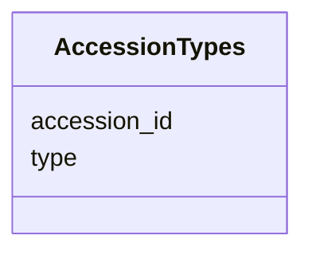

# Class: AccessionTypes 


URI: [img_core_v400:AccessionTypes](https://w3id.org/jgi/img_core_v400/AccessionTypes)





<!-- no inheritance hierarchy -->


## Slots

| Name | Cardinality and Range | Description | Inheritance |
| ---  | --- | --- | --- |
| [accession_id](accession_id.md) | 0..1 <br/> [String](String.md) |  | direct |
| [type](type.md) | 0..1 <br/> [String](String.md) |  | direct |


## Identifier and Mapping Information


### Schema Source


* from schema: https://w3id.org/jgi/img_core_v400


## Mappings

| Mapping Type | Mapped Value |
| ---  | ---  |
| self | img_core_v400:AccessionTypes |
| native | img_core_v400:AccessionTypes |


## LinkML Source

<!-- TODO: investigate https://stackoverflow.com/questions/37606292/how-to-create-tabbed-code-blocks-in-mkdocs-or-sphinx -->

### Direct

<details>
```yaml
name: accession_types
from_schema: https://w3id.org/jgi/img_core_v400
attributes:
  accession_id:
    name: accession_id
    from_schema: https://w3id.org/jgi/img_core_v400
    rank: 1000
    domain_of:
    - accession_types
    range: string
    required: false
  type:
    name: type
    from_schema: https://w3id.org/jgi/img_core_v400
    rank: 1000
    domain_of:
    - accession_types
    - genome_property
    - interpro
    - pfam_family
    - scaffold_repeats
    range: string
    required: false

```
</details>

### Induced

<details>
```yaml
name: accession_types
from_schema: https://w3id.org/jgi/img_core_v400
attributes:
  accession_id:
    name: accession_id
    from_schema: https://w3id.org/jgi/img_core_v400
    rank: 1000
    alias: accession_id
    owner: accession_types
    domain_of:
    - accession_types
    range: string
    required: false
  type:
    name: type
    from_schema: https://w3id.org/jgi/img_core_v400
    rank: 1000
    alias: type
    owner: accession_types
    domain_of:
    - accession_types
    - genome_property
    - interpro
    - pfam_family
    - scaffold_repeats
    range: string
    required: false

```
</details>