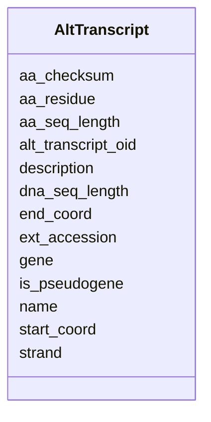

# Class: AltTranscript 


URI: [img_core_v400:AltTranscript](https://w3id.org/jgi/img_core_v400/AltTranscript)





<!-- no inheritance hierarchy -->


## Slots

| Name | Cardinality and Range | Description | Inheritance |
| ---  | --- | --- | --- |
| [alt_transcript_oid](alt_transcript_oid.md) | 0..1 <br/> [Integer](Integer.md) |  | direct |
| [gene](gene.md) | 0..1 <br/> [Integer](Integer.md) |  | direct |
| [start_coord](start_coord.md) | 0..1 <br/> [Integer](Integer.md) |  | direct |
| [end_coord](end_coord.md) | 0..1 <br/> [Integer](Integer.md) |  | direct |
| [dna_seq_length](dna_seq_length.md) | 0..1 <br/> [Integer](Integer.md) |  | direct |
| [aa_seq_length](aa_seq_length.md) | 0..1 <br/> [Integer](Integer.md) |  | direct |
| [strand](strand.md) | 0..1 <br/> [String](String.md) |  | direct |
| [is_pseudogene](is_pseudogene.md) | 0..1 <br/> [String](String.md) |  | direct |
| [aa_checksum](aa_checksum.md) | 0..1 <br/> [String](String.md) |  | direct |
| [name](name.md) | 0..1 <br/> [String](String.md) |  | direct |
| [ext_accession](ext_accession.md) | 0..1 <br/> [String](String.md) |  | direct |
| [description](description.md) | 0..1 <br/> [String](String.md) |  | direct |
| [aa_residue](aa_residue.md) | 0..1 <br/> [String](String.md) |  | direct |


## Identifier and Mapping Information


### Schema Source


* from schema: https://w3id.org/jgi/img_core_v400


## Mappings

| Mapping Type | Mapped Value |
| ---  | ---  |
| self | img_core_v400:AltTranscript |
| native | img_core_v400:AltTranscript |


## LinkML Source

<!-- TODO: investigate https://stackoverflow.com/questions/37606292/how-to-create-tabbed-code-blocks-in-mkdocs-or-sphinx -->

### Direct

<details>
```yaml
name: alt_transcript
from_schema: https://w3id.org/jgi/img_core_v400
attributes:
  alt_transcript_oid:
    name: alt_transcript_oid
    from_schema: https://w3id.org/jgi/img_core_v400
    rank: 1000
    domain_of:
    - alt_transcript
    range: integer
    required: false
  gene:
    name: gene
    from_schema: https://w3id.org/jgi/img_core_v400
    rank: 1000
    domain_of:
    - alt_transcript
    range: integer
    required: false
  start_coord:
    name: start_coord
    from_schema: https://w3id.org/jgi/img_core_v400
    rank: 1000
    domain_of:
    - alt_transcript
    - dt_intergenic
    - gene
    - gene_frag_coords
    - gene_sig_peptides
    - kp_pseudo
    - scaffold_nx_feature
    - scaffold_repeats
    - taxon_crispr_summary
    range: integer
    required: false
  end_coord:
    name: end_coord
    from_schema: https://w3id.org/jgi/img_core_v400
    rank: 1000
    domain_of:
    - alt_transcript
    - dt_intergenic
    - gene
    - gene_frag_coords
    - gene_sig_peptides
    - kp_pseudo
    - scaffold_nx_feature
    - scaffold_repeats
    - taxon_crispr_summary
    range: integer
    required: false
  dna_seq_length:
    name: dna_seq_length
    from_schema: https://w3id.org/jgi/img_core_v400
    rank: 1000
    domain_of:
    - alt_transcript
    - gene
    range: integer
    required: false
  aa_seq_length:
    name: aa_seq_length
    from_schema: https://w3id.org/jgi/img_core_v400
    rank: 1000
    domain_of:
    - alt_transcript
    - gene
    - kegg_gene
    - kp_pseudo
    range: integer
    required: false
  strand:
    name: strand
    from_schema: https://w3id.org/jgi/img_core_v400
    rank: 1000
    domain_of:
    - alt_transcript
    - gene
    - kp_pseudo
    - scaffold_nx_feature
    range: string
    required: false
  is_pseudogene:
    name: is_pseudogene
    from_schema: https://w3id.org/jgi/img_core_v400
    rank: 1000
    domain_of:
    - alt_transcript
    - gene
    range: string
    required: false
  aa_checksum:
    name: aa_checksum
    from_schema: https://w3id.org/jgi/img_core_v400
    rank: 1000
    domain_of:
    - alt_transcript
    - gene
    range: string
    required: false
  name:
    name: name
    from_schema: https://w3id.org/jgi/img_core_v400
    rank: 1000
    domain_of:
    - alt_transcript
    - cog2014
    - cogfunc2014
    - db_source
    - dt_cog
    - dt_img_term
    - dt_ko
    - dt_pfam
    - dt_tfam
    - exclude_func
    - genome_property
    - interpro
    - pfam_clan
    - pfam_dead
    - pfam_family
    - property_step
    - superfamily
    range: string
    required: false
  ext_accession:
    name: ext_accession
    from_schema: https://w3id.org/jgi/img_core_v400
    rank: 1000
    domain_of:
    - alt_transcript
    - compound
    - compound_aliases
    - compound_ext_links
    - gene_tigrfams
    - interpro
    - interpro_go_terms
    - pfam_clan
    - pfam_clan_pfam_families
    - pfam_family
    - pfam_family_cogs
    - pfam_family_ext_links
    - pfam_family_genome_properties
    - reaction
    - reaction_compounds
    - reaction_enzymes
    - reaction_ext_links
    - scaffold
    - tigrfam
    - tigrfam_enzymes
    - tigrfam_genome_properties
    - tigrfam_roles
    range: string
    required: false
  description:
    name: description
    from_schema: https://w3id.org/jgi/img_core_v400
    rank: 1000
    domain_of:
    - alt_transcript
    - cath_funfam
    - cog
    - gene
    - gene_xref_families
    - genome_property
    - kegg_pathway
    - kog
    - pfam_clan
    - pfam_family
    - smart
    - superfamily
    - yesnocv
    range: string
    required: false
  aa_residue:
    name: aa_residue
    from_schema: https://w3id.org/jgi/img_core_v400
    rank: 1000
    domain_of:
    - alt_transcript
    range: string
    required: false

```
</details>

### Induced

<details>
```yaml
name: alt_transcript
from_schema: https://w3id.org/jgi/img_core_v400
attributes:
  alt_transcript_oid:
    name: alt_transcript_oid
    from_schema: https://w3id.org/jgi/img_core_v400
    rank: 1000
    alias: alt_transcript_oid
    owner: alt_transcript
    domain_of:
    - alt_transcript
    range: integer
    required: false
  gene:
    name: gene
    from_schema: https://w3id.org/jgi/img_core_v400
    rank: 1000
    alias: gene
    owner: alt_transcript
    domain_of:
    - alt_transcript
    range: integer
    required: false
  start_coord:
    name: start_coord
    from_schema: https://w3id.org/jgi/img_core_v400
    rank: 1000
    alias: start_coord
    owner: alt_transcript
    domain_of:
    - alt_transcript
    - dt_intergenic
    - gene
    - gene_frag_coords
    - gene_sig_peptides
    - kp_pseudo
    - scaffold_nx_feature
    - scaffold_repeats
    - taxon_crispr_summary
    range: integer
    required: false
  end_coord:
    name: end_coord
    from_schema: https://w3id.org/jgi/img_core_v400
    rank: 1000
    alias: end_coord
    owner: alt_transcript
    domain_of:
    - alt_transcript
    - dt_intergenic
    - gene
    - gene_frag_coords
    - gene_sig_peptides
    - kp_pseudo
    - scaffold_nx_feature
    - scaffold_repeats
    - taxon_crispr_summary
    range: integer
    required: false
  dna_seq_length:
    name: dna_seq_length
    from_schema: https://w3id.org/jgi/img_core_v400
    rank: 1000
    alias: dna_seq_length
    owner: alt_transcript
    domain_of:
    - alt_transcript
    - gene
    range: integer
    required: false
  aa_seq_length:
    name: aa_seq_length
    from_schema: https://w3id.org/jgi/img_core_v400
    rank: 1000
    alias: aa_seq_length
    owner: alt_transcript
    domain_of:
    - alt_transcript
    - gene
    - kegg_gene
    - kp_pseudo
    range: integer
    required: false
  strand:
    name: strand
    from_schema: https://w3id.org/jgi/img_core_v400
    rank: 1000
    alias: strand
    owner: alt_transcript
    domain_of:
    - alt_transcript
    - gene
    - kp_pseudo
    - scaffold_nx_feature
    range: string
    required: false
  is_pseudogene:
    name: is_pseudogene
    from_schema: https://w3id.org/jgi/img_core_v400
    rank: 1000
    alias: is_pseudogene
    owner: alt_transcript
    domain_of:
    - alt_transcript
    - gene
    range: string
    required: false
  aa_checksum:
    name: aa_checksum
    from_schema: https://w3id.org/jgi/img_core_v400
    rank: 1000
    alias: aa_checksum
    owner: alt_transcript
    domain_of:
    - alt_transcript
    - gene
    range: string
    required: false
  name:
    name: name
    from_schema: https://w3id.org/jgi/img_core_v400
    rank: 1000
    alias: name
    owner: alt_transcript
    domain_of:
    - alt_transcript
    - cog2014
    - cogfunc2014
    - db_source
    - dt_cog
    - dt_img_term
    - dt_ko
    - dt_pfam
    - dt_tfam
    - exclude_func
    - genome_property
    - interpro
    - pfam_clan
    - pfam_dead
    - pfam_family
    - property_step
    - superfamily
    range: string
    required: false
  ext_accession:
    name: ext_accession
    from_schema: https://w3id.org/jgi/img_core_v400
    rank: 1000
    alias: ext_accession
    owner: alt_transcript
    domain_of:
    - alt_transcript
    - compound
    - compound_aliases
    - compound_ext_links
    - gene_tigrfams
    - interpro
    - interpro_go_terms
    - pfam_clan
    - pfam_clan_pfam_families
    - pfam_family
    - pfam_family_cogs
    - pfam_family_ext_links
    - pfam_family_genome_properties
    - reaction
    - reaction_compounds
    - reaction_enzymes
    - reaction_ext_links
    - scaffold
    - tigrfam
    - tigrfam_enzymes
    - tigrfam_genome_properties
    - tigrfam_roles
    range: string
    required: false
  description:
    name: description
    from_schema: https://w3id.org/jgi/img_core_v400
    rank: 1000
    alias: description
    owner: alt_transcript
    domain_of:
    - alt_transcript
    - cath_funfam
    - cog
    - gene
    - gene_xref_families
    - genome_property
    - kegg_pathway
    - kog
    - pfam_clan
    - pfam_family
    - smart
    - superfamily
    - yesnocv
    range: string
    required: false
  aa_residue:
    name: aa_residue
    from_schema: https://w3id.org/jgi/img_core_v400
    rank: 1000
    alias: aa_residue
    owner: alt_transcript
    domain_of:
    - alt_transcript
    range: string
    required: false

```
</details>