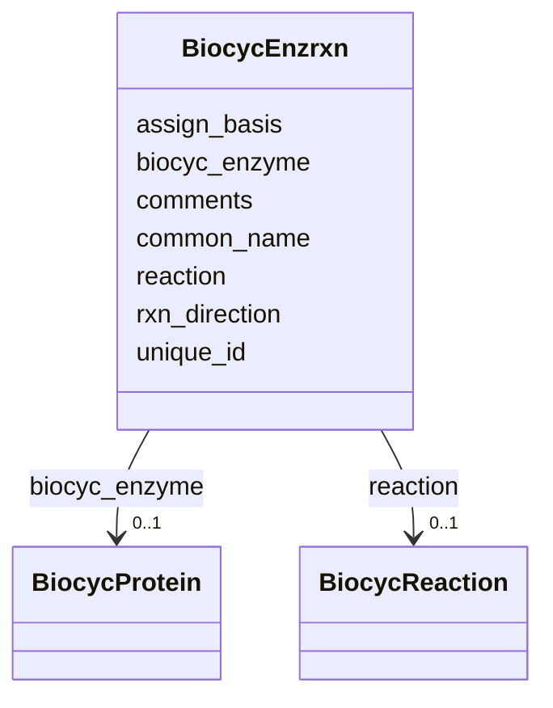

# Class: BiocycEnzrxn 


URI: [img_core_v400:BiocycEnzrxn](https://w3id.org/jgi/img_core_v400/BiocycEnzrxn)





<!-- no inheritance hierarchy -->


## Slots

| Name | Cardinality and Range | Description | Inheritance |
| ---  | --- | --- | --- |
| [unique_id](unique_id.md) | 0..1 <br/> [String](String.md) |  | direct |
| [biocyc_enzyme](biocyc_enzyme.md) | 0..1 <br/> [BiocycProtein](BiocycProtein.md) | Foreign key to biocyc_protein | direct |
| [common_name](common_name.md) | 0..1 <br/> [String](String.md) |  | direct |
| [assign_basis](assign_basis.md) | 0..1 <br/> [String](String.md) |  | direct |
| [reaction](reaction.md) | 0..1 <br/> [BiocycReaction](BiocycReaction.md) | Foreign key to biocyc_reaction | direct |
| [rxn_direction](rxn_direction.md) | 0..1 <br/> [String](String.md) |  | direct |
| [comments](comments.md) | 0..1 <br/> [String](String.md) |  | direct |


## Usages

| used by | used in | type | used |
| ---  | --- | --- | --- |
| [BiocycEnzrxnExtLinks](BiocycEnzrxnExtLinks.md) | [unique_id](unique_id.md) | range | [BiocycEnzrxn](BiocycEnzrxn.md) |
| [BiocycEnzrxnProsthGroups](BiocycEnzrxnProsthGroups.md) | [unique_id](unique_id.md) | range | [BiocycEnzrxn](BiocycEnzrxn.md) |
| [BiocycEnzrxnSynonyms](BiocycEnzrxnSynonyms.md) | [unique_id](unique_id.md) | range | [BiocycEnzrxn](BiocycEnzrxn.md) |
| [BiocycProteinCatalyzes](BiocycProteinCatalyzes.md) | [enzrxn](enzrxn.md) | range | [BiocycEnzrxn](BiocycEnzrxn.md) |


## Identifier and Mapping Information


### Schema Source


* from schema: https://w3id.org/jgi/img_core_v400


## Mappings

| Mapping Type | Mapped Value |
| ---  | ---  |
| self | img_core_v400:BiocycEnzrxn |
| native | img_core_v400:BiocycEnzrxn |


## LinkML Source

<!-- TODO: investigate https://stackoverflow.com/questions/37606292/how-to-create-tabbed-code-blocks-in-mkdocs-or-sphinx -->

### Direct

<details>
```yaml
name: biocyc_enzrxn
from_schema: https://w3id.org/jgi/img_core_v400
attributes:
  unique_id:
    name: unique_id
    from_schema: https://w3id.org/jgi/img_core_v400
    domain_of:
    - biocyc_class
    - biocyc_class_parents
    - biocyc_class_synonyms
    - biocyc_class_types
    - biocyc_comp
    - biocyc_comp_ext_links
    - biocyc_comp_synonyms
    - biocyc_comp_types
    - biocyc_enzrxn
    - biocyc_enzrxn_ext_links
    - biocyc_enzrxn_prosth_groups
    - biocyc_enzrxn_synonyms
    - biocyc_pathway
    - biocyc_pathway_comments
    - biocyc_pathway_ext_links
    - biocyc_pathway_in_species
    - biocyc_pathway_pwy_links
    - biocyc_pathway_sub_pwys
    - biocyc_pathway_super_pwys
    - biocyc_pathway_taxon_range
    - biocyc_pathway_types
    - biocyc_protein
    - biocyc_protein_catalyzes
    - biocyc_protein_ext_links
    - biocyc_protein_in_species
    - biocyc_protein_synonyms
    - biocyc_protein_types
    - biocyc_reaction
    - biocyc_reaction_ext_links
    - biocyc_reaction_in_pwys
    - biocyc_reaction_left_hand
    - biocyc_reaction_right_hand
    - biocyc_reaction_synonyms
    - biocyc_reaction_types
    range: string
    required: false
  biocyc_enzyme:
    name: biocyc_enzyme
    description: Foreign key to biocyc_protein
    from_schema: https://w3id.org/jgi/img_core_v400
    rank: 1000
    domain_of:
    - biocyc_enzrxn
    range: biocyc_protein
    required: false
  common_name:
    name: common_name
    from_schema: https://w3id.org/jgi/img_core_v400
    domain_of:
    - biocyc_class
    - biocyc_comp
    - biocyc_enzrxn
    - biocyc_pathway
    - biocyc_protein
    - biocyc_reaction
    - compound
    - gene_biocyc_rxns
    range: string
    required: false
  assign_basis:
    name: assign_basis
    from_schema: https://w3id.org/jgi/img_core_v400
    rank: 1000
    domain_of:
    - biocyc_enzrxn
    - gene_biocyc_rxns
    range: string
    required: false
  reaction:
    name: reaction
    description: Foreign key to biocyc_reaction
    from_schema: https://w3id.org/jgi/img_core_v400
    rank: 1000
    domain_of:
    - biocyc_enzrxn
    range: biocyc_reaction
    required: false
  rxn_direction:
    name: rxn_direction
    from_schema: https://w3id.org/jgi/img_core_v400
    rank: 1000
    domain_of:
    - biocyc_enzrxn
    range: string
    required: false
  comments:
    name: comments
    from_schema: https://w3id.org/jgi/img_core_v400
    domain_of:
    - biocyc_class
    - biocyc_comp
    - biocyc_enzrxn
    - biocyc_pathway_comments
    - biocyc_protein
    - biocyc_reaction
    - enzyme
    - enzyme_transferred
    - gene_sig_peptides
    - go_term
    - pfam_clan
    - pfam_dead
    - pfam_family
    - reaction
    - taxon
    - taxon_prod_vw
    - taxon_replacements
    range: string
    required: false

```
</details>

### Induced

<details>
```yaml
name: biocyc_enzrxn
from_schema: https://w3id.org/jgi/img_core_v400
attributes:
  unique_id:
    name: unique_id
    from_schema: https://w3id.org/jgi/img_core_v400
    alias: unique_id
    owner: biocyc_enzrxn
    domain_of:
    - biocyc_class
    - biocyc_class_parents
    - biocyc_class_synonyms
    - biocyc_class_types
    - biocyc_comp
    - biocyc_comp_ext_links
    - biocyc_comp_synonyms
    - biocyc_comp_types
    - biocyc_enzrxn
    - biocyc_enzrxn_ext_links
    - biocyc_enzrxn_prosth_groups
    - biocyc_enzrxn_synonyms
    - biocyc_pathway
    - biocyc_pathway_comments
    - biocyc_pathway_ext_links
    - biocyc_pathway_in_species
    - biocyc_pathway_pwy_links
    - biocyc_pathway_sub_pwys
    - biocyc_pathway_super_pwys
    - biocyc_pathway_taxon_range
    - biocyc_pathway_types
    - biocyc_protein
    - biocyc_protein_catalyzes
    - biocyc_protein_ext_links
    - biocyc_protein_in_species
    - biocyc_protein_synonyms
    - biocyc_protein_types
    - biocyc_reaction
    - biocyc_reaction_ext_links
    - biocyc_reaction_in_pwys
    - biocyc_reaction_left_hand
    - biocyc_reaction_right_hand
    - biocyc_reaction_synonyms
    - biocyc_reaction_types
    range: string
    required: false
  biocyc_enzyme:
    name: biocyc_enzyme
    description: Foreign key to biocyc_protein
    from_schema: https://w3id.org/jgi/img_core_v400
    rank: 1000
    alias: biocyc_enzyme
    owner: biocyc_enzrxn
    domain_of:
    - biocyc_enzrxn
    range: biocyc_protein
    required: false
  common_name:
    name: common_name
    from_schema: https://w3id.org/jgi/img_core_v400
    alias: common_name
    owner: biocyc_enzrxn
    domain_of:
    - biocyc_class
    - biocyc_comp
    - biocyc_enzrxn
    - biocyc_pathway
    - biocyc_protein
    - biocyc_reaction
    - compound
    - gene_biocyc_rxns
    range: string
    required: false
  assign_basis:
    name: assign_basis
    from_schema: https://w3id.org/jgi/img_core_v400
    rank: 1000
    alias: assign_basis
    owner: biocyc_enzrxn
    domain_of:
    - biocyc_enzrxn
    - gene_biocyc_rxns
    range: string
    required: false
  reaction:
    name: reaction
    description: Foreign key to biocyc_reaction
    from_schema: https://w3id.org/jgi/img_core_v400
    rank: 1000
    alias: reaction
    owner: biocyc_enzrxn
    domain_of:
    - biocyc_enzrxn
    range: biocyc_reaction
    required: false
  rxn_direction:
    name: rxn_direction
    from_schema: https://w3id.org/jgi/img_core_v400
    rank: 1000
    alias: rxn_direction
    owner: biocyc_enzrxn
    domain_of:
    - biocyc_enzrxn
    range: string
    required: false
  comments:
    name: comments
    from_schema: https://w3id.org/jgi/img_core_v400
    alias: comments
    owner: biocyc_enzrxn
    domain_of:
    - biocyc_class
    - biocyc_comp
    - biocyc_enzrxn
    - biocyc_pathway_comments
    - biocyc_protein
    - biocyc_reaction
    - enzyme
    - enzyme_transferred
    - gene_sig_peptides
    - go_term
    - pfam_clan
    - pfam_dead
    - pfam_family
    - reaction
    - taxon
    - taxon_prod_vw
    - taxon_replacements
    range: string
    required: false

```
</details>