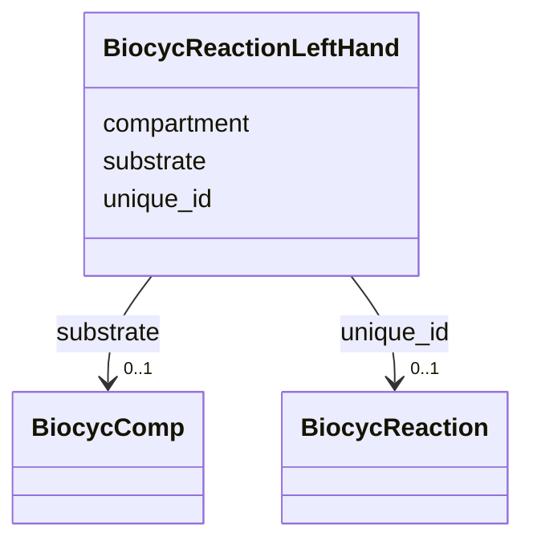

# Class: BiocycReactionLeftHand 


URI: [img_core_v400:BiocycReactionLeftHand](https://w3id.org/jgi/img_core_v400/BiocycReactionLeftHand)





<!-- no inheritance hierarchy -->


## Slots

| Name | Cardinality and Range | Description | Inheritance |
| ---  | --- | --- | --- |
| [unique_id](unique_id.md) | 0..1 <br/> [BiocycReaction](BiocycReaction.md) | Foreign key to biocyc_reaction | direct |
| [substrate](substrate.md) | 0..1 <br/> [BiocycComp](BiocycComp.md) | Foreign key to biocyc_comp | direct |
| [compartment](compartment.md) | 0..1 <br/> [String](String.md) |  | direct |


## Identifier and Mapping Information


### Schema Source


* from schema: https://w3id.org/jgi/img_core_v400


## Mappings

| Mapping Type | Mapped Value |
| ---  | ---  |
| self | img_core_v400:BiocycReactionLeftHand |
| native | img_core_v400:BiocycReactionLeftHand |


## LinkML Source

<!-- TODO: investigate https://stackoverflow.com/questions/37606292/how-to-create-tabbed-code-blocks-in-mkdocs-or-sphinx -->

### Direct

<details>
```yaml
name: biocyc_reaction_left_hand
from_schema: https://w3id.org/jgi/img_core_v400
attributes:
  unique_id:
    name: unique_id
    description: Foreign key to biocyc_reaction
    from_schema: https://w3id.org/jgi/img_core_v400
    domain_of:
    - biocyc_class
    - biocyc_class_parents
    - biocyc_class_synonyms
    - biocyc_class_types
    - biocyc_comp
    - biocyc_comp_ext_links
    - biocyc_comp_synonyms
    - biocyc_comp_types
    - biocyc_enzrxn
    - biocyc_enzrxn_ext_links
    - biocyc_enzrxn_prosth_groups
    - biocyc_enzrxn_synonyms
    - biocyc_pathway
    - biocyc_pathway_comments
    - biocyc_pathway_ext_links
    - biocyc_pathway_in_species
    - biocyc_pathway_pwy_links
    - biocyc_pathway_sub_pwys
    - biocyc_pathway_super_pwys
    - biocyc_pathway_taxon_range
    - biocyc_pathway_types
    - biocyc_protein
    - biocyc_protein_catalyzes
    - biocyc_protein_ext_links
    - biocyc_protein_in_species
    - biocyc_protein_synonyms
    - biocyc_protein_types
    - biocyc_reaction
    - biocyc_reaction_ext_links
    - biocyc_reaction_in_pwys
    - biocyc_reaction_left_hand
    - biocyc_reaction_right_hand
    - biocyc_reaction_synonyms
    - biocyc_reaction_types
    range: biocyc_reaction
    required: false
  substrate:
    name: substrate
    description: Foreign key to biocyc_comp
    from_schema: https://w3id.org/jgi/img_core_v400
    rank: 1000
    domain_of:
    - biocyc_reaction_left_hand
    - biocyc_reaction_right_hand
    range: biocyc_comp
    required: false
  compartment:
    name: compartment
    from_schema: https://w3id.org/jgi/img_core_v400
    rank: 1000
    domain_of:
    - biocyc_reaction_left_hand
    - biocyc_reaction_right_hand
    range: string
    required: false

```
</details>

### Induced

<details>
```yaml
name: biocyc_reaction_left_hand
from_schema: https://w3id.org/jgi/img_core_v400
attributes:
  unique_id:
    name: unique_id
    description: Foreign key to biocyc_reaction
    from_schema: https://w3id.org/jgi/img_core_v400
    alias: unique_id
    owner: biocyc_reaction_left_hand
    domain_of:
    - biocyc_class
    - biocyc_class_parents
    - biocyc_class_synonyms
    - biocyc_class_types
    - biocyc_comp
    - biocyc_comp_ext_links
    - biocyc_comp_synonyms
    - biocyc_comp_types
    - biocyc_enzrxn
    - biocyc_enzrxn_ext_links
    - biocyc_enzrxn_prosth_groups
    - biocyc_enzrxn_synonyms
    - biocyc_pathway
    - biocyc_pathway_comments
    - biocyc_pathway_ext_links
    - biocyc_pathway_in_species
    - biocyc_pathway_pwy_links
    - biocyc_pathway_sub_pwys
    - biocyc_pathway_super_pwys
    - biocyc_pathway_taxon_range
    - biocyc_pathway_types
    - biocyc_protein
    - biocyc_protein_catalyzes
    - biocyc_protein_ext_links
    - biocyc_protein_in_species
    - biocyc_protein_synonyms
    - biocyc_protein_types
    - biocyc_reaction
    - biocyc_reaction_ext_links
    - biocyc_reaction_in_pwys
    - biocyc_reaction_left_hand
    - biocyc_reaction_right_hand
    - biocyc_reaction_synonyms
    - biocyc_reaction_types
    range: biocyc_reaction
    required: false
  substrate:
    name: substrate
    description: Foreign key to biocyc_comp
    from_schema: https://w3id.org/jgi/img_core_v400
    rank: 1000
    alias: substrate
    owner: biocyc_reaction_left_hand
    domain_of:
    - biocyc_reaction_left_hand
    - biocyc_reaction_right_hand
    range: biocyc_comp
    required: false
  compartment:
    name: compartment
    from_schema: https://w3id.org/jgi/img_core_v400
    rank: 1000
    alias: compartment
    owner: biocyc_reaction_left_hand
    domain_of:
    - biocyc_reaction_left_hand
    - biocyc_reaction_right_hand
    range: string
    required: false

```
</details>