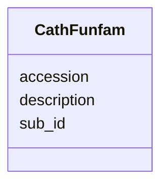

# Class: CathFunfam 


URI: [img_core_v400:CathFunfam](https://w3id.org/jgi/img_core_v400/CathFunfam)





<!-- no inheritance hierarchy -->


## Slots

| Name | Cardinality and Range | Description | Inheritance |
| ---  | --- | --- | --- |
| [accession](accession.md) | 0..1 <br/> [String](String.md) |  | direct |
| [description](description.md) | 0..1 <br/> [String](String.md) |  | direct |
| [sub_id](sub_id.md) | 0..1 <br/> [String](String.md) |  | direct |


## Identifier and Mapping Information


### Schema Source


* from schema: https://w3id.org/jgi/img_core_v400


## Mappings

| Mapping Type | Mapped Value |
| ---  | ---  |
| self | img_core_v400:CathFunfam |
| native | img_core_v400:CathFunfam |


## LinkML Source

<!-- TODO: investigate https://stackoverflow.com/questions/37606292/how-to-create-tabbed-code-blocks-in-mkdocs-or-sphinx -->

### Direct

<details>
```yaml
name: cath_funfam
from_schema: https://w3id.org/jgi/img_core_v400
attributes:
  accession:
    name: accession
    from_schema: https://w3id.org/jgi/img_core_v400
    rank: 1000
    domain_of:
    - cath_funfam
    - smart
    - superfamily
    range: string
    required: false
  description:
    name: description
    from_schema: https://w3id.org/jgi/img_core_v400
    domain_of:
    - alt_transcript
    - cath_funfam
    - cog
    - gene
    - gene_xref_families
    - genome_property
    - kegg_pathway
    - kog
    - pfam_clan
    - pfam_family
    - smart
    - superfamily
    - yesnocv
    range: string
    required: false
  sub_id:
    name: sub_id
    from_schema: https://w3id.org/jgi/img_core_v400
    rank: 1000
    domain_of:
    - cath_funfam
    range: string
    required: false

```
</details>

### Induced

<details>
```yaml
name: cath_funfam
from_schema: https://w3id.org/jgi/img_core_v400
attributes:
  accession:
    name: accession
    from_schema: https://w3id.org/jgi/img_core_v400
    rank: 1000
    alias: accession
    owner: cath_funfam
    domain_of:
    - cath_funfam
    - smart
    - superfamily
    range: string
    required: false
  description:
    name: description
    from_schema: https://w3id.org/jgi/img_core_v400
    alias: description
    owner: cath_funfam
    domain_of:
    - alt_transcript
    - cath_funfam
    - cog
    - gene
    - gene_xref_families
    - genome_property
    - kegg_pathway
    - kog
    - pfam_clan
    - pfam_family
    - smart
    - superfamily
    - yesnocv
    range: string
    required: false
  sub_id:
    name: sub_id
    from_schema: https://w3id.org/jgi/img_core_v400
    rank: 1000
    alias: sub_id
    owner: cath_funfam
    domain_of:
    - cath_funfam
    range: string
    required: false

```
</details>