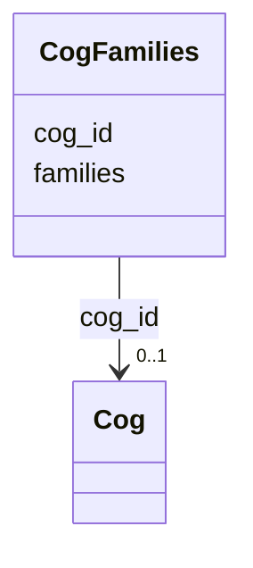

# Class: CogFamilies 


URI: [img_core_v400:CogFamilies](https://w3id.org/jgi/img_core_v400/CogFamilies)





<!-- no inheritance hierarchy -->


## Slots

| Name | Cardinality and Range | Description | Inheritance |
| ---  | --- | --- | --- |
| [cog_id](cog_id.md) | 0..1 <br/> [Cog](Cog.md) | Foreign key to cog | direct |
| [families](families.md) | 0..1 <br/> [String](String.md) |  | direct |


## Identifier and Mapping Information


### Schema Source


* from schema: https://w3id.org/jgi/img_core_v400


## Mappings

| Mapping Type | Mapped Value |
| ---  | ---  |
| self | img_core_v400:CogFamilies |
| native | img_core_v400:CogFamilies |


## LinkML Source

<!-- TODO: investigate https://stackoverflow.com/questions/37606292/how-to-create-tabbed-code-blocks-in-mkdocs-or-sphinx -->

### Direct

<details>
```yaml
name: cog_families
from_schema: https://w3id.org/jgi/img_core_v400
attributes:
  cog_id:
    name: cog_id
    description: Foreign key to cog
    from_schema: https://w3id.org/jgi/img_core_v400
    domain_of:
    - cog
    - cog_families
    - cog_functions
    - dt_cog
    - dt_scog_genes
    - dt_scogs
    - ko2cog
    range: cog
    required: false
  families:
    name: families
    from_schema: https://w3id.org/jgi/img_core_v400
    rank: 1000
    domain_of:
    - cog_families
    - kog_families
    range: string
    required: false

```
</details>

### Induced

<details>
```yaml
name: cog_families
from_schema: https://w3id.org/jgi/img_core_v400
attributes:
  cog_id:
    name: cog_id
    description: Foreign key to cog
    from_schema: https://w3id.org/jgi/img_core_v400
    alias: cog_id
    owner: cog_families
    domain_of:
    - cog
    - cog_families
    - cog_functions
    - dt_cog
    - dt_scog_genes
    - dt_scogs
    - ko2cog
    range: cog
    required: false
  families:
    name: families
    from_schema: https://w3id.org/jgi/img_core_v400
    rank: 1000
    alias: families
    owner: cog_families
    domain_of:
    - cog_families
    - kog_families
    range: string
    required: false

```
</details>