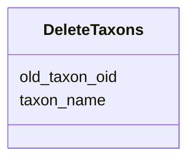

# Class: DeleteTaxons 


URI: [img_core_v400:DeleteTaxons](https://w3id.org/jgi/img_core_v400/DeleteTaxons)





<!-- no inheritance hierarchy -->


## Slots

| Name | Cardinality and Range | Description | Inheritance |
| ---  | --- | --- | --- |
| [old_taxon_oid](old_taxon_oid.md) | 0..1 <br/> [Integer](Integer.md) |  | direct |
| [taxon_name](taxon_name.md) | 0..1 <br/> [String](String.md) |  | direct |


## Identifier and Mapping Information


### Schema Source


* from schema: https://w3id.org/jgi/img_core_v400


## Mappings

| Mapping Type | Mapped Value |
| ---  | ---  |
| self | img_core_v400:DeleteTaxons |
| native | img_core_v400:DeleteTaxons |


## LinkML Source

<!-- TODO: investigate https://stackoverflow.com/questions/37606292/how-to-create-tabbed-code-blocks-in-mkdocs-or-sphinx -->

### Direct

<details>
```yaml
name: delete_taxons
from_schema: https://w3id.org/jgi/img_core_v400
attributes:
  old_taxon_oid:
    name: old_taxon_oid
    from_schema: https://w3id.org/jgi/img_core_v400
    rank: 1000
    domain_of:
    - delete_taxons
    - map_taxon_pairs
    - taxon_replacements
    - taxon_replacements_view
    range: integer
    required: false
  taxon_name:
    name: taxon_name
    from_schema: https://w3id.org/jgi/img_core_v400
    rank: 1000
    domain_of:
    - delete_taxons
    - dt_phylodist_new_taxons
    - kp_taxons
    - new_taxons
    - new_taxons_batch
    - old_taxons
    - tarball_refresh_taxons
    range: string
    required: false

```
</details>

### Induced

<details>
```yaml
name: delete_taxons
from_schema: https://w3id.org/jgi/img_core_v400
attributes:
  old_taxon_oid:
    name: old_taxon_oid
    from_schema: https://w3id.org/jgi/img_core_v400
    rank: 1000
    alias: old_taxon_oid
    owner: delete_taxons
    domain_of:
    - delete_taxons
    - map_taxon_pairs
    - taxon_replacements
    - taxon_replacements_view
    range: integer
    required: false
  taxon_name:
    name: taxon_name
    from_schema: https://w3id.org/jgi/img_core_v400
    rank: 1000
    alias: taxon_name
    owner: delete_taxons
    domain_of:
    - delete_taxons
    - dt_phylodist_new_taxons
    - kp_taxons
    - new_taxons
    - new_taxons_batch
    - old_taxons
    - tarball_refresh_taxons
    range: string
    required: false

```
</details>