# Class: DtCogStats 


URI: [img_core_v400:DtCogStats](https://w3id.org/jgi/img_core_v400/DtCogStats)

```mermaid
 classDiagram
    class DtCogStats
    click DtCogStats href "../DtCogStats/"
      DtCogStats : amino_acid_metabolism
        
      DtCogStats : amino_acid_metabolism_pc
        
      DtCogStats : carbohydrate_metabolism
        
      DtCogStats : carbohydrate_metabolism_pc
        
      DtCogStats : cell_cycle
        
      DtCogStats : cell_cycle_pc
        
      DtCogStats : cell_motility
        
      DtCogStats : cell_motility_pc
        
      DtCogStats : cell_wall_biogenesis
        
      DtCogStats : cell_wall_biogenesis_pc
        
      DtCogStats : chromatin_structure
        
      DtCogStats : chromatin_structure_pc
        
      DtCogStats : coenzyme_transport
        
      DtCogStats : coenzyme_transport_pc
        
      DtCogStats : cytoskeleton
        
      DtCogStats : cytoskeleton_pc
        
      DtCogStats : defense_mechanisms
        
      DtCogStats : defense_mechanisms_pc
        
      DtCogStats : energy_production
        
      DtCogStats : energy_production_pc
        
      DtCogStats : extracellular_structures
        
      DtCogStats : extracellular_structures_pc
        
      DtCogStats : function_unknown
        
      DtCogStats : function_unknown_pc
        
      DtCogStats : general_function_only
        
      DtCogStats : general_function_only_pc
        
      DtCogStats : intracellular_trafficking
        
      DtCogStats : intracellular_trafficking_pc
        
      DtCogStats : ion_transport
        
      DtCogStats : ion_transport_pc
        
      DtCogStats : lipid_metabolism
        
      DtCogStats : lipid_metabolism_pc
        
      DtCogStats : mobilome
        
      DtCogStats : mobilome_pc
        
      DtCogStats : nuclear_structure
        
      DtCogStats : nuclear_structure_pc
        
      DtCogStats : nucleotide_metabolism
        
      DtCogStats : nucleotide_metabolism_pc
        
      DtCogStats : posttrans_modification
        
      DtCogStats : posttrans_modification_pc
        
      DtCogStats : replication_repair
        
      DtCogStats : replication_repair_pc
        
      DtCogStats : rna_processing
        
      DtCogStats : rna_processing_pc
        
      DtCogStats : secondary_metabolites
        
      DtCogStats : secondary_metabolites_pc
        
      DtCogStats : signal_transduction
        
      DtCogStats : signal_transduction_pc
        
      DtCogStats : taxon_oid
        
      DtCogStats : total_cog_gene_count
        
      DtCogStats : transcription
        
      DtCogStats : transcription_pc
        
      DtCogStats : translation
        
      DtCogStats : translation_pc
        
      
```





<!-- no inheritance hierarchy -->


## Slots

| Name | Cardinality and Range | Description | Inheritance |
| ---  | --- | --- | --- |
| [taxon_oid](taxon_oid.md) | 0..1 <br/> [Float](Float.md) |  | direct |
| [total_cog_gene_count](total_cog_gene_count.md) | 0..1 <br/> [Float](Float.md) |  | direct |
| [amino_acid_metabolism](amino_acid_metabolism.md) | 0..1 <br/> [Float](Float.md) |  | direct |
| [amino_acid_metabolism_pc](amino_acid_metabolism_pc.md) | 0..1 <br/> [Float](Float.md) |  | direct |
| [carbohydrate_metabolism](carbohydrate_metabolism.md) | 0..1 <br/> [Float](Float.md) |  | direct |
| [carbohydrate_metabolism_pc](carbohydrate_metabolism_pc.md) | 0..1 <br/> [Float](Float.md) |  | direct |
| [cell_cycle](cell_cycle.md) | 0..1 <br/> [Float](Float.md) |  | direct |
| [cell_cycle_pc](cell_cycle_pc.md) | 0..1 <br/> [Float](Float.md) |  | direct |
| [cell_motility](cell_motility.md) | 0..1 <br/> [Float](Float.md) |  | direct |
| [cell_motility_pc](cell_motility_pc.md) | 0..1 <br/> [Float](Float.md) |  | direct |
| [cell_wall_biogenesis](cell_wall_biogenesis.md) | 0..1 <br/> [Float](Float.md) |  | direct |
| [cell_wall_biogenesis_pc](cell_wall_biogenesis_pc.md) | 0..1 <br/> [Float](Float.md) |  | direct |
| [chromatin_structure](chromatin_structure.md) | 0..1 <br/> [Float](Float.md) |  | direct |
| [chromatin_structure_pc](chromatin_structure_pc.md) | 0..1 <br/> [Float](Float.md) |  | direct |
| [coenzyme_transport](coenzyme_transport.md) | 0..1 <br/> [Float](Float.md) |  | direct |
| [coenzyme_transport_pc](coenzyme_transport_pc.md) | 0..1 <br/> [Float](Float.md) |  | direct |
| [cytoskeleton](cytoskeleton.md) | 0..1 <br/> [Float](Float.md) |  | direct |
| [cytoskeleton_pc](cytoskeleton_pc.md) | 0..1 <br/> [Float](Float.md) |  | direct |
| [defense_mechanisms](defense_mechanisms.md) | 0..1 <br/> [Float](Float.md) |  | direct |
| [defense_mechanisms_pc](defense_mechanisms_pc.md) | 0..1 <br/> [Float](Float.md) |  | direct |
| [energy_production](energy_production.md) | 0..1 <br/> [Float](Float.md) |  | direct |
| [energy_production_pc](energy_production_pc.md) | 0..1 <br/> [Float](Float.md) |  | direct |
| [extracellular_structures](extracellular_structures.md) | 0..1 <br/> [Float](Float.md) |  | direct |
| [extracellular_structures_pc](extracellular_structures_pc.md) | 0..1 <br/> [Float](Float.md) |  | direct |
| [function_unknown](function_unknown.md) | 0..1 <br/> [Float](Float.md) |  | direct |
| [function_unknown_pc](function_unknown_pc.md) | 0..1 <br/> [Float](Float.md) |  | direct |
| [general_function_only](general_function_only.md) | 0..1 <br/> [Float](Float.md) |  | direct |
| [general_function_only_pc](general_function_only_pc.md) | 0..1 <br/> [Float](Float.md) |  | direct |
| [ion_transport](ion_transport.md) | 0..1 <br/> [Float](Float.md) |  | direct |
| [ion_transport_pc](ion_transport_pc.md) | 0..1 <br/> [Float](Float.md) |  | direct |
| [intracellular_trafficking](intracellular_trafficking.md) | 0..1 <br/> [Float](Float.md) |  | direct |
| [intracellular_trafficking_pc](intracellular_trafficking_pc.md) | 0..1 <br/> [Float](Float.md) |  | direct |
| [lipid_metabolism](lipid_metabolism.md) | 0..1 <br/> [Float](Float.md) |  | direct |
| [lipid_metabolism_pc](lipid_metabolism_pc.md) | 0..1 <br/> [Float](Float.md) |  | direct |
| [nuclear_structure](nuclear_structure.md) | 0..1 <br/> [Float](Float.md) |  | direct |
| [nuclear_structure_pc](nuclear_structure_pc.md) | 0..1 <br/> [Float](Float.md) |  | direct |
| [nucleotide_metabolism](nucleotide_metabolism.md) | 0..1 <br/> [Float](Float.md) |  | direct |
| [nucleotide_metabolism_pc](nucleotide_metabolism_pc.md) | 0..1 <br/> [Float](Float.md) |  | direct |
| [posttrans_modification](posttrans_modification.md) | 0..1 <br/> [Float](Float.md) |  | direct |
| [posttrans_modification_pc](posttrans_modification_pc.md) | 0..1 <br/> [Float](Float.md) |  | direct |
| [rna_processing](rna_processing.md) | 0..1 <br/> [Float](Float.md) |  | direct |
| [rna_processing_pc](rna_processing_pc.md) | 0..1 <br/> [Float](Float.md) |  | direct |
| [replication_repair](replication_repair.md) | 0..1 <br/> [Float](Float.md) |  | direct |
| [replication_repair_pc](replication_repair_pc.md) | 0..1 <br/> [Float](Float.md) |  | direct |
| [secondary_metabolites](secondary_metabolites.md) | 0..1 <br/> [Float](Float.md) |  | direct |
| [secondary_metabolites_pc](secondary_metabolites_pc.md) | 0..1 <br/> [Float](Float.md) |  | direct |
| [signal_transduction](signal_transduction.md) | 0..1 <br/> [Float](Float.md) |  | direct |
| [signal_transduction_pc](signal_transduction_pc.md) | 0..1 <br/> [Float](Float.md) |  | direct |
| [transcription](transcription.md) | 0..1 <br/> [Float](Float.md) |  | direct |
| [transcription_pc](transcription_pc.md) | 0..1 <br/> [Float](Float.md) |  | direct |
| [translation](translation.md) | 0..1 <br/> [Float](Float.md) |  | direct |
| [translation_pc](translation_pc.md) | 0..1 <br/> [Float](Float.md) |  | direct |
| [mobilome](mobilome.md) | 0..1 <br/> [Float](Float.md) |  | direct |
| [mobilome_pc](mobilome_pc.md) | 0..1 <br/> [Float](Float.md) |  | direct |


## Identifier and Mapping Information


### Schema Source


* from schema: https://w3id.org/jgi/img_core_v400


## Mappings

| Mapping Type | Mapped Value |
| ---  | ---  |
| self | img_core_v400:DtCogStats |
| native | img_core_v400:DtCogStats |


## LinkML Source

<!-- TODO: investigate https://stackoverflow.com/questions/37606292/how-to-create-tabbed-code-blocks-in-mkdocs-or-sphinx -->

### Direct

<details>
```yaml
name: dt_cog_stats
from_schema: https://w3id.org/jgi/img_core_v400
attributes:
  taxon_oid:
    name: taxon_oid
    from_schema: https://w3id.org/jgi/img_core_v400
    domain_of:
    - asv5_taxons
    - bcg_taxons
    - dt_all_phylo_taxon_stats
    - dt_cog_stats
    - dt_kog_stats
    - dt_phylo_taxon_stats
    - dt_phylodist_new_taxons
    - dt_phylum_dist_genes
    - dt_phylum_dist_stats
    - dt_scog_genes
    - dt_taxon_kmodule_mcr
    - img_iuig_tarballs_11202023
    - img_umag_bin_tarballs_02062024
    - imgnr_taxons_062123
    - iso_plasmids
    - kp_actino
    - kp_taxons
    - new_taxons
    - new_taxons_batch
    - old_taxons
    - tarball_refresh_taxons
    - taxon
    - taxon_assembly_stats
    - taxon_cathfunfam_count
    - taxon_cog_count
    - taxon_crispr_details
    - taxon_crispr_summary
    - taxon_dw
    - taxon_ec_count
    - taxon_ext_links
    - taxon_gene_prefix
    - taxon_gtdbtk_lineage
    - taxon_ko_count
    - taxon_pfam_count
    - taxon_prod_vw
    - taxon_replacements
    - taxon_replacements_view
    - taxon_scaf_prefix
    - taxon_smart_count
    - taxon_smc_stats
    - taxon_stats
    - taxon_stats_merfs
    - taxon_stats_prod_vw
    - taxon_supfam_count
    - taxon_taxon_scaffold_info
    - taxon_tigr_count
    - vw_gold_taxon
    - vw_taxon_sc
    range: float
    required: false
  total_cog_gene_count:
    name: total_cog_gene_count
    from_schema: https://w3id.org/jgi/img_core_v400
    rank: 1000
    domain_of:
    - dt_cog_stats
    range: float
    required: false
  amino_acid_metabolism:
    name: amino_acid_metabolism
    from_schema: https://w3id.org/jgi/img_core_v400
    rank: 1000
    domain_of:
    - dt_cog_stats
    - dt_kog_stats
    range: float
    required: false
  amino_acid_metabolism_pc:
    name: amino_acid_metabolism_pc
    from_schema: https://w3id.org/jgi/img_core_v400
    rank: 1000
    domain_of:
    - dt_cog_stats
    - dt_kog_stats
    range: float
    required: false
  carbohydrate_metabolism:
    name: carbohydrate_metabolism
    from_schema: https://w3id.org/jgi/img_core_v400
    rank: 1000
    domain_of:
    - dt_cog_stats
    - dt_kog_stats
    range: float
    required: false
  carbohydrate_metabolism_pc:
    name: carbohydrate_metabolism_pc
    from_schema: https://w3id.org/jgi/img_core_v400
    rank: 1000
    domain_of:
    - dt_cog_stats
    - dt_kog_stats
    range: float
    required: false
  cell_cycle:
    name: cell_cycle
    from_schema: https://w3id.org/jgi/img_core_v400
    rank: 1000
    domain_of:
    - dt_cog_stats
    - dt_kog_stats
    range: float
    required: false
  cell_cycle_pc:
    name: cell_cycle_pc
    from_schema: https://w3id.org/jgi/img_core_v400
    rank: 1000
    domain_of:
    - dt_cog_stats
    - dt_kog_stats
    range: float
    required: false
  cell_motility:
    name: cell_motility
    from_schema: https://w3id.org/jgi/img_core_v400
    rank: 1000
    domain_of:
    - dt_cog_stats
    - dt_kog_stats
    range: float
    required: false
  cell_motility_pc:
    name: cell_motility_pc
    from_schema: https://w3id.org/jgi/img_core_v400
    rank: 1000
    domain_of:
    - dt_cog_stats
    - dt_kog_stats
    range: float
    required: false
  cell_wall_biogenesis:
    name: cell_wall_biogenesis
    from_schema: https://w3id.org/jgi/img_core_v400
    rank: 1000
    domain_of:
    - dt_cog_stats
    - dt_kog_stats
    range: float
    required: false
  cell_wall_biogenesis_pc:
    name: cell_wall_biogenesis_pc
    from_schema: https://w3id.org/jgi/img_core_v400
    rank: 1000
    domain_of:
    - dt_cog_stats
    - dt_kog_stats
    range: float
    required: false
  chromatin_structure:
    name: chromatin_structure
    from_schema: https://w3id.org/jgi/img_core_v400
    rank: 1000
    domain_of:
    - dt_cog_stats
    - dt_kog_stats
    range: float
    required: false
  chromatin_structure_pc:
    name: chromatin_structure_pc
    from_schema: https://w3id.org/jgi/img_core_v400
    rank: 1000
    domain_of:
    - dt_cog_stats
    - dt_kog_stats
    range: float
    required: false
  coenzyme_transport:
    name: coenzyme_transport
    from_schema: https://w3id.org/jgi/img_core_v400
    rank: 1000
    domain_of:
    - dt_cog_stats
    - dt_kog_stats
    range: float
    required: false
  coenzyme_transport_pc:
    name: coenzyme_transport_pc
    from_schema: https://w3id.org/jgi/img_core_v400
    rank: 1000
    domain_of:
    - dt_cog_stats
    - dt_kog_stats
    range: float
    required: false
  cytoskeleton:
    name: cytoskeleton
    from_schema: https://w3id.org/jgi/img_core_v400
    rank: 1000
    domain_of:
    - dt_cog_stats
    - dt_kog_stats
    range: float
    required: false
  cytoskeleton_pc:
    name: cytoskeleton_pc
    from_schema: https://w3id.org/jgi/img_core_v400
    rank: 1000
    domain_of:
    - dt_cog_stats
    - dt_kog_stats
    range: float
    required: false
  defense_mechanisms:
    name: defense_mechanisms
    from_schema: https://w3id.org/jgi/img_core_v400
    rank: 1000
    domain_of:
    - dt_cog_stats
    - dt_kog_stats
    range: float
    required: false
  defense_mechanisms_pc:
    name: defense_mechanisms_pc
    from_schema: https://w3id.org/jgi/img_core_v400
    rank: 1000
    domain_of:
    - dt_cog_stats
    - dt_kog_stats
    range: float
    required: false
  energy_production:
    name: energy_production
    from_schema: https://w3id.org/jgi/img_core_v400
    rank: 1000
    domain_of:
    - dt_cog_stats
    - dt_kog_stats
    range: float
    required: false
  energy_production_pc:
    name: energy_production_pc
    from_schema: https://w3id.org/jgi/img_core_v400
    rank: 1000
    domain_of:
    - dt_cog_stats
    - dt_kog_stats
    range: float
    required: false
  extracellular_structures:
    name: extracellular_structures
    from_schema: https://w3id.org/jgi/img_core_v400
    rank: 1000
    domain_of:
    - dt_cog_stats
    - dt_kog_stats
    range: float
    required: false
  extracellular_structures_pc:
    name: extracellular_structures_pc
    from_schema: https://w3id.org/jgi/img_core_v400
    rank: 1000
    domain_of:
    - dt_cog_stats
    - dt_kog_stats
    range: float
    required: false
  function_unknown:
    name: function_unknown
    from_schema: https://w3id.org/jgi/img_core_v400
    rank: 1000
    domain_of:
    - dt_cog_stats
    - dt_kog_stats
    range: float
    required: false
  function_unknown_pc:
    name: function_unknown_pc
    from_schema: https://w3id.org/jgi/img_core_v400
    rank: 1000
    domain_of:
    - dt_cog_stats
    - dt_kog_stats
    range: float
    required: false
  general_function_only:
    name: general_function_only
    from_schema: https://w3id.org/jgi/img_core_v400
    rank: 1000
    domain_of:
    - dt_cog_stats
    - dt_kog_stats
    range: float
    required: false
  general_function_only_pc:
    name: general_function_only_pc
    from_schema: https://w3id.org/jgi/img_core_v400
    rank: 1000
    domain_of:
    - dt_cog_stats
    - dt_kog_stats
    range: float
    required: false
  ion_transport:
    name: ion_transport
    from_schema: https://w3id.org/jgi/img_core_v400
    rank: 1000
    domain_of:
    - dt_cog_stats
    - dt_kog_stats
    range: float
    required: false
  ion_transport_pc:
    name: ion_transport_pc
    from_schema: https://w3id.org/jgi/img_core_v400
    rank: 1000
    domain_of:
    - dt_cog_stats
    - dt_kog_stats
    range: float
    required: false
  intracellular_trafficking:
    name: intracellular_trafficking
    from_schema: https://w3id.org/jgi/img_core_v400
    rank: 1000
    domain_of:
    - dt_cog_stats
    - dt_kog_stats
    range: float
    required: false
  intracellular_trafficking_pc:
    name: intracellular_trafficking_pc
    from_schema: https://w3id.org/jgi/img_core_v400
    rank: 1000
    domain_of:
    - dt_cog_stats
    - dt_kog_stats
    range: float
    required: false
  lipid_metabolism:
    name: lipid_metabolism
    from_schema: https://w3id.org/jgi/img_core_v400
    rank: 1000
    domain_of:
    - dt_cog_stats
    - dt_kog_stats
    range: float
    required: false
  lipid_metabolism_pc:
    name: lipid_metabolism_pc
    from_schema: https://w3id.org/jgi/img_core_v400
    rank: 1000
    domain_of:
    - dt_cog_stats
    - dt_kog_stats
    range: float
    required: false
  nuclear_structure:
    name: nuclear_structure
    from_schema: https://w3id.org/jgi/img_core_v400
    rank: 1000
    domain_of:
    - dt_cog_stats
    - dt_kog_stats
    range: float
    required: false
  nuclear_structure_pc:
    name: nuclear_structure_pc
    from_schema: https://w3id.org/jgi/img_core_v400
    rank: 1000
    domain_of:
    - dt_cog_stats
    - dt_kog_stats
    range: float
    required: false
  nucleotide_metabolism:
    name: nucleotide_metabolism
    from_schema: https://w3id.org/jgi/img_core_v400
    rank: 1000
    domain_of:
    - dt_cog_stats
    - dt_kog_stats
    range: float
    required: false
  nucleotide_metabolism_pc:
    name: nucleotide_metabolism_pc
    from_schema: https://w3id.org/jgi/img_core_v400
    rank: 1000
    domain_of:
    - dt_cog_stats
    - dt_kog_stats
    range: float
    required: false
  posttrans_modification:
    name: posttrans_modification
    from_schema: https://w3id.org/jgi/img_core_v400
    rank: 1000
    domain_of:
    - dt_cog_stats
    - dt_kog_stats
    range: float
    required: false
  posttrans_modification_pc:
    name: posttrans_modification_pc
    from_schema: https://w3id.org/jgi/img_core_v400
    rank: 1000
    domain_of:
    - dt_cog_stats
    - dt_kog_stats
    range: float
    required: false
  rna_processing:
    name: rna_processing
    from_schema: https://w3id.org/jgi/img_core_v400
    rank: 1000
    domain_of:
    - dt_cog_stats
    - dt_kog_stats
    range: float
    required: false
  rna_processing_pc:
    name: rna_processing_pc
    from_schema: https://w3id.org/jgi/img_core_v400
    rank: 1000
    domain_of:
    - dt_cog_stats
    - dt_kog_stats
    range: float
    required: false
  replication_repair:
    name: replication_repair
    from_schema: https://w3id.org/jgi/img_core_v400
    rank: 1000
    domain_of:
    - dt_cog_stats
    - dt_kog_stats
    range: float
    required: false
  replication_repair_pc:
    name: replication_repair_pc
    from_schema: https://w3id.org/jgi/img_core_v400
    rank: 1000
    domain_of:
    - dt_cog_stats
    - dt_kog_stats
    range: float
    required: false
  secondary_metabolites:
    name: secondary_metabolites
    from_schema: https://w3id.org/jgi/img_core_v400
    rank: 1000
    domain_of:
    - dt_cog_stats
    - dt_kog_stats
    range: float
    required: false
  secondary_metabolites_pc:
    name: secondary_metabolites_pc
    from_schema: https://w3id.org/jgi/img_core_v400
    rank: 1000
    domain_of:
    - dt_cog_stats
    - dt_kog_stats
    range: float
    required: false
  signal_transduction:
    name: signal_transduction
    from_schema: https://w3id.org/jgi/img_core_v400
    rank: 1000
    domain_of:
    - dt_cog_stats
    - dt_kog_stats
    range: float
    required: false
  signal_transduction_pc:
    name: signal_transduction_pc
    from_schema: https://w3id.org/jgi/img_core_v400
    rank: 1000
    domain_of:
    - dt_cog_stats
    - dt_kog_stats
    range: float
    required: false
  transcription:
    name: transcription
    from_schema: https://w3id.org/jgi/img_core_v400
    rank: 1000
    domain_of:
    - dt_cog_stats
    - dt_kog_stats
    range: float
    required: false
  transcription_pc:
    name: transcription_pc
    from_schema: https://w3id.org/jgi/img_core_v400
    rank: 1000
    domain_of:
    - dt_cog_stats
    - dt_kog_stats
    range: float
    required: false
  translation:
    name: translation
    from_schema: https://w3id.org/jgi/img_core_v400
    rank: 1000
    domain_of:
    - dt_cog_stats
    - dt_kog_stats
    range: float
    required: false
  translation_pc:
    name: translation_pc
    from_schema: https://w3id.org/jgi/img_core_v400
    rank: 1000
    domain_of:
    - dt_cog_stats
    - dt_kog_stats
    range: float
    required: false
  mobilome:
    name: mobilome
    from_schema: https://w3id.org/jgi/img_core_v400
    rank: 1000
    domain_of:
    - dt_cog_stats
    range: float
    required: false
  mobilome_pc:
    name: mobilome_pc
    from_schema: https://w3id.org/jgi/img_core_v400
    rank: 1000
    domain_of:
    - dt_cog_stats
    range: float
    required: false

```
</details>

### Induced

<details>
```yaml
name: dt_cog_stats
from_schema: https://w3id.org/jgi/img_core_v400
attributes:
  taxon_oid:
    name: taxon_oid
    from_schema: https://w3id.org/jgi/img_core_v400
    alias: taxon_oid
    owner: dt_cog_stats
    domain_of:
    - asv5_taxons
    - bcg_taxons
    - dt_all_phylo_taxon_stats
    - dt_cog_stats
    - dt_kog_stats
    - dt_phylo_taxon_stats
    - dt_phylodist_new_taxons
    - dt_phylum_dist_genes
    - dt_phylum_dist_stats
    - dt_scog_genes
    - dt_taxon_kmodule_mcr
    - img_iuig_tarballs_11202023
    - img_umag_bin_tarballs_02062024
    - imgnr_taxons_062123
    - iso_plasmids
    - kp_actino
    - kp_taxons
    - new_taxons
    - new_taxons_batch
    - old_taxons
    - tarball_refresh_taxons
    - taxon
    - taxon_assembly_stats
    - taxon_cathfunfam_count
    - taxon_cog_count
    - taxon_crispr_details
    - taxon_crispr_summary
    - taxon_dw
    - taxon_ec_count
    - taxon_ext_links
    - taxon_gene_prefix
    - taxon_gtdbtk_lineage
    - taxon_ko_count
    - taxon_pfam_count
    - taxon_prod_vw
    - taxon_replacements
    - taxon_replacements_view
    - taxon_scaf_prefix
    - taxon_smart_count
    - taxon_smc_stats
    - taxon_stats
    - taxon_stats_merfs
    - taxon_stats_prod_vw
    - taxon_supfam_count
    - taxon_taxon_scaffold_info
    - taxon_tigr_count
    - vw_gold_taxon
    - vw_taxon_sc
    range: float
    required: false
  total_cog_gene_count:
    name: total_cog_gene_count
    from_schema: https://w3id.org/jgi/img_core_v400
    rank: 1000
    alias: total_cog_gene_count
    owner: dt_cog_stats
    domain_of:
    - dt_cog_stats
    range: float
    required: false
  amino_acid_metabolism:
    name: amino_acid_metabolism
    from_schema: https://w3id.org/jgi/img_core_v400
    rank: 1000
    alias: amino_acid_metabolism
    owner: dt_cog_stats
    domain_of:
    - dt_cog_stats
    - dt_kog_stats
    range: float
    required: false
  amino_acid_metabolism_pc:
    name: amino_acid_metabolism_pc
    from_schema: https://w3id.org/jgi/img_core_v400
    rank: 1000
    alias: amino_acid_metabolism_pc
    owner: dt_cog_stats
    domain_of:
    - dt_cog_stats
    - dt_kog_stats
    range: float
    required: false
  carbohydrate_metabolism:
    name: carbohydrate_metabolism
    from_schema: https://w3id.org/jgi/img_core_v400
    rank: 1000
    alias: carbohydrate_metabolism
    owner: dt_cog_stats
    domain_of:
    - dt_cog_stats
    - dt_kog_stats
    range: float
    required: false
  carbohydrate_metabolism_pc:
    name: carbohydrate_metabolism_pc
    from_schema: https://w3id.org/jgi/img_core_v400
    rank: 1000
    alias: carbohydrate_metabolism_pc
    owner: dt_cog_stats
    domain_of:
    - dt_cog_stats
    - dt_kog_stats
    range: float
    required: false
  cell_cycle:
    name: cell_cycle
    from_schema: https://w3id.org/jgi/img_core_v400
    rank: 1000
    alias: cell_cycle
    owner: dt_cog_stats
    domain_of:
    - dt_cog_stats
    - dt_kog_stats
    range: float
    required: false
  cell_cycle_pc:
    name: cell_cycle_pc
    from_schema: https://w3id.org/jgi/img_core_v400
    rank: 1000
    alias: cell_cycle_pc
    owner: dt_cog_stats
    domain_of:
    - dt_cog_stats
    - dt_kog_stats
    range: float
    required: false
  cell_motility:
    name: cell_motility
    from_schema: https://w3id.org/jgi/img_core_v400
    rank: 1000
    alias: cell_motility
    owner: dt_cog_stats
    domain_of:
    - dt_cog_stats
    - dt_kog_stats
    range: float
    required: false
  cell_motility_pc:
    name: cell_motility_pc
    from_schema: https://w3id.org/jgi/img_core_v400
    rank: 1000
    alias: cell_motility_pc
    owner: dt_cog_stats
    domain_of:
    - dt_cog_stats
    - dt_kog_stats
    range: float
    required: false
  cell_wall_biogenesis:
    name: cell_wall_biogenesis
    from_schema: https://w3id.org/jgi/img_core_v400
    rank: 1000
    alias: cell_wall_biogenesis
    owner: dt_cog_stats
    domain_of:
    - dt_cog_stats
    - dt_kog_stats
    range: float
    required: false
  cell_wall_biogenesis_pc:
    name: cell_wall_biogenesis_pc
    from_schema: https://w3id.org/jgi/img_core_v400
    rank: 1000
    alias: cell_wall_biogenesis_pc
    owner: dt_cog_stats
    domain_of:
    - dt_cog_stats
    - dt_kog_stats
    range: float
    required: false
  chromatin_structure:
    name: chromatin_structure
    from_schema: https://w3id.org/jgi/img_core_v400
    rank: 1000
    alias: chromatin_structure
    owner: dt_cog_stats
    domain_of:
    - dt_cog_stats
    - dt_kog_stats
    range: float
    required: false
  chromatin_structure_pc:
    name: chromatin_structure_pc
    from_schema: https://w3id.org/jgi/img_core_v400
    rank: 1000
    alias: chromatin_structure_pc
    owner: dt_cog_stats
    domain_of:
    - dt_cog_stats
    - dt_kog_stats
    range: float
    required: false
  coenzyme_transport:
    name: coenzyme_transport
    from_schema: https://w3id.org/jgi/img_core_v400
    rank: 1000
    alias: coenzyme_transport
    owner: dt_cog_stats
    domain_of:
    - dt_cog_stats
    - dt_kog_stats
    range: float
    required: false
  coenzyme_transport_pc:
    name: coenzyme_transport_pc
    from_schema: https://w3id.org/jgi/img_core_v400
    rank: 1000
    alias: coenzyme_transport_pc
    owner: dt_cog_stats
    domain_of:
    - dt_cog_stats
    - dt_kog_stats
    range: float
    required: false
  cytoskeleton:
    name: cytoskeleton
    from_schema: https://w3id.org/jgi/img_core_v400
    rank: 1000
    alias: cytoskeleton
    owner: dt_cog_stats
    domain_of:
    - dt_cog_stats
    - dt_kog_stats
    range: float
    required: false
  cytoskeleton_pc:
    name: cytoskeleton_pc
    from_schema: https://w3id.org/jgi/img_core_v400
    rank: 1000
    alias: cytoskeleton_pc
    owner: dt_cog_stats
    domain_of:
    - dt_cog_stats
    - dt_kog_stats
    range: float
    required: false
  defense_mechanisms:
    name: defense_mechanisms
    from_schema: https://w3id.org/jgi/img_core_v400
    rank: 1000
    alias: defense_mechanisms
    owner: dt_cog_stats
    domain_of:
    - dt_cog_stats
    - dt_kog_stats
    range: float
    required: false
  defense_mechanisms_pc:
    name: defense_mechanisms_pc
    from_schema: https://w3id.org/jgi/img_core_v400
    rank: 1000
    alias: defense_mechanisms_pc
    owner: dt_cog_stats
    domain_of:
    - dt_cog_stats
    - dt_kog_stats
    range: float
    required: false
  energy_production:
    name: energy_production
    from_schema: https://w3id.org/jgi/img_core_v400
    rank: 1000
    alias: energy_production
    owner: dt_cog_stats
    domain_of:
    - dt_cog_stats
    - dt_kog_stats
    range: float
    required: false
  energy_production_pc:
    name: energy_production_pc
    from_schema: https://w3id.org/jgi/img_core_v400
    rank: 1000
    alias: energy_production_pc
    owner: dt_cog_stats
    domain_of:
    - dt_cog_stats
    - dt_kog_stats
    range: float
    required: false
  extracellular_structures:
    name: extracellular_structures
    from_schema: https://w3id.org/jgi/img_core_v400
    rank: 1000
    alias: extracellular_structures
    owner: dt_cog_stats
    domain_of:
    - dt_cog_stats
    - dt_kog_stats
    range: float
    required: false
  extracellular_structures_pc:
    name: extracellular_structures_pc
    from_schema: https://w3id.org/jgi/img_core_v400
    rank: 1000
    alias: extracellular_structures_pc
    owner: dt_cog_stats
    domain_of:
    - dt_cog_stats
    - dt_kog_stats
    range: float
    required: false
  function_unknown:
    name: function_unknown
    from_schema: https://w3id.org/jgi/img_core_v400
    rank: 1000
    alias: function_unknown
    owner: dt_cog_stats
    domain_of:
    - dt_cog_stats
    - dt_kog_stats
    range: float
    required: false
  function_unknown_pc:
    name: function_unknown_pc
    from_schema: https://w3id.org/jgi/img_core_v400
    rank: 1000
    alias: function_unknown_pc
    owner: dt_cog_stats
    domain_of:
    - dt_cog_stats
    - dt_kog_stats
    range: float
    required: false
  general_function_only:
    name: general_function_only
    from_schema: https://w3id.org/jgi/img_core_v400
    rank: 1000
    alias: general_function_only
    owner: dt_cog_stats
    domain_of:
    - dt_cog_stats
    - dt_kog_stats
    range: float
    required: false
  general_function_only_pc:
    name: general_function_only_pc
    from_schema: https://w3id.org/jgi/img_core_v400
    rank: 1000
    alias: general_function_only_pc
    owner: dt_cog_stats
    domain_of:
    - dt_cog_stats
    - dt_kog_stats
    range: float
    required: false
  ion_transport:
    name: ion_transport
    from_schema: https://w3id.org/jgi/img_core_v400
    rank: 1000
    alias: ion_transport
    owner: dt_cog_stats
    domain_of:
    - dt_cog_stats
    - dt_kog_stats
    range: float
    required: false
  ion_transport_pc:
    name: ion_transport_pc
    from_schema: https://w3id.org/jgi/img_core_v400
    rank: 1000
    alias: ion_transport_pc
    owner: dt_cog_stats
    domain_of:
    - dt_cog_stats
    - dt_kog_stats
    range: float
    required: false
  intracellular_trafficking:
    name: intracellular_trafficking
    from_schema: https://w3id.org/jgi/img_core_v400
    rank: 1000
    alias: intracellular_trafficking
    owner: dt_cog_stats
    domain_of:
    - dt_cog_stats
    - dt_kog_stats
    range: float
    required: false
  intracellular_trafficking_pc:
    name: intracellular_trafficking_pc
    from_schema: https://w3id.org/jgi/img_core_v400
    rank: 1000
    alias: intracellular_trafficking_pc
    owner: dt_cog_stats
    domain_of:
    - dt_cog_stats
    - dt_kog_stats
    range: float
    required: false
  lipid_metabolism:
    name: lipid_metabolism
    from_schema: https://w3id.org/jgi/img_core_v400
    rank: 1000
    alias: lipid_metabolism
    owner: dt_cog_stats
    domain_of:
    - dt_cog_stats
    - dt_kog_stats
    range: float
    required: false
  lipid_metabolism_pc:
    name: lipid_metabolism_pc
    from_schema: https://w3id.org/jgi/img_core_v400
    rank: 1000
    alias: lipid_metabolism_pc
    owner: dt_cog_stats
    domain_of:
    - dt_cog_stats
    - dt_kog_stats
    range: float
    required: false
  nuclear_structure:
    name: nuclear_structure
    from_schema: https://w3id.org/jgi/img_core_v400
    rank: 1000
    alias: nuclear_structure
    owner: dt_cog_stats
    domain_of:
    - dt_cog_stats
    - dt_kog_stats
    range: float
    required: false
  nuclear_structure_pc:
    name: nuclear_structure_pc
    from_schema: https://w3id.org/jgi/img_core_v400
    rank: 1000
    alias: nuclear_structure_pc
    owner: dt_cog_stats
    domain_of:
    - dt_cog_stats
    - dt_kog_stats
    range: float
    required: false
  nucleotide_metabolism:
    name: nucleotide_metabolism
    from_schema: https://w3id.org/jgi/img_core_v400
    rank: 1000
    alias: nucleotide_metabolism
    owner: dt_cog_stats
    domain_of:
    - dt_cog_stats
    - dt_kog_stats
    range: float
    required: false
  nucleotide_metabolism_pc:
    name: nucleotide_metabolism_pc
    from_schema: https://w3id.org/jgi/img_core_v400
    rank: 1000
    alias: nucleotide_metabolism_pc
    owner: dt_cog_stats
    domain_of:
    - dt_cog_stats
    - dt_kog_stats
    range: float
    required: false
  posttrans_modification:
    name: posttrans_modification
    from_schema: https://w3id.org/jgi/img_core_v400
    rank: 1000
    alias: posttrans_modification
    owner: dt_cog_stats
    domain_of:
    - dt_cog_stats
    - dt_kog_stats
    range: float
    required: false
  posttrans_modification_pc:
    name: posttrans_modification_pc
    from_schema: https://w3id.org/jgi/img_core_v400
    rank: 1000
    alias: posttrans_modification_pc
    owner: dt_cog_stats
    domain_of:
    - dt_cog_stats
    - dt_kog_stats
    range: float
    required: false
  rna_processing:
    name: rna_processing
    from_schema: https://w3id.org/jgi/img_core_v400
    rank: 1000
    alias: rna_processing
    owner: dt_cog_stats
    domain_of:
    - dt_cog_stats
    - dt_kog_stats
    range: float
    required: false
  rna_processing_pc:
    name: rna_processing_pc
    from_schema: https://w3id.org/jgi/img_core_v400
    rank: 1000
    alias: rna_processing_pc
    owner: dt_cog_stats
    domain_of:
    - dt_cog_stats
    - dt_kog_stats
    range: float
    required: false
  replication_repair:
    name: replication_repair
    from_schema: https://w3id.org/jgi/img_core_v400
    rank: 1000
    alias: replication_repair
    owner: dt_cog_stats
    domain_of:
    - dt_cog_stats
    - dt_kog_stats
    range: float
    required: false
  replication_repair_pc:
    name: replication_repair_pc
    from_schema: https://w3id.org/jgi/img_core_v400
    rank: 1000
    alias: replication_repair_pc
    owner: dt_cog_stats
    domain_of:
    - dt_cog_stats
    - dt_kog_stats
    range: float
    required: false
  secondary_metabolites:
    name: secondary_metabolites
    from_schema: https://w3id.org/jgi/img_core_v400
    rank: 1000
    alias: secondary_metabolites
    owner: dt_cog_stats
    domain_of:
    - dt_cog_stats
    - dt_kog_stats
    range: float
    required: false
  secondary_metabolites_pc:
    name: secondary_metabolites_pc
    from_schema: https://w3id.org/jgi/img_core_v400
    rank: 1000
    alias: secondary_metabolites_pc
    owner: dt_cog_stats
    domain_of:
    - dt_cog_stats
    - dt_kog_stats
    range: float
    required: false
  signal_transduction:
    name: signal_transduction
    from_schema: https://w3id.org/jgi/img_core_v400
    rank: 1000
    alias: signal_transduction
    owner: dt_cog_stats
    domain_of:
    - dt_cog_stats
    - dt_kog_stats
    range: float
    required: false
  signal_transduction_pc:
    name: signal_transduction_pc
    from_schema: https://w3id.org/jgi/img_core_v400
    rank: 1000
    alias: signal_transduction_pc
    owner: dt_cog_stats
    domain_of:
    - dt_cog_stats
    - dt_kog_stats
    range: float
    required: false
  transcription:
    name: transcription
    from_schema: https://w3id.org/jgi/img_core_v400
    rank: 1000
    alias: transcription
    owner: dt_cog_stats
    domain_of:
    - dt_cog_stats
    - dt_kog_stats
    range: float
    required: false
  transcription_pc:
    name: transcription_pc
    from_schema: https://w3id.org/jgi/img_core_v400
    rank: 1000
    alias: transcription_pc
    owner: dt_cog_stats
    domain_of:
    - dt_cog_stats
    - dt_kog_stats
    range: float
    required: false
  translation:
    name: translation
    from_schema: https://w3id.org/jgi/img_core_v400
    rank: 1000
    alias: translation
    owner: dt_cog_stats
    domain_of:
    - dt_cog_stats
    - dt_kog_stats
    range: float
    required: false
  translation_pc:
    name: translation_pc
    from_schema: https://w3id.org/jgi/img_core_v400
    rank: 1000
    alias: translation_pc
    owner: dt_cog_stats
    domain_of:
    - dt_cog_stats
    - dt_kog_stats
    range: float
    required: false
  mobilome:
    name: mobilome
    from_schema: https://w3id.org/jgi/img_core_v400
    rank: 1000
    alias: mobilome
    owner: dt_cog_stats
    domain_of:
    - dt_cog_stats
    range: float
    required: false
  mobilome_pc:
    name: mobilome_pc
    from_schema: https://w3id.org/jgi/img_core_v400
    rank: 1000
    alias: mobilome_pc
    owner: dt_cog_stats
    domain_of:
    - dt_cog_stats
    range: float
    required: false

```
</details>