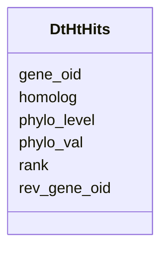

# Class: DtHtHits 


URI: [img_core_v400:DtHtHits](https://w3id.org/jgi/img_core_v400/DtHtHits)





<!-- no inheritance hierarchy -->


## Slots

| Name | Cardinality and Range | Description | Inheritance |
| ---  | --- | --- | --- |
| [gene_oid](gene_oid.md) | 0..1 <br/> [Integer](Integer.md) |  | direct |
| [phylo_level](phylo_level.md) | 0..1 <br/> [String](String.md) |  | direct |
| [phylo_val](phylo_val.md) | 0..1 <br/> [String](String.md) |  | direct |
| [homolog](homolog.md) | 0..1 <br/> [Integer](Integer.md) |  | direct |
| [rank](rank.md) | 0..1 <br/> [Integer](Integer.md) |  | direct |
| [rev_gene_oid](rev_gene_oid.md) | 0..1 <br/> [Integer](Integer.md) |  | direct |


## Identifier and Mapping Information


### Schema Source


* from schema: https://w3id.org/jgi/img_core_v400


## Mappings

| Mapping Type | Mapped Value |
| ---  | ---  |
| self | img_core_v400:DtHtHits |
| native | img_core_v400:DtHtHits |


## LinkML Source

<!-- TODO: investigate https://stackoverflow.com/questions/37606292/how-to-create-tabbed-code-blocks-in-mkdocs-or-sphinx -->

### Direct

<details>
```yaml
name: dt_ht_hits
from_schema: https://w3id.org/jgi/img_core_v400
attributes:
  gene_oid:
    name: gene_oid
    from_schema: https://w3id.org/jgi/img_core_v400
    domain_of:
    - actino_abc_genes
    - delete_genes
    - dt_ht_hits
    - dt_img_gene_prot_pep_sample
    - dt_phylum_dist_genes
    - dt_scog_genes
    - gene
    - gene_aliases
    - gene_biocyc_rxns
    - gene_cathfam
    - gene_cog_groups
    - gene_essential_genes
    - gene_exceptions
    - gene_ext_links
    - gene_feature_tags
    - gene_frag_coords
    - gene_go_terms
    - gene_img_interpro_hits
    - gene_ko_enzymes
    - gene_ko_enzymes_new
    - gene_ko_terms
    - gene_kog_groups
    - gene_notes
    - gene_paralogs
    - gene_pdb_xrefs
    - gene_pfam_families
    - gene_sig_peptides
    - gene_smart
    - gene_superfam
    - gene_tigrfams
    - gene_xref_families
    - kp_pseudo
    - merfs_gene_mapping
    - mv_gene_tmhmm_stats
    - tmp_genes
    range: integer
    required: false
  phylo_level:
    name: phylo_level
    from_schema: https://w3id.org/jgi/img_core_v400
    rank: 1000
    domain_of:
    - dt_ht_hits
    range: string
    required: false
  phylo_val:
    name: phylo_val
    from_schema: https://w3id.org/jgi/img_core_v400
    rank: 1000
    domain_of:
    - dt_ht_hits
    range: string
    required: false
  homolog:
    name: homolog
    from_schema: https://w3id.org/jgi/img_core_v400
    rank: 1000
    domain_of:
    - dt_ht_hits
    - dt_phylum_dist_genes
    range: integer
    required: false
  rank:
    name: rank
    from_schema: https://w3id.org/jgi/img_core_v400
    rank: 1000
    domain_of:
    - dt_ht_hits
    range: integer
    required: false
  rev_gene_oid:
    name: rev_gene_oid
    from_schema: https://w3id.org/jgi/img_core_v400
    rank: 1000
    domain_of:
    - dt_ht_hits
    range: integer
    required: false

```
</details>

### Induced

<details>
```yaml
name: dt_ht_hits
from_schema: https://w3id.org/jgi/img_core_v400
attributes:
  gene_oid:
    name: gene_oid
    from_schema: https://w3id.org/jgi/img_core_v400
    alias: gene_oid
    owner: dt_ht_hits
    domain_of:
    - actino_abc_genes
    - delete_genes
    - dt_ht_hits
    - dt_img_gene_prot_pep_sample
    - dt_phylum_dist_genes
    - dt_scog_genes
    - gene
    - gene_aliases
    - gene_biocyc_rxns
    - gene_cathfam
    - gene_cog_groups
    - gene_essential_genes
    - gene_exceptions
    - gene_ext_links
    - gene_feature_tags
    - gene_frag_coords
    - gene_go_terms
    - gene_img_interpro_hits
    - gene_ko_enzymes
    - gene_ko_enzymes_new
    - gene_ko_terms
    - gene_kog_groups
    - gene_notes
    - gene_paralogs
    - gene_pdb_xrefs
    - gene_pfam_families
    - gene_sig_peptides
    - gene_smart
    - gene_superfam
    - gene_tigrfams
    - gene_xref_families
    - kp_pseudo
    - merfs_gene_mapping
    - mv_gene_tmhmm_stats
    - tmp_genes
    range: integer
    required: false
  phylo_level:
    name: phylo_level
    from_schema: https://w3id.org/jgi/img_core_v400
    rank: 1000
    alias: phylo_level
    owner: dt_ht_hits
    domain_of:
    - dt_ht_hits
    range: string
    required: false
  phylo_val:
    name: phylo_val
    from_schema: https://w3id.org/jgi/img_core_v400
    rank: 1000
    alias: phylo_val
    owner: dt_ht_hits
    domain_of:
    - dt_ht_hits
    range: string
    required: false
  homolog:
    name: homolog
    from_schema: https://w3id.org/jgi/img_core_v400
    rank: 1000
    alias: homolog
    owner: dt_ht_hits
    domain_of:
    - dt_ht_hits
    - dt_phylum_dist_genes
    range: integer
    required: false
  rank:
    name: rank
    from_schema: https://w3id.org/jgi/img_core_v400
    rank: 1000
    alias: rank
    owner: dt_ht_hits
    domain_of:
    - dt_ht_hits
    range: integer
    required: false
  rev_gene_oid:
    name: rev_gene_oid
    from_schema: https://w3id.org/jgi/img_core_v400
    rank: 1000
    alias: rev_gene_oid
    owner: dt_ht_hits
    domain_of:
    - dt_ht_hits
    range: integer
    required: false

```
</details>