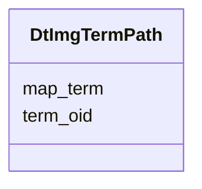

# Class: DtImgTermPath 


URI: [img_core_v400:DtImgTermPath](https://w3id.org/jgi/img_core_v400/DtImgTermPath)





<!-- no inheritance hierarchy -->


## Slots

| Name | Cardinality and Range | Description | Inheritance |
| ---  | --- | --- | --- |
| [term_oid](term_oid.md) | 0..1 <br/> [Integer](Integer.md) |  | direct |
| [map_term](map_term.md) | 0..1 <br/> [Integer](Integer.md) |  | direct |


## Identifier and Mapping Information


### Schema Source


* from schema: https://w3id.org/jgi/img_core_v400


## Mappings

| Mapping Type | Mapped Value |
| ---  | ---  |
| self | img_core_v400:DtImgTermPath |
| native | img_core_v400:DtImgTermPath |


## LinkML Source

<!-- TODO: investigate https://stackoverflow.com/questions/37606292/how-to-create-tabbed-code-blocks-in-mkdocs-or-sphinx -->

### Direct

<details>
```yaml
name: dt_img_term_path
from_schema: https://w3id.org/jgi/img_core_v400
attributes:
  term_oid:
    name: term_oid
    from_schema: https://w3id.org/jgi/img_core_v400
    domain_of:
    - dt_img_term
    - dt_img_term_path
    range: integer
    required: false
  map_term:
    name: map_term
    from_schema: https://w3id.org/jgi/img_core_v400
    rank: 1000
    domain_of:
    - dt_img_term_path
    range: integer
    required: false

```
</details>

### Induced

<details>
```yaml
name: dt_img_term_path
from_schema: https://w3id.org/jgi/img_core_v400
attributes:
  term_oid:
    name: term_oid
    from_schema: https://w3id.org/jgi/img_core_v400
    alias: term_oid
    owner: dt_img_term_path
    domain_of:
    - dt_img_term
    - dt_img_term_path
    range: integer
    required: false
  map_term:
    name: map_term
    from_schema: https://w3id.org/jgi/img_core_v400
    rank: 1000
    alias: map_term
    owner: dt_img_term_path
    domain_of:
    - dt_img_term_path
    range: integer
    required: false

```
</details>