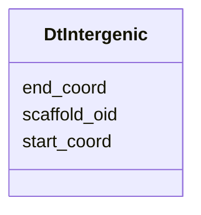

# Class: DtIntergenic 


URI: [img_core_v400:DtIntergenic](https://w3id.org/jgi/img_core_v400/DtIntergenic)





<!-- no inheritance hierarchy -->


## Slots

| Name | Cardinality and Range | Description | Inheritance |
| ---  | --- | --- | --- |
| [scaffold_oid](scaffold_oid.md) | 0..1 <br/> [Integer](Integer.md) |  | direct |
| [start_coord](start_coord.md) | 0..1 <br/> [Integer](Integer.md) |  | direct |
| [end_coord](end_coord.md) | 0..1 <br/> [Integer](Integer.md) |  | direct |


## Identifier and Mapping Information


### Schema Source


* from schema: https://w3id.org/jgi/img_core_v400


## Mappings

| Mapping Type | Mapped Value |
| ---  | ---  |
| self | img_core_v400:DtIntergenic |
| native | img_core_v400:DtIntergenic |


## LinkML Source

<!-- TODO: investigate https://stackoverflow.com/questions/37606292/how-to-create-tabbed-code-blocks-in-mkdocs-or-sphinx -->

### Direct

<details>
```yaml
name: dt_intergenic
from_schema: https://w3id.org/jgi/img_core_v400
attributes:
  scaffold_oid:
    name: scaffold_oid
    from_schema: https://w3id.org/jgi/img_core_v400
    domain_of:
    - delete_scaffolds
    - dt_intergenic
    - scaffold
    - scaffold_ext_links
    - scaffold_nx_feature
    - scaffold_repeats
    - scaffold_stats
    range: integer
    required: false
  start_coord:
    name: start_coord
    from_schema: https://w3id.org/jgi/img_core_v400
    domain_of:
    - alt_transcript
    - dt_intergenic
    - gene
    - gene_frag_coords
    - gene_sig_peptides
    - kp_pseudo
    - scaffold_nx_feature
    - scaffold_repeats
    - taxon_crispr_summary
    range: integer
    required: false
  end_coord:
    name: end_coord
    from_schema: https://w3id.org/jgi/img_core_v400
    domain_of:
    - alt_transcript
    - dt_intergenic
    - gene
    - gene_frag_coords
    - gene_sig_peptides
    - kp_pseudo
    - scaffold_nx_feature
    - scaffold_repeats
    - taxon_crispr_summary
    range: integer
    required: false

```
</details>

### Induced

<details>
```yaml
name: dt_intergenic
from_schema: https://w3id.org/jgi/img_core_v400
attributes:
  scaffold_oid:
    name: scaffold_oid
    from_schema: https://w3id.org/jgi/img_core_v400
    alias: scaffold_oid
    owner: dt_intergenic
    domain_of:
    - delete_scaffolds
    - dt_intergenic
    - scaffold
    - scaffold_ext_links
    - scaffold_nx_feature
    - scaffold_repeats
    - scaffold_stats
    range: integer
    required: false
  start_coord:
    name: start_coord
    from_schema: https://w3id.org/jgi/img_core_v400
    alias: start_coord
    owner: dt_intergenic
    domain_of:
    - alt_transcript
    - dt_intergenic
    - gene
    - gene_frag_coords
    - gene_sig_peptides
    - kp_pseudo
    - scaffold_nx_feature
    - scaffold_repeats
    - taxon_crispr_summary
    range: integer
    required: false
  end_coord:
    name: end_coord
    from_schema: https://w3id.org/jgi/img_core_v400
    alias: end_coord
    owner: dt_intergenic
    domain_of:
    - alt_transcript
    - dt_intergenic
    - gene
    - gene_frag_coords
    - gene_sig_peptides
    - kp_pseudo
    - scaffold_nx_feature
    - scaffold_repeats
    - taxon_crispr_summary
    range: integer
    required: false

```
</details>