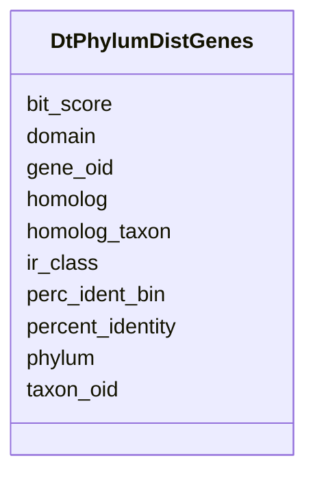

# Class: DtPhylumDistGenes 


URI: [img_core_v400:DtPhylumDistGenes](https://w3id.org/jgi/img_core_v400/DtPhylumDistGenes)





<!-- no inheritance hierarchy -->


## Slots

| Name | Cardinality and Range | Description | Inheritance |
| ---  | --- | --- | --- |
| [taxon_oid](taxon_oid.md) | 0..1 <br/> [Integer](Integer.md) |  | direct |
| [domain](domain.md) | 0..1 <br/> [String](String.md) |  | direct |
| [phylum](phylum.md) | 0..1 <br/> [String](String.md) |  | direct |
| [ir_class](ir_class.md) | 0..1 <br/> [String](String.md) |  | direct |
| [gene_oid](gene_oid.md) | 0..1 <br/> [Integer](Integer.md) |  | direct |
| [homolog](homolog.md) | 0..1 <br/> [Integer](Integer.md) |  | direct |
| [homolog_taxon](homolog_taxon.md) | 0..1 <br/> [Integer](Integer.md) |  | direct |
| [perc_ident_bin](perc_ident_bin.md) | 0..1 <br/> [Integer](Integer.md) |  | direct |
| [percent_identity](percent_identity.md) | 0..1 <br/> [Float](Float.md) |  | direct |
| [bit_score](bit_score.md) | 0..1 <br/> [Float](Float.md) |  | direct |


## Identifier and Mapping Information


### Schema Source


* from schema: https://w3id.org/jgi/img_core_v400


## Mappings

| Mapping Type | Mapped Value |
| ---  | ---  |
| self | img_core_v400:DtPhylumDistGenes |
| native | img_core_v400:DtPhylumDistGenes |


## LinkML Source

<!-- TODO: investigate https://stackoverflow.com/questions/37606292/how-to-create-tabbed-code-blocks-in-mkdocs-or-sphinx -->

### Direct

<details>
```yaml
name: dt_phylum_dist_genes
from_schema: https://w3id.org/jgi/img_core_v400
attributes:
  taxon_oid:
    name: taxon_oid
    from_schema: https://w3id.org/jgi/img_core_v400
    domain_of:
    - asv5_taxons
    - bcg_taxons
    - dt_all_phylo_taxon_stats
    - dt_cog_stats
    - dt_kog_stats
    - dt_phylo_taxon_stats
    - dt_phylodist_new_taxons
    - dt_phylum_dist_genes
    - dt_phylum_dist_stats
    - dt_scog_genes
    - dt_taxon_kmodule_mcr
    - img_iuig_tarballs_11202023
    - img_umag_bin_tarballs_02062024
    - imgnr_taxons_062123
    - iso_plasmids
    - kp_actino
    - kp_taxons
    - new_taxons
    - new_taxons_batch
    - old_taxons
    - tarball_refresh_taxons
    - taxon
    - taxon_assembly_stats
    - taxon_cathfunfam_count
    - taxon_cog_count
    - taxon_crispr_details
    - taxon_crispr_summary
    - taxon_dw
    - taxon_ec_count
    - taxon_ext_links
    - taxon_gene_prefix
    - taxon_gtdbtk_lineage
    - taxon_ko_count
    - taxon_pfam_count
    - taxon_prod_vw
    - taxon_replacements
    - taxon_replacements_view
    - taxon_scaf_prefix
    - taxon_smart_count
    - taxon_smc_stats
    - taxon_stats
    - taxon_stats_merfs
    - taxon_stats_prod_vw
    - taxon_supfam_count
    - taxon_taxon_scaffold_info
    - taxon_tigr_count
    - vw_gold_taxon
    - vw_taxon_sc
    range: integer
    required: false
  domain:
    name: domain
    from_schema: https://w3id.org/jgi/img_core_v400
    rank: 1000
    domain_of:
    - dt_phylum_dist_genes
    - dt_phylum_dist_stats
    - imgnr_taxons_062123
    - smart
    - taxon
    - taxon_prod_vw
    - vw_taxon_sc
    range: string
    required: false
  phylum:
    name: phylum
    from_schema: https://w3id.org/jgi/img_core_v400
    rank: 1000
    domain_of:
    - dt_phylum_dist_genes
    - dt_phylum_dist_stats
    - imgnr_taxons_062123
    - taxon
    - taxon_prod_vw
    range: string
    required: false
  ir_class:
    name: ir_class
    from_schema: https://w3id.org/jgi/img_core_v400
    rank: 1000
    domain_of:
    - dt_phylum_dist_genes
    - dt_phylum_dist_stats
    - imgnr_taxons_062123
    - taxon
    - taxon_prod_vw
    range: string
    required: false
  gene_oid:
    name: gene_oid
    from_schema: https://w3id.org/jgi/img_core_v400
    domain_of:
    - actino_abc_genes
    - delete_genes
    - dt_ht_hits
    - dt_img_gene_prot_pep_sample
    - dt_phylum_dist_genes
    - dt_scog_genes
    - gene
    - gene_aliases
    - gene_biocyc_rxns
    - gene_cathfam
    - gene_cog_groups
    - gene_essential_genes
    - gene_exceptions
    - gene_ext_links
    - gene_feature_tags
    - gene_frag_coords
    - gene_go_terms
    - gene_img_interpro_hits
    - gene_ko_enzymes
    - gene_ko_enzymes_new
    - gene_ko_terms
    - gene_kog_groups
    - gene_notes
    - gene_paralogs
    - gene_pdb_xrefs
    - gene_pfam_families
    - gene_sig_peptides
    - gene_smart
    - gene_superfam
    - gene_tigrfams
    - gene_xref_families
    - kp_pseudo
    - merfs_gene_mapping
    - mv_gene_tmhmm_stats
    - tmp_genes
    range: integer
    required: false
  homolog:
    name: homolog
    from_schema: https://w3id.org/jgi/img_core_v400
    domain_of:
    - dt_ht_hits
    - dt_phylum_dist_genes
    range: integer
    required: false
  homolog_taxon:
    name: homolog_taxon
    from_schema: https://w3id.org/jgi/img_core_v400
    domain_of:
    - dt_all_phylo_taxon_stats
    - dt_phylo_taxon_stats
    - dt_phylum_dist_genes
    range: integer
    required: false
  perc_ident_bin:
    name: perc_ident_bin
    from_schema: https://w3id.org/jgi/img_core_v400
    rank: 1000
    domain_of:
    - dt_phylum_dist_genes
    - dt_phylum_dist_stats
    range: integer
    required: false
  percent_identity:
    name: percent_identity
    from_schema: https://w3id.org/jgi/img_core_v400
    rank: 1000
    domain_of:
    - dt_phylum_dist_genes
    - gene_cathfam
    - gene_cog_groups
    - gene_ko_terms
    - gene_kog_groups
    - gene_paralogs
    - gene_pfam_families
    - gene_smart
    - gene_superfam
    - gene_tigrfams
    range: float
    required: false
  bit_score:
    name: bit_score
    from_schema: https://w3id.org/jgi/img_core_v400
    rank: 1000
    domain_of:
    - dt_phylum_dist_genes
    - gene_cathfam
    - gene_cog_groups
    - gene_ko_terms
    - gene_kog_groups
    - gene_paralogs
    - gene_pfam_families
    - gene_smart
    - gene_superfam
    - gene_tigrfams
    range: float
    required: false

```
</details>

### Induced

<details>
```yaml
name: dt_phylum_dist_genes
from_schema: https://w3id.org/jgi/img_core_v400
attributes:
  taxon_oid:
    name: taxon_oid
    from_schema: https://w3id.org/jgi/img_core_v400
    alias: taxon_oid
    owner: dt_phylum_dist_genes
    domain_of:
    - asv5_taxons
    - bcg_taxons
    - dt_all_phylo_taxon_stats
    - dt_cog_stats
    - dt_kog_stats
    - dt_phylo_taxon_stats
    - dt_phylodist_new_taxons
    - dt_phylum_dist_genes
    - dt_phylum_dist_stats
    - dt_scog_genes
    - dt_taxon_kmodule_mcr
    - img_iuig_tarballs_11202023
    - img_umag_bin_tarballs_02062024
    - imgnr_taxons_062123
    - iso_plasmids
    - kp_actino
    - kp_taxons
    - new_taxons
    - new_taxons_batch
    - old_taxons
    - tarball_refresh_taxons
    - taxon
    - taxon_assembly_stats
    - taxon_cathfunfam_count
    - taxon_cog_count
    - taxon_crispr_details
    - taxon_crispr_summary
    - taxon_dw
    - taxon_ec_count
    - taxon_ext_links
    - taxon_gene_prefix
    - taxon_gtdbtk_lineage
    - taxon_ko_count
    - taxon_pfam_count
    - taxon_prod_vw
    - taxon_replacements
    - taxon_replacements_view
    - taxon_scaf_prefix
    - taxon_smart_count
    - taxon_smc_stats
    - taxon_stats
    - taxon_stats_merfs
    - taxon_stats_prod_vw
    - taxon_supfam_count
    - taxon_taxon_scaffold_info
    - taxon_tigr_count
    - vw_gold_taxon
    - vw_taxon_sc
    range: integer
    required: false
  domain:
    name: domain
    from_schema: https://w3id.org/jgi/img_core_v400
    rank: 1000
    alias: domain
    owner: dt_phylum_dist_genes
    domain_of:
    - dt_phylum_dist_genes
    - dt_phylum_dist_stats
    - imgnr_taxons_062123
    - smart
    - taxon
    - taxon_prod_vw
    - vw_taxon_sc
    range: string
    required: false
  phylum:
    name: phylum
    from_schema: https://w3id.org/jgi/img_core_v400
    rank: 1000
    alias: phylum
    owner: dt_phylum_dist_genes
    domain_of:
    - dt_phylum_dist_genes
    - dt_phylum_dist_stats
    - imgnr_taxons_062123
    - taxon
    - taxon_prod_vw
    range: string
    required: false
  ir_class:
    name: ir_class
    from_schema: https://w3id.org/jgi/img_core_v400
    rank: 1000
    alias: ir_class
    owner: dt_phylum_dist_genes
    domain_of:
    - dt_phylum_dist_genes
    - dt_phylum_dist_stats
    - imgnr_taxons_062123
    - taxon
    - taxon_prod_vw
    range: string
    required: false
  gene_oid:
    name: gene_oid
    from_schema: https://w3id.org/jgi/img_core_v400
    alias: gene_oid
    owner: dt_phylum_dist_genes
    domain_of:
    - actino_abc_genes
    - delete_genes
    - dt_ht_hits
    - dt_img_gene_prot_pep_sample
    - dt_phylum_dist_genes
    - dt_scog_genes
    - gene
    - gene_aliases
    - gene_biocyc_rxns
    - gene_cathfam
    - gene_cog_groups
    - gene_essential_genes
    - gene_exceptions
    - gene_ext_links
    - gene_feature_tags
    - gene_frag_coords
    - gene_go_terms
    - gene_img_interpro_hits
    - gene_ko_enzymes
    - gene_ko_enzymes_new
    - gene_ko_terms
    - gene_kog_groups
    - gene_notes
    - gene_paralogs
    - gene_pdb_xrefs
    - gene_pfam_families
    - gene_sig_peptides
    - gene_smart
    - gene_superfam
    - gene_tigrfams
    - gene_xref_families
    - kp_pseudo
    - merfs_gene_mapping
    - mv_gene_tmhmm_stats
    - tmp_genes
    range: integer
    required: false
  homolog:
    name: homolog
    from_schema: https://w3id.org/jgi/img_core_v400
    alias: homolog
    owner: dt_phylum_dist_genes
    domain_of:
    - dt_ht_hits
    - dt_phylum_dist_genes
    range: integer
    required: false
  homolog_taxon:
    name: homolog_taxon
    from_schema: https://w3id.org/jgi/img_core_v400
    alias: homolog_taxon
    owner: dt_phylum_dist_genes
    domain_of:
    - dt_all_phylo_taxon_stats
    - dt_phylo_taxon_stats
    - dt_phylum_dist_genes
    range: integer
    required: false
  perc_ident_bin:
    name: perc_ident_bin
    from_schema: https://w3id.org/jgi/img_core_v400
    rank: 1000
    alias: perc_ident_bin
    owner: dt_phylum_dist_genes
    domain_of:
    - dt_phylum_dist_genes
    - dt_phylum_dist_stats
    range: integer
    required: false
  percent_identity:
    name: percent_identity
    from_schema: https://w3id.org/jgi/img_core_v400
    rank: 1000
    alias: percent_identity
    owner: dt_phylum_dist_genes
    domain_of:
    - dt_phylum_dist_genes
    - gene_cathfam
    - gene_cog_groups
    - gene_ko_terms
    - gene_kog_groups
    - gene_paralogs
    - gene_pfam_families
    - gene_smart
    - gene_superfam
    - gene_tigrfams
    range: float
    required: false
  bit_score:
    name: bit_score
    from_schema: https://w3id.org/jgi/img_core_v400
    rank: 1000
    alias: bit_score
    owner: dt_phylum_dist_genes
    domain_of:
    - dt_phylum_dist_genes
    - gene_cathfam
    - gene_cog_groups
    - gene_ko_terms
    - gene_kog_groups
    - gene_paralogs
    - gene_pfam_families
    - gene_smart
    - gene_superfam
    - gene_tigrfams
    range: float
    required: false

```
</details>