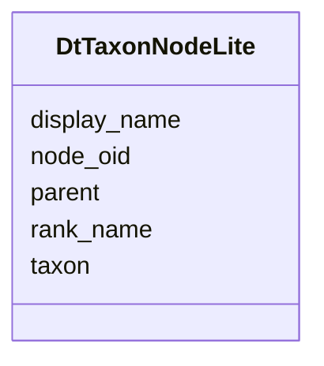

# Class: DtTaxonNodeLite 


URI: [img_core_v400:DtTaxonNodeLite](https://w3id.org/jgi/img_core_v400/DtTaxonNodeLite)





<!-- no inheritance hierarchy -->


## Slots

| Name | Cardinality and Range | Description | Inheritance |
| ---  | --- | --- | --- |
| [node_oid](node_oid.md) | 0..1 <br/> [Integer](Integer.md) |  | direct |
| [display_name](display_name.md) | 0..1 <br/> [String](String.md) |  | direct |
| [rank_name](rank_name.md) | 0..1 <br/> [String](String.md) |  | direct |
| [taxon](taxon.md) | 0..1 <br/> [Integer](Integer.md) |  | direct |
| [parent](parent.md) | 0..1 <br/> [Integer](Integer.md) |  | direct |


## Identifier and Mapping Information


### Schema Source


* from schema: https://w3id.org/jgi/img_core_v400


## Mappings

| Mapping Type | Mapped Value |
| ---  | ---  |
| self | img_core_v400:DtTaxonNodeLite |
| native | img_core_v400:DtTaxonNodeLite |


## LinkML Source

<!-- TODO: investigate https://stackoverflow.com/questions/37606292/how-to-create-tabbed-code-blocks-in-mkdocs-or-sphinx -->

### Direct

<details>
```yaml
name: dt_taxon_node_lite
from_schema: https://w3id.org/jgi/img_core_v400
attributes:
  node_oid:
    name: node_oid
    from_schema: https://w3id.org/jgi/img_core_v400
    rank: 1000
    domain_of:
    - dt_taxon_node_lite
    - taxon_node_lite
    range: integer
    required: false
  display_name:
    name: display_name
    from_schema: https://w3id.org/jgi/img_core_v400
    rank: 1000
    domain_of:
    - dt_taxon_node_lite
    - taxon_node_lite
    range: string
    required: false
  rank_name:
    name: rank_name
    from_schema: https://w3id.org/jgi/img_core_v400
    rank: 1000
    domain_of:
    - dt_taxon_node_lite
    - taxon_node_lite
    range: string
    required: false
  taxon:
    name: taxon
    from_schema: https://w3id.org/jgi/img_core_v400
    domain_of:
    - cog_species
    - dt_img_gene_prot_pep_sample
    - dt_taxon_node_lite
    - gene
    - gene_biocyc_rxns
    - gene_cathfam
    - gene_cog_groups
    - gene_img_interpro_hits
    - gene_ko_enzymes
    - gene_ko_enzymes_new
    - gene_ko_terms
    - gene_kog_groups
    - gene_pfam_families
    - gene_smart
    - gene_superfam
    - gene_tigrfams
    - gene_xref_families
    - kp_pseudo
    - merfs_gene_mapping
    - paralog_group
    - scaffold
    - scaffold_stats
    - taxon_node_lite
    range: integer
    required: false
  parent:
    name: parent
    from_schema: https://w3id.org/jgi/img_core_v400
    domain_of:
    - compound
    - dt_taxon_node_lite
    - go_term_parents
    - taxon_node_lite
    range: integer
    required: false

```
</details>

### Induced

<details>
```yaml
name: dt_taxon_node_lite
from_schema: https://w3id.org/jgi/img_core_v400
attributes:
  node_oid:
    name: node_oid
    from_schema: https://w3id.org/jgi/img_core_v400
    rank: 1000
    alias: node_oid
    owner: dt_taxon_node_lite
    domain_of:
    - dt_taxon_node_lite
    - taxon_node_lite
    range: integer
    required: false
  display_name:
    name: display_name
    from_schema: https://w3id.org/jgi/img_core_v400
    rank: 1000
    alias: display_name
    owner: dt_taxon_node_lite
    domain_of:
    - dt_taxon_node_lite
    - taxon_node_lite
    range: string
    required: false
  rank_name:
    name: rank_name
    from_schema: https://w3id.org/jgi/img_core_v400
    rank: 1000
    alias: rank_name
    owner: dt_taxon_node_lite
    domain_of:
    - dt_taxon_node_lite
    - taxon_node_lite
    range: string
    required: false
  taxon:
    name: taxon
    from_schema: https://w3id.org/jgi/img_core_v400
    alias: taxon
    owner: dt_taxon_node_lite
    domain_of:
    - cog_species
    - dt_img_gene_prot_pep_sample
    - dt_taxon_node_lite
    - gene
    - gene_biocyc_rxns
    - gene_cathfam
    - gene_cog_groups
    - gene_img_interpro_hits
    - gene_ko_enzymes
    - gene_ko_enzymes_new
    - gene_ko_terms
    - gene_kog_groups
    - gene_pfam_families
    - gene_smart
    - gene_superfam
    - gene_tigrfams
    - gene_xref_families
    - kp_pseudo
    - merfs_gene_mapping
    - paralog_group
    - scaffold
    - scaffold_stats
    - taxon_node_lite
    range: integer
    required: false
  parent:
    name: parent
    from_schema: https://w3id.org/jgi/img_core_v400
    alias: parent
    owner: dt_taxon_node_lite
    domain_of:
    - compound
    - dt_taxon_node_lite
    - go_term_parents
    - taxon_node_lite
    range: integer
    required: false

```
</details>