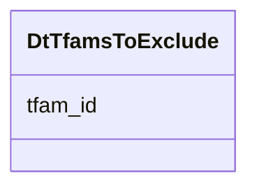

# Class: DtTfamsToExclude 


URI: [img_core_v400:DtTfamsToExclude](https://w3id.org/jgi/img_core_v400/DtTfamsToExclude)





<!-- no inheritance hierarchy -->


## Slots

| Name | Cardinality and Range | Description | Inheritance |
| ---  | --- | --- | --- |
| [tfam_id](tfam_id.md) | 0..1 <br/> [String](String.md) |  | direct |


## Identifier and Mapping Information


### Schema Source


* from schema: https://w3id.org/jgi/img_core_v400


## Mappings

| Mapping Type | Mapped Value |
| ---  | ---  |
| self | img_core_v400:DtTfamsToExclude |
| native | img_core_v400:DtTfamsToExclude |


## LinkML Source

<!-- TODO: investigate https://stackoverflow.com/questions/37606292/how-to-create-tabbed-code-blocks-in-mkdocs-or-sphinx -->

### Direct

<details>
```yaml
name: dt_tfams_to_exclude
from_schema: https://w3id.org/jgi/img_core_v400
attributes:
  tfam_id:
    name: tfam_id
    from_schema: https://w3id.org/jgi/img_core_v400
    domain_of:
    - dt_tfam
    - dt_tfams_to_exclude
    range: string
    required: false

```
</details>

### Induced

<details>
```yaml
name: dt_tfams_to_exclude
from_schema: https://w3id.org/jgi/img_core_v400
attributes:
  tfam_id:
    name: tfam_id
    from_schema: https://w3id.org/jgi/img_core_v400
    alias: tfam_id
    owner: dt_tfams_to_exclude
    domain_of:
    - dt_tfam
    - dt_tfams_to_exclude
    range: string
    required: false

```
</details>