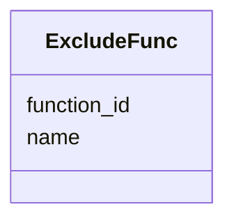

# Class: ExcludeFunc 


URI: [img_core_v400:ExcludeFunc](https://w3id.org/jgi/img_core_v400/ExcludeFunc)





<!-- no inheritance hierarchy -->


## Slots

| Name | Cardinality and Range | Description | Inheritance |
| ---  | --- | --- | --- |
| [function_id](function_id.md) | 0..1 <br/> [String](String.md) |  | direct |
| [name](name.md) | 0..1 <br/> [String](String.md) |  | direct |


## Identifier and Mapping Information


### Schema Source


* from schema: https://w3id.org/jgi/img_core_v400


## Mappings

| Mapping Type | Mapped Value |
| ---  | ---  |
| self | img_core_v400:ExcludeFunc |
| native | img_core_v400:ExcludeFunc |


## LinkML Source

<!-- TODO: investigate https://stackoverflow.com/questions/37606292/how-to-create-tabbed-code-blocks-in-mkdocs-or-sphinx -->

### Direct

<details>
```yaml
name: exclude_func
from_schema: https://w3id.org/jgi/img_core_v400
attributes:
  function_id:
    name: function_id
    from_schema: https://w3id.org/jgi/img_core_v400
    rank: 1000
    domain_of:
    - exclude_func
    range: string
    required: false
  name:
    name: name
    from_schema: https://w3id.org/jgi/img_core_v400
    domain_of:
    - alt_transcript
    - cog2014
    - cogfunc2014
    - db_source
    - dt_cog
    - dt_img_term
    - dt_ko
    - dt_pfam
    - dt_tfam
    - exclude_func
    - genome_property
    - interpro
    - pfam_clan
    - pfam_dead
    - pfam_family
    - property_step
    - superfamily
    range: string
    required: false

```
</details>

### Induced

<details>
```yaml
name: exclude_func
from_schema: https://w3id.org/jgi/img_core_v400
attributes:
  function_id:
    name: function_id
    from_schema: https://w3id.org/jgi/img_core_v400
    rank: 1000
    alias: function_id
    owner: exclude_func
    domain_of:
    - exclude_func
    range: string
    required: false
  name:
    name: name
    from_schema: https://w3id.org/jgi/img_core_v400
    alias: name
    owner: exclude_func
    domain_of:
    - alt_transcript
    - cog2014
    - cogfunc2014
    - db_source
    - dt_cog
    - dt_img_term
    - dt_ko
    - dt_pfam
    - dt_tfam
    - exclude_func
    - genome_property
    - interpro
    - pfam_clan
    - pfam_dead
    - pfam_family
    - property_step
    - superfamily
    range: string
    required: false

```
</details>